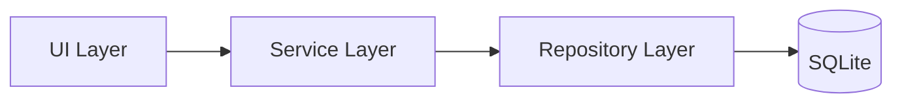

# Pixiv Local Manager

## 프로젝트 개요

Pixiv 작가 폴더를 로컬 환경에서 체계적으로 관리하기 위한 Windows 데스크탑 프로그램.

작가 정보, 작품 수, 평점, 메모, 업데이트 상태를 SQLite 데이터베이스에 저장하고,
Pixiv 최신 작품 여부를 확인하여 로컬 컬렉션을 효율적으로 관리하는 것을 목표로 한다.

---

## 프로젝트 목적

<table>
<tr>
    <th>목적</th>
    <th>설명</th>
</tr>

<tr>
    <td>작가 관리</td>
    <td>등록된 작가 정보를 통합 관리</td>
</tr>

<tr>
    <td>업데이트 관리</td>
    <td>Pixiv 최신 작품 여부를 확인하여 업데이트 상태 관리</td>
</tr>

<tr>
    <td>데이터 관리</td>
    <td>SQLite 기반 데이터 저장 및 백업 지원</td>
</tr>

<tr>
    <td>컬렉션 정리</td>
    <td>평점과 메모를 이용한 개인 라이브러리 관리</td>
</tr>

<tr>
    <td>생산성 향상</td>
    <td>작가 검색, 정렬, 상태 확인 기능 제공</td>
</tr>

</table>

---

## 프로젝트 방향

<table>
<tr>
    <th>항목</th>
    <th>방향</th>
</tr>

<tr>
    <td>데이터 기준</td>
    <td>로컬 폴더 중심 관리</td>
</tr>

<tr>
    <td>Pixiv 요청</td>
    <td>필요 시에만 수동 확인</td>
</tr>

<tr>
    <td>성능</td>
    <td>빠른 스캔, 빠른 검색, 빠른 실행 우선</td>
</tr>

<tr>
    <td>UI</td>
    <td>간결하고 직관적인 데스크탑 UI</td>
</tr>

<tr>
    <td>아키텍처</td>
    <td>UI / Service / Repository 계층 분리</td>
</tr>

<tr>
    <td>확장성</td>
    <td>기능 추가가 쉬운 모듈형 구조</td>
</tr>

</table>

---

## 시스템 구성

---

## V1 범위

<table>
<tr>
    <th>구분</th>
    <th>기능</th>
</tr>

<tr>
    <td rowspan="6">대시보드</td>
    <td>전체 작가 수 표시</td>
</tr>
<tr><td>전체 작품 수 표시</td></tr>
<tr><td>평균 평점 표시</td></tr>
<tr><td>업데이트 상태 요약</td></tr>
<tr><td>추천 작가 표시</td></tr>
<tr><td>랜덤 작가 표시</td></tr>

<tr>
    <td rowspan="6">폴더 스캔</td>
    <td>작가 폴더 자동 탐색</td>
</tr>
<tr><td>작가명 / Pixiv ID 자동 파싱</td></tr>
<tr><td>신규 작가 등록</td></tr>
<tr><td>기존 작가 갱신</td></tr>
<tr><td>실시간 진행률 표시</td></tr>
<tr><td>스캔 로그 표시</td></tr>

<tr>
    <td rowspan="7">작가 관리</td>
    <td>작가 검색</td>
</tr>
<tr><td>작가 정렬</td></tr>
<tr><td>상태별 정렬</td></tr>
<tr><td>평점 관리</td></tr>
<tr><td>메모 관리</td></tr>
<tr><td>작가 상세 정보 수정</td></tr>
<tr><td>Pixiv 페이지 바로가기</td></tr>

<tr>
    <td rowspan="5">업데이트 확인</td>
    <td>다중 작가 선택</td>
</tr>
<tr><td>Pixiv 최신 작품 조회</td></tr>
<tr><td>업데이트 상태 갱신</td></tr>
<tr><td>최근 확인 작가 제외</td></tr>
<tr><td>진행 로그 표시</td></tr>

<tr>
    <td rowspan="5">설정</td>
    <td>기본 Pixiv 폴더 설정</td>
</tr>
<tr><td>PHPSESSID 저장</td></tr>
<tr><td>DB 백업</td></tr>
<tr><td>DB 복원</td></tr>
<tr><td>CSV 내보내기</td></tr>

</table>

---

## V1 제외 범위

<table>
<tr>
    <th>구분</th>
    <th>제외 기능</th>
</tr>

<tr>
    <td rowspan="4">작품 관리</td>
    <td>작품 상세 정보 관리</td>
</tr>
<tr><td>작품별 평점</td></tr>
<tr><td>작품별 메모</td></tr>
<tr><td>작품 썸네일 UI</td></tr>

<tr>
    <td rowspan="3">Pixiv 연동</td>
    <td>자동 주기 갱신</td>
</tr>
<tr><td>태그 자동 수집</td></tr>
<tr><td>북마크 수집</td></tr>

<tr>
    <td rowspan="3">추천 기능</td>
    <td>태그 기반 추천</td>
</tr>
<tr><td>유사 작가 추천</td></tr>
<tr><td>머신러닝 기반 추천</td></tr>

</table>

---

## 기술 스택

<table>
<tr>
    <th>구분</th>
    <th>사용 기술</th>
</tr>

<tr>
    <td>개발 언어</td>
    <td>Python</td>
</tr>

<tr>
    <td>GUI</td>
    <td>PySide6</td>
</tr>

<tr>
    <td>데이터베이스</td>
    <td>SQLite</td>
</tr>

<tr>
    <td>아키텍처</td>
    <td>Repository Pattern</td>
</tr>

<tr>
    <td>배포</td>
    <td>PyInstaller</td>
</tr>

<tr>
    <td>내보내기</td>
    <td>CSV</td>
</tr>

<tr>
    <td>Pixiv 연동</td>
    <td>Pixiv AJAX API</td>
</tr>

</table>

---

## 장기 확장 방향

<table>
<tr>
    <th>구분</th>
    <th>확장 기능</th>
</tr>

<tr>
    <td rowspan="4">작품 관리</td>
    <td>작품 상세 관리</td>
</tr>
<tr><td>작품별 평점</td></tr>
<tr><td>작품별 메모</td></tr>
<tr><td>썸네일 보기</td></tr>

<tr>
    <td rowspan="3">태그 기능</td>
    <td>사용자 태그</td>
</tr>
<tr><td>태그 검색</td></tr>
<tr><td>태그 필터</td></tr>

<tr>
    <td rowspan="3">추천 기능</td>
    <td>추천 작가</td>
</tr>
<tr><td>유사 작가</td></tr>
<tr><td>추천 시스템</td></tr>

</table>