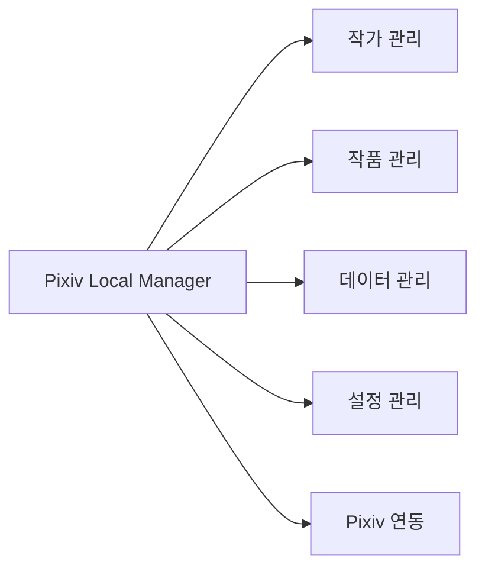

# Pixiv Local Manager

## 프로젝트 개요

로컬에 저장된 Pixiv 작가 및 작품 폴더를 관리하기 위한 Windows 데스크탑 프로그램.

작가 정보, 작품 정보, 평점, 메모, 최신 작품 상태 등을 한 곳에서 관리하는 것을 목표로 한다.

---

## 프로젝트 목적

<table>
<tr>
    <th>목적</th>
    <th>설명</th>
</tr>
<tr>
    <td>작가 관리</td>
    <td>저장된 작가 폴더와 작가 정보를 통합 관리</td>
</tr>
<tr>
    <td>작품 관리</td>
    <td>로컬에 저장된 작품과 최신 작품 상태 확인</td>
</tr>
<tr>
    <td>빠른 탐색</td>
    <td>Pixiv 작가 페이지, 로컬 폴더, 외부 뷰어 즉시 실행</td>
</tr>
<tr>
    <td>데이터 관리</td>
    <td>CSV 내보내기, JSON 백업 및 복원 지원</td>
</tr>
<tr>
    <td>관리 효율성</td>
    <td>평점, 메모, 상태값을 이용한 개인 라이브러리 정리</td>
</tr>
</table>

---

## 프로젝트 방향

<table>
<tr>
    <th>항목</th>
    <th>방향</th>
</tr>
<tr>
    <td>데이터 기준</td>
    <td>로컬 파일 및 폴더 데이터 중심</td>
</tr>
<tr>
    <td>Pixiv 요청</td>
    <td>크롤링 최소화, 수동 갱신 중심</td>
</tr>
<tr>
    <td>성능</td>
    <td>빠른 스캔, 빠른 검색, 빠른 실행 우선</td>
</tr>
<tr>
    <td>UI</td>
    <td>간단하지만 보기 좋은 데스크탑 UI</td>
</tr>
<tr>
    <td>배포</td>
    <td>EXE 파일 실행만으로 사용 가능하도록 구성</td>
</tr>
<tr>
    <td>확장성</td>
    <td>작품 상세, 태그, 썸네일, 확장 프로그램을 추후 추가 가능하게 설계</td>
</tr>
</table>

---

## 프로젝트 범위

---

## V1 범위

<table>
<tr>
    <th>구분</th>
    <th>기능</th>
</tr>

<tr>
    <td rowspan="6">작가 관리</td>
    <td>작가 폴더 등록</td>
</tr>
<tr><td>작가명-ID 자동 파싱</td></tr>
<tr><td>작가명 수정</td></tr>
<tr><td>작가 검색 및 정렬</td></tr>
<tr><td>평점, 메모, 상태 관리</td></tr>
<tr><td>Pixiv 작가 페이지 및 로컬 폴더 열기</td></tr>

<tr>
    <td rowspan="6">작품 관리</td>
    <td>로컬 최신 작품 ID 3개 계산</td>
</tr>
<tr><td>Pixiv 최신 작품 ID 3개 저장</td></tr>
<tr><td>업데이트 상태 표시</td></tr>
<tr><td>작가 폴더 용량 계산</td></tr>
<tr><td>작가 폴더 파일 수 계산</td></tr>
<tr><td>작가 폴더 작품 수 계산</td></tr>

<tr>
    <td rowspan="3">데이터 관리</td>
    <td>CSV 내보내기</td>
</tr>
<tr><td>JSON 백업</td></tr>
<tr><td>JSON 복원</td></tr>

<tr>
    <td rowspan="3">설정 관리</td>
    <td>외부 뷰어 경로 설정</td>
</tr>
<tr><td>기본 정렬 설정</td></tr>
<tr><td>UI 설정</td></tr>
</table>

---

## V1 제외 범위

<table>
<tr>
    <th>구분</th>
    <th>제외 기능</th>
</tr>

<tr>
    <td rowspan="3">Pixiv 연동</td>
    <td>자동 크롤링</td>
</tr>
<tr><td>태그 자동 수집</td></tr>
<tr><td>북마크 수 자동 수집</td></tr>

<tr>
    <td rowspan="3">작품 관리</td>
    <td>작품별 상세 관리</td>
</tr>
<tr><td>작품별 평점 및 메모</td></tr>
<tr><td>썸네일 카드 UI</td></tr>

<tr>
    <td rowspan="3">확장 기능</td>
    <td>브라우저 확장 프로그램</td>
</tr>
<tr><td>추천 시스템</td></tr>
<tr><td>자체 이미지 뷰어</td></tr>
</table>

---

## 기술 스택

<table>
<tr>
    <th>구분</th>
    <th>사용 기술</th>
</tr>
<tr>
    <td>개발 언어</td>
    <td>Python</td>
</tr>
<tr>
    <td>GUI</td>
    <td>PySide6</td>
</tr>
<tr>
    <td>데이터베이스</td>
    <td>SQLite</td>
</tr>
<tr>
    <td>설정 파일</td>
    <td>INI</td>
</tr>
<tr>
    <td>백업</td>
    <td>JSON</td>
</tr>
<tr>
    <td>내보내기</td>
    <td>CSV</td>
</tr>
<tr>
    <td>배포</td>
    <td>PyInstaller</td>
</tr>
</table>

---

## 데이터 저장 구조

<table>
<tr>
    <th>파일</th>
    <th>역할</th>
</tr>
<tr>
    <td>pixiv_manager.db</td>
    <td>작가, 작품, 평점, 메모, 상태 데이터 저장</td>
</tr>
<tr>
    <td>config.ini</td>
    <td>외부 뷰어 경로, UI 설정, 기본 정렬 설정 저장</td>
</tr>
<tr>
    <td>backup.json</td>
    <td>데이터 백업 및 복원용 파일</td>
</tr>
<tr>
    <td>export.csv</td>
    <td>등록 데이터 내보내기 파일</td>
</tr>
</table>

---

## 장기 확장 방향

<table>
<tr>
    <th>구분</th>
    <th>확장 기능</th>
</tr>

<tr>
    <td rowspan="4">작품 관리</td>
    <td>작품 상세 관리</td>
</tr>
<tr><td>작품별 평점 및 메모</td></tr>
<tr><td>읽음 / 미확인 상태</td></tr>
<tr><td>썸네일 보기</td></tr>

<tr>
    <td rowspan="3">태그 관리</td>
    <td>사용자 태그</td>
</tr>
<tr><td>태그 검색</td></tr>
<tr><td>차단 태그</td></tr>

<tr>
    <td rowspan="3">Pixiv 연동</td>
    <td>최신 작품 수동 갱신</td>
</tr>
<tr><td>작품 태그 가져오기</td></tr>
<tr><td>작품 정보 캐싱</td></tr>

<tr>
    <td rowspan="3">확장 기능</td>
    <td>브라우저 확장 프로그램</td>
</tr>
<tr><td>태그 기반 추천</td></tr>
<tr><td>작가 추천</td></tr>
</table>
