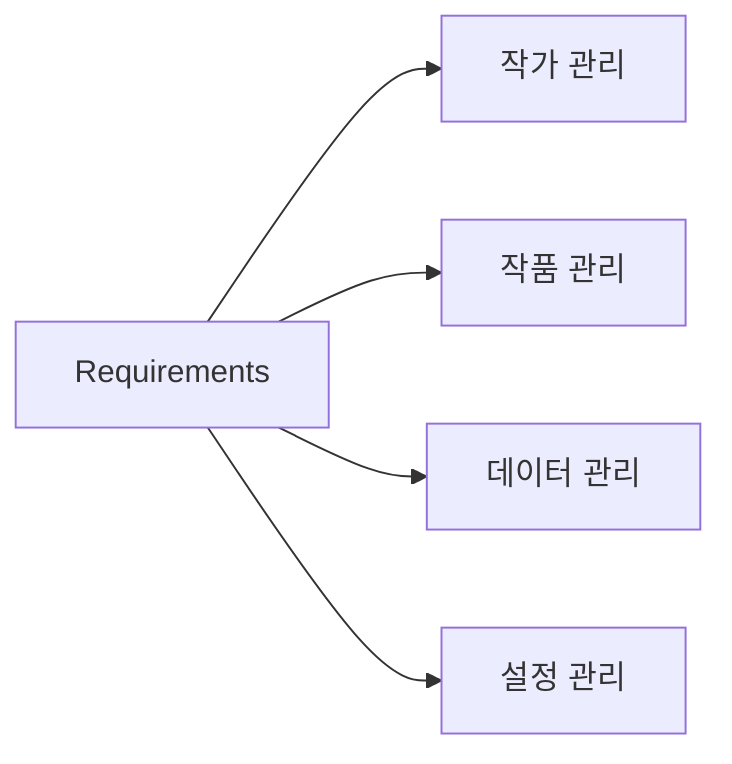

# 기능 요구사항 (Requirements)

## 기능 분류

---

## 작가 관리

<table>
<tr>
    <th>ID</th>
    <th>기능</th>
    <th>설명</th>
</tr>

<tr>
    <td>A-01</td>
    <td>작가 등록</td>
    <td>작가명-ID 형식의 폴더 등록</td>
</tr>

<tr>
    <td>A-02</td>
    <td>자동 파싱</td>
    <td>작가명과 Pixiv ID 자동 분리</td>
</tr>

<tr>
    <td>A-03</td>
    <td>작가명 수정</td>
    <td>작가명 변경 지원</td>
</tr>

<tr>
    <td>A-04</td>
    <td>작가 검색</td>
    <td>작가명 및 ID 검색</td>
</tr>

<tr>
    <td>A-04-1</td>
    <td>다국어 작가명 지원</td>
    <td>한글, 일본어, 영어, 숫자, 특수문자, 이모티콘 저장 및 검색 지원</td>
</tr>

<tr>
    <td>A-05</td>
    <td>평점</td>
    <td>사용자 평점 저장</td>
</tr>

<tr>
    <td>A-06</td>
    <td>메모</td>
    <td>작가별 메모 저장</td>
</tr>

<tr>
    <td>A-07</td>
    <td>상태 관리</td>
    <td>즐겨찾기, 보류, 완료 등 상태 저장</td>
</tr>

<tr>
    <td>A-08</td>
    <td>Pixiv 이동</td>
    <td>작가 페이지 즉시 열기</td>
</tr>

<tr>
    <td>A-09</td>
    <td>폴더 열기</td>
    <td>로컬 폴더 즉시 열기</td>
</tr>

</table>

---

## 작품 관리

<table>
<tr>
    <th>ID</th>
    <th>기능</th>
    <th>설명</th>
</tr>

<tr>
    <td>W-01</td>
    <td>최신 작품 확인</td>
    <td>폴더 내 최신 작품 ID 3개 확인</td>
</tr>

<tr>
    <td>W-02</td>
    <td>Pixiv 최신 작품 저장</td>
    <td>Pixiv 최신 작품 ID 3개 저장</td>
</tr>

<tr>
    <td>W-03</td>
    <td>업데이트 상태 표시</td>
    <td>최신 여부 표시</td>
</tr>

<tr>
    <td>W-04</td>
    <td>작품 링크 이동</td>
    <td>작품 페이지 즉시 열기</td>
</tr>

<tr>
    <td>W-05</td>
    <td>폴더 용량 계산</td>
    <td>작가 폴더 전체 용량 계산</td>
</tr>

<tr>
    <td>W-06</td>
    <td>파일 수 계산</td>
    <td>작가 폴더 전체 파일 수 계산</td>
</tr>

<tr>
    <td>W-07</td>
    <td>작품 수 계산</td>
    <td>작가 폴더 작품 수 계산</td>
</tr>

</table>

---

## 데이터 관리

<table>
<tr>
    <th>ID</th>
    <th>기능</th>
    <th>설명</th>
</tr>

<tr>
    <td>D-01</td>
    <td>CSV 내보내기</td>
    <td>등록 데이터 CSV 저장</td>
</tr>

<tr>
    <td>D-02</td>
    <td>JSON 백업</td>
    <td>전체 데이터 백업</td>
</tr>

<tr>
    <td>D-03</td>
    <td>JSON 복원</td>
    <td>백업 데이터 복원</td>
</tr>

</table>

---

## 설정 관리

<table>
<tr>
    <th>ID</th>
    <th>기능</th>
    <th>설명</th>
</tr>

<tr>
    <td>S-01</td>
    <td>외부 뷰어 설정</td>
    <td>기본 실행 프로그램 지정</td>
</tr>

<tr>
    <td>S-02</td>
    <td>정렬 설정</td>
    <td>기본 정렬 방식 저장</td>
</tr>

<tr>
    <td>S-03</td>
    <td>UI 설정</td>
    <td>프로그램 표시 설정 저장</td>
</tr>

</table>

---

## 성능 요구사항

<table>
<tr>
    <th>항목</th>
    <th>목표</th>
</tr>

<tr>
    <td>프로그램 시작</td>
    <td>3초 이내</td>
</tr>

<tr>
    <td>작가 검색</td>
    <td>즉시 응답</td>
</tr>

<tr>
    <td>폴더 스캔</td>
    <td>대용량 폴더 대응</td>
</tr>

<tr>
    <td>Pixiv 요청</td>
    <td>최소화</td>
</tr>

</table>

---

## V1 제외 기능

<table>
<tr>
    <th>기능</th>
</tr>

<tr><td>자동 크롤링</td></tr>
<tr><td>태그 수집</td></tr>
<tr><td>작품 상세 관리</td></tr>
<tr><td>썸네일 표시</td></tr>
<tr><td>브라우저 확장 프로그램</td></tr>

</table>
