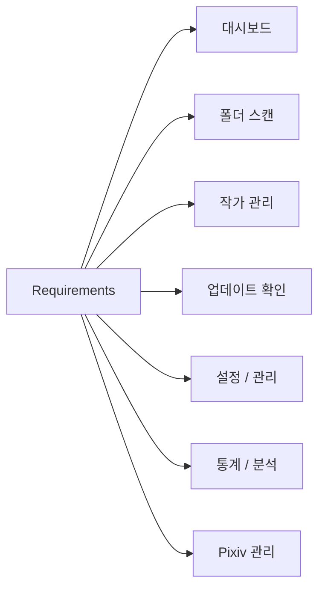

# 기능 요구사항 (Requirements)

## 기능 분류



---

# 기능 요구사항 (FR)

## FR-01 대시보드

<table>
<tr>
    <th>ID</th>
    <th>기능</th>
    <th>설명</th>
</tr>

<tr>
    <td>D-01</td>
    <td>통계 카드</td>
    <td>전체 작가 수 표시</td>
</tr>

<tr>
    <td>D-02</td>
    <td>통계 카드</td>
    <td>전체 작품 수 표시</td>
</tr>

<tr>
    <td>D-03</td>
    <td>통계 카드</td>
    <td>전체 파일 수 표시</td>
</tr>

<tr>
    <td>D-04</td>
    <td>통계 카드</td>
    <td>전체 폴더 용량 표시</td>
</tr>

<tr>
    <td>D-05</td>
    <td>업데이트 현황</td>
    <td>최신, 업데이트 필요, 미확인, 오류 상태 표시</td>
</tr>

<tr>
    <td>D-06</td>
    <td>누락 통계</td>
    <td>전체 누락 작품 수 및 변화 표시</td>
</tr>

<tr>
    <td>D-07</td>
    <td>최근 활동</td>
    <td>최근 열람, 등록, 확인, 오류, 누락 증가 이력 표시</td>
</tr>

<tr>
    <td>D-08</td>
    <td>스캔 통계</td>
    <td>최근 스캔 결과 표시</td>
</tr>

<tr>
    <td>D-09</td>
    <td>TOP 랭킹</td>
    <td>작품 수, 파일 수, 폴더 용량 TOP 표시</td>
</tr>

<tr>
    <td>D-10</td>
    <td>추천 작가</td>
    <td>고평점 및 즐겨찾기 기반 추천</td>
</tr>

<tr>
    <td>D-11</td>
    <td>랜덤 작가</td>
    <td>등록 작가 중 무작위 추천</td>
</tr>

<tr>
    <td>D-12</td>
    <td>상세 페이지 연동</td>
    <td>최근 활동 및 TOP 랭킹에서 상세 페이지 이동</td>
</tr>

</table>

---

## FR-02 폴더 스캔

<table>
<tr>
    <th>ID</th>
    <th>기능</th>
    <th>설명</th>
</tr>

<tr>
    <td>F-01</td>
    <td>폴더 선택</td>
    <td>루트 Pixiv 폴더 선택</td>
</tr>

<tr>
    <td>F-02</td>
    <td>폴더 탐색</td>
    <td>최대 3단계 하위 폴더 탐색</td>
</tr>

<tr>
    <td>F-03</td>
    <td>작가 파싱</td>
    <td>작가명과 Pixiv ID 자동 파싱</td>
</tr>

<tr>
    <td>F-04</td>
    <td>작품 수 계산</td>
    <td>작품 ID 기준 작품 수 계산</td>
</tr>

<tr>
    <td>F-05</td>
    <td>파일 수 계산</td>
    <td>이미지 파일 개수 계산</td>
</tr>

<tr>
    <td>F-06</td>
    <td>폴더 용량 계산</td>
    <td>작가 폴더 용량 계산</td>
</tr>

<tr>
    <td>F-07</td>
    <td>작가 등록</td>
    <td>신규 작가 DB 등록</td>
</tr>

<tr>
    <td>F-08</td>
    <td>작가 갱신</td>
    <td>기존 작가 정보 업데이트</td>
</tr>

<tr>
    <td>F-09</td>
    <td>진행률 표시</td>
    <td>실시간 스캔 진행률 표시</td>
</tr>

<tr>
    <td>F-10</td>
    <td>로그 표시</td>
    <td>실시간 처리 결과 출력</td>
</tr>

<tr>
    <td>F-11</td>
    <td>스캔 미리보기</td>
    <td>등록 전 예상 결과를 미리 확인</td>
</tr>

<tr>
    <td>F-12</td>
    <td>선택 항목 등록</td>
    <td>미리보기에서 선택한 항목만 등록</td>
</tr>

<tr>
    <td>F-13</td>
    <td>결과 필터</td>
    <td>신규, 업데이트, 변경 없음, 오류 결과 필터링</td>
</tr>

<tr>
    <td>F-14</td>
    <td>중복 Pixiv ID 제외</td>
    <td>이미 등록된 Pixiv ID 자동 제외</td>
</tr>

<tr>
    <td>F-15</td>
    <td>실패 항목 재시도</td>
    <td>실패한 폴더만 다시 스캔</td>
</tr>

<tr>
    <td>F-16</td>
    <td>CSV 저장</td>
    <td>스캔 결과 및 미리보기 결과 CSV 저장</td>
</tr>

<tr>
    <td>F-17</td>
    <td>최근 스캔 결과 저장</td>
    <td>최근 스캔 결과 저장 및 조회</td>
</tr>

<tr>
    <td>F-18</td>
    <td>스캔 결과 비교</td>
    <td>이전 스캔 결과와 비교</td>
</tr>

<tr>
    <td>F-19</td>
    <td>일시정지</td>
    <td>현재 작업 완료 후 스캔 일시정지</td>
</tr>

<tr>
    <td>F-20</td>
    <td>이어서 스캔</td>
    <td>일시정지 위치부터 재개</td>
</tr>

<tr>
    <td>F-21</td>
    <td>스캔 중지</td>
    <td>실행 중인 스캔 중단</td>
</tr>

<tr>
    <td>F-22</td>
    <td>진행 정보 표시</td>
    <td>처리 속도, 실행 시간, 남은 시간 표시</td>
</tr>

</table>

---

## FR-03 작가 관리

<table>
<tr>
    <th>ID</th>
    <th>기능</th>
    <th>설명</th>
</tr>

<tr>
    <td>A-01</td>
    <td>작가 등록</td>
    <td>신규 작가 등록</td>
</tr>

<tr>
    <td>A-02</td>
    <td>작가 조회</td>
    <td>등록 작가 목록 조회</td>
</tr>

<tr>
    <td>A-03</td>
    <td>작가 검색</td>
    <td>작가명, Pixiv ID 기반 검색</td>
</tr>

<tr>
    <td>A-04</td>
    <td>다중 정렬</td>
    <td>최대 3개 컬럼 기준 정렬</td>
</tr>

<tr>
    <td>A-05</td>
    <td>즐겨찾기</td>
    <td>즐겨찾기 설정 및 해제</td>
</tr>

<tr>
    <td>A-06</td>
    <td>숨김</td>
    <td>숨김 설정 및 해제</td>
</tr>

<tr>
    <td>A-07</td>
    <td>평점 관리</td>
    <td>0~10 평점 저장</td>
</tr>

<tr>
    <td>A-08</td>
    <td>태그 관리</td>
    <td>태그 등록, 수정, 삭제</td>
</tr>

<tr>
    <td>A-09</td>
    <td>메모 관리</td>
    <td>장문 메모 저장</td>
</tr>

<tr>
    <td>A-10</td>
    <td>참고 링크</td>
    <td>참고 링크 저장</td>
</tr>

<tr>
    <td>A-11</td>
    <td>다운로드 메모</td>
    <td>다운로드 관련 메모 저장</td>
</tr>

<tr>
    <td>A-12</td>
    <td>최근 열람 기록</td>
    <td>최근 열람 일시 저장</td>
</tr>

<tr>
    <td>A-13</td>
    <td>작가 삭제</td>
    <td>삭제 전 자동 백업 후 삭제</td>
</tr>

<tr>
    <td>A-14</td>
    <td>작가 복구</td>
    <td>삭제 백업 기반 복구</td>
</tr>

<tr>
    <td>A-15</td>
    <td>폴더 바로가기</td>
    <td>작가 폴더 열기</td>
</tr>

<tr>
    <td>A-16</td>
    <td>Pixiv 바로가기</td>
    <td>Pixiv 프로필 열기</td>
</tr>

<tr>
    <td>A-17</td>
    <td>폴더 변경</td>
    <td>작가 폴더 경로 변경</td>
</tr>

<tr>
    <td>A-18</td>
    <td>현재 작가 재스캔</td>
    <td>선택 작가 재스캔</td>
</tr>

<tr>
    <td>A-19</td>
    <td>현재 작가 업데이트 확인</td>
    <td>선택 작가 업데이트 확인</td>
</tr>

<tr>
    <td>A-20</td>
    <td>최신 로컬 작품 표시</td>
    <td>최근 작품 목록 표시</td>
</tr>

<tr>
    <td>A-21</td>
    <td>누락 작품 표시</td>
    <td>로컬에 없는 작품 ID 표시</td>
</tr>

<tr>
    <td>A-22</td>
    <td>업데이트 이력 표시</td>
    <td>최근 업데이트 결과 표시</td>
</tr>

</table>

---

## FR-04 업데이트 확인

<table>
<tr>
    <th>ID</th>
    <th>기능</th>
    <th>설명</th>
</tr>

<tr>
    <td>U-01</td>
    <td>다중 작가 선택</td>
    <td>업데이트 대상 선택</td>
</tr>

<tr>
    <td>U-02</td>
    <td>전체 선택</td>
    <td>전체 작가 선택</td>
</tr>

<tr>
    <td>U-03</td>
    <td>필터 선택</td>
    <td>필터 결과만 선택</td>
</tr>

<tr>
    <td>U-04</td>
    <td>업데이트 확인</td>
    <td>Pixiv 최신 작품 조회</td>
</tr>

<tr>
    <td>U-05</td>
    <td>누락 작품 계산</td>
    <td>로컬 데이터와 비교</td>
</tr>

<tr>
    <td>U-06</td>
    <td>상태 계산</td>
    <td>최신, 필요, 오류 상태 계산</td>
</tr>

<tr>
    <td>U-07</td>
    <td>업데이트 이력 저장</td>
    <td>확인 결과 저장</td>
</tr>

<tr>
    <td>U-08</td>
    <td>최근 확인 저장</td>
    <td>최근 확인 일시 저장</td>
</tr>

<tr>
    <td>U-09</td>
    <td>누락 증가 계산</td>
    <td>직전 결과와 비교</td>
</tr>

<tr>
    <td>U-10</td>
    <td>해결 작품 계산</td>
    <td>직전 결과와 비교</td>
</tr>

<tr>
    <td>U-11</td>
    <td>실시간 로그</td>
    <td>진행 로그 출력</td>
</tr>

<tr>
    <td>U-12</td>
    <td>진행률 표시</td>
    <td>실시간 진행률 표시</td>
</tr>

<tr>
    <td>U-13</td>
    <td>결과 요약</td>
    <td>최종 결과 통계 생성</td>
</tr>

<tr>
    <td>U-14</td>
    <td>일시정지</td>
    <td>현재 작업 완료 후 정지</td>
</tr>

<tr>
    <td>U-15</td>
    <td>재개</td>
    <td>중단 위치부터 재개</td>
</tr>

<tr>
    <td>U-16</td>
    <td>중단</td>
    <td>업데이트 확인 중단</td>
</tr>

<tr>
    <td>U-17</td>
    <td>요청 간격 적용</td>
    <td>최소 요청 간격 적용</td>
</tr>

<tr>
    <td>U-18</td>
    <td>배치 휴식 적용</td>
    <td>지정 개수 처리 후 휴식</td>
</tr>

<tr>
    <td>U-19</td>
    <td>재시도 처리</td>
    <td>실패 요청 재시도</td>
</tr>

<tr>
    <td>U-20</td>
    <td>Pixiv 태그 동기화</td>
    <td>작가 태그 자동 갱신</td>
</tr>

</table>

---

## FR-05 설정 / 관리

<table>
<tr>
    <th>ID</th>
    <th>기능</th>
    <th>설명</th>
</tr>

<tr>
    <td>S-01</td>
    <td>기본 폴더 설정</td>
    <td>Pixiv 루트 폴더 저장</td>
</tr>

<tr>
    <td>S-02</td>
    <td>Pixiv PHPSESSID 저장</td>
    <td>Pixiv 로그인 세션 저장</td>
</tr>

<tr>
    <td>S-03</td>
    <td>PHPSESSID 테스트</td>
    <td>세션 유효성 확인</td>
</tr>

<tr>
    <td>S-04</td>
    <td>업데이트 확인 요청 설정</td>
    <td>요청 간격, 배치 수, 휴식 시간, 재시도 설정</td>
</tr>

<tr>
    <td>S-05</td>
    <td>Pixiv 관리 요청 설정</td>
    <td>요청 간격, 배치 수, 휴식 시간, 재시도 설정</td>
</tr>

<tr>
    <td>S-06</td>
    <td>DB 정보 조회</td>
    <td>DB 크기 및 통계 정보 조회</td>
</tr>

<tr>
    <td>S-07</td>
    <td>DB 무결성 검사</td>
    <td>데이터 이상 여부 검사</td>
</tr>

<tr>
    <td>S-08</td>
    <td>DB 최적화</td>
    <td>VACUUM 및 ANALYZE 실행</td>
</tr>

<tr>
    <td>S-09</td>
    <td>DB 백업</td>
    <td>SQLite DB 백업</td>
</tr>

<tr>
    <td>S-10</td>
    <td>DB 복원</td>
    <td>백업 파일 복원</td>
</tr>

<tr>
    <td>S-11</td>
    <td>자동 백업</td>
    <td>자동 백업 설정</td>
</tr>

<tr>
    <td>S-12</td>
    <td>백업 보관 정책</td>
    <td>최대 보관 개수 관리</td>
</tr>

<tr>
    <td>S-13</td>
    <td>설정 백업</td>
    <td>설정 JSON 백업</td>
</tr>

<tr>
    <td>S-14</td>
    <td>설정 복원</td>
    <td>설정 JSON 복원</td>
</tr>

<tr>
    <td>S-15</td>
    <td>설정 초기화</td>
    <td>기본 설정 복원</td>
</tr>

<tr>
    <td>S-16</td>
    <td>CSV 내보내기</td>
    <td>작가 목록 CSV 저장</td>
</tr>

<tr>
    <td>S-17</td>
    <td>환경 정보 저장</td>
    <td>창 크기 및 위치 저장</td>
</tr>

</table>

---

## FR-06 통계 / 분석

<table>
<tr>
    <th>ID</th>
    <th>기능</th>
    <th>설명</th>
</tr>

<tr>
    <td>T-01</td>
    <td>기초 통계</td>
    <td>작가 수, 작품 수, 파일 수, 용량 통계</td>
</tr>

<tr>
    <td>T-02</td>
    <td>상태 분포 분석</td>
    <td>업데이트 상태 분포 표시</td>
</tr>

<tr>
    <td>T-03</td>
    <td>평점 분포 분석</td>
    <td>평점 구간별 통계</td>
</tr>

<tr>
    <td>T-04</td>
    <td>데이터 품질 분석</td>
    <td>태그, 평점, 메모 작성 비율 분석</td>
</tr>

<tr>
    <td>T-05</td>
    <td>작품 수 TOP</td>
    <td>작품 수 기준 랭킹</td>
</tr>

<tr>
    <td>T-06</td>
    <td>파일 수 TOP</td>
    <td>파일 수 기준 랭킹</td>
</tr>

<tr>
    <td>T-07</td>
    <td>용량 TOP</td>
    <td>폴더 용량 기준 랭킹</td>
</tr>

<tr>
    <td>T-08</td>
    <td>태그 분석</td>
    <td>태그 사용 빈도 분석</td>
</tr>

<tr>
    <td>T-09</td>
    <td>즐겨찾기 통계</td>
    <td>즐겨찾기 작가 통계</td>
</tr>

<tr>
    <td>T-10</td>
    <td>태그별 작품 수 분석</td>
    <td>Pixiv 태그 통계 기반 분석</td>
</tr>

</table>

---

## FR-07 Pixiv 관리

<table>
<tr>
    <th>ID</th>
    <th>기능</th>
    <th>설명</th>
</tr>

<tr>
    <td>P-01</td>
    <td>팔로우 유저 가져오기</td>
    <td>TXT, CSV 기반 팔로우 ID 등록</td>
</tr>

<tr>
    <td>P-02</td>
    <td>북마크 작품 가져오기</td>
    <td>TXT, CSV 기반 작품 ID 등록</td>
</tr>

<tr>
    <td>P-03</td>
    <td>중복 제거</td>
    <td>이미 등록된 ID 자동 제외</td>
</tr>

<tr>
    <td>P-04</td>
    <td>로컬 작가 매칭</td>
    <td>Pixiv ID 기준 자동 매칭</td>
</tr>

<tr>
    <td>P-05</td>
    <td>팔로우 유저 관리</td>
    <td>팔로우 목록 조회 및 관리</td>
</tr>

<tr>
    <td>P-06</td>
    <td>북마크 작품 관리</td>
    <td>북마크 목록 조회 및 관리</td>
</tr>

<tr>
    <td>P-07</td>
    <td>Pixiv 메타데이터 조회</td>
    <td>작품 및 유저 정보 수집</td>
</tr>

<tr>
    <td>P-08</td>
    <td>태그 통계 수집</td>
    <td>Pixiv 태그 및 작품 수 수집</td>
</tr>

<tr>
    <td>P-09</td>
    <td>AI 작품 여부 수집</td>
    <td>AI 생성 여부 저장</td>
</tr>

<tr>
    <td>P-10</td>
    <td>Pixiv 바로가기</td>
    <td>유저 및 작품 페이지 열기</td>
</tr>

<tr>
    <td>P-11</td>
    <td>동기화 로그</td>
    <td>동기화 결과 로그 출력</td>
</tr>

<tr>
    <td>P-12</td>
    <td>요약 통계</td>
    <td>팔로우, 북마크, 매칭 통계 표시</td>
</tr>

</table>

---

# 비기능 요구사항 (NFR)

## NFR-01 성능

<table>
<tr>
    <th>ID</th>
    <th>항목</th>
    <th>설명</th>
</tr>

<tr>
    <td>N-01</td>
    <td>UI 응답성</td>
    <td>장시간 작업 중 UI 멈춤 방지</td>
</tr>

<tr>
    <td>N-02</td>
    <td>멀티스레드</td>
    <td>스캔 및 업데이트 작업을 별도 스레드에서 실행</td>
</tr>

<tr>
    <td>N-03</td>
    <td>대량 데이터 처리</td>
    <td>수백~수천 작가 데이터 처리 지원</td>
</tr>

</table>

---

## NFR-02 안정성

<table>
<tr>
    <th>ID</th>
    <th>항목</th>
    <th>설명</th>
</tr>

<tr>
    <td>N-04</td>
    <td>예외 처리</td>
    <td>오류 발생 시 프로그램 종료 방지</td>
</tr>

<tr>
    <td>N-05</td>
    <td>자동 백업</td>
    <td>데이터 손실 방지</td>
</tr>

<tr>
    <td>N-06</td>
    <td>복구 기능</td>
    <td>삭제 데이터 복구 지원</td>
</tr>

<tr>
    <td>N-07</td>
    <td>DB 무결성</td>
    <td>정기 무결성 검사 지원</td>
</tr>

</table>

---

## NFR-03 유지보수성

<table>
<tr>
    <th>ID</th>
    <th>항목</th>
    <th>설명</th>
</tr>

<tr>
    <td>N-08</td>
    <td>Service Layer</td>
    <td>UI와 비즈니스 로직 분리</td>
</tr>

<tr>
    <td>N-09</td>
    <td>Repository Layer</td>
    <td>데이터 접근 계층 분리</td>
</tr>

<tr>
    <td>N-10</td>
    <td>모듈화</td>
    <td>기능 단위 폴더 구조 유지</td>
</tr>

<tr>
    <td>N-11</td>
    <td>리팩토링 용이성</td>
    <td>대규모 기능 추가를 고려한 구조 유지</td>
</tr>

<tr>
    <td>N-12</td>
    <td>확장성</td>
    <td>V3 작품 관리 시스템 확장 지원</td>
</tr>

</table>

---

## NFR-04 Pixiv 연동 안정성

<table>
<tr>
    <th>ID</th>
    <th>항목</th>
    <th>설명</th>
</tr>

<tr>
    <td>N-13</td>
    <td>요청 간격 제한</td>
    <td>과도한 Pixiv 요청 방지</td>
</tr>

<tr>
    <td>N-14</td>
    <td>배치 처리</td>
    <td>대량 요청 시 휴식 적용</td>
</tr>

<tr>
    <td>N-15</td>
    <td>재시도</td>
    <td>일시적 오류 자동 재시도</td>
</tr>

<tr>
    <td>N-16</td>
    <td>세션 검증</td>
    <td>PHPSESSID 유효성 검사 지원</td>
</tr>

<tr>
    <td>N-17</td>
    <td>최소 수집 원칙</td>
    <td>필요한 정보만 조회하여 계정 위험 최소화</td>
</tr>

</table>

---

# 시스템 제약사항

## 기술 스택

```text
Python 3.12
PySide6
SQLite
JSON
CSV
```

---

## 운영 환경

```text
Windows 11
Desktop Application
Local Database
```

---

## 데이터 저장

```text
SQLite Database
JSON Backup
CSV Export
```

---

# V2 개발 예정 기능

현재 V2는 핵심 기능 구현이 완료되었으며 아래 항목이 남아 있다.

```text
3차 리팩토링
추가 기능 개발
4차 리팩토링
v1.0.0 배포 준비
```

---

# V3 개발 예정 기능

```text
작품 관리
작품 상세 정보
썸네일 보기
카드 보기
작품 검색
작품 태그 관리
작품 통계
자체 뷰어
슬라이드쇼
전체 화면
다운로드 연동
다중 라이브러리
```

---

# 구현 완료 기능

## V1 완료

```text
프로젝트 구조 설계
데이터베이스 설계
서비스 레이어 구축
GUI 구축
폴더 스캔
작가 등록
작가 상세 조회
설정 관리
Pixiv 업데이트 확인
```

---

## V2 완료

```text
작가 목록 관리 고도화
작가 상세 페이지 고도화
스캔 시스템 고도화
2차 리팩토링
업데이트 확인 고도화
대시보드 고도화
설정 / 관리 고도화
통계 / 분석 기능 추가
Pixiv 관리 / 연동
```

---

# 사용자 시나리오

## 작가 등록

```text
사용자
→ 폴더 선택
→ 폴더 스캔
→ 미리보기 확인
→ 선택 등록
→ 작가 목록 반영
```

---

## 업데이트 확인

```text
사용자
→ 작가 선택
→ 업데이트 확인
→ 누락 작품 계산
→ 상태 계산
→ 결과 저장
→ 대시보드 반영
```

---

## Pixiv 관리

```text
사용자
→ TXT / CSV 불러오기
→ 팔로우 / 북마크 ID 파싱
→ 메타데이터 수집
→ 로컬 작가 매칭
→ 데이터 저장
→ Pixiv 관리 페이지 반영
```

---

## 데이터 관리

```text
사용자
→ 설정 페이지
→ DB 정보 조회
→ 무결성 검사
→ DB 최적화
→ 백업 / 복원
```

---

# 버전 기준

본 문서는 v0.15.0 (Pixiv 관리 시스템 및 Pixiv 메타데이터 연동 완료) 기준으로 작성되었다.
