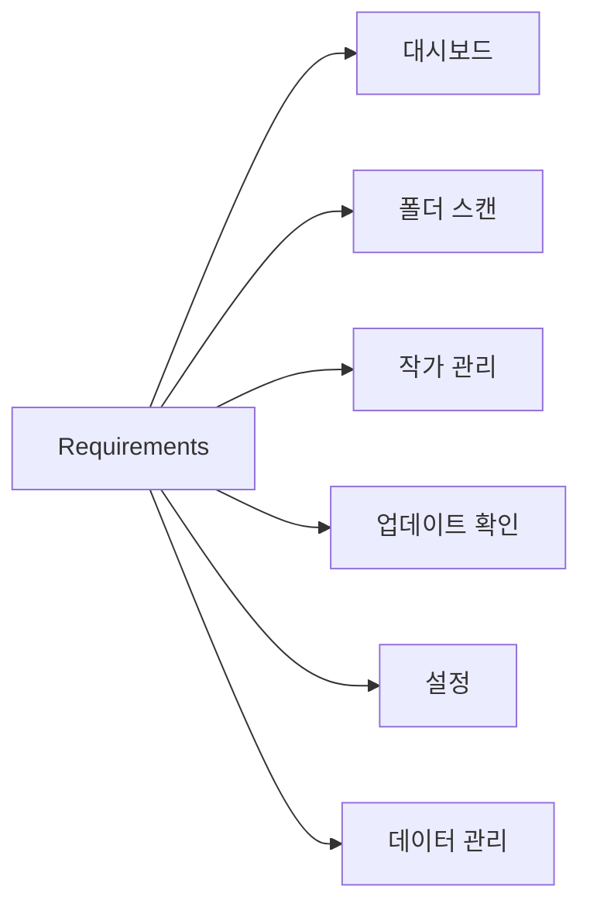

# 기능 요구사항 (Requirements)

## 기능 분류

---

# 기능 요구사항 (FR)

## FR-01 대시보드

<table>
<tr>
    <th>ID</th>
    <th>기능</th>
    <th>설명</th>
</tr>

<tr>
    <td>D-01</td>
    <td>통계 표시</td>
    <td>전체 작가 수 표시</td>
</tr>

<tr>
    <td>D-02</td>
    <td>작품 통계</td>
    <td>전체 작품 수 표시</td>
</tr>

<tr>
    <td>D-03</td>
    <td>평균 평점</td>
    <td>전체 작가 평균 평점 표시</td>
</tr>

<tr>
    <td>D-04</td>
    <td>업데이트 현황</td>
    <td>업데이트 상태별 개수 표시</td>
</tr>

<tr>
    <td>D-05</td>
    <td>추천 작가</td>
    <td>평점 기반 추천 작가 표시</td>
</tr>

<tr>
    <td>D-06</td>
    <td>랜덤 작가</td>
    <td>등록 작가 중 무작위 선택</td>
</tr>

</table>

---

## FR-02 폴더 스캔

<table>
<tr>
    <th>ID</th>
    <th>기능</th>
    <th>설명</th>
</tr>

<tr>
    <td>F-01</td>
    <td>폴더 선택</td>
    <td>루트 Pixiv 폴더 선택</td>
</tr>

<tr>
    <td>F-02</td>
    <td>폴더 탐색</td>
    <td>최대 3단계 하위 폴더 탐색</td>
</tr>

<tr>
    <td>F-03</td>
    <td>작가 파싱</td>
    <td>작가명과 Pixiv ID 자동 파싱</td>
</tr>

<tr>
    <td>F-04</td>
    <td>작품 수 계산</td>
    <td>이미지 파일 개수 계산</td>
</tr>

<tr>
    <td>F-05</td>
    <td>작가 등록</td>
    <td>신규 작가 DB 등록</td>
</tr>

<tr>
    <td>F-06</td>
    <td>작가 갱신</td>
    <td>기존 작가 정보 업데이트</td>
</tr>

<tr>
    <td>F-07</td>
    <td>진행률 표시</td>
    <td>실시간 스캔 진행률 표시</td>
</tr>

<tr>
    <td>F-08</td>
    <td>로그 표시</td>
    <td>실시간 처리 결과 출력</td>
</tr>

</table>

---

## FR-03 작가 관리

<table>
<tr>
    <th>ID</th>
    <th>기능</th>
    <th>설명</th>
</tr>

<tr>
    <td>A-01</td>
    <td>작가 조회</td>
    <td>등록된 작가 목록 표시</td>
</tr>

<tr>
    <td>A-02</td>
    <td>검색</td>
    <td>작가명 및 Pixiv ID 검색</td>
</tr>

<tr>
    <td>A-03</td>
    <td>정렬</td>
    <td>작가명, 작품 수, 평점 정렬</td>
</tr>

<tr>
    <td>A-04</td>
    <td>상태 정렬</td>
    <td>업데이트 상태 기준 정렬</td>
</tr>

<tr>
    <td>A-05</td>
    <td>평점 관리</td>
    <td>0~10 점수 저장</td>
</tr>

<tr>
    <td>A-06</td>
    <td>메모 관리</td>
    <td>작가별 메모 저장</td>
</tr>

<tr>
    <td>A-07</td>
    <td>상세 화면</td>
    <td>작가 상세 정보 조회 및 수정</td>
</tr>

<tr>
    <td>A-08</td>
    <td>Pixiv 이동</td>
    <td>Pixiv 페이지 열기</td>
</tr>

</table>

---

## FR-04 업데이트 확인

<table>
<tr>
    <th>ID</th>
    <th>기능</th>
    <th>설명</th>
</tr>

<tr>
    <td>U-01</td>
    <td>다중 선택</td>
    <td>여러 작가 동시 선택</td>
</tr>

<tr>
    <td>U-02</td>
    <td>업데이트 확인</td>
    <td>Pixiv 최신 작품 조회</td>
</tr>

<tr>
    <td>U-03</td>
    <td>작품 수 비교</td>
    <td>로컬 작품 수와 Pixiv 작품 수 비교</td>
</tr>

<tr>
    <td>U-04</td>
    <td>누락 계산</td>
    <td>누락 작품 수 계산</td>
</tr>

<tr>
    <td>U-05</td>
    <td>상태 갱신</td>
    <td>업데이트 상태 자동 저장</td>
</tr>

<tr>
    <td>U-06</td>
    <td>최근 확인 제외</td>
    <td>최근 확인 작가 제외</td>
</tr>

<tr>
    <td>U-07</td>
    <td>작업 취소</td>
    <td>실행 중 취소 지원</td>
</tr>

<tr>
    <td>U-08</td>
    <td>결과 로그</td>
    <td>작업 결과 기록</td>
</tr>

</table>

---

## FR-05 설정

<table>
<tr>
    <th>ID</th>
    <th>기능</th>
    <th>설명</th>
</tr>

<tr>
    <td>S-01</td>
    <td>기본 폴더 설정</td>
    <td>기본 Pixiv 폴더 저장</td>
</tr>

<tr>
    <td>S-02</td>
    <td>PHPSESSID 저장</td>
    <td>Pixiv 로그인 쿠키 저장</td>
</tr>

<tr>
    <td>S-03</td>
    <td>DB 백업</td>
    <td>SQLite DB 백업</td>
</tr>

<tr>
    <td>S-04</td>
    <td>DB 복원</td>
    <td>SQLite DB 복원</td>
</tr>

<tr>
    <td>S-05</td>
    <td>CSV 내보내기</td>
    <td>작가 목록 CSV 저장</td>
</tr>

</table>

---

# 비기능 요구사항 (NFR)

<table>
<tr>
    <th>ID</th>
    <th>항목</th>
    <th>목표</th>
</tr>

<tr>
    <td>NFR-01</td>
    <td>실행 속도</td>
    <td>프로그램 시작 3초 이내</td>
</tr>

<tr>
    <td>NFR-02</td>
    <td>검색 성능</td>
    <td>즉시 응답</td>
</tr>

<tr>
    <td>NFR-03</td>
    <td>대용량 폴더 대응</td>
    <td>수천 개 파일 처리 가능</td>
</tr>

<tr>
    <td>NFR-04</td>
    <td>Pixiv 요청 최소화</td>
    <td>불필요한 네트워크 요청 방지</td>
</tr>

<tr>
    <td>NFR-05</td>
    <td>확장성</td>
    <td>서비스 단위 기능 추가 가능</td>
</tr>

</table>

---

# V1 제외 기능

<table>
<tr>
    <th>기능</th>
</tr>

<tr><td>작품 상세 관리</td></tr>
<tr><td>작품별 평점</td></tr>
<tr><td>작품별 메모</td></tr>
<tr><td>썸네일 UI</td></tr>
<tr><td>태그 관리</td></tr>
<tr><td>태그 검색</td></tr>
<tr><td>자동 주기 갱신</td></tr>
<tr><td>브라우저 확장 프로그램</td></tr>

</table>