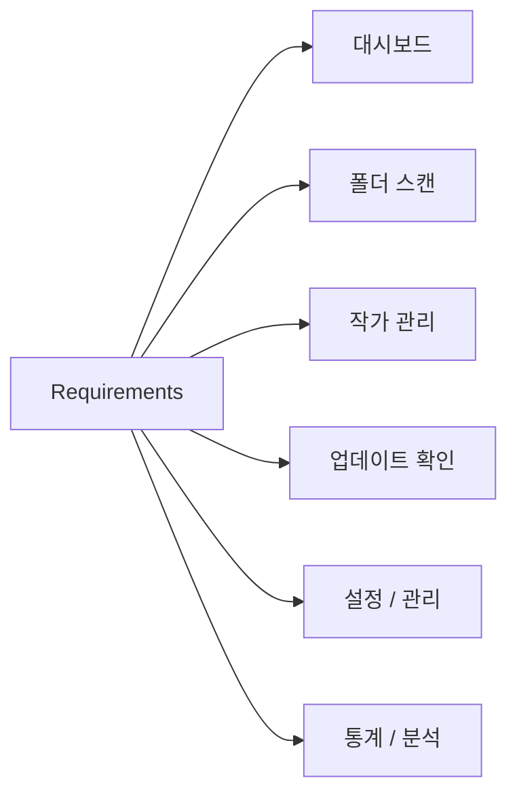

# 기능 요구사항 (Requirements)

## 기능 분류

---

# 기능 요구사항 (FR)

## FR-01 대시보드

<table>
<tr>
    <th>ID</th>
    <th>기능</th>
    <th>설명</th>
</tr>

<tr>
    <td>D-01</td>
    <td>통계 카드</td>
    <td>전체 작가 수 표시</td>
</tr>

<tr>
    <td>D-02</td>
    <td>통계 카드</td>
    <td>전체 작품 수 표시</td>
</tr>

<tr>
    <td>D-03</td>
    <td>통계 카드</td>
    <td>전체 파일 수 표시</td>
</tr>

<tr>
    <td>D-04</td>
    <td>통계 카드</td>
    <td>전체 폴더 용량 표시</td>
</tr>

<tr>
    <td>D-05</td>
    <td>업데이트 현황</td>
    <td>최신, 업데이트 필요, 미확인, 오류 상태 표시</td>
</tr>

<tr>
    <td>D-06</td>
    <td>누락 통계</td>
    <td>전체 누락 작품 수 및 일일 변화 표시</td>
</tr>

<tr>
    <td>D-07</td>
    <td>최근 활동</td>
    <td>최근 열람, 등록, 확인, 오류, 누락 증가 이력 표시</td>
</tr>

<tr>
    <td>D-08</td>
    <td>스캔 통계</td>
    <td>최근 스캔 결과 표시</td>
</tr>

<tr>
    <td>D-09</td>
    <td>TOP 랭킹</td>
    <td>작품 수, 파일 수, 폴더 용량 TOP 표시</td>
</tr>

<tr>
    <td>D-10</td>
    <td>추천 작가</td>
    <td>고평점 및 즐겨찾기 기반 추천</td>
</tr>

<tr>
    <td>D-11</td>
    <td>랜덤 작가</td>
    <td>등록 작가 중 무작위 추천</td>
</tr>

<tr>
    <td>D-12</td>
    <td>상세 페이지 연동</td>
    <td>최근 활동 및 TOP 랭킹에서 상세 페이지 이동</td>
</tr>

</table>

---

## FR-02 폴더 스캔

<table>
<tr>
    <th>ID</th>
    <th>기능</th>
    <th>설명</th>
</tr>

<tr>
    <td>F-01</td>
    <td>폴더 선택</td>
    <td>루트 Pixiv 폴더 선택</td>
</tr>

<tr>
    <td>F-02</td>
    <td>폴더 탐색</td>
    <td>최대 3단계 하위 폴더 탐색</td>
</tr>

<tr>
    <td>F-03</td>
    <td>작가 파싱</td>
    <td>작가명과 Pixiv ID 자동 파싱</td>
</tr>

<tr>
    <td>F-04</td>
    <td>작품 수 계산</td>
    <td>이미지 파일 개수 계산</td>
</tr>

<tr>
    <td>F-05</td>
    <td>작가 등록</td>
    <td>신규 작가 DB 등록</td>
</tr>

<tr>
    <td>F-06</td>
    <td>작가 갱신</td>
    <td>기존 작가 정보 업데이트</td>
</tr>

<tr>
    <td>F-07</td>
    <td>진행률 표시</td>
    <td>실시간 스캔 진행률 표시</td>
</tr>

<tr>
    <td>F-08</td>
    <td>로그 표시</td>
    <td>실시간 처리 결과 출력</td>
</tr>

<tr>
    <td>F-09</td>
    <td>스캔 미리보기</td>
    <td>등록 전 예상 결과를 미리 확인</td>
</tr>

<tr>
    <td>F-10</td>
    <td>선택 항목 등록</td>
    <td>미리보기에서 선택한 항목만 등록</td>
</tr>

<tr>
    <td>F-11</td>
    <td>결과 필터</td>
    <td>신규, 업데이트, 변경 없음, 오류 결과 필터링</td>
</tr>

<tr>
    <td>F-12</td>
    <td>실패 항목 재시도</td>
    <td>실패한 폴더만 다시 스캔</td>
</tr>

<tr>
    <td>F-13</td>
    <td>CSV 저장</td>
    <td>스캔 결과 및 미리보기 결과 CSV 저장</td>
</tr>

<tr>
    <td>F-14</td>
    <td>최근 스캔 결과 저장</td>
    <td>최근 스캔 결과 저장 및 조회</td>
</tr>

<tr>
    <td>F-15</td>
    <td>스캔 결과 비교</td>
    <td>이전 스캔 결과와 비교</td>
</tr>

<tr>
    <td>F-16</td>
    <td>일시정지</td>
    <td>현재 작업 완료 후 스캔 일시정지</td>
</tr>

<tr>
    <td>F-17</td>
    <td>이어서 스캔</td>
    <td>일시정지 위치부터 재개</td>
</tr>

<tr>
    <td>F-18</td>
    <td>스캔 중지</td>
    <td>실행 중인 스캔 중단</td>
</tr>

<tr>
    <td>F-19</td>
    <td>진행 정보 표시</td>
    <td>처리 속도, 실행 시간, 남은 시간 표시</td>
</tr>

</table>

---

## FR-03 작가 관리

<table>
<tr>
    <th>ID</th>
    <th>기능</th>
    <th>설명</th>
</tr>

<tr>
    <td>A-01</td>
    <td>작가 조회</td>
    <td>등록된 작가 목록 표시</td>
</tr>

<tr>
    <td>A-02</td>
    <td>검색</td>
    <td>작가명 및 Pixiv ID 검색</td>
</tr>

<tr>
    <td>A-03</td>
    <td>정렬</td>
    <td>작가명, 작품 수, 평점 정렬</td>
</tr>

<tr>
    <td>A-04</td>
    <td>상태 정렬</td>
    <td>업데이트 상태 기준 정렬</td>
</tr>

<tr>
    <td>A-05</td>
    <td>평점 관리</td>
    <td>0~10 점수 저장</td>
</tr>

<tr>
    <td>A-06</td>
    <td>메모 관리</td>
    <td>작가별 메모 저장</td>
</tr>

<tr>
    <td>A-07</td>
    <td>상세 화면</td>
    <td>작가 상세 정보 조회 및 수정</td>
</tr>

<tr>
    <td>A-08</td>
    <td>Pixiv 이동</td>
    <td>Pixiv 페이지 열기</td>
</tr>

<tr>
    <td>A-09</td>
    <td>즐겨찾기</td>
    <td>작가 즐겨찾기 등록 및 해제</td>
</tr>

<tr>
    <td>A-10</td>
    <td>숨김 기능</td>
    <td>작가 숨김 및 숨김 해제</td>
</tr>

<tr>
    <td>A-11</td>
    <td>다중 선택 관리</td>
    <td>여러 작가 일괄 수정</td>
</tr>

<tr>
    <td>A-12</td>
    <td>작가 삭제</td>
    <td>선택 작가 삭제</td>
</tr>

<tr>
    <td>A-13</td>
    <td>삭제 작가 복구</td>
    <td>백업 파일 기반 복구</td>
</tr>

<tr>
    <td>A-14</td>
    <td>최근 열람 기록</td>
    <td>최근 확인한 작가 기록</td>
</tr>

<tr>
    <td>A-15</td>
    <td>태그 관리</td>
    <td>태그 원문, 번역, 작품 수 관리</td>
</tr>

<tr>
    <td>A-16</td>
    <td>최근 로컬 작품</td>
    <td>최근 저장 작품 표시</td>
</tr>

<tr>
    <td>A-17</td>
    <td>누락 작품 목록</td>
    <td>Pixiv에는 있으나 로컬에 없는 작품 목록 표시</td>
</tr>

<tr>
    <td>A-18</td>
    <td>작가 폴더 변경</td>
    <td>작가 저장 폴더 경로 변경</td>
</tr>

<tr>
    <td>A-19</td>
    <td>참고 링크</td>
    <td>작가 관련 참고 링크 저장</td>
</tr>

<tr>
    <td>A-20</td>
    <td>다운로드 메모</td>
    <td>다운로드 관련 메모 저장</td>
</tr>

<tr>
    <td>A-21</td>
    <td>현재 작가 재스캔</td>
    <td>현재 작가 폴더 재분석 및 정보 갱신</td>
</tr>

<tr>
    <td>A-22</td>
    <td>현재 작가 업데이트 확인</td>
    <td>현재 작가의 Pixiv 최신 정보 확인</td>
</tr>

<tr>
    <td>A-23</td>
    <td>Pixiv ID 복사</td>
    <td>Pixiv ID를 클립보드로 복사</td>
</tr>

<tr>
    <td>A-24</td>
    <td>폴더 경로 복사</td>
    <td>폴더 경로를 클립보드로 복사</td>
</tr>

<tr>
    <td>A-25</td>
    <td>업데이트 이력 조회</td>
    <td>과거 업데이트 결과 및 누락 변화 확인</td>
</tr>

</table>

---

## FR-04 업데이트 확인

<table>
<tr>
    <th>ID</th>
    <th>기능</th>
    <th>설명</th>
</tr>

<tr>
    <td>U-01</td>
    <td>다중 선택</td>
    <td>여러 작가 동시 선택</td>
</tr>

<tr>
    <td>U-02</td>
    <td>업데이트 확인</td>
    <td>Pixiv 최신 작품 정보 조회</td>
</tr>

<tr>
    <td>U-03</td>
    <td>작품 수 비교</td>
    <td>로컬 작품 수와 Pixiv 작품 수 비교</td>
</tr>

<tr>
    <td>U-04</td>
    <td>작품 ID 비교</td>
    <td>작품 ID 기준 누락 작품 확인</td>
</tr>

<tr>
    <td>U-05</td>
    <td>누락 작품 수 계산</td>
    <td>누락 작품 개수 계산</td>
</tr>

<tr>
    <td>U-06</td>
    <td>업데이트 상태 저장</td>
    <td>업데이트 상태 자동 저장</td>
</tr>

<tr>
    <td>U-07</td>
    <td>최근 확인 제외</td>
    <td>최근 확인 작가 제외</td>
</tr>

<tr>
    <td>U-08</td>
    <td>작업 취소</td>
    <td>실행 중 취소 지원</td>
</tr>

<tr>
    <td>U-09</td>
    <td>진행률 표시</td>
    <td>실시간 진행률 표시</td>
</tr>

<tr>
    <td>U-10</td>
    <td>결과 로그 출력</td>
    <td>실시간 결과 로그 표시</td>
</tr>

<tr>
    <td>U-11</td>
    <td>오류 기록</td>
    <td>업데이트 오류 정보 기록</td>
</tr>

<tr>
    <td>U-12</td>
    <td>요청 간격 제어</td>
    <td>Pixiv 요청 간격 자동 제어</td>
</tr>

<tr>
    <td>U-13</td>
    <td>누락 작품 수 기록</td>
    <td>확인 시점별 누락 작품 수 저장</td>
</tr>

<tr>
    <td>U-14</td>
    <td>실패 작가 재확인</td>
    <td>업데이트 실패 작가만 다시 확인</td>
</tr>

<tr>
    <td>U-15</td>
    <td>조건부 일괄 확인</td>
    <td>평점, 상태, 즐겨찾기 조건 기반 실행</td>
</tr>

<tr>
    <td>U-16</td>
    <td>업데이트 필요 자동 선택</td>
    <td>업데이트 필요 작가 자동 선택</td>
</tr>

<tr>
    <td>U-17</td>
    <td>요청 제한 대응</td>
    <td>403, 429 오류 발생 시 자동 대응</td>
</tr>

<tr>
    <td>U-18</td>
    <td>자동 재시도</td>
    <td>일시적인 오류 발생 시 자동 재시도</td>
</tr>

<tr>
    <td>U-19</td>
    <td>일시정지</td>
    <td>업데이트 확인 작업 일시정지</td>
</tr>

<tr>
    <td>U-20</td>
    <td>이어서 하기</td>
    <td>일시정지 위치부터 재개</td>
</tr>

<tr>
    <td>U-21</td>
    <td>예약 실행</td>
    <td>예약된 시간에 자동 실행</td>
</tr>

<tr>
    <td>U-22</td>
    <td>PHPSESSID 테스트</td>
    <td>Pixiv 로그인 상태 사전 확인</td>
</tr>

<tr>
    <td>U-23</td>
    <td>CSV 저장</td>
    <td>업데이트 결과 CSV 저장</td>
</tr>

<tr>
    <td>U-24</td>
    <td>결과 요약</td>
    <td>성공, 실패 결과 통계 표시</td>
</tr>

<tr>
    <td>U-25</td>
    <td>다운로드 예정 목록</td>
    <td>누락 작품 기반 다운로드 예정 목록 생성</td>
</tr>

<tr>
    <td>U-26</td>
    <td>업데이트 결과 저장</td>
    <td>업데이트 결과 저장</td>
</tr>

<tr>
    <td>U-27</td>
    <td>업데이트 결과 비교</td>
    <td>과거 결과와 현재 결과 비교</td>
</tr>

<tr>
    <td>U-28</td>
    <td>최근 누락 증가 작가</td>
    <td>누락 작품 수 증가 작가 표시</td>
</tr>

<tr>
    <td>U-29</td>
    <td>신규 누락 계산</td>
    <td>직전 확인 이후 새롭게 누락된 작품 계산</td>
</tr>

<tr>
    <td>U-30</td>
    <td>해결 작품 계산</td>
    <td>직전 확인 이후 누락이 해결된 작품 계산</td>
</tr>

<tr>
    <td>U-31</td>
    <td>작가별 이력 조회</td>
    <td>작가별 업데이트 확인 이력 조회</td>
</tr>

<tr>
    <td>U-32</td>
    <td>누락 변화 추이</td>
    <td>작가별 누락 작품 수 변화 추적</td>
</tr>

</table>

---

## FR-05 설정 / 관리

<table>
<tr>
    <th>ID</th>
    <th>기능</th>
    <th>설명</th>
</tr>

<tr>
    <td>S-01</td>
    <td>기본 폴더 설정</td>
    <td>기본 Pixiv 폴더 저장</td>
</tr>

<tr>
    <td>S-02</td>
    <td>PHPSESSID 저장</td>
    <td>Pixiv 로그인 쿠키 저장</td>
</tr>

<tr>
    <td>S-03</td>
    <td>DB 백업</td>
    <td>SQLite DB 백업</td>
</tr>

<tr>
    <td>S-04</td>
    <td>DB 복원</td>
    <td>SQLite DB 복원</td>
</tr>

<tr>
    <td>S-05</td>
    <td>CSV 내보내기</td>
    <td>작가 목록 CSV 저장</td>
</tr>

<tr>
    <td>S-06</td>
    <td>삭제 작가 백업</td>
    <td>삭제 전 자동 백업 생성</td>
</tr>

<tr>
    <td>S-07</td>
    <td>삭제 작가 복구</td>
    <td>삭제 백업 파일 기반 복구</td>
</tr>

<tr>
    <td>S-08</td>
    <td>설정 저장</td>
    <td>프로그램 설정 자동 저장</td>
</tr>

<tr>
    <td>S-09</td>
    <td>최근 사용 경로 저장</td>
    <td>최근 사용 폴더 저장</td>
</tr>

<tr>
    <td>S-10</td>
    <td>로그 관리</td>
    <td>로그 조회 및 관리</td>
</tr>

<tr>
    <td>S-11</td>
    <td>자동 백업</td>
    <td>주기적 데이터베이스 백업</td>
</tr>

<tr>
    <td>S-12</td>
    <td>백업 목록 관리</td>
    <td>백업 파일 목록 조회 및 관리</td>
</tr>

<tr>
    <td>S-13</td>
    <td>설정 초기화</td>
    <td>설정을 기본값으로 초기화</td>
</tr>

<tr>
    <td>S-14</td>
    <td>데이터 무결성 검사</td>
    <td>중복 및 손상 데이터 검사</td>
</tr>

<tr>
    <td>S-15</td>
    <td>DB 최적화</td>
    <td>데이터베이스 최적화 실행</td>
</tr>

<tr>
    <td>S-16</td>
    <td>프로그램 정보</td>
    <td>버전 및 데이터 정보 표시</td>
</tr>

<tr>
    <td>S-17</td>
    <td>설정 백업 및 복원</td>
    <td>설정 데이터 백업 및 복원</td>
</tr>

<tr>
    <td>S-18</td>
    <td>창 크기 저장</td>
    <td>마지막 창 크기 저장</td>
</tr>

<tr>
    <td>S-19</td>
    <td>창 위치 저장</td>
    <td>마지막 창 위치 저장</td>
</tr>

<tr>
    <td>S-20</td>
    <td>로그 조회</td>
    <td>프로그램 로그 조회</td>
</tr>

</table>

---

## FR-06 통계 / 분석

<table>
<tr>
    <th>ID</th>
    <th>기능</th>
    <th>설명</th>
</tr>

<tr>
    <td>T-01</td>
    <td>작가 통계</td>
    <td>전체 작가 수 분석</td>
</tr>

<tr>
    <td>T-02</td>
    <td>작품 통계</td>
    <td>전체 작품 수 분석</td>
</tr>

<tr>
    <td>T-03</td>
    <td>평점 통계</td>
    <td>평균 평점 및 평점 분포 분석</td>
</tr>

<tr>
    <td>T-04</td>
    <td>업데이트 통계</td>
    <td>업데이트 상태 비율 분석</td>
</tr>

<tr>
    <td>T-05</td>
    <td>태그 통계</td>
    <td>태그 사용 빈도 분석</td>
</tr>

<tr>
    <td>T-06</td>
    <td>즐겨찾기 통계</td>
    <td>즐겨찾기 관련 통계 제공</td>
</tr>

<tr>
    <td>T-07</td>
    <td>등록 추이</td>
    <td>기간별 등록 수 분석</td>
</tr>

<tr>
    <td>T-08</td>
    <td>업데이트 추이</td>
    <td>기간별 업데이트 결과 분석</td>
</tr>

</table>

---

# 비기능 요구사항 (NFR)

<table>
<tr>
    <th>ID</th>
    <th>항목</th>
    <th>목표</th>
</tr>

<tr>
    <td>NFR-01</td>
    <td>실행 속도</td>
    <td>프로그램 시작 3초 이내</td>
</tr>

<tr>
    <td>NFR-02</td>
    <td>검색 성능</td>
    <td>즉시 응답</td>
</tr>

<tr>
    <td>NFR-03</td>
    <td>대용량 폴더 대응</td>
    <td>수천 개 파일 처리 가능</td>
</tr>

<tr>
    <td>NFR-04</td>
    <td>Pixiv 요청 최소화</td>
    <td>불필요한 네트워크 요청 방지</td>
</tr>

<tr>
    <td>NFR-05</td>
    <td>데이터 안정성</td>
    <td>백업 및 복구 지원</td>
</tr>

<tr>
    <td>NFR-06</td>
    <td>확장성</td>
    <td>서비스 단위 기능 추가 가능</td>
</tr>

<tr>
    <td>NFR-07</td>
    <td>유지보수성</td>
    <td>모듈 단위 구조 유지</td>
</tr>

</table>

---

# 버전 범위

<table>
<tr>
    <th>버전</th>
    <th>범위</th>
</tr>

<tr>
    <td>V1</td>
    <td>프로젝트 기반 구축, 스캔 시스템, 작가 등록, 업데이트 확인 기본 기능</td>
</tr>

<tr>
    <td>V2</td>
    <td>작가 관리, 작가 상세 페이지, 스캔 시스템, 업데이트 확인, 대시보드, 설정/관리, 통계/분석 - 7개 부분 고도화</td>
</tr>

<tr>
    <td>V3</td>
    <td>보기 형식 확장, 작품 관리, 자체 뷰어, 장기 기능</td>
</tr>

</table>

---

# V3 제외 기능

<table>
<tr>
    <th>기능</th>
</tr>

<tr><td>웹 버전</td></tr>
<tr><td>플러그인 시스템</td></tr>
<tr><td>클라우드 백업</td></tr>
<tr><td>다중 라이브러리 관리</td></tr>

</table>

---
