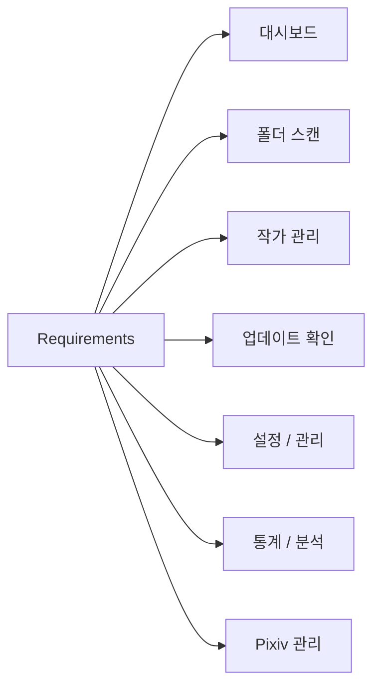

# 기능 요구사항 (Requirements)

## 기능 분류



---

# 기능 요구사항 (FR)

## FR-01 대시보드

<table>
<tr>
    <th>ID</th>
    <th>기능</th>
    <th>설명</th>
</tr>

<tr>
    <td>D-01</td>
    <td>통계 카드</td>
    <td>전체 작가 수 표시</td>
</tr>

<tr>
    <td>D-02</td>
    <td>통계 카드</td>
    <td>전체 작품 수 표시</td>
</tr>

<tr>
    <td>D-03</td>
    <td>통계 카드</td>
    <td>전체 파일 수 표시</td>
</tr>

<tr>
    <td>D-04</td>
    <td>통계 카드</td>
    <td>전체 폴더 용량 표시</td>
</tr>

<tr>
    <td>D-05</td>
    <td>업데이트 현황</td>
    <td>최신, 업데이트 필요, 미확인, 오류 상태 표시</td>
</tr>

<tr>
    <td>D-06</td>
    <td>누락 통계</td>
    <td>전체 누락 작품 수 및 변화 표시</td>
</tr>

<tr>
    <td>D-07</td>
    <td>최근 활동</td>
    <td>최근 열람, 등록, 확인, 오류, 누락 증가 이력 표시</td>
</tr>

<tr>
    <td>D-08</td>
    <td>스캔 통계</td>
    <td>최근 스캔 결과 표시</td>
</tr>

<tr>
    <td>D-09</td>
    <td>TOP 랭킹</td>
    <td>작품 수, 파일 수, 폴더 용량 TOP 표시</td>
</tr>

<tr>
    <td>D-10</td>
    <td>추천 작가</td>
    <td>고평점 및 즐겨찾기 기반 추천</td>
</tr>

<tr>
    <td>D-11</td>
    <td>랜덤 작가</td>
    <td>등록 작가 중 무작위 추천</td>
</tr>

<tr>
    <td>D-12</td>
    <td>상세 페이지 연동</td>
    <td>최근 활동 및 TOP 랭킹에서 상세 페이지 이동</td>
</tr>

</table>

---

## FR-02 폴더 스캔

<table>
<tr>
    <th>ID</th>
    <th>기능</th>
    <th>설명</th>
</tr>

<tr>
    <td>F-01</td>
    <td>폴더 선택</td>
    <td>루트 Pixiv 폴더 선택</td>
</tr>

<tr>
    <td>F-02</td>
    <td>폴더 탐색</td>
    <td>최대 3단계 하위 폴더 탐색</td>
</tr>

<tr>
    <td>F-03</td>
    <td>작가 파싱</td>
    <td>작가명과 Pixiv ID 자동 파싱</td>
</tr>

<tr>
    <td>F-04</td>
    <td>작품 수 계산</td>
    <td>작품 ID 기준 작품 수 계산</td>
</tr>

<tr>
    <td>F-05</td>
    <td>파일 수 계산</td>
    <td>이미지 파일 개수 계산</td>
</tr>

<tr>
    <td>F-06</td>
    <td>폴더 용량 계산</td>
    <td>작가 폴더 용량 계산</td>
</tr>

<tr>
    <td>F-07</td>
    <td>작가 등록</td>
    <td>신규 작가 DB 등록</td>
</tr>

<tr>
    <td>F-08</td>
    <td>작가 갱신</td>
    <td>기존 작가 정보 업데이트</td>
</tr>

<tr>
    <td>F-09</td>
    <td>진행률 표시</td>
    <td>실시간 스캔 진행률 표시</td>
</tr>

<tr>
    <td>F-10</td>
    <td>로그 표시</td>
    <td>실시간 처리 결과 출력</td>
</tr>

<tr>
    <td>F-11</td>
    <td>스캔 미리보기</td>
    <td>등록 전 예상 결과를 미리 확인</td>
</tr>

<tr>
    <td>F-12</td>
    <td>선택 항목 등록</td>
    <td>미리보기에서 선택한 항목만 등록</td>
</tr>

<tr>
    <td>F-13</td>
    <td>결과 필터</td>
    <td>신규, 업데이트, 변경 없음, 오류 결과 필터링</td>
</tr>

<tr>
    <td>F-14</td>
    <td>중복 Pixiv ID 제외</td>
    <td>이미 등록된 Pixiv ID 자동 제외</td>
</tr>

<tr>
    <td>F-15</td>
    <td>실패 항목 재시도</td>
    <td>실패한 폴더만 다시 스캔</td>
</tr>

<tr>
    <td>F-16</td>
    <td>CSV 저장</td>
    <td>스캔 결과 및 미리보기 결과 CSV 저장</td>
</tr>

<tr>
    <td>F-17</td>
    <td>최근 스캔 결과 저장</td>
    <td>최근 스캔 결과 저장 및 조회</td>
</tr>

<tr>
    <td>F-18</td>
    <td>스캔 결과 비교</td>
    <td>이전 스캔 결과와 비교</td>
</tr>

<tr>
    <td>F-19</td>
    <td>일시정지</td>
    <td>현재 작업 완료 후 스캔 일시정지</td>
</tr>

<tr>
    <td>F-20</td>
    <td>이어서 스캔</td>
    <td>일시정지 위치부터 재개</td>
</tr>

<tr>
    <td>F-21</td>
    <td>스캔 중지</td>
    <td>실행 중인 스캔 중단</td>
</tr>

<tr>
    <td>F-22</td>
    <td>진행 정보 표시</td>
    <td>처리 속도, 실행 시간, 남은 시간 표시</td>
</tr>

</table>

---

## FR-03 작가 관리

<table>
<tr>
    <th>ID</th>
    <th>기능</th>
    <th>설명</th>
</tr>

<tr>
    <td>A-01</td>
    <td>작가 등록</td>
    <td>신규 작가 등록</td>
</tr>

<tr>
    <td>A-02</td>
    <td>작가 조회</td>
    <td>등록 작가 목록 조회</td>
</tr>

<tr>
    <td>A-03</td>
    <td>작가 검색</td>
    <td>전체, 작가명, Pixiv ID, 태그 기반 검색</td>
</tr>

<tr>
    <td>A-04</td>
    <td>다중 정렬</td>
    <td>최대 3개 컬럼 기준 정렬</td>
</tr>

<tr>
    <td>A-05</td>
    <td>즐겨찾기</td>
    <td>즐겨찾기 설정 및 해제</td>
</tr>

<tr>
    <td>A-06</td>
    <td>평점 관리</td>
    <td>0~10 평점 저장</td>
</tr>

<tr>
    <td>A-07</td>
    <td>태그 관리</td>
    <td>태그 등록, 수정, 삭제</td>
</tr>

<tr>
    <td>A-08</td>
    <td>메모 관리</td>
    <td>장문 메모 저장</td>
</tr>

<tr>
    <td>A-09</td>
    <td>참고 링크</td>
    <td>참고 링크 저장</td>
</tr>

<tr>
    <td>A-10</td>
    <td>다운로드 메모</td>
    <td>다운로드 관련 메모 저장</td>
</tr>

<tr>
    <td>A-11</td>
    <td>최근 열람 기록</td>
    <td>최근 열람 일시 저장</td>
</tr>

<tr>
    <td>A-12</td>
    <td>작가 삭제</td>
    <td>삭제 전 자동 백업 후 삭제</td>
</tr>

<tr>
    <td>A-13</td>
    <td>작가 복구</td>
    <td>삭제 백업 기반 복구</td>
</tr>

<tr>
    <td>A-14</td>
    <td>폴더 바로가기</td>
    <td>작가 폴더 열기</td>
</tr>

<tr>
    <td>A-15</td>
    <td>Pixiv 바로가기</td>
    <td>Pixiv 프로필 열기</td>
</tr>

<tr>
    <td>A-16</td>
    <td>Pixiv ID 복사</td>
    <td>Pixiv ID 클립보드 복사</td>
</tr>

<tr>
    <td>A-17</td>
    <td>폴더 경로 복사</td>
    <td>작가 폴더 경로 클립보드 복사</td>
</tr>

<tr>
    <td>A-18</td>
    <td>폴더 변경</td>
    <td>작가 폴더 경로 변경</td>
</tr>

<tr>
    <td>A-19</td>
    <td>현재 작가 재스캔</td>
    <td>선택 작가 재스캔</td>
</tr>

<tr>
    <td>A-20</td>
    <td>현재 작가 업데이트 확인</td>
    <td>선택 작가 업데이트 확인</td>
</tr>

<tr>
    <td>A-21</td>
    <td>최신 로컬 작품 표시</td>
    <td>최근 작품 목록 표시</td>
</tr>

<tr>
    <td>A-22</td>
    <td>누락 작품 표시</td>
    <td>로컬에 없는 작품 ID 표시</td>
</tr>

<tr>
    <td>A-23</td>
    <td>업데이트 이력 표시</td>
    <td>최근 업데이트 결과 표시</td>
</tr>

<tr>
    <td>A-24</td>
    <td>우클릭 메뉴</td>
    <td>작가 목록에서 평점, 즐겨찾기, 삭제 기능 제공</td>
</tr>

<tr>
    <td>A-25</td>
    <td>저장 용량 표시</td>
    <td>작가 목록 및 상세에서 폴더 저장 용량 표시</td>
</tr>

<tr>
    <td>A-26</td>
    <td>누락 작품 수 표시</td>
    <td>작가 목록에서 누락 작품 수 표시</td>
</tr>

<tr>
    <td>A-27</td>
    <td>수정일 표시</td>
    <td>작가 목록에서 수정일 표시 및 정렬</td>
</tr>

</table>

---

## FR-04 업데이트 확인

<table>
<tr>
    <th>ID</th>
    <th>기능</th>
    <th>설명</th>
</tr>

<tr>
    <td>U-01</td>
    <td>다중 작가 선택</td>
    <td>업데이트 대상 선택</td>
</tr>

<tr>
    <td>U-02</td>
    <td>전체 선택</td>
    <td>전체 작가 선택</td>
</tr>

<tr>
    <td>U-03</td>
    <td>필터 선택</td>
    <td>필터 결과만 선택</td>
</tr>

<tr>
    <td>U-04</td>
    <td>업데이트 확인</td>
    <td>Pixiv 최신 작품 조회</td>
</tr>

<tr>
    <td>U-05</td>
    <td>누락 작품 계산</td>
    <td>로컬 데이터와 비교</td>
</tr>

<tr>
    <td>U-06</td>
    <td>상태 계산</td>
    <td>최신, 필요, 오류 상태 계산</td>
</tr>

<tr>
    <td>U-07</td>
    <td>업데이트 이력 저장</td>
    <td>확인 결과 저장</td>
</tr>

<tr>
    <td>U-08</td>
    <td>최근 확인 저장</td>
    <td>최근 확인 일시 저장</td>
</tr>

<tr>
    <td>U-09</td>
    <td>누락 증가 계산</td>
    <td>직전 결과와 비교</td>
</tr>

<tr>
    <td>U-10</td>
    <td>해결 작품 계산</td>
    <td>직전 결과와 비교</td>
</tr>

<tr>
    <td>U-11</td>
    <td>실시간 로그</td>
    <td>진행 로그 출력</td>
</tr>

<tr>
    <td>U-12</td>
    <td>진행률 표시</td>
    <td>실시간 진행률 표시</td>
</tr>

<tr>
    <td>U-13</td>
    <td>결과 요약</td>
    <td>최종 결과 통계 생성</td>
</tr>

<tr>
    <td>U-14</td>
    <td>일시정지</td>
    <td>현재 작업 완료 후 정지</td>
</tr>

<tr>
    <td>U-15</td>
    <td>재개</td>
    <td>중단 위치부터 재개</td>
</tr>

<tr>
    <td>U-16</td>
    <td>중단</td>
    <td>업데이트 확인 중단</td>
</tr>

<tr>
    <td>U-17</td>
    <td>요청 간격 적용</td>
    <td>최소 요청 간격 적용</td>
</tr>

<tr>
    <td>U-18</td>
    <td>배치 휴식 적용</td>
    <td>지정 개수 처리 후 휴식</td>
</tr>

<tr>
    <td>U-19</td>
    <td>재시도 처리</td>
    <td>실패 요청 재시도</td>
</tr>

<tr>
    <td>U-20</td>
    <td>Pixiv 태그 동기화</td>
    <td>작가 태그 자동 갱신</td>
</tr>

<tr>
    <td>U-21</td>
    <td>업데이트 결과 비교</td>
    <td>직전 결과와 현재 결과 비교</td>
</tr>

<tr>
    <td>U-22</td>
    <td>업데이트 이력 조회</td>
    <td>작가 상세에서 저장된 이력 조회</td>
</tr>

<tr>
    <td>U-23</td>
    <td>누락 작품 변화 추적</td>
    <td>신규 누락 및 해결 작품 변화 추적</td>
</tr>

</table>

---

## FR-05 설정 / 관리

<table>
<tr>
    <th>ID</th>
    <th>기능</th>
    <th>설명</th>
</tr>

<tr>
    <td>S-01</td>
    <td>Pixiv 루트 폴더 설정</td>
    <td>기본 Pixiv 폴더 경로 저장</td>
</tr>

<tr>
    <td>S-02</td>
    <td>PHPSESSID 저장</td>
    <td>Pixiv 로그인 세션 저장</td>
</tr>

<tr>
    <td>S-03</td>
    <td>세션 테스트</td>
    <td>PHPSESSID 유효성 검사</td>
</tr>

<tr>
    <td>S-04</td>
    <td>Pixiv 요청 간격 설정</td>
    <td>Pixiv 관리 요청 간격 설정</td>
</tr>

<tr>
    <td>S-05</td>
    <td>Pixiv 배치 설정</td>
    <td>Pixiv 관리 배치 처리 수 설정</td>
</tr>

<tr>
    <td>S-06</td>
    <td>업데이트 요청 간격 설정</td>
    <td>업데이트 확인 요청 간격 설정</td>
</tr>

<tr>
    <td>S-07</td>
    <td>업데이트 배치 설정</td>
    <td>업데이트 확인 배치 처리 수 설정</td>
</tr>

<tr>
    <td>S-08</td>
    <td>창 위치 저장</td>
    <td>창 크기 및 위치 저장</td>
</tr>

<tr>
    <td>S-09</td>
    <td>창 위치 복구</td>
    <td>프로그램 시작 시 창 상태 복구</td>
</tr>

<tr>
    <td>S-10</td>
    <td>DB 정보 조회</td>
    <td>DB 크기 및 통계 조회</td>
</tr>

<tr>
    <td>S-11</td>
    <td>DB 무결성 검사</td>
    <td>데이터 이상 여부 검사</td>
</tr>

<tr>
    <td>S-12</td>
    <td>DB 최적화</td>
    <td>VACUUM, ANALYZE 실행</td>
</tr>

<tr>
    <td>S-13</td>
    <td>DB 백업</td>
    <td>SQLite DB 백업</td>
</tr>

<tr>
    <td>S-14</td>
    <td>DB 복원</td>
    <td>SQLite DB 복원</td>
</tr>

<tr>
    <td>S-15</td>
    <td>설정 백업</td>
    <td>설정 JSON 백업</td>
</tr>

<tr>
    <td>S-16</td>
    <td>설정 복원</td>
    <td>설정 JSON 복원</td>
</tr>

<tr>
    <td>S-17</td>
    <td>프로그램 정보</td>
    <td>버전 및 환경 정보 표시</td>
</tr>

<tr>
    <td>S-18</td>
    <td>최근 경로 저장</td>
    <td>가져오기 및 내보내기 경로 저장</td>
</tr>

<tr>
    <td>S-19</td>
    <td>로그 관리</td>
    <td>실행 로그 조회 및 관리</td>
</tr>

<tr>
    <td>S-20</td>
    <td>백업 정보 조회</td>
    <td>최근 백업 정보 표시</td>
</tr>

</table>

---

## FR-06 통계 / 분석

<table>
<tr>
    <th>ID</th>
    <th>기능</th>
    <th>설명</th>
</tr>

<tr>
    <td>T-01</td>
    <td>전체 통계</td>
    <td>전체 작가, 작품, 파일, 용량 집계</td>
</tr>

<tr>
    <td>T-02</td>
    <td>상태 분포 분석</td>
    <td>업데이트 상태 분포 분석</td>
</tr>

<tr>
    <td>T-03</td>
    <td>평점 분포 분석</td>
    <td>평점 분포 분석</td>
</tr>

<tr>
    <td>T-04</td>
    <td>TOP 랭킹</td>
    <td>작품 수, 파일 수, 용량 TOP 분석</td>
</tr>

<tr>
    <td>T-05</td>
    <td>태그 분석</td>
    <td>사용 태그 통계 분석</td>
</tr>

<tr>
    <td>T-06</td>
    <td>품질 분석</td>
    <td>태그, 메모, 평점 작성률 분석</td>
</tr>

<tr>
    <td>T-07</td>
    <td>즐겨찾기 분석</td>
    <td>즐겨찾기 작가 통계</td>
</tr>

<tr>
    <td>T-08</td>
    <td>주간 변화 분석</td>
    <td>누락 변화 및 저장 용량 변화 분석</td>
</tr>

<tr>
    <td>T-09</td>
    <td>Pixiv 관리 통계</td>
    <td>팔로우 및 북마크 통계 분석</td>
</tr>

<tr>
    <td>T-10</td>
    <td>태그 검색 이동</td>
    <td>Pixiv 태그 검색 페이지 이동</td>
</tr>

<tr>
    <td>T-11</td>
    <td>작가 페이지 이동</td>
    <td>Pixiv 작가 페이지 이동</td>
</tr>

</table>

---

## FR-07 Pixiv 관리

<table>
<tr>
    <th>ID</th>
    <th>기능</th>
    <th>설명</th>
</tr>

<tr>
    <td>P-01</td>
    <td>팔로우 유저 관리</td>
    <td>팔로우 유저 목록 저장 및 조회</td>
</tr>

<tr>
    <td>P-02</td>
    <td>북마크 작품 관리</td>
    <td>북마크 작품 목록 저장 및 조회</td>
</tr>

<tr>
    <td>P-03</td>
    <td>TXT 가져오기</td>
    <td>TXT 파일에서 ID 추출</td>
</tr>

<tr>
    <td>P-04</td>
    <td>CSV 가져오기</td>
    <td>CSV 파일에서 ID 추출</td>
</tr>

<tr>
    <td>P-05</td>
    <td>중복 제거</td>
    <td>중복 ID 자동 제외</td>
</tr>

<tr>
    <td>P-06</td>
    <td>Pixiv 메타데이터 수집</td>
    <td>작가 및 작품 정보 수집</td>
</tr>

<tr>
    <td>P-07</td>
    <td>Pixiv 태그 수집</td>
    <td>태그 및 번역 정보 수집</td>
</tr>

<tr>
    <td>P-08</td>
    <td>AI 정보 수집</td>
    <td>AI 생성 여부 수집</td>
</tr>

<tr>
    <td>P-09</td>
    <td>로컬 작가 매칭</td>
    <td>Pixiv ID 기반 자동 매칭</td>
</tr>

<tr>
    <td>P-10</td>
    <td>동기화 실행</td>
    <td>Pixiv 정보 동기화</td>
</tr>

<tr>
    <td>P-11</td>
    <td>동기화 로그</td>
    <td>동기화 진행 로그 저장</td>
</tr>

<tr>
    <td>P-12</td>
    <td>통계 생성</td>
    <td>팔로우 및 북마크 통계 생성</td>
</tr>

<tr>
    <td>P-13</td>
    <td>동기화 결과 비교</td>
    <td>이전 동기화 결과와 현재 결과 비교</td>
</tr>

<tr>
    <td>P-14</td>
    <td>동기화 이력 저장</td>
    <td>동기화 실행 결과 저장</td>
</tr>

<tr>
    <td>P-15</td>
    <td>태그 재동기화</td>
    <td>저장된 태그 정보 재수집</td>
</tr>

</table>

---

# 비기능 요구사항 (NFR)

## NFR-01 성능

<table>
<tr>
    <th>ID</th>
    <th>항목</th>
    <th>설명</th>
</tr>

<tr>
    <td>N-01</td>
    <td>작가 조회</td>
    <td>1,000명 이상 작가 목록에서 원활한 조회 지원</td>
</tr>

<tr>
    <td>N-02</td>
    <td>스캔 처리</td>
    <td>대량 폴더 스캔 시 UI 응답 유지</td>
</tr>

<tr>
    <td>N-03</td>
    <td>업데이트 확인</td>
    <td>다중 작가 처리 중 UI 응답 유지</td>
</tr>

<tr>
    <td>N-04</td>
    <td>통계 생성</td>
    <td>통계 페이지 진입 시 빠른 데이터 계산</td>
</tr>

<tr>
    <td>N-05</td>
    <td>DB 최적화</td>
    <td>대용량 데이터 환경에서도 정상 동작</td>
</tr>

</table>

---

## NFR-02 안정성

<table>
<tr>
    <th>ID</th>
    <th>항목</th>
    <th>설명</th>
</tr>

<tr>
    <td>N-06</td>
    <td>오류 처리</td>
    <td>예외 발생 시 프로그램 종료 방지</td>
</tr>

<tr>
    <td>N-07</td>
    <td>데이터 보호</td>
    <td>삭제 전 자동 백업 수행</td>
</tr>

<tr>
    <td>N-08</td>
    <td>복구 지원</td>
    <td>삭제 작가 복구 지원</td>
</tr>

<tr>
    <td>N-09</td>
    <td>DB 보호</td>
    <td>DB 백업 및 복원 지원</td>
</tr>

<tr>
    <td>N-10</td>
    <td>설정 보호</td>
    <td>설정 백업 및 복원 지원</td>
</tr>

</table>

---

## NFR-03 유지보수성

<table>
<tr>
    <th>ID</th>
    <th>항목</th>
    <th>설명</th>
</tr>

<tr>
    <td>N-11</td>
    <td>계층 분리</td>
    <td>UI → Service → Repository 구조 유지</td>
</tr>

<tr>
    <td>N-12</td>
    <td>모듈화</td>
    <td>기능별 모듈 분리</td>
</tr>

<tr>
    <td>N-13</td>
    <td>UI 분리</td>
    <td>Page, Section, Widget 구조 사용</td>
</tr>

<tr>
    <td>N-14</td>
    <td>비동기 처리</td>
    <td>장시간 작업은 Worker 사용</td>
</tr>

<tr>
    <td>N-15</td>
    <td>확장성</td>
    <td>V3 기능 추가 시 구조 변경 최소화</td>
</tr>

</table>

---

## NFR-04 사용성

<table>
<tr>
    <th>ID</th>
    <th>항목</th>
    <th>설명</th>
</tr>

<tr>
    <td>N-16</td>
    <td>일관성</td>
    <td>모든 페이지에서 동일한 UI 패턴 사용</td>
</tr>

<tr>
    <td>N-17</td>
    <td>가독성</td>
    <td>상태 배지 및 통계 정보 시각화</td>
</tr>

<tr>
    <td>N-18</td>
    <td>접근성</td>
    <td>검색, 필터, 정렬 중심 사용성 제공</td>
</tr>

<tr>
    <td>N-19</td>
    <td>바로가기</td>
    <td>Pixiv 및 폴더 바로가기 제공</td>
</tr>

<tr>
    <td>N-20</td>
    <td>작업 효율</td>
    <td>일괄 처리 기능 제공</td>
</tr>

</table>

---

# 제약 사항

## 기술 스택

```text
Python 3.12
PySide6
SQLite
JSON
CSV
PyInstaller
```

---

## 운영 환경

```text
Windows 11
Desktop Application
Local Database
```

---

## Pixiv 정책 대응

```text
최소 요청 수 유지
요청 간격 적용
배치 휴식 적용
재시도 제한
PHPSESSID 기반 인증
```

---

# 우선순위

## 필수 기능

```text
작가 관리
폴더 스캔
업데이트 확인
대시보드
설정 관리
통계 분석
Pixiv 관리
백업 및 복구
```

---

## V2 완료 목표

```text
작가 중심 관리 시스템 완성
Pixiv 관리 시스템 완성
통계 분석 시스템 완성
v1.0.0 배포 준비
```

---

## V3 목표

```text
작품 중심 관리 시스템 구축
자체 뷰어 구축
Pixiv 자동 동기화 구축
예약 실행 시스템 구축
```

---

# 요구사항 추적

## V1

```text
프로젝트 구조
데이터베이스
서비스 레이어
GUI
폴더 스캔
작가 등록
설정 관리
업데이트 확인
```

완료

---

## V2

```text
작가 목록 관리
작가 상세 관리
스캔 시스템
업데이트 확인
대시보드
설정 관리
통계 분석
Pixiv 관리
Pixiv 연동
3차 리팩토링
추가 기능 개발
```

완료

---

## V2 잔여 작업

```text
V2 개발 마무리
성능 최적화
안정성 점검
문서 정비
v1.0.0 배포 준비
```

---

## V3

```text
작품 관리
작품 상세
작품 태그 편집

팔로우 / 북마크 상세

Pixiv 계정 연동

자동 동기화
동기화 결과 비교
동기화 이력
동기화 로그
태그 재동기화

업데이트 예약 실행
예약 실행 로그
예약 실행 오류 기록

Pixiv 검색 기능

자체 뷰어
다운로드 연동
다중 라이브러리
```

예정

---

# 버전 기준

본 문서는 v0.17.0 (추가 기능 개발 완료) 기준으로 작성되었다.

현재 프로젝트는 v0.18.0 (V2 개발 마무리 및 v1.0.0 준비) 단계 진행 예정 상태이다.
