# 시스템 흐름도 (System Flow)

## 전체 시스템 흐름

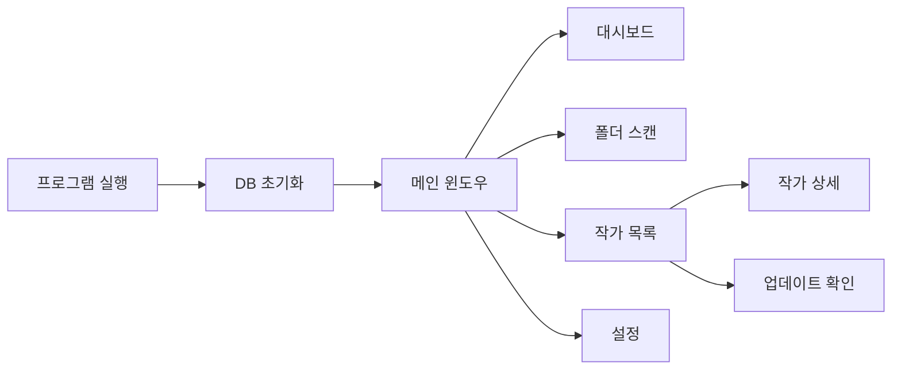

---

## 프로그램 구조

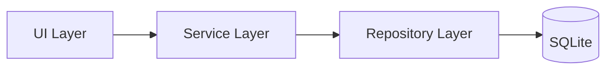

---

## 폴더 스캔 흐름

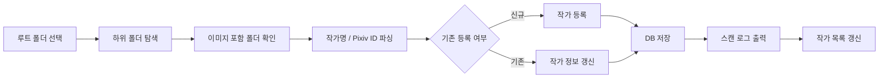

---

## 작가 목록 흐름

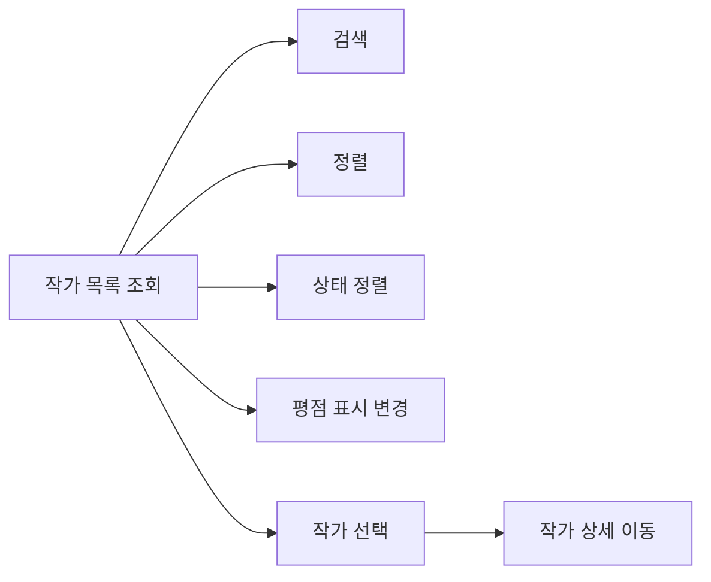

---

## 작가 상세 흐름

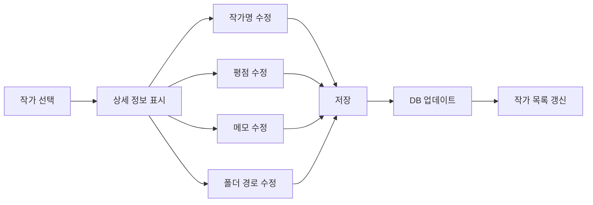

---

## Pixiv 업데이트 확인 흐름

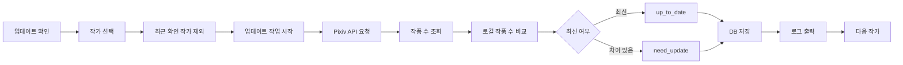

---

## 업데이트 작업 흐름

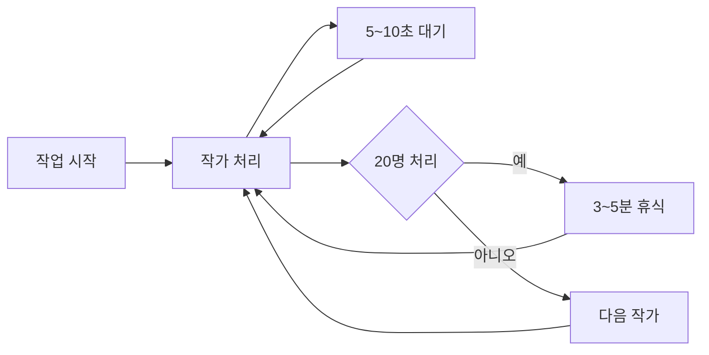

---

## 설정 저장 흐름

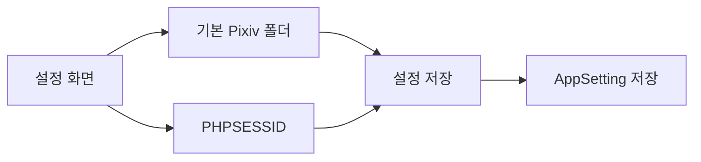

---

## DB 백업 흐름

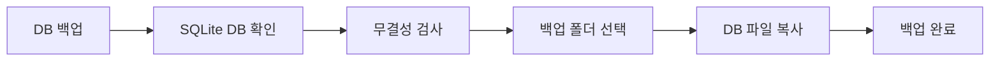

---

## DB 복원 흐름

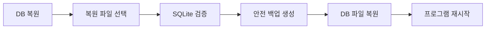

---

## CSV 내보내기 흐름

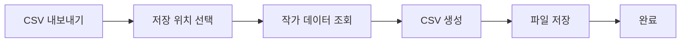

---

## 화면 이동 구조

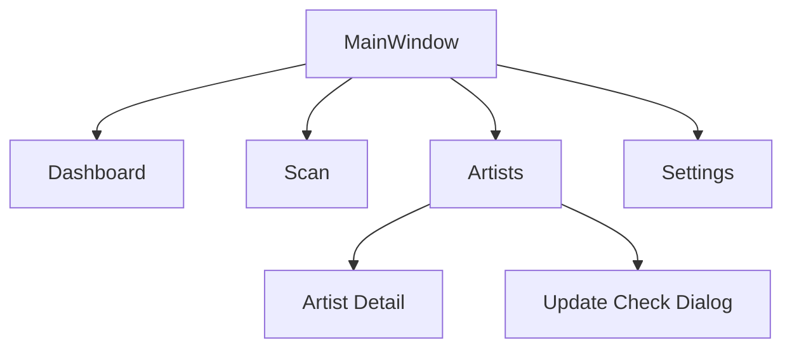

---

## 데이터 흐름

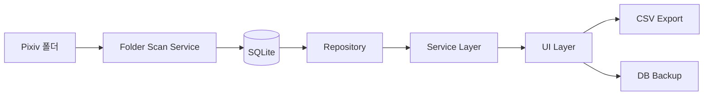