# 시스템 흐름

## 전체 흐름

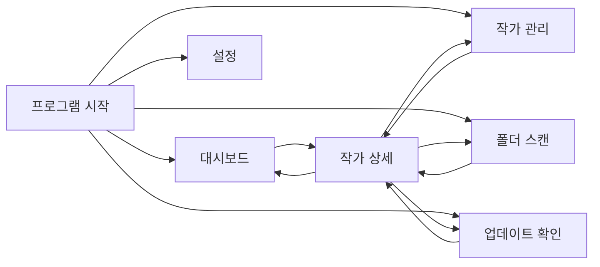

---

# 대시보드 흐름

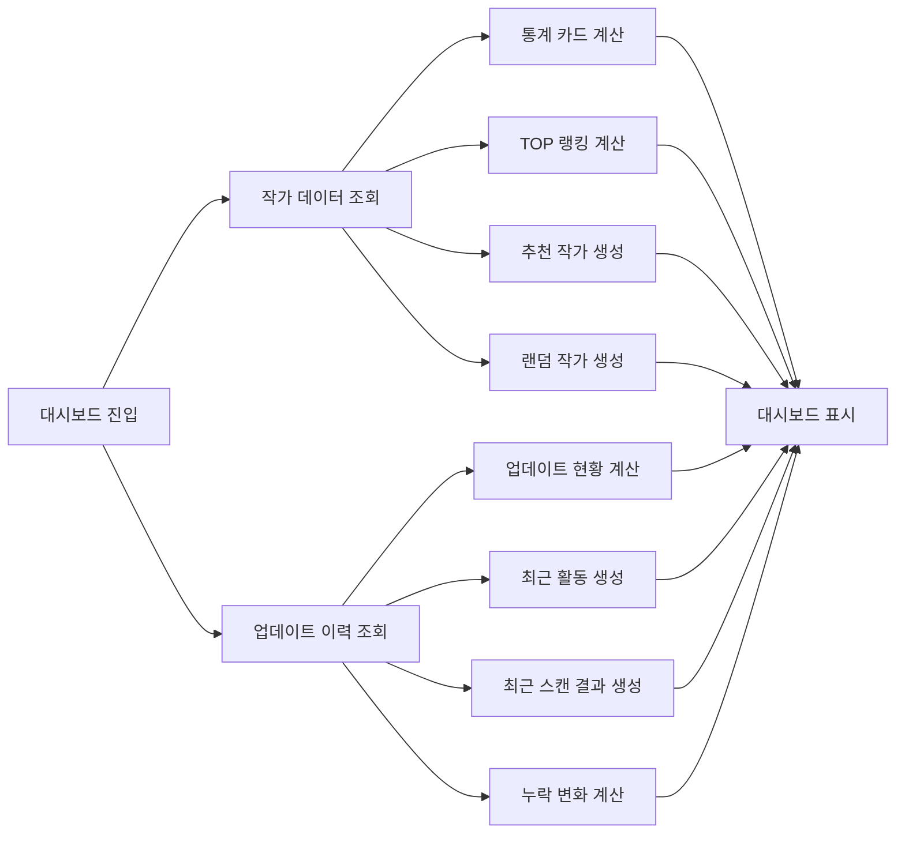

---

# 대시보드 상세 이동 흐름

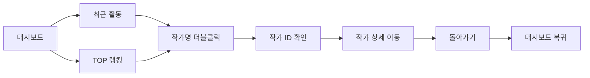

---

# 폴더 스캔 흐름

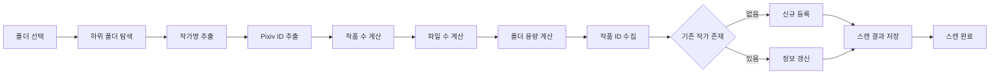

---

# 스캔 미리보기 흐름

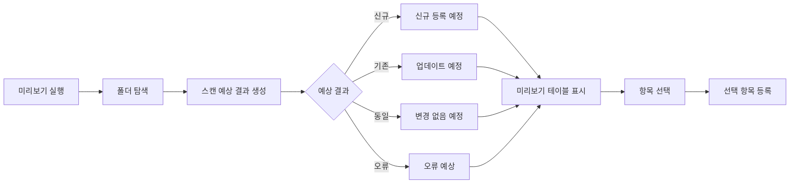

---

# 스캔 제어 흐름

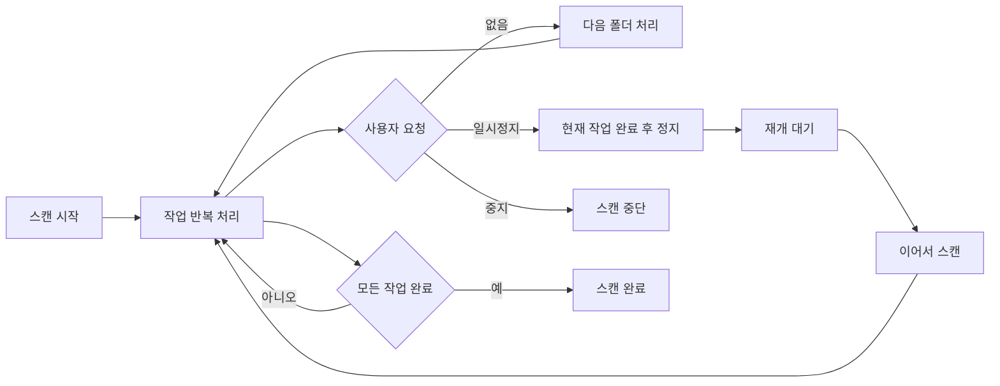

---

# 작가 조회 흐름

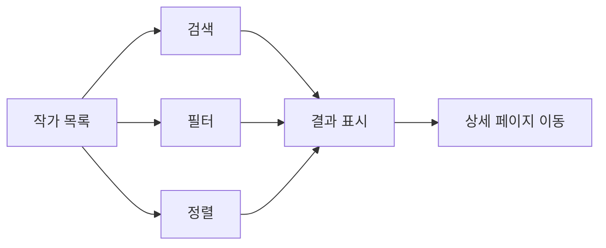

---

# 작가 상세 조회 흐름

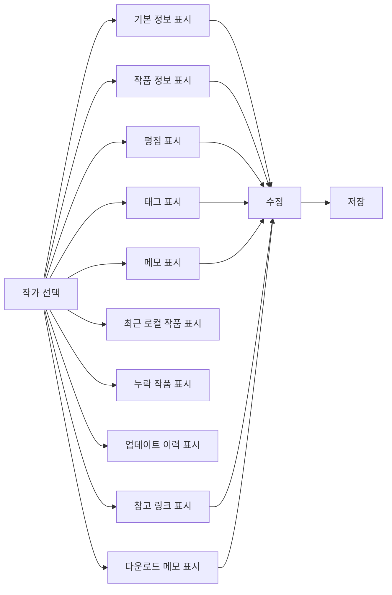

---

# 작가 상세 돌아가기 흐름

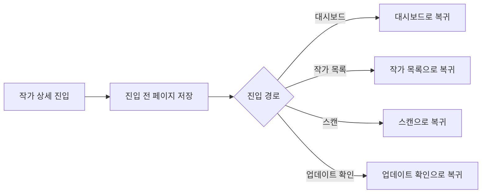

---

# 작가 폴더 변경 흐름

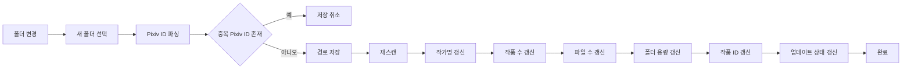

---

# 누락 작품 생성 흐름

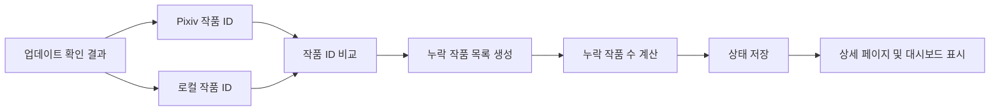

---

# 업데이트 확인 흐름

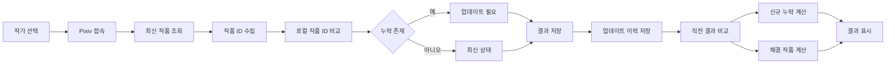

---

# 다중 업데이트 확인 흐름

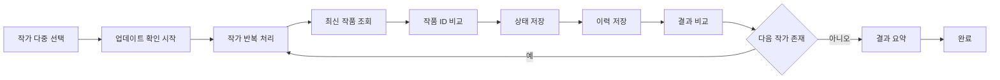

---

# 업데이트 일시정지 / 재개 흐름

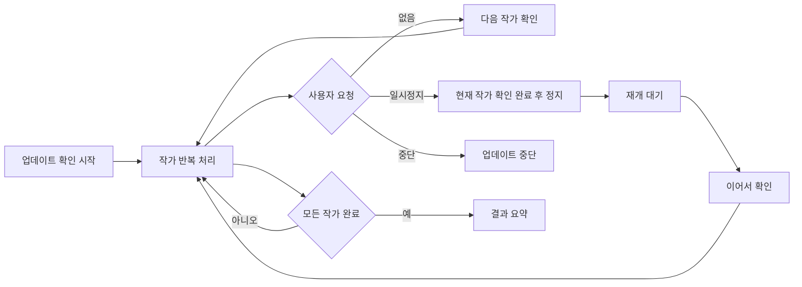

---

# 업데이트 이력 비교 흐름

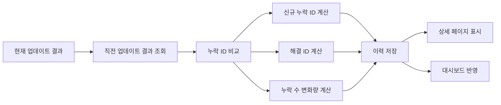

---

# 작가 삭제 흐름

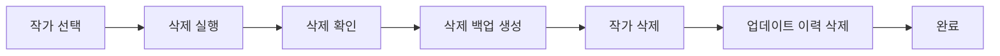

---

# 삭제 작가 복구 흐름

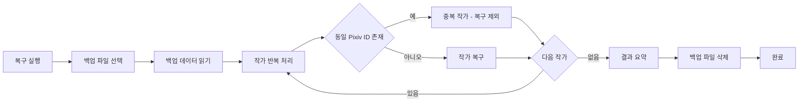

---

# DB 백업 흐름

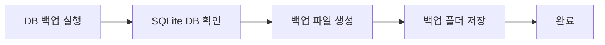

---

# DB 복원 흐름

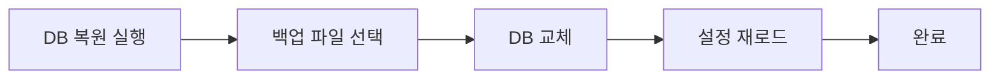

---

# CSV 내보내기 흐름

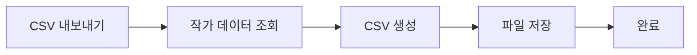

---

# 평점 일괄 변경 흐름

```mermaid
flowchart LR

A[작가 다중 선택]

A --> B[평점 지정]

B --> C[선택 작가 반복 처리]

C --> D[평점 저장]

D --> E{다음 작가 존재}

E -->|예| C
E -->|아니오| F[완료]
```

---

# 즐겨찾기 일괄 변경 흐름

```mermaid
flowchart LR

A[작가 다중 선택]

A --> B[즐겨찾기 설정 또는 해제]

B --> C[선택 작가 반복 처리]

C --> D[상태 저장]

D --> E{다음 작가 존재}

E -->|예| C
E -->|아니오| F[완료]
```

---

# 숨김 일괄 변경 흐름

```mermaid
flowchart LR

A[작가 다중 선택]

A --> B[숨김 설정 또는 해제]

B --> C[선택 작가 반복 처리]

C --> D[상태 저장]

D --> E{다음 작가 존재}

E -->|예| C
E -->|아니오| F[완료]
```

---

# 태그 정리 흐름

```mermaid
flowchart LR

A[태그 정리 실행]

A --> B[태그 목록 조회]

B --> C[중복 태그 병합]
C --> D[빈 태그 제거]

D --> E[작품 수 기준 정렬]

E --> F[저장]
```

---

# 프로그램 종료 흐름

```mermaid
flowchart LR

A[프로그램 종료]

A --> B[진행 중 작업 확인]
B --> C[업데이트 워커 종료]
C --> D[DB 연결 종료]

D --> E[종료]
```

---

# 주요 데이터 흐름

## 대시보드

```text
Dashboard
→ ArtistService
→ ArtistUpdateHistoryRepository
→ Dashboard Metrics
→ Dashboard UI
```

---

## 작가 등록

```text
폴더 스캔
→ ArtistScanService
→ ArtistRepository
→ SQLite 저장
```

---

## 작가 수정

```text
Artist Detail
→ ArtistService
→ ArtistRepository
→ SQLite 저장
```

---

## 업데이트 확인

```text
Update Check Page
→ PixivUpdateService
→ ArtworkStatusService
→ ArtistUpdateService
→ ArtistUpdateHistoryRepository
→ ArtistRepository
→ SQLite 저장
```

---

## 업데이트 결과 비교

```text
Update Result
→ ArtistUpdateHistoryRepository
→ Previous History
→ Comparison
→ History Save
→ Dashboard / Artist Detail
```

---

## 삭제 작가 복구

```text
복구 실행
→ BackupService
→ ArtistRepository
→ SQLite 저장
```

---

## 폴더 변경

```text
폴더 변경
→ FolderScanService
→ ArtworkStatusService
→ ArtistRepository
→ SQLite 저장
```

---

# 향후 확장 예정

## V2

```text
설정 관리 고도화
통계 / 분석 시스템
3차 리팩토링
누락 기능 및 신규 기능 추가
```

---

## V3

```text
작품 관리
작품 상세 정보
카드 보기
썸네일 보기
자체 뷰어
자동 업데이트
```

---

# 버전 기준

본 문서는 v0.12.0 (대시보드 고도화 완료) 기준으로 작성되었다.
