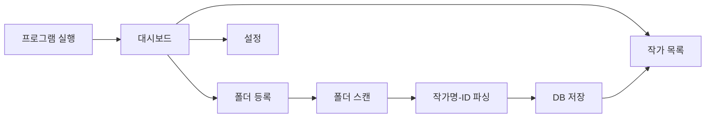
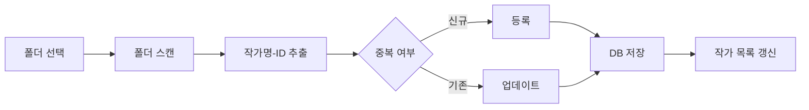
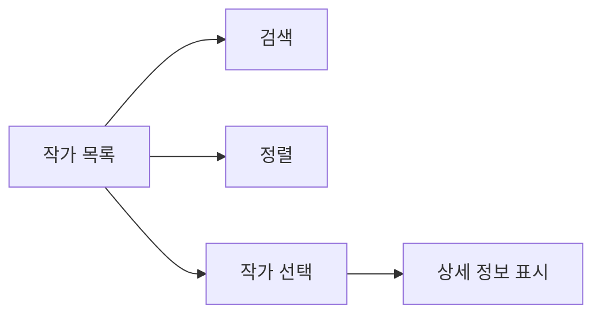
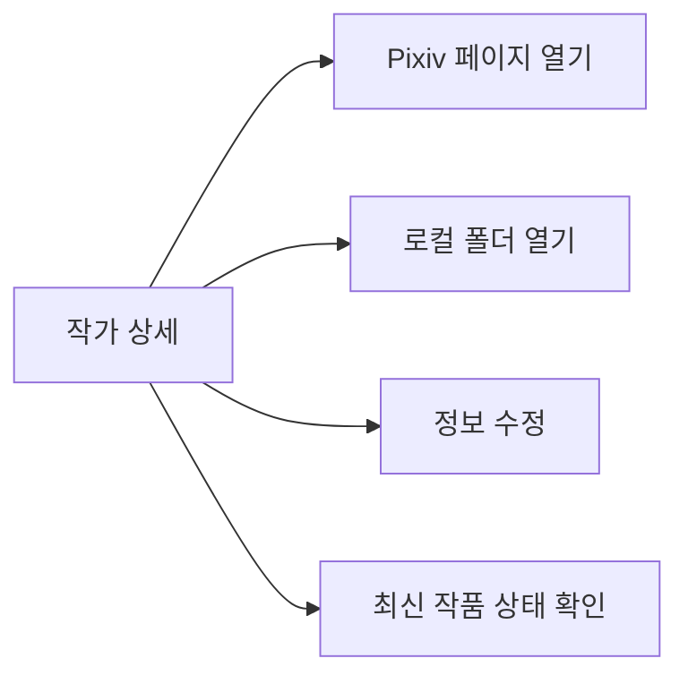
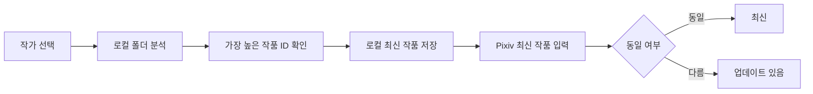
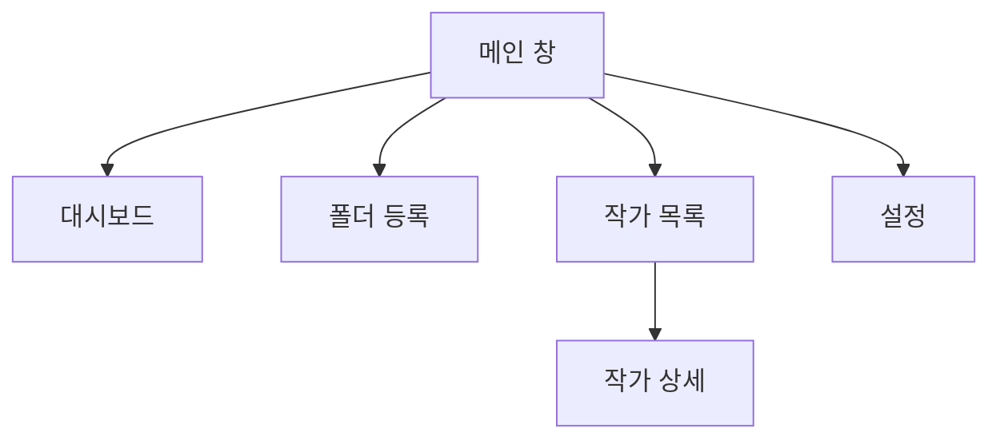
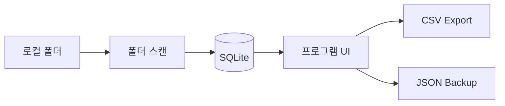

# 시스템 흐름도 (System Flow)

## 전체 사용 흐름

---

## 작가 등록 흐름

---

## 작가 조회 흐름

---

## 작가 상세 흐름

---

## 최신 작품 확인 흐름

---

## CSV 내보내기 흐름

---

## 백업 흐름

---

## 복원 흐름

---

## 화면 이동 구조

---

## V1 데이터 흐름

