# 시스템 흐름

## 전체 흐름

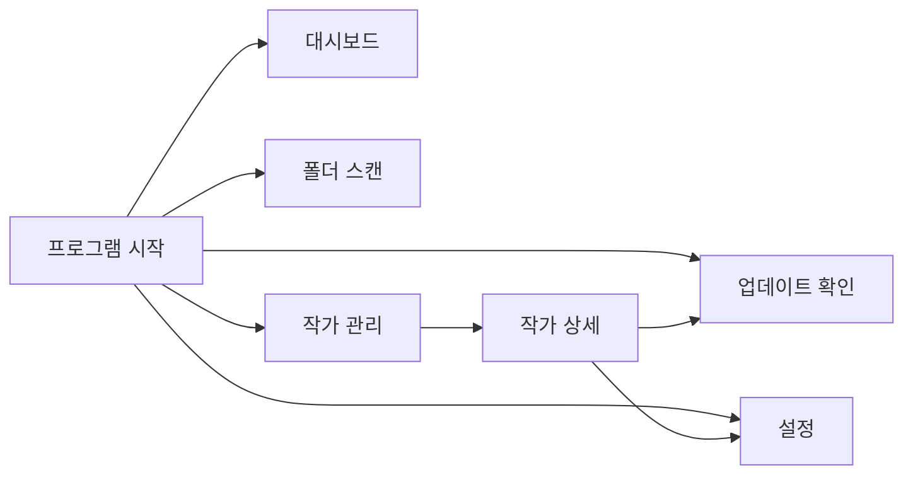

---

# 폴더 스캔 흐름

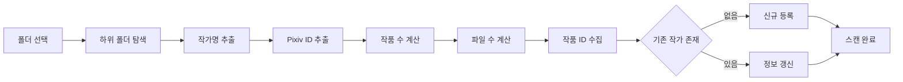

---

# 작가 조회 흐름

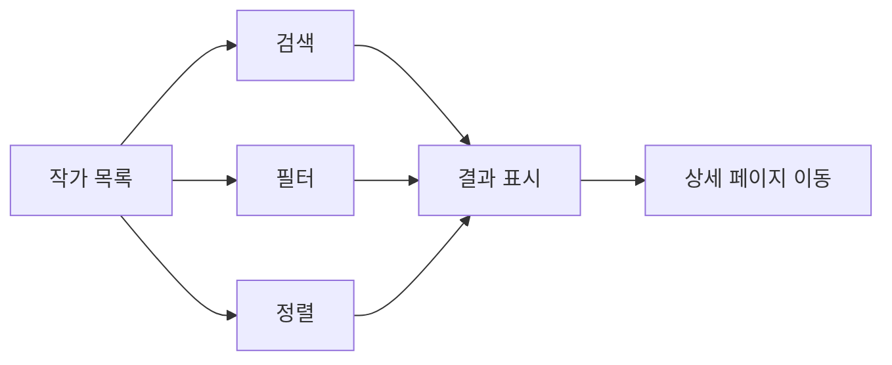

---

# 작가 상세 조회 흐름

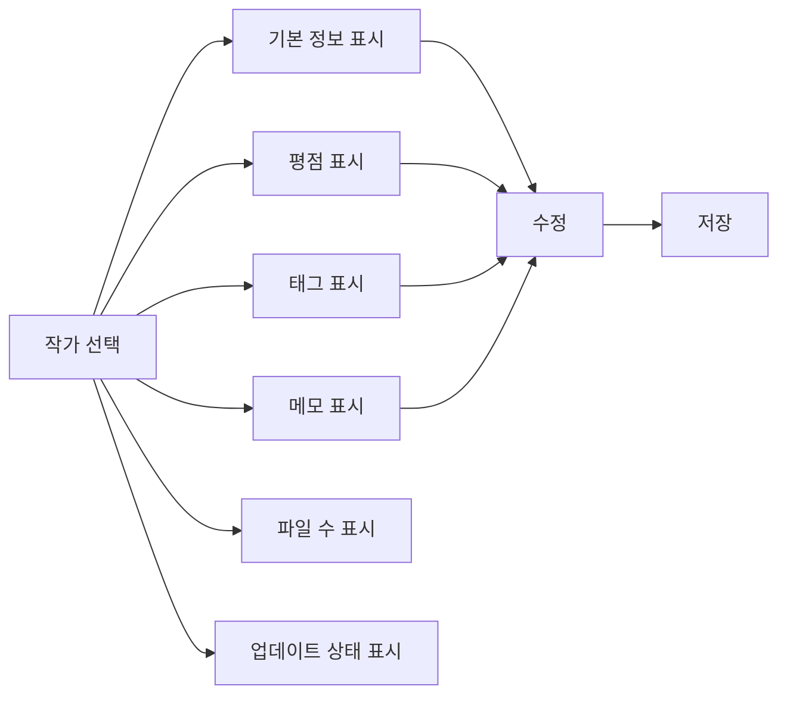

---

# 작가 폴더 변경 흐름

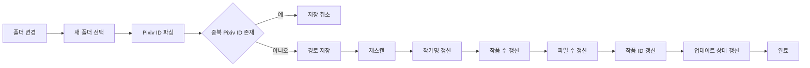

---

# 업데이트 확인 흐름

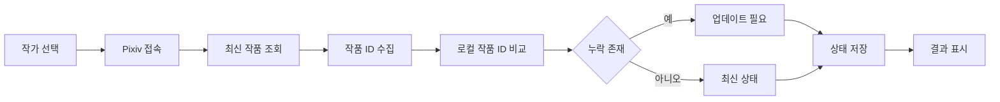

---

# 다중 업데이트 확인 흐름

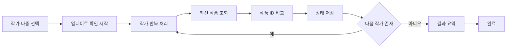

---

# 작가 삭제 흐름

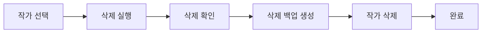

---

# 삭제 작가 복구 흐름

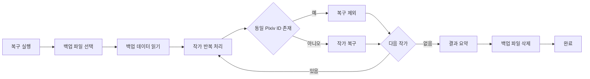

---

# DB 백업 흐름

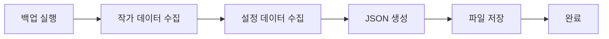

---

# DB 복원 흐름

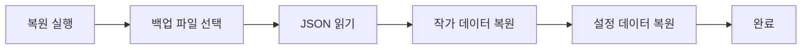

---

# 프로그램 종료 흐름

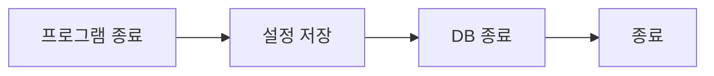
