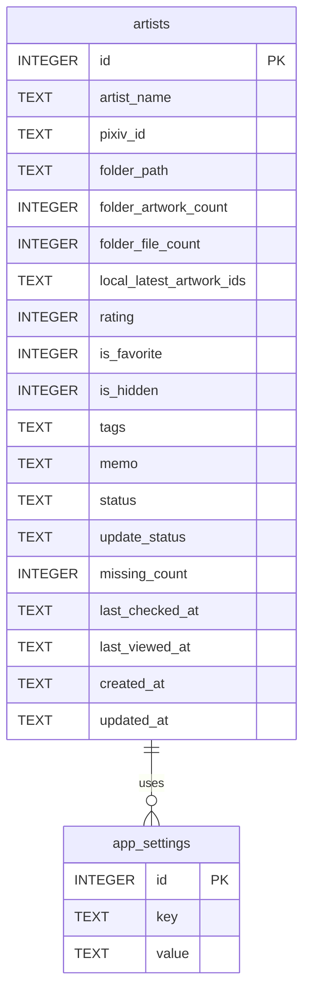

# 데이터베이스 설계

## 개요

Pixiv Local Manager는 SQLite 데이터베이스를 사용한다.

현재 데이터는 다음 두 개의 테이블로 구성된다.

<table>
<tr>
    <th>테이블</th>
    <th>설명</th>
</tr>

<tr>
    <td>artists</td>
    <td>작가 정보 저장</td>
</tr>

<tr>
    <td>app_settings</td>
    <td>프로그램 설정 저장</td>
</tr>

</table>

---

# ERD



---

# artists

작가 정보를 저장하는 핵심 테이블.

## 컬럼 구조

<table>
<tr>
    <th>컬럼</th>
    <th>타입</th>
    <th>설명</th>
</tr>

<tr>
    <td>id</td>
    <td>INTEGER</td>
    <td>기본 키</td>
</tr>

<tr>
    <td>artist_name</td>
    <td>TEXT</td>
    <td>작가명</td>
</tr>

<tr>
    <td>pixiv_id</td>
    <td>TEXT</td>
    <td>Pixiv 사용자 ID</td>
</tr>

<tr>
    <td>folder_path</td>
    <td>TEXT</td>
    <td>작가 폴더 경로</td>
</tr>

<tr>
    <td>folder_artwork_count</td>
    <td>INTEGER</td>
    <td>작품 수</td>
</tr>

<tr>
    <td>folder_file_count</td>
    <td>INTEGER</td>
    <td>실제 파일 수</td>
</tr>

<tr>
    <td>local_latest_artwork_ids</td>
    <td>TEXT</td>
    <td>로컬 작품 ID 목록(JSON)</td>
</tr>

<tr>
    <td>rating</td>
    <td>INTEGER</td>
    <td>0~10 평점</td>
</tr>

<tr>
    <td>is_favorite</td>
    <td>INTEGER</td>
    <td>즐겨찾기 여부</td>
</tr>

<tr>
    <td>is_hidden</td>
    <td>INTEGER</td>
    <td>숨김 여부</td>
</tr>

<tr>
    <td>tags</td>
    <td>TEXT</td>
    <td>태그 정보(JSON)</td>
</tr>

<tr>
    <td>memo</td>
    <td>TEXT</td>
    <td>작가 메모</td>
</tr>

<tr>
    <td>status</td>
    <td>TEXT</td>
    <td>사용자 지정 상태</td>
</tr>

<tr>
    <td>update_status</td>
    <td>TEXT</td>
    <td>업데이트 상태</td>
</tr>

<tr>
    <td>missing_count</td>
    <td>INTEGER</td>
    <td>누락 작품 수</td>
</tr>

<tr>
    <td>last_checked_at</td>
    <td>TEXT</td>
    <td>최근 업데이트 확인 시각</td>
</tr>

<tr>
    <td>last_viewed_at</td>
    <td>TEXT</td>
    <td>최근 열람 시각</td>
</tr>

<tr>
    <td>created_at</td>
    <td>TEXT</td>
    <td>등록 시각</td>
</tr>

<tr>
    <td>updated_at</td>
    <td>TEXT</td>
    <td>최근 수정 시각</td>
</tr>

</table>

---

# app_settings

프로그램 설정 저장 테이블.

## 컬럼 구조

<table>
<tr>
    <th>컬럼</th>
    <th>타입</th>
    <th>설명</th>
</tr>

<tr>
    <td>id</td>
    <td>INTEGER</td>
    <td>기본 키</td>
</tr>

<tr>
    <td>key</td>
    <td>TEXT</td>
    <td>설정 이름</td>
</tr>

<tr>
    <td>value</td>
    <td>TEXT</td>
    <td>설정 값</td>
</tr>

</table>

---

# 저장 예시

## artists

```json
{
    "artist_name": "ExampleArtist",
    "pixiv_id": "12345678",
    "folder_path": "D:/Pixiv/ExampleArtist (12345678)",
    "folder_artwork_count": 152,
    "folder_file_count": 487,
    "local_latest_artwork_ids": [
        "100000001",
        "100000002",
        "100000003"
    ],
    "rating": 9,
    "is_favorite": true,
    "is_hidden": false,
    "tags": [
        {
            "tag": "Original",
            "translated_name": "오리지널",
            "count": 52
        }
    ],
    "memo": "좋아하는 작가",
    "status": "active",
    "update_status": "update_needed",
    "missing_count": 4
}
```

---

# 데이터 저장 위치

```text
data/
├─ database.db

├─ backups/
│  ├─ database/
│  └─ deleted_artists/

├─ exports/
│  └─ artists.csv
```

---

# 향후 확장 예정

## V2

* 업데이트 이력 테이블
* 오류 로그 테이블
* 통계 데이터 저장

## V3

* artworks 테이블
* collections 테이블
* viewer_history 테이블
* download_queue 테이블

---
