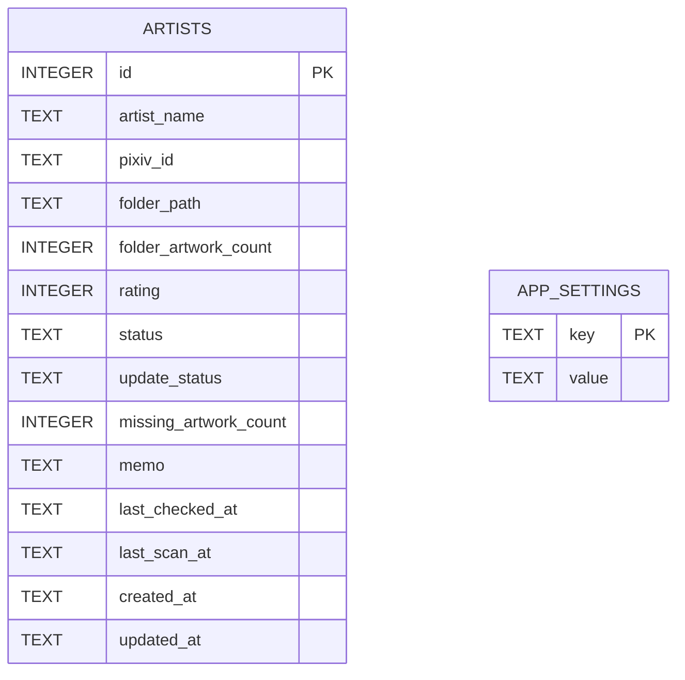
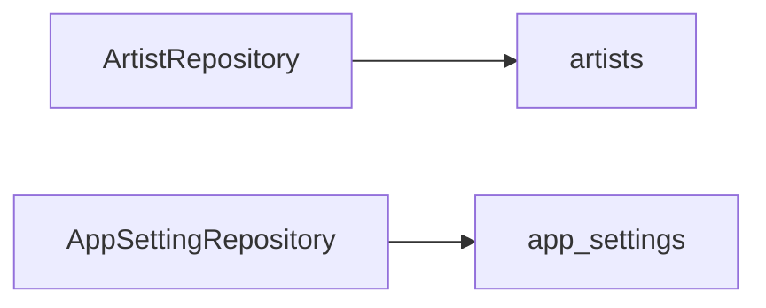

# 데이터베이스 설계 (Database)

## 저장 방식

<table>
<tr>
    <th>항목</th>
    <th>내용</th>
</tr>

<tr>
    <td>DBMS</td>
    <td>SQLite</td>
</tr>

<tr>
    <td>DB 파일</td>
    <td>data/pixiv_manager.db</td>
</tr>

<tr>
    <td>설정 저장</td>
    <td>app_settings 테이블</td>
</tr>

<tr>
    <td>백업 방식</td>
    <td>SQLite 파일 복사</td>
</tr>

<tr>
    <td>내보내기</td>
    <td>CSV</td>
</tr>

</table>

---

# 데이터 모델

---

# 테이블 구조

## artists

<table>
<tr>
    <th>컬럼</th>
    <th>타입</th>
    <th>설명</th>
</tr>

<tr>
    <td>id</td>
    <td>INTEGER</td>
    <td>내부 식별자</td>
</tr>

<tr>
    <td>artist_name</td>
    <td>TEXT</td>
    <td>작가명</td>
</tr>

<tr>
    <td>pixiv_id</td>
    <td>TEXT</td>
    <td>Pixiv 사용자 ID</td>
</tr>

<tr>
    <td>folder_path</td>
    <td>TEXT</td>
    <td>로컬 폴더 경로</td>
</tr>

<tr>
    <td>folder_artwork_count</td>
    <td>INTEGER</td>
    <td>로컬 작품 수</td>
</tr>

<tr>
    <td>rating</td>
    <td>INTEGER</td>
    <td>사용자 평점 (0~10)</td>
</tr>

<tr>
    <td>status</td>
    <td>TEXT</td>
    <td>작가 상태</td>
</tr>

<tr>
    <td>update_status</td>
    <td>TEXT</td>
    <td>업데이트 상태</td>
</tr>

<tr>
    <td>missing_artwork_count</td>
    <td>INTEGER</td>
    <td>누락 작품 수</td>
</tr>

<tr>
    <td>memo</td>
    <td>TEXT</td>
    <td>사용자 메모</td>
</tr>

<tr>
    <td>last_checked_at</td>
    <td>TEXT</td>
    <td>마지막 업데이트 확인 시각</td>
</tr>

<tr>
    <td>last_scan_at</td>
    <td>TEXT</td>
    <td>마지막 폴더 스캔 시각</td>
</tr>

<tr>
    <td>created_at</td>
    <td>TEXT</td>
    <td>등록 시각</td>
</tr>

<tr>
    <td>updated_at</td>
    <td>TEXT</td>
    <td>수정 시각</td>
</tr>

</table>

---

## app_settings

<table>
<tr>
    <th>컬럼</th>
    <th>타입</th>
    <th>설명</th>
</tr>

<tr>
    <td>key</td>
    <td>TEXT</td>
    <td>설정 키</td>
</tr>

<tr>
    <td>value</td>
    <td>TEXT</td>
    <td>설정 값</td>
</tr>

</table>

---

# 상태값 정의

## status

<table>
<tr>
    <th>값</th>
    <th>설명</th>
</tr>

<tr>
    <td>active</td>
    <td>활성</td>
</tr>

<tr>
    <td>inactive</td>
    <td>비활성</td>
</tr>

</table>

---

## update_status

<table>
<tr>
    <th>값</th>
    <th>설명</th>
</tr>

<tr>
    <td>unknown</td>
    <td>아직 확인하지 않음</td>
</tr>

<tr>
    <td>up_to_date</td>
    <td>최신 상태</td>
</tr>

<tr>
    <td>need_update</td>
    <td>업데이트 필요</td>
</tr>

<tr>
    <td>updated</td>
    <td>업데이트 완료</td>
</tr>

<tr>
    <td>error</td>
    <td>오류 발생</td>
</tr>

</table>

---

# 인덱스

<table>
<tr>
    <th>대상</th>
    <th>목적</th>
</tr>

<tr>
    <td>pixiv_id</td>
    <td>중복 방지 및 조회</td>
</tr>

<tr>
    <td>artist_name</td>
    <td>검색 성능 향상</td>
</tr>

</table>

---

# Repository 구조

---

# 데이터 저장 원칙

<table>
<tr>
    <th>원칙</th>
    <th>설명</th>
</tr>

<tr>
    <td>Pixiv ID 기준</td>
    <td>작가 식별은 Pixiv ID 우선</td>
</tr>

<tr>
    <td>로컬 우선</td>
    <td>폴더 구조 기반 데이터 수집</td>
</tr>

<tr>
    <td>수동 업데이트</td>
    <td>필요할 때만 Pixiv 조회</td>
</tr>

<tr>
    <td>SQLite 단일 DB</td>
    <td>배포 및 백업 단순화</td>
</tr>

<tr>
    <td>확장 가능</td>
    <td>V2에서 작품 테이블 추가 가능</td>
</tr>

</table>

---

# V1 제외 테이블

<table>
<tr>
    <th>테이블</th>
    <th>설명</th>
</tr>

<tr>
    <td>artworks</td>
    <td>작품 상세 관리</td>
</tr>

<tr>
    <td>tags</td>
    <td>태그 관리</td>
</tr>

<tr>
    <td>artwork_tags</td>
    <td>작품-태그 연결</td>
</tr>

<tr>
    <td>collections</td>
    <td>컬렉션 기능</td>
</tr>

</table>