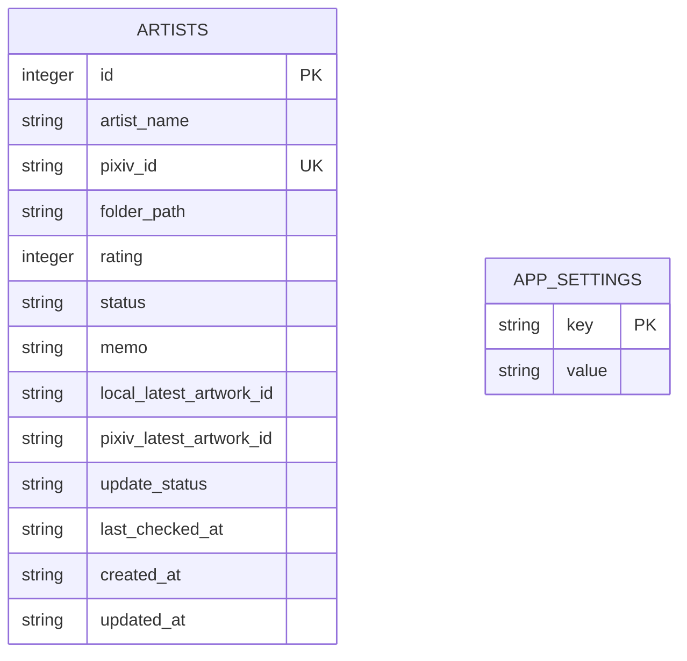
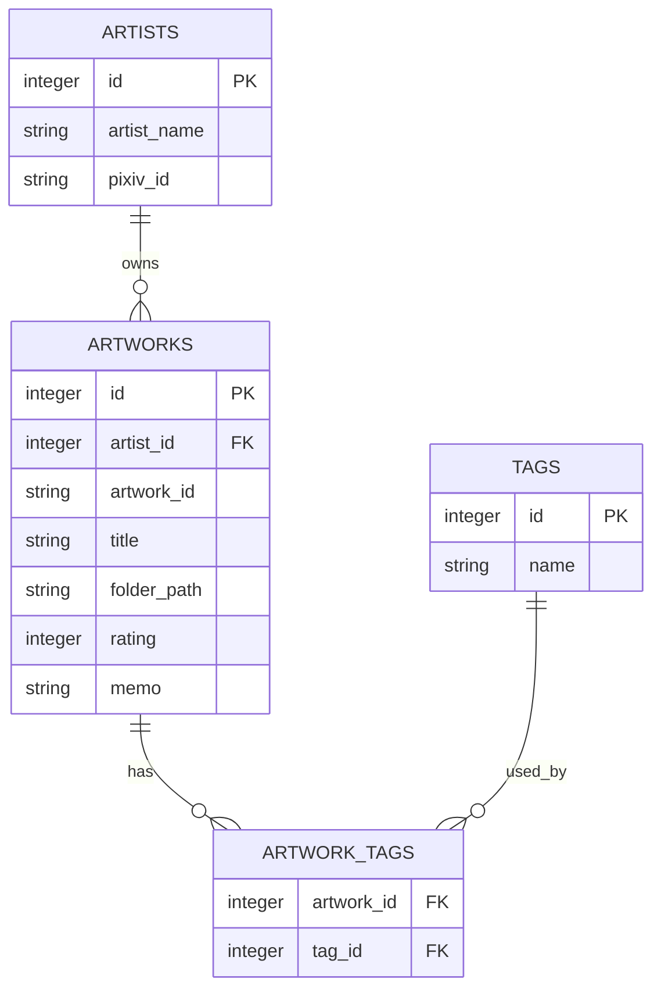

# 데이터베이스 설계 (Database)

## 저장 방식

<table>
<tr>
    <th>항목</th>
    <th>내용</th>
</tr>
<tr>
    <td>DB</td>
    <td>SQLite</td>
</tr>
<tr>
    <td>DB 파일</td>
    <td>data/pixiv_manager.db</td>
</tr>
<tr>
    <td>설정 파일</td>
    <td>data/config.ini</td>
</tr>
<tr>
    <td>백업</td>
    <td>JSON</td>
</tr>
<tr>
    <td>내보내기</td>
    <td>CSV</td>
</tr>
</table>

---

## V1 데이터 구조

---

## artists 테이블

<table>
<tr>
    <th>컬럼</th>
    <th>타입</th>
    <th>설명</th>
</tr>
<tr>
    <td>id</td>
    <td>INTEGER</td>
    <td>내부 관리 ID</td>
</tr>
<tr>
    <td>artist_name</td>
    <td>TEXT</td>
    <td>작가명</td>
</tr>
<tr>
    <td>pixiv_id</td>
    <td>TEXT</td>
    <td>Pixiv 작가 ID</td>
</tr>
<tr>
    <td>folder_path</td>
    <td>TEXT</td>
    <td>로컬 작가 폴더 경로</td>
</tr>
<tr>
    <td>rating</td>
    <td>INTEGER</td>
    <td>사용자 평점</td>
</tr>
<tr>
    <td>status</td>
    <td>TEXT</td>
    <td>작가 상태</td>
</tr>
<tr>
    <td>memo</td>
    <td>TEXT</td>
    <td>작가 메모</td>
</tr>
<tr>
    <td>local_latest_artwork_id</td>
    <td>TEXT</td>
    <td>로컬 폴더 기준 최신 작품 ID</td>
</tr>
<tr>
    <td>pixiv_latest_artwork_id</td>
    <td>TEXT</td>
    <td>Pixiv 기준 최신 작품 ID</td>
</tr>
<tr>
    <td>update_status</td>
    <td>TEXT</td>
    <td>최신 / 업데이트 있음 / 확인 안함</td>
</tr>
<tr>
    <td>last_checked_at</td>
    <td>TEXT</td>
    <td>마지막 확인 날짜</td>
</tr>
<tr>
    <td>created_at</td>
    <td>TEXT</td>
    <td>등록 날짜</td>
</tr>
<tr>
    <td>updated_at</td>
    <td>TEXT</td>
    <td>수정 날짜</td>
</tr>
</table>

---

## app_settings 테이블

<table>
<tr>
    <th>컬럼</th>
    <th>타입</th>
    <th>설명</th>
</tr>
<tr>
    <td>key</td>
    <td>TEXT</td>
    <td>설정 이름</td>
</tr>
<tr>
    <td>value</td>
    <td>TEXT</td>
    <td>설정 값</td>
</tr>
</table>

---

## 작가 상태값

<table>
<tr>
    <th>상태</th>
    <th>의미</th>
</tr>
<tr>
    <td>normal</td>
    <td>기본 상태</td>
</tr>
<tr>
    <td>favorite</td>
    <td>즐겨찾기</td>
</tr>
<tr>
    <td>pending</td>
    <td>확인 필요</td>
</tr>
<tr>
    <td>hold</td>
    <td>보류</td>
</tr>
<tr>
    <td>hidden</td>
    <td>숨김</td>
</tr>
</table>

---

## 업데이트 상태값

<table>
<tr>
    <th>상태</th>
    <th>조건</th>
</tr>
<tr>
    <td>unknown</td>
    <td>Pixiv 최신 작품 ID가 없음</td>
</tr>
<tr>
    <td>latest</td>
    <td>로컬 최신 작품 ID와 Pixiv 최신 작품 ID가 같음</td>
</tr>
<tr>
    <td>outdated</td>
    <td>로컬 최신 작품 ID와 Pixiv 최신 작품 ID가 다름</td>
</tr>
</table>

---

## V1에서 제외하는 테이블

<table>
<tr>
    <th>테이블</th>
    <th>제외 이유</th>
</tr>
<tr>
    <td>artworks</td>
    <td>작품 상세 관리는 V2 이후 구현</td>
</tr>
<tr>
    <td>tags</td>
    <td>태그 관리는 V2 이후 구현</td>
</tr>
<tr>
    <td>artwork_tags</td>
    <td>작품-태그 연결은 V2 이후 구현</td>
</tr>
<tr>
    <td>collections</td>
    <td>컬렉션 기능은 V2 이후 구현</td>
</tr>
</table>

---

## V2 이후 확장 구조

---

## 데이터 저장 원칙

<table>
<tr>
    <th>원칙</th>
    <th>내용</th>
</tr>
<tr>
    <td>작가 ID 기준</td>
    <td>작가명은 변경될 수 있으므로 Pixiv ID를 핵심 기준으로 사용</td>
</tr>
<tr>
    <td>로컬 우선</td>
    <td>폴더명과 파일명에서 가능한 정보를 먼저 추출</td>
</tr>
<tr>
    <td>Pixiv 요청 최소화</td>
    <td>자동 수집보다 수동 입력 및 캐시 중심</td>
</tr>
<tr>
    <td>백업 가능</td>
    <td>SQLite 데이터를 JSON으로 내보낼 수 있도록 구성</td>
</tr>
<tr>
    <td>확장 가능</td>
    <td>V2에서 작품, 태그, 컬렉션 테이블 추가 가능하도록 설계</td>
</tr>
</table>
