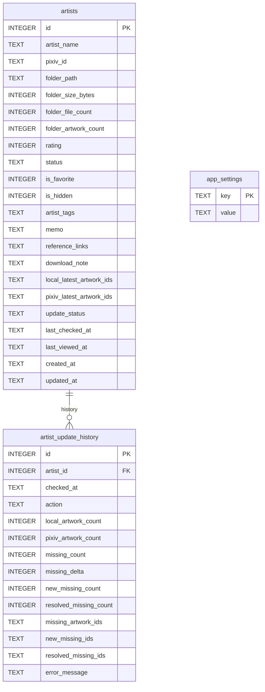

# 데이터베이스 설계

## 개요

Pixiv Local Manager는 SQLite 데이터베이스를 사용한다.

현재 데이터는 다음 세 개의 테이블로 구성된다.

<table>
<tr>
    <th>테이블</th>
    <th>설명</th>
</tr>

<tr>
    <td>artists</td>
    <td>작가 정보 저장</td>
</tr>

<tr>
    <td>artist_update_history</td>
    <td>업데이트 확인 이력 저장</td>
</tr>

<tr>
    <td>app_settings</td>
    <td>프로그램 설정 저장</td>
</tr>

</table>

---

# ERD



---

# artists

작가 정보를 저장하는 핵심 테이블.

## 주요 역할

* 작가 기본 정보 저장
* 작품 수 저장
* 파일 수 저장
* 폴더 용량 저장
* 태그 정보 저장
* 즐겨찾기 및 숨김 저장
* 최근 열람 기록 저장
* 최근 업데이트 확인 정보 저장

---

## update_status 값

<table>
<tr>
    <th>값</th>
    <th>설명</th>
</tr>

<tr>
    <td>unknown</td>
    <td>업데이트 확인 이력 없음</td>
</tr>

<tr>
    <td>latest</td>
    <td>최신 상태</td>
</tr>

<tr>
    <td>up_to_date</td>
    <td>최신 상태(호환용)</td>
</tr>

<tr>
    <td>need_update</td>
    <td>누락 작품 존재</td>
</tr>

<tr>
    <td>error</td>
    <td>확인 실패</td>
</tr>

</table>

---

# artist_update_history

업데이트 확인 결과 저장 테이블.

업데이트 확인 실행 시마다 새로운 행이 추가된다.

대시보드, 최근 활동, 누락 변화 추적, 업데이트 이력 기능의 기반이 되는 테이블이다.

---

## 컬럼 구조

<table>
<tr>
    <th>컬럼</th>
    <th>설명</th>
</tr>

<tr>
    <td>id</td>
    <td>기본 키</td>
</tr>

<tr>
    <td>artist_id</td>
    <td>artists.id 참조</td>
</tr>

<tr>
    <td>checked_at</td>
    <td>확인 시각</td>
</tr>

<tr>
    <td>action</td>
    <td>최신, 업데이트 필요, 오류, 스킵 결과</td>
</tr>

<tr>
    <td>local_artwork_count</td>
    <td>로컬 작품 수</td>
</tr>

<tr>
    <td>pixiv_artwork_count</td>
    <td>Pixiv 작품 수</td>
</tr>

<tr>
    <td>missing_count</td>
    <td>누락 작품 수</td>
</tr>

<tr>
    <td>missing_delta</td>
    <td>직전 결과 대비 변화량</td>
</tr>

<tr>
    <td>new_missing_count</td>
    <td>새롭게 누락된 작품 수</td>
</tr>

<tr>
    <td>resolved_missing_count</td>
    <td>해결된 작품 수</td>
</tr>

<tr>
    <td>missing_artwork_ids</td>
    <td>전체 누락 작품 ID</td>
</tr>

<tr>
    <td>new_missing_ids</td>
    <td>신규 누락 작품 ID</td>
</tr>

<tr>
    <td>resolved_missing_ids</td>
    <td>해결된 작품 ID</td>
</tr>

<tr>
    <td>error_message</td>
    <td>오류 메시지</td>
</tr>

</table>

---

## 활용 기능

* 업데이트 결과 저장
* 결과 비교
* 신규 누락 계산
* 해결 작품 계산
* 최근 활동
* 최근 오류 작가
* 누락 증가 작가
* 대시보드 통계
* 작가 상세 업데이트 이력

---

# app_settings

프로그램 설정 저장 테이블.

설정 값은 Key-Value 형태로 저장한다.

---

## 컬럼 구조

<table>
<tr>
    <th>컬럼</th>
    <th>타입</th>
    <th>설명</th>
</tr>

<tr>
    <td>key</td>
    <td>TEXT</td>
    <td>설정 이름 (기본 키)</td>
</tr>

<tr>
    <td>value</td>
    <td>TEXT</td>
    <td>설정 값</td>
</tr>

</table>

---

## 저장 예시

```json
{
    "key": "pixiv_root_folder",
    "value": "D:/Pixiv"
}
```

```json
{
    "key": "php_sessid",
    "value": "xxxxxxxxxxxxxxxx"
}
```

```json
{
    "key": "scan_interval",
    "value": "24"
}
```

```json
{
    "key": "auto_rescan",
    "value": "true"
}
```

---

# 저장 예시

## artists

```json
{
    "artist_name": "ExampleArtist",
    "pixiv_id": "12345678",
    "folder_path": "D:/Pixiv/ExampleArtist (12345678)",
    "folder_size_bytes": 12884901888,
    "folder_file_count": 487,
    "folder_artwork_count": 152,
    "rating": 9,
    "status": "normal",
    "is_favorite": true,
    "is_hidden": false,
    "update_status": "need_update",
    "last_checked_at": "2026-06-15T13:00:00",
    "last_viewed_at": "2026-06-15T13:20:00"
}
```

---

## artist_update_history

```json
{
    "artist_id": 1,
    "checked_at": "2026-06-17T15:00:00",
    "action": "need_update",
    "local_artwork_count": 152,
    "pixiv_artwork_count": 156,
    "missing_count": 4,
    "missing_delta": 2,
    "new_missing_count": 2,
    "resolved_missing_count": 0,
    "missing_artwork_ids": "1001,1002,1003,1004",
    "new_missing_ids": "1003,1004",
    "resolved_missing_ids": "",
    "error_message": ""
}
```

---

# 데이터 저장 위치

```text
data/
│
├─ pixiv_manager.db
│
├─ scan_results/
│  ├─ latest_scan.csv
│  └─ latest_scan.json
│
├─ update_history/
│
└─ logs/
```

---

# 백업 위치

```text
backups/
│
├─ database/
│
└─ deleted_artists/
```

---

# DB 백업

전체 데이터베이스 백업은 설정 화면에서 실행한다.

```text
backups/database/
```

DB 백업은 다음 데이터를 모두 포함한다.

* artists
* artist_update_history
* app_settings

---

# 삭제 작가 백업

작가 삭제 시 삭제 전 자동으로 JSON 백업을 생성한다.

```text
backups/deleted_artists/
```

삭제 작가 백업에는 삭제 대상 작가의 DB 필드가 저장된다.

복구 시 동일한 Pixiv ID를 가진 작가가 이미 존재하면 자동으로 건너뛴다.

---

# 데이터 관계

```text
artists
    │
    └── artist_update_history
```

하나의 작가는 여러 개의 업데이트 이력을 가진다.

```text
Artist
    ├─ History #1
    ├─ History #2
    ├─ History #3
    └─ History #N
```

---

# 최근 활동 데이터 생성

대시보드의 최근 활동 데이터는 다음 정보를 기반으로 생성된다.

```text
artists
 ├─ last_viewed_at
 ├─ created_at
 └─ last_checked_at

artist_update_history
 ├─ checked_at
 ├─ action
 ├─ missing_delta
 └─ error_message
```

---

# TOP 랭킹 데이터 생성

대시보드 TOP 랭킹은 artists 테이블을 기준으로 생성된다.

```text
작품 수 TOP
 → folder_artwork_count

파일 수 TOP
 → folder_file_count

폴더 용량 TOP
 → folder_size_bytes
```

---

# 추천 작가 데이터 생성

추천 작가는 artists 데이터를 기반으로 생성된다.

```text
고평점 추천
 → rating >= 8

즐겨찾기 추천
 → is_favorite = 1

랜덤 작가
 → 전체 작가 무작위 선택
```

---

# 마이그레이션

기존 DB를 유지하면서 새 컬럼을 추가하기 위해 schema.py 에서 누락 컬럼을 확인한 뒤 필요한 컬럼만 추가한다.

---

## 주요 마이그레이션 컬럼

<table>
<tr>
    <th>컬럼</th>
    <th>설명</th>
</tr>

<tr>
    <td>is_favorite</td>
    <td>즐겨찾기 여부</td>
</tr>

<tr>
    <td>is_hidden</td>
    <td>숨김 여부</td>
</tr>

<tr>
    <td>artist_tags</td>
    <td>작가 태그 정보</td>
</tr>

<tr>
    <td>reference_links</td>
    <td>참고 링크</td>
</tr>

<tr>
    <td>download_note</td>
    <td>다운로드 메모</td>
</tr>

<tr>
    <td>last_viewed_at</td>
    <td>최근 열람 시각</td>
</tr>

<tr>
    <td>update_status</td>
    <td>업데이트 상태</td>
</tr>

</table>

---

# 인덱스

향후 데이터 증가에 대비하여 다음 컬럼 인덱스 적용을 고려한다.

```text
artists.pixiv_id
artists.update_status
artists.last_checked_at
artists.last_viewed_at

artist_update_history.artist_id
artist_update_history.checked_at
```

---

# 향후 확장 예정

## V2

현재 V2에서 구현 예정인 DB 확장은 없다.

---

## V3

```text
artworks
collections
viewer_history
download_queue
```

### artworks

작품 단위 저장.

```text
작품 ID
작품 제목
등록일
태그
파일 수
```

### viewer_history

작품 열람 이력 저장.

```text
작품 ID
열람 시각
열람 횟수
```

### download_queue

다운로드 대기열 관리.

```text
작품 ID
상태
추가 시각
완료 시각
```

---

# 버전 기준

본 문서는 v0.12.0 (대시보드 고도화 완료) 기준으로 작성되었다.
