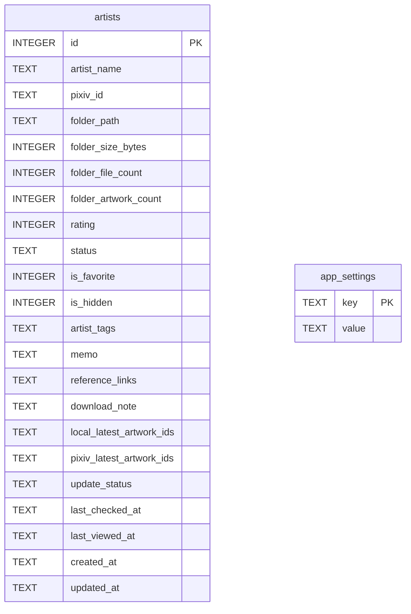

# 데이터베이스 설계

## 개요

Pixiv Local Manager는 SQLite 데이터베이스를 사용한다.

현재 데이터는 다음 두 개의 테이블로 구성된다.

<table>
<tr>
    <th>테이블</th>
    <th>설명</th>
</tr>

<tr>
    <td>artists</td>
    <td>작가 정보 저장</td>
</tr>

<tr>
    <td>app_settings</td>
    <td>프로그램 설정 저장</td>
</tr>

</table>

---

# ERD



---

# artists

작가 정보를 저장하는 핵심 테이블.

## 컬럼 구조

<table>
<tr>
    <th>컬럼</th>
    <th>타입</th>
    <th>설명</th>
</tr>

<tr>
    <td>id</td>
    <td>INTEGER</td>
    <td>기본 키</td>
</tr>

<tr>
    <td>artist_name</td>
    <td>TEXT</td>
    <td>작가명</td>
</tr>

<tr>
    <td>pixiv_id</td>
    <td>TEXT</td>
    <td>Pixiv 사용자 ID</td>
</tr>

<tr>
    <td>folder_path</td>
    <td>TEXT</td>
    <td>작가 폴더 경로</td>
</tr>

<tr>
    <td>folder_size_bytes</td>
    <td>INTEGER</td>
    <td>작가 폴더 전체 용량</td>
</tr>

<tr>
    <td>folder_file_count</td>
    <td>INTEGER</td>
    <td>실제 이미지 파일 수</td>
</tr>

<tr>
    <td>folder_artwork_count</td>
    <td>INTEGER</td>
    <td>작품 ID 기준 작품 수</td>
</tr>

<tr>
    <td>rating</td>
    <td>INTEGER</td>
    <td>0~10 평점</td>
</tr>

<tr>
    <td>status</td>
    <td>TEXT</td>
    <td>사용자 지정 상태</td>
</tr>

<tr>
    <td>is_favorite</td>
    <td>INTEGER</td>
    <td>즐겨찾기 여부</td>
</tr>

<tr>
    <td>is_hidden</td>
    <td>INTEGER</td>
    <td>숨김 여부</td>
</tr>

<tr>
    <td>artist_tags</td>
    <td>TEXT</td>
    <td>태그 정보(JSON, 태그명 / 번역명 / 작품 수 / 파일 수 저장)</td>
</tr>

<tr>
    <td>memo</td>
    <td>TEXT</td>
    <td>작가 장문 메모</td>
</tr>

<tr>
    <td>reference_links</td>
    <td>TEXT</td>
    <td>작가 관련 참고 링크</td>
</tr>

<tr>
    <td>download_note</td>
    <td>TEXT</td>
    <td>다운로드 기준, 제외 조건, 주의사항 등 다운로드 관련 메모</td>
</tr>

<tr>
    <td>local_latest_artwork_ids</td>
    <td>TEXT</td>
    <td>로컬에서 확인된 최신 작품 ID 목록</td>
</tr>

<tr>
    <td>pixiv_latest_artwork_ids</td>
    <td>TEXT</td>
    <td>Pixiv에서 확인된 최신 작품 ID 목록</td>
</tr>

<tr>
    <td>update_status</td>
    <td>TEXT</td>
    <td>업데이트 상태</td>
</tr>

<tr>
    <td>last_checked_at</td>
    <td>TEXT</td>
    <td>최근 업데이트 확인 시각</td>
</tr>

<tr>
    <td>last_viewed_at</td>
    <td>TEXT</td>
    <td>최근 상세 페이지 열람 시각</td>
</tr>

<tr>
    <td>created_at</td>
    <td>TEXT</td>
    <td>등록 시각</td>
</tr>

<tr>
    <td>updated_at</td>
    <td>TEXT</td>
    <td>최근 수정 시각</td>
</tr>

</table>

---

# app_settings

프로그램 설정 저장 테이블.

## 컬럼 구조

<table>
<tr>
    <th>컬럼</th>
    <th>타입</th>
    <th>설명</th>
</tr>

<tr>
    <td>key</td>
    <td>TEXT</td>
    <td>설정 이름, 기본 키</td>
</tr>

<tr>
    <td>value</td>
    <td>TEXT</td>
    <td>설정 값</td>
</tr>

</table>

---

# 저장 예시

## artists

```json
{
    "artist_name": "ExampleArtist",
    "pixiv_id": "12345678",
    "folder_path": "D:/Pixiv/ExampleArtist (12345678)",
    "folder_size_bytes": 12884901888,
    "folder_file_count": 487,
    "folder_artwork_count": 152,
    "rating": 9,
    "status": "normal",
    "is_favorite": true,
    "is_hidden": false,
    "artist_tags": [
        {
            "name": "Original",
            "translated_name": "오리지널",
            "artwork_count": 52,
            "file_count": 183
        }
    ],
    "memo": "좋아하는 작가",
    "reference_links": "https://www.pixiv.net/users/12345678",
    "download_note": "신작 위주로 다운로드",
    "local_latest_artwork_ids": "100000001,100000002,100000003",
    "pixiv_latest_artwork_ids": "100000001,100000002,100000003,100000004",
    "update_status": "need_update",
    "last_checked_at": "2026-06-15T13:00:00",
    "last_viewed_at": "2026-06-15T13:20:00"
}
```

---

## app_settings

```json
{
    "key": "pixiv_root_folder",
    "value": "D:/Pixiv"
}
```

---

# 데이터 저장 위치

```text
data/
├─ database.db

├─ backups/
│  ├─ database/
│  └─ deleted_artists/

├─ exports/
│  └─ artists.csv
```

---

# 백업 구조

## DB 백업

전체 데이터베이스 백업은 설정 화면에서 실행한다.

```text
data/backups/database/
```

DB 백업은 전체 작가 데이터와 설정 데이터를 보관하는 용도로 사용한다.

---

## 삭제 작가 백업

작가 삭제 시 삭제 전 자동으로 JSON 백업을 생성한다.

```text
data/backups/deleted_artists/
```

삭제 작가 백업에는 삭제 대상 작가의 DB 필드가 저장되며, 복구 기능을 통해 다시 등록할 수 있다.

복구 시 동일한 Pixiv ID를 가진 작가가 이미 존재하면 해당 작가는 자동으로 건너뛴다.

---

# 마이그레이션

기존 DB를 유지하면서 새 컬럼을 추가하기 위해 `schema.py`에서 누락 컬럼을 확인한 뒤 필요한 컬럼만 추가한다.

현재 자동 추가 대상 컬럼은 다음과 같다.

<table>
<tr>
    <th>컬럼</th>
    <th>설명</th>
</tr>

<tr>
    <td>is_favorite</td>
    <td>즐겨찾기 여부</td>
</tr>

<tr>
    <td>is_hidden</td>
    <td>숨김 여부</td>
</tr>

<tr>
    <td>artist_tags</td>
    <td>작가 태그 정보</td>
</tr>

<tr>
    <td>reference_links</td>
    <td>참고 링크</td>
</tr>

<tr>
    <td>download_note</td>
    <td>다운로드 메모</td>
</tr>

<tr>
    <td>last_viewed_at</td>
    <td>최근 상세 페이지 열람 시각</td>
</tr>

</table>

---

# 향후 확장 예정

## V2

* 업데이트 이력 테이블
* 오류 로그 테이블
* 통계 데이터 저장

## V3

* artworks 테이블
* collections 테이블
* viewer_history 테이블
* download_queue 테이블

---
