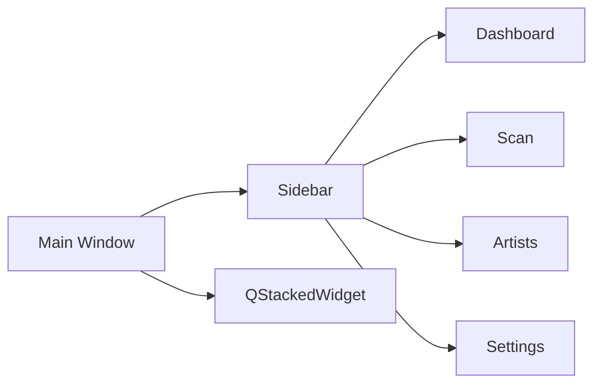
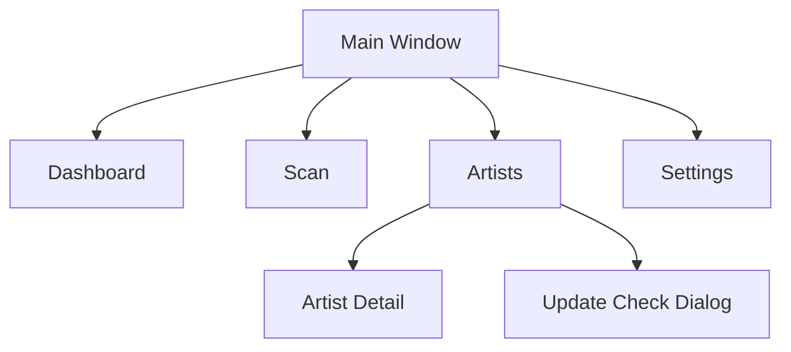

# UI 설계 (UI Design)

## UI 기본 방향

<table>
<tr>
    <th>항목</th>
    <th>방향</th>
</tr>

<tr>
    <td>구조</td>
    <td>사이드바 + 페이지 전환 방식</td>
</tr>

<tr>
    <td>디자인</td>
    <td>관리 도구 중심의 단순하고 직관적인 UI</td>
</tr>

<tr>
    <td>조작 방식</td>
    <td>검색, 선택, 버튼 실행 중심</td>
</tr>

<tr>
    <td>화면 전환</td>
    <td>사이드바 메뉴 기반</td>
</tr>

<tr>
    <td>우선순위</td>
    <td>속도, 가독성, 유지보수성</td>
</tr>

</table>

---

# 전체 화면 구조

---

# 화면 구성

<table>
<tr>
    <th>화면</th>
    <th>설명</th>
</tr>

<tr>
    <td>Dashboard</td>
    <td>전체 통계 및 추천 정보 표시</td>
</tr>

<tr>
    <td>Scan</td>
    <td>Pixiv 폴더 스캔 및 등록</td>
</tr>

<tr>
    <td>Artists</td>
    <td>작가 목록 조회 및 관리</td>
</tr>

<tr>
    <td>Artist Detail</td>
    <td>작가 상세 정보 수정</td>
</tr>

<tr>
    <td>Settings</td>
    <td>프로그램 설정 관리</td>
</tr>

<tr>
    <td>Update Check Dialog</td>
    <td>Pixiv 업데이트 확인</td>
</tr>

</table>

---

# 화면 이동 구조

---

# Sidebar

<table>
<tr>
    <th>메뉴</th>
    <th>역할</th>
</tr>

<tr>
    <td>대시보드</td>
    <td>통계 및 추천 정보</td>
</tr>

<tr>
    <td>폴더 스캔</td>
    <td>폴더 등록 및 갱신</td>
</tr>

<tr>
    <td>작가 목록</td>
    <td>작가 관리</td>
</tr>

<tr>
    <td>설정</td>
    <td>환경 설정</td>
</tr>

</table>

---

# Dashboard 화면

## 구성 요소

<table>
<tr>
    <th>구성</th>
    <th>설명</th>
</tr>

<tr>
    <td>통계 카드</td>
    <td>전체 작가 수, 작품 수, 평균 평점</td>
</tr>

<tr>
    <td>업데이트 현황</td>
    <td>상태별 작가 수 표시</td>
</tr>

<tr>
    <td>최근 등록 작가</td>
    <td>최근 추가된 작가 목록</td>
</tr>

<tr>
    <td>최근 스캔 정보</td>
    <td>마지막 스캔 시각 표시</td>
</tr>

<tr>
    <td>추천 작가</td>
    <td>평점 기반 추천</td>
</tr>

<tr>
    <td>랜덤 작가</td>
    <td>무작위 작가 선택</td>
</tr>

</table>

---

# Scan 화면

## 구성 요소

<table>
<tr>
    <th>구성</th>
    <th>설명</th>
</tr>

<tr>
    <td>폴더 선택</td>
    <td>루트 Pixiv 폴더 지정</td>
</tr>

<tr>
    <td>스캔 시작</td>
    <td>폴더 분석 시작</td>
</tr>

<tr>
    <td>진행률 표시</td>
    <td>실시간 진행 상황 표시</td>
</tr>

<tr>
    <td>결과 로그</td>
    <td>처리 결과 출력</td>
</tr>

</table>

---

# Artists 화면

## 구성 요소

<table>
<tr>
    <th>구성</th>
    <th>설명</th>
</tr>

<tr>
    <td>검색창</td>
    <td>작가명 / Pixiv ID 검색</td>
</tr>

<tr>
    <td>새로고침</td>
    <td>목록 갱신</td>
</tr>

<tr>
    <td>업데이트 확인</td>
    <td>업데이트 확인 다이얼로그 실행</td>
</tr>

<tr>
    <td>평점 표시 전환</td>
    <td>별점 ↔ 숫자</td>
</tr>

<tr>
    <td>작가 테이블</td>
    <td>등록 작가 목록</td>
</tr>

</table>

---

# Artist Table

## 컬럼 구조

<table>
<tr>
    <th>컬럼</th>
    <th>설명</th>
</tr>

<tr>
    <td>No</td>
    <td>순번</td>
</tr>

<tr>
    <td>작가명</td>
    <td>작가 이름</td>
</tr>

<tr>
    <td>Pixiv ID</td>
    <td>Pixiv 사용자 ID</td>
</tr>

<tr>
    <td>작품 수</td>
    <td>로컬 작품 수</td>
</tr>

<tr>
    <td>상태</td>
    <td>업데이트 상태 배지</td>
</tr>

<tr>
    <td>평점</td>
    <td>별 또는 숫자</td>
</tr>

<tr>
    <td>메모</td>
    <td>작가 메모</td>
</tr>

<tr>
    <td>Pixiv</td>
    <td>Pixiv 페이지 열기</td>
</tr>

</table>

---

# Artist Detail 화면

## 구성 요소

<table>
<tr>
    <th>구성</th>
    <th>설명</th>
</tr>

<tr>
    <td>기본 정보</td>
    <td>작가명, Pixiv ID</td>
</tr>

<tr>
    <td>폴더 정보</td>
    <td>폴더 경로, 작품 수</td>
</tr>

<tr>
    <td>평점</td>
    <td>0~10 점수</td>
</tr>

<tr>
    <td>메모</td>
    <td>사용자 메모</td>
</tr>

<tr>
    <td>업데이트 정보</td>
    <td>상태 및 누락 작품 수</td>
</tr>

<tr>
    <td>실행 버튼</td>
    <td>Pixiv 열기, 폴더 열기, 저장</td>
</tr>

</table>

---

# Update Check Dialog

## 구성 요소

<table>
<tr>
    <th>구성</th>
    <th>설명</th>
</tr>

<tr>
    <td>작가 선택 테이블</td>
    <td>업데이트 대상 선택</td>
</tr>

<tr>
    <td>전체 선택</td>
    <td>모든 작가 선택</td>
</tr>

<tr>
    <td>전체 해제</td>
    <td>선택 해제</td>
</tr>

<tr>
    <td>미확인 선택</td>
    <td>unknown 상태 선택</td>
</tr>

<tr>
    <td>업데이트 필요 선택</td>
    <td>need_update 상태 선택</td>
</tr>

<tr>
    <td>최근 확인 제외</td>
    <td>최근 6시간 작가 제외</td>
</tr>

<tr>
    <td>진행률</td>
    <td>작업 진행 상황</td>
</tr>

<tr>
    <td>결과 로그</td>
    <td>작업 결과 출력</td>
</tr>

</table>

---

# Settings 화면

## 구성 요소

<table>
<tr>
    <th>설정</th>
    <th>설명</th>
</tr>

<tr>
    <td>PHPSESSID</td>
    <td>Pixiv 로그인 쿠키</td>
</tr>

<tr>
    <td>기본 Pixiv 폴더</td>
    <td>스캔 기본 경로</td>
</tr>

<tr>
    <td>DB 백업</td>
    <td>SQLite 백업</td>
</tr>

<tr>
    <td>DB 복원</td>
    <td>SQLite 복원</td>
</tr>

<tr>
    <td>CSV 내보내기</td>
    <td>작가 목록 저장</td>
</tr>

</table>

---

# 상태 표시 기준

<table>
<tr>
    <th>상태</th>
    <th>설명</th>
</tr>

<tr>
    <td>unknown</td>
    <td>확인하지 않음</td>
</tr>

<tr>
    <td>up_to_date</td>
    <td>최신 상태</td>
</tr>

<tr>
    <td>need_update</td>
    <td>업데이트 필요</td>
</tr>

<tr>
    <td>updated</td>
    <td>업데이트 완료</td>
</tr>

<tr>
    <td>error</td>
    <td>오류 발생</td>
</tr>

</table>

---

# UI 우선순위

<table>
<tr>
    <th>우선순위</th>
    <th>내용</th>
</tr>

<tr>
    <td>1</td>
    <td>작가 목록 접근성</td>
</tr>

<tr>
    <td>2</td>
    <td>빠른 검색 및 정렬</td>
</tr>

<tr>
    <td>3</td>
    <td>업데이트 상태 확인 편의성</td>
</tr>

<tr>
    <td>4</td>
    <td>유지보수 가능한 UI 구조</td>
</tr>

</table>