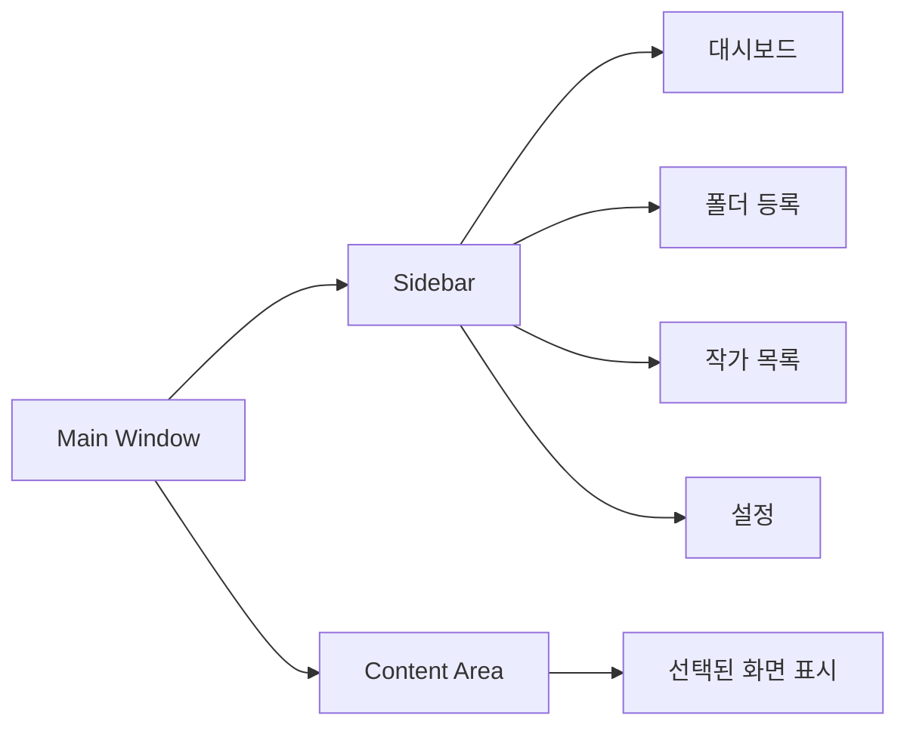
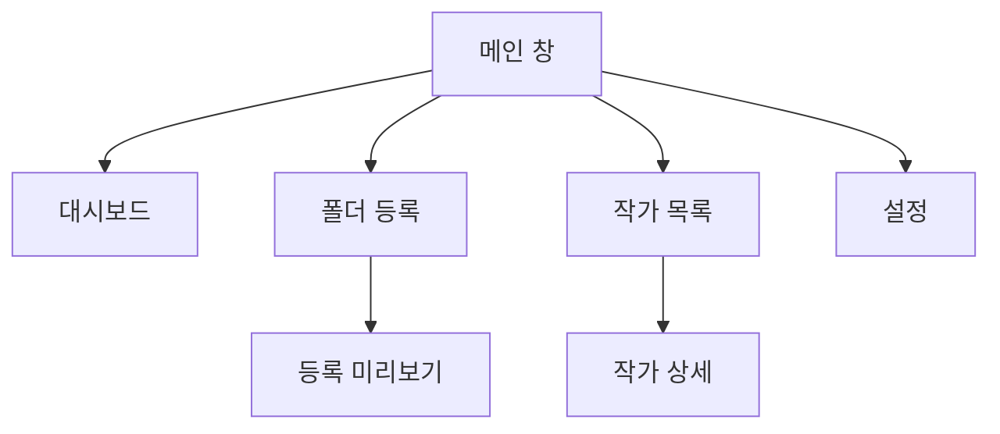

# UI 설계 (UI Design)

## UI 기본 방향

<table>
<tr>
    <th>항목</th>
    <th>방향</th>
</tr>
<tr>
    <td>구조</td>
    <td>사이드바 + 메인 화면</td>
</tr>
<tr>
    <td>디자인</td>
    <td>간단하지만 보기 좋은 관리 도구 형태</td>
</tr>
<tr>
    <td>조작 방식</td>
    <td>검색, 선택, 버튼 실행 중심</td>
</tr>
<tr>
    <td>화면 전환</td>
    <td>왼쪽 메뉴에서 주요 화면 이동</td>
</tr>
<tr>
    <td>우선순위</td>
    <td>속도, 가독성, 빠른 실행</td>
</tr>
</table>

---

## 전체 화면 구조

---

## 메인 화면 구성

<table>
<tr>
    <th>영역</th>
    <th>역할</th>
</tr>
<tr>
    <td>상단 영역</td>
    <td>프로그램 이름, 현재 화면 제목 표시</td>
</tr>
<tr>
    <td>왼쪽 사이드바</td>
    <td>주요 화면 이동</td>
</tr>
<tr>
    <td>메인 영역</td>
    <td>선택한 화면 내용 표시</td>
</tr>
<tr>
    <td>하단 상태 영역</td>
    <td>작업 결과, 오류, 진행 상태 표시</td>
</tr>
</table>

---

## 화면 목록

<table>
<tr>
    <th>화면</th>
    <th>역할</th>
</tr>
<tr>
    <td>대시보드</td>
    <td>등록 작가 수, 업데이트 필요 작가, 최근 확인 작가 표시</td>
</tr>
<tr>
    <td>폴더 등록</td>
    <td>루트 폴더 선택, 작가 폴더 스캔, 등록 미리보기</td>
</tr>
<tr>
    <td>작가 목록</td>
    <td>작가 검색, 정렬, 선택, 상세 확인</td>
</tr>
<tr>
    <td>작가 상세</td>
    <td>작가 정보 수정, Pixiv 열기, 폴더 열기</td>
</tr>
<tr>
    <td>설정</td>
    <td>외부 뷰어, 기본 정렬, UI 설정 관리</td>
</tr>
</table>

---

## 화면 이동 구조

---

## 대시보드 화면

<table>
<tr>
    <th>구성 요소</th>
    <th>내용</th>
</tr>
<tr>
    <td>요약 카드</td>
    <td>전체 작가 수, 업데이트 필요 작가 수, 확인 안 한 작가 수</td>
</tr>
<tr>
    <td>최근 등록 작가</td>
    <td>최근 등록된 작가 목록</td>
</tr>
<tr>
    <td>업데이트 필요 작가</td>
    <td>로컬 최신 작품과 Pixiv 최신 작품이 다른 작가</td>
</tr>
<tr>
    <td>빠른 실행</td>
    <td>폴더 등록, 작가 목록, CSV 내보내기 버튼</td>
</tr>
</table>

---

## 폴더 등록 화면

<table>
<tr>
    <th>구성 요소</th>
    <th>내용</th>
</tr>
<tr>
    <td>루트 폴더 선택</td>
    <td>작가 폴더들이 들어있는 상위 폴더 선택</td>
</tr>
<tr>
    <td>스캔 버튼</td>
    <td>선택한 폴더 하위 폴더 분석</td>
</tr>
<tr>
    <td>등록 미리보기</td>
    <td>작가명, Pixiv ID, 폴더 경로, 중복 여부 표시</td>
</tr>
<tr>
    <td>등록 버튼</td>
    <td>선택된 작가 폴더를 DB에 저장</td>
</tr>
</table>

---

## 작가 목록 화면

<table>
<tr>
    <th>구성 요소</th>
    <th>내용</th>
</tr>
<tr>
    <td>검색창</td>
    <td>작가명, Pixiv ID 검색</td>
</tr>
<tr>
    <td>필터</td>
    <td>상태, 평점, 업데이트 상태 기준 필터</td>
</tr>
<tr>
    <td>정렬</td>
    <td>이름순, 평점순, 최신 작품순, 최근 확인순</td>
</tr>
<tr>
    <td>작가 테이블</td>
    <td>등록된 작가 목록 표시</td>
</tr>
<tr>
    <td>상세 패널</td>
    <td>선택한 작가의 상세 정보 표시</td>
</tr>
</table>

---

## 작가 목록 컬럼

<table>
<tr>
    <th>컬럼</th>
    <th>설명</th>
</tr>
<tr>
    <td>작가명</td>
    <td>수정 가능한 작가 이름</td>
</tr>
<tr>
    <td>Pixiv ID</td>
    <td>작가 페이지 이동에 사용하는 ID</td>
</tr>
<tr>
    <td>평점</td>
    <td>사용자 지정 평점</td>
</tr>
<tr>
    <td>상태</td>
    <td>기본, 즐겨찾기, 확인 필요, 보류, 숨김</td>
</tr>
<tr>
    <td>로컬 최신</td>
    <td>로컬 폴더 기준 최신 작품 ID</td>
</tr>
<tr>
    <td>Pixiv 최신</td>
    <td>사용자가 입력한 Pixiv 최신 작품 ID</td>
</tr>
<tr>
    <td>업데이트</td>
    <td>최신, 업데이트 있음, 확인 안함</td>
</tr>
<tr>
    <td>마지막 확인일</td>
    <td>작가 페이지 또는 정보 확인 날짜</td>
</tr>
</table>

---

## 작가 상세 화면

<table>
<tr>
    <th>구성 요소</th>
    <th>내용</th>
</tr>
<tr>
    <td>기본 정보</td>
    <td>작가명, Pixiv ID, 폴더 경로</td>
</tr>
<tr>
    <td>평점</td>
    <td>작가 평점 수정</td>
</tr>
<tr>
    <td>상태</td>
    <td>작가 상태 수정</td>
</tr>
<tr>
    <td>메모</td>
    <td>작가 관련 메모 작성</td>
</tr>
<tr>
    <td>최신 작품 정보</td>
    <td>로컬 최신 ID, Pixiv 최신 ID, 업데이트 상태 표시</td>
</tr>
<tr>
    <td>실행 버튼</td>
    <td>Pixiv 열기, 폴더 열기, 외부 뷰어 실행</td>
</tr>
</table>

---

## 설정 화면

<table>
<tr>
    <th>설정</th>
    <th>내용</th>
</tr>
<tr>
    <td>외부 뷰어 경로</td>
    <td>외부 이미지 뷰어 실행 파일 경로</td>
</tr>
<tr>
    <td>기본 정렬</td>
    <td>작가 목록 기본 정렬 기준</td>
</tr>
<tr>
    <td>UI 설정</td>
    <td>테마, 글자 크기, 창 크기 등</td>
</tr>
<tr>
    <td>데이터 경로</td>
    <td>DB, 백업, 내보내기 폴더 경로</td>
</tr>
</table>

---

## 상태 표시 기준

<table>
<tr>
    <th>상태</th>
    <th>표시 의미</th>
</tr>
<tr>
    <td>최신</td>
    <td>로컬 최신 작품과 Pixiv 최신 작품이 같음</td>
</tr>
<tr>
    <td>업데이트 있음</td>
    <td>Pixiv 최신 작품이 로컬 최신 작품과 다름</td>
</tr>
<tr>
    <td>확인 안함</td>
    <td>Pixiv 최신 작품 ID가 입력되지 않음</td>
</tr>
<tr>
    <td>경로 오류</td>
    <td>등록된 로컬 폴더가 존재하지 않음</td>
</tr>
</table>

---

## UI 우선순위

<table>
<tr>
    <th>우선순위</th>
    <th>내용</th>
</tr>
<tr>
    <td>1</td>
    <td>작가 목록을 빠르게 확인할 수 있어야 함</td>
</tr>
<tr>
    <td>2</td>
    <td>검색과 정렬이 즉시 반응해야 함</td>
</tr>
<tr>
    <td>3</td>
    <td>Pixiv 페이지와 로컬 폴더 이동이 버튼 한 번으로 가능해야 함</td>
</tr>
<tr>
    <td>4</td>
    <td>기능이 많아져도 화면이 복잡해지지 않아야 함</td>
</tr>
</table>
