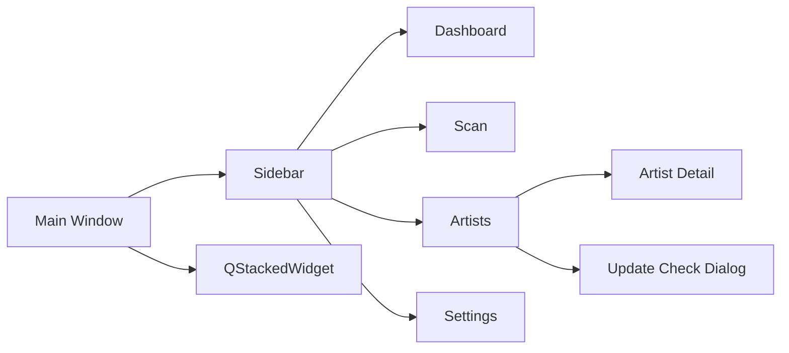

# UI 설계

## UI 기본 방향

<table>
<tr>
    <th>항목</th>
    <th>방향</th>
</tr>

<tr>
    <td>구조</td>
    <td>사이드바 + 페이지 전환 방식</td>
</tr>

<tr>
    <td>디자인</td>
    <td>관리 도구 중심의 단순하고 직관적인 UI</td>
</tr>

<tr>
    <td>조작 방식</td>
    <td>검색, 필터, 선택, 버튼 실행 중심</td>
</tr>

<tr>
    <td>화면 전환</td>
    <td>사이드바 메뉴 기반</td>
</tr>

<tr>
    <td>우선순위</td>
    <td>속도, 가독성, 유지보수성</td>
</tr>

</table>

---

# 전체 화면 구조



---

# 화면 구성

<table>
<tr>
    <th>화면</th>
    <th>설명</th>
</tr>

<tr>
    <td>Dashboard</td>
    <td>전체 통계 및 추천 정보 표시</td>
</tr>

<tr>
    <td>Scan</td>
    <td>Pixiv 폴더 스캔 및 등록</td>
</tr>

<tr>
    <td>Artists</td>
    <td>작가 목록 조회, 필터, 정렬, 일괄 관리</td>
</tr>

<tr>
    <td>Artist Detail</td>
    <td>작가 상세 정보 조회 및 수정</td>
</tr>

<tr>
    <td>Settings</td>
    <td>프로그램 설정 관리</td>
</tr>

<tr>
    <td>Update Check Dialog</td>
    <td>Pixiv 업데이트 확인</td>
</tr>

</table>

---

# Sidebar

<table>
<tr>
    <th>메뉴</th>
    <th>역할</th>
</tr>

<tr>
    <td>대시보드</td>
    <td>통계 및 추천 정보</td>
</tr>

<tr>
    <td>폴더 스캔</td>
    <td>폴더 등록 및 갱신</td>
</tr>

<tr>
    <td>작가 목록</td>
    <td>작가 관리</td>
</tr>

<tr>
    <td>설정</td>
    <td>환경 설정</td>
</tr>

</table>

---

# Dashboard 화면

## 구성 요소

<table>
<tr>
    <th>구성</th>
    <th>설명</th>
</tr>

<tr>
    <td>통계 카드</td>
    <td>전체 작가 수, 작품 수, 평균 평점</td>
</tr>

<tr>
    <td>업데이트 현황</td>
    <td>상태별 작가 수 표시</td>
</tr>

<tr>
    <td>최근 등록 작가</td>
    <td>최근 추가된 작가 목록</td>
</tr>

<tr>
    <td>최근 스캔 정보</td>
    <td>마지막 스캔 시각 표시</td>
</tr>

<tr>
    <td>추천 작가</td>
    <td>평점 기반 추천</td>
</tr>

<tr>
    <td>랜덤 작가</td>
    <td>무작위 작가 선택</td>
</tr>

</table>

---

# Scan 화면

## 구성 요소

<table>
<tr>
    <th>구성</th>
    <th>설명</th>
</tr>

<tr>
    <td>폴더 선택</td>
    <td>루트 Pixiv 폴더 지정</td>
</tr>

<tr>
    <td>스캔 시작</td>
    <td>폴더 분석 시작</td>
</tr>

<tr>
    <td>진행률 표시</td>
    <td>실시간 진행 상황 표시</td>
</tr>

<tr>
    <td>결과 로그</td>
    <td>처리 결과 출력</td>
</tr>

</table>

---

# Artists 화면

## 구성 요소

<table>
<tr>
    <th>구성</th>
    <th>설명</th>
</tr>

<tr>
    <td>검색창</td>
    <td>작가명 / Pixiv ID 검색</td>
</tr>

<tr>
    <td>평점 표시 전환</td>
    <td>별점 ↔ 숫자 전환</td>
</tr>

<tr>
    <td>업데이트 확인</td>
    <td>업데이트 확인 다이얼로그 실행</td>
</tr>

<tr>
    <td>새로고침</td>
    <td>작가 목록 갱신</td>
</tr>

<tr>
    <td>필터 영역</td>
    <td>평점, 즐겨찾기, 업데이트 필요, 미확인, 평점 미설정, 숨김 제외 필터</td>
</tr>

<tr>
    <td>일괄 작업 영역</td>
    <td>평점 변경, 즐겨찾기, 숨김, 삭제, 복구 실행</td>
</tr>

<tr>
    <td>작가 테이블</td>
    <td>등록 작가 목록 표시</td>
</tr>

</table>

---

# Artist Table

## 컬럼 구조

<table>
<tr>
    <th>컬럼</th>
    <th>설명</th>
</tr>

<tr>
    <td>No</td>
    <td>순번</td>
</tr>

<tr>
    <td>즐겨찾기</td>
    <td>즐겨찾기 토글</td>
</tr>

<tr>
    <td>작가명</td>
    <td>작가 이름</td>
</tr>

<tr>
    <td>Pixiv ID</td>
    <td>Pixiv 사용자 ID</td>
</tr>

<tr>
    <td>작품 수</td>
    <td>로컬 작품 수</td>
</tr>

<tr>
    <td>파일 수</td>
    <td>실제 이미지 파일 수</td>
</tr>

<tr>
    <td>상태</td>
    <td>업데이트 상태 배지</td>
</tr>

<tr>
    <td>평점</td>
    <td>별 또는 숫자 표시</td>
</tr>

<tr>
    <td>태그</td>
    <td>작가 태그 정보</td>
</tr>

<tr>
    <td>최근 열람</td>
    <td>최근 상세 페이지 진입 시각</td>
</tr>

<tr>
    <td>등록일</td>
    <td>작가 등록 시각</td>
</tr>

<tr>
    <td>메모</td>
    <td>작가 메모</td>
</tr>

<tr>
    <td>바로가기</td>
    <td>폴더 열기 / Pixiv 페이지 열기</td>
</tr>

</table>

---

# Artists 필터

<table>
<tr>
    <th>필터</th>
    <th>설명</th>
</tr>

<tr>
    <td>검색</td>
    <td>작가명 또는 Pixiv ID 기준 검색</td>
</tr>

<tr>
    <td>평점 필터</td>
    <td>평점 이상 또는 일치 조건 필터</td>
</tr>

<tr>
    <td>즐겨찾기</td>
    <td>즐겨찾기 작가만 표시</td>
</tr>

<tr>
    <td>업데이트 필요</td>
    <td>업데이트 필요 상태 작가만 표시</td>
</tr>

<tr>
    <td>미확인</td>
    <td>업데이트 미확인 작가만 표시</td>
</tr>

<tr>
    <td>평점 미설정</td>
    <td>평점이 0인 작가만 표시</td>
</tr>

<tr>
    <td>숨김 제외</td>
    <td>숨김 처리된 작가를 목록에서 제외</td>
</tr>

</table>

---

# Artists 일괄 작업

<table>
<tr>
    <th>작업</th>
    <th>설명</th>
</tr>

<tr>
    <td>선택 평점 변경</td>
    <td>선택한 작가의 평점을 한 번에 변경</td>
</tr>

<tr>
    <td>선택 즐겨찾기</td>
    <td>선택한 작가를 즐겨찾기로 설정</td>
</tr>

<tr>
    <td>선택 즐겨찾기 해제</td>
    <td>선택한 작가의 즐겨찾기 해제</td>
</tr>

<tr>
    <td>선택 숨김</td>
    <td>선택한 작가를 숨김 처리</td>
</tr>

<tr>
    <td>선택 숨김 해제</td>
    <td>선택한 작가의 숨김 해제</td>
</tr>

<tr>
    <td>선택 삭제</td>
    <td>선택한 작가 삭제 및 삭제 전 자동 백업</td>
</tr>

<tr>
    <td>삭제 작가 복구</td>
    <td>삭제 백업 JSON을 선택하여 작가 복구</td>
</tr>

</table>

---

# Artist Detail 화면

## 구성 요소

<table>
<tr>
    <th>구성</th>
    <th>설명</th>
</tr>

<tr>
    <td>기본 정보</td>
    <td>작가명, Pixiv ID, 폴더 경로, 상태 표시</td>
</tr>

<tr>
    <td>작품 정보</td>
    <td>작품 수, 파일 수, 폴더 용량 표시</td>
</tr>

<tr>
    <td>평점</td>
    <td>작가 평점 수정</td>
</tr>

<tr>
    <td>즐겨찾기</td>
    <td>즐겨찾기 설정 및 해제</td>
</tr>

<tr>
    <td>숨김</td>
    <td>숨김 설정 및 해제</td>
</tr>

<tr>
    <td>폴더 변경</td>
    <td>작가 저장 위치 변경</td>
</tr>

<tr>
    <td>최근 로컬 작품</td>
    <td>최근 저장된 작품 목록 표시</td>
</tr>

<tr>
    <td>누락 작품 ID 목록</td>
    <td>Pixiv에는 있으나 로컬에 없는 작품 표시</td>
</tr>

<tr>
    <td>Pixiv 바로가기</td>
    <td>작가 또는 작품 Pixiv 페이지 열기</td>
</tr>

<tr>
    <td>폴더 바로가기</td>
    <td>파일 위치 열기</td>
</tr>

<tr>
    <td>태그 관리</td>
    <td>태그 정보 조회 및 수정</td>
</tr>

<tr>
    <td>메모 관리</td>
    <td>장문 메모 저장</td>
</tr>

<tr>
    <td>참고 링크</td>
    <td>작가 관련 링크 저장</td>
</tr>

<tr>
    <td>다운로드 메모</td>
    <td>다운로드 관련 메모 저장</td>
</tr>

</table>

---

## 태그 관리 영역

<table>
<tr>
    <th>항목</th>
    <th>설명</th>
</tr>

<tr>
    <td>태그명</td>
    <td>Pixiv 원본 태그</td>
</tr>

<tr>
    <td>번역명</td>
    <td>사용자 번역명</td>
</tr>

<tr>
    <td>작품 수</td>
    <td>태그가 사용된 작품 수</td>
</tr>

<tr>
    <td>파일 수</td>
    <td>태그가 사용된 파일 수</td>
</tr>

<tr>
    <td>작품 수 정렬</td>
    <td>작품 수 기준 정렬</td>
</tr>

<tr>
    <td>중복 태그 정리</td>
    <td>동일 태그 자동 병합</td>
</tr>

<tr>
    <td>빈 태그 정리</td>
    <td>빈 태그 자동 제거</td>
</tr>

</table>

---

## 최근 로컬 작품 영역

<table>
<tr>
    <th>항목</th>
    <th>설명</th>
</tr>

<tr>
    <td>작품 ID</td>
    <td>작품 식별 번호 표시</td>
</tr>

<tr>
    <td>Pixiv</td>
    <td>Pixiv 작품 페이지 열기</td>
</tr>

<tr>
    <td>폴더</td>
    <td>해당 파일 위치 열기</td>
</tr>

</table>

---

## 누락 작품 영역

<table>
<tr>
    <th>항목</th>
    <th>설명</th>
</tr>

<tr>
    <td>작품 ID</td>
    <td>누락 작품 ID 표시</td>
</tr>

<tr>
    <td>Pixiv</td>
    <td>Pixiv 작품 페이지 열기</td>
</tr>

</table>

---

## 스크롤 구조

```text
QScrollArea
 └─ Artist Detail Container
     ├─ 기본 정보
     ├─ 작품 정보
     ├─ 최근 로컬 작품
     ├─ 누락 작품
     ├─ 태그 관리
     ├─ 메모
     ├─ 참고 링크
     └─ 다운로드 메모
```

---

# Update Check Dialog

## 구성 요소

<table>
<tr>
    <th>구성</th>
    <th>설명</th>
</tr>

<tr>
    <td>작가 목록</td>
    <td>업데이트 대상 작가 표시</td>
</tr>

<tr>
    <td>선택 영역</td>
    <td>전체 선택 / 해제</td>
</tr>

<tr>
    <td>진행률</td>
    <td>현재 진행 상태 표시</td>
</tr>

<tr>
    <td>결과 로그</td>
    <td>업데이트 결과 출력</td>
</tr>

<tr>
    <td>시작</td>
    <td>업데이트 확인 시작</td>
</tr>

<tr>
    <td>취소</td>
    <td>업데이트 확인 취소</td>
</tr>

</table>

---

# Settings 화면

## 구성 요소

<table>
<tr>
    <th>구성</th>
    <th>설명</th>
</tr>

<tr>
    <td>기본 폴더 설정</td>
    <td>Pixiv 루트 폴더 지정</td>
</tr>

<tr>
    <td>PHPSESSID 설정</td>
    <td>Pixiv 로그인 쿠키 저장</td>
</tr>

<tr>
    <td>DB 백업</td>
    <td>전체 DB 백업 생성</td>
</tr>

<tr>
    <td>DB 복원</td>
    <td>백업 DB 복원</td>
</tr>

<tr>
    <td>CSV 내보내기</td>
    <td>작가 목록 CSV 저장</td>
</tr>

<tr>
    <td>삭제 작가 복구</td>
    <td>삭제 백업 파일 기반 복구</td>
</tr>

<tr>
    <td>프로그램 정보</td>
    <td>버전 및 DB 정보 표시</td>
</tr>

</table>

---

# 디자인 원칙

<table>
<tr>
    <th>항목</th>
    <th>설명</th>
</tr>

<tr>
    <td>가독성</td>
    <td>한 화면에서 최대한 많은 정보를 확인할 수 있도록 구성</td>
</tr>

<tr>
    <td>일관성</td>
    <td>모든 페이지에서 동일한 UI 패턴 사용</td>
</tr>

<tr>
    <td>단순성</td>
    <td>불필요한 팝업 최소화</td>
</tr>

<tr>
    <td>속도</td>
    <td>최소 클릭으로 주요 기능 접근</td>
</tr>

<tr>
    <td>확장성</td>
    <td>V3 작품 관리 및 뷰어 기능 추가 가능 구조 유지</td>
</tr>

</table>

---
