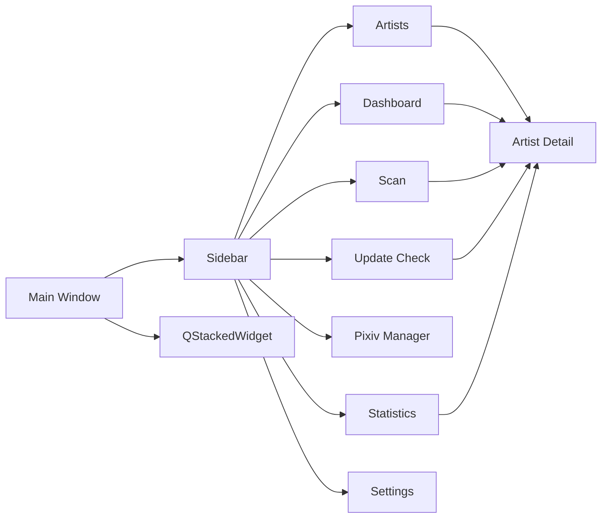

# UI 설계

## UI 기본 방향

<table>
<tr>
    <th>항목</th>
    <th>방향</th>
</tr>

<tr>
    <td>구조</td>
    <td>사이드바 + 페이지 전환 방식</td>
</tr>

<tr>
    <td>디자인</td>
    <td>관리 도구 중심의 단순하고 직관적인 UI</td>
</tr>

<tr>
    <td>조작 방식</td>
    <td>검색, 필터, 선택, 버튼 실행 중심</td>
</tr>

<tr>
    <td>화면 전환</td>
    <td>사이드바 메뉴 기반</td>
</tr>

<tr>
    <td>우선순위</td>
    <td>속도, 가독성, 유지보수성</td>
</tr>

</table>

---

# 전체 화면 구조



---

# 화면 구성

<table>
<tr>
    <th>화면</th>
    <th>설명</th>
</tr>

<tr>
    <td>Dashboard</td>
    <td>전체 통계, 최근 활동, 추천 정보 표시</td>
</tr>

<tr>
    <td>Scan</td>
    <td>Pixiv 폴더 스캔, 미리보기, 등록 및 결과 관리</td>
</tr>

<tr>
    <td>Update Check</td>
    <td>Pixiv 업데이트 확인 및 결과 관리</td>
</tr>

<tr>
    <td>Artists</td>
    <td>작가 목록 조회, 필터, 정렬, 일괄 관리</td>
</tr>

<tr>
    <td>Artist Detail</td>
    <td>작가 상세 정보 조회 및 수정</td>
</tr>

<tr>
    <td>Pixiv Manager</td>
    <td>Pixiv 팔로우 유저 및 북마크 작품 관리</td>
</tr>

<tr>
    <td>Statistics</td>
    <td>통계 분석 및 데이터 품질 관리</td>
</tr>

<tr>
    <td>Settings</td>
    <td>프로그램 설정 및 데이터 관리</td>
</tr>

</table>

---

# Sidebar

<table>
<tr>
    <th>메뉴</th>
    <th>역할</th>
</tr>

<tr>
    <td>대시보드</td>
    <td>통계 및 추천 정보</td>
</tr>

<tr>
    <td>폴더 스캔</td>
    <td>폴더 등록, 갱신, 미리보기, 결과 관리</td>
</tr>

<tr>
    <td>업데이트 확인</td>
    <td>Pixiv 업데이트 확인</td>
</tr>

<tr>
    <td>작가 목록</td>
    <td>로컬 작가 관리</td>
</tr>

<tr>
    <td>Pixiv 관리</td>
    <td>Pixiv 팔로우 유저 및 북마크 작품 관리</td>
</tr>

<tr>
    <td>통계 분석</td>
    <td>통계 및 데이터 품질 분석</td>
</tr>

<tr>
    <td>설정</td>
    <td>환경 설정 및 데이터 관리</td>
</tr>

</table>

---

# Dashboard 화면

## 구성 요소

<table>
<tr>
    <th>구성</th>
    <th>설명</th>
</tr>

<tr>
    <td>통계 카드</td>
    <td>전체 작가 수, 작품 수, 파일 수, 폴더 용량, 최근 스캔 일시 표시</td>
</tr>

<tr>
    <td>업데이트 현황</td>
    <td>상태 분포 및 누락 작품 통계 표시</td>
</tr>

<tr>
    <td>최근 활동</td>
    <td>최근 열람, 최근 등록, 최근 확인, 오류, 누락 증가 이력 표시</td>
</tr>

<tr>
    <td>TOP 랭킹</td>
    <td>작품 수, 파일 수, 폴더 용량 기준 랭킹 표시</td>
</tr>

<tr>
    <td>추천 작가</td>
    <td>고평점 작가 및 즐겨찾기 작가 추천</td>
</tr>

<tr>
    <td>랜덤 작가</td>
    <td>무작위 작가 추천</td>
</tr>

</table>

---

## Dashboard 세부 구성

<table>
<tr>
    <th>영역</th>
    <th>설명</th>
</tr>

<tr>
    <td>통계 카드</td>
    <td>전체 작가 수, 전체 작품 수, 전체 파일 수, 전체 폴더 용량, 최근 스캔 일시 표시</td>
</tr>

<tr>
    <td>업데이트 현황</td>
    <td>최신, 업데이트 필요, 미확인, 오류 상태 분포 및 누락 작품 통계 표시</td>
</tr>

<tr>
    <td>최근 활동</td>
    <td>최근 열람, 최근 등록, 최근 확인, 오류, 누락 증가 탭 제공</td>
</tr>

<tr>
    <td>TOP 랭킹</td>
    <td>작품 수, 파일 수, 폴더 용량 기준 TOP 랭킹 제공</td>
</tr>

<tr>
    <td>추천 작가</td>
    <td>평점, 작품 수, 파일 수 표시</td>
</tr>

<tr>
    <td>랜덤 작가</td>
    <td>Pixiv 바로가기, 폴더 바로가기 제공</td>
</tr>

<tr>
    <td>상세 페이지 연동</td>
    <td>최근 활동 및 랭킹 더블클릭 시 상세 페이지 이동</td>
</tr>

</table>

---

# Scan 화면

## 구성 요소

<table>
<tr>
    <th>구성</th>
    <th>설명</th>
</tr>

<tr>
    <td>폴더 선택</td>
    <td>루트 Pixiv 폴더 지정</td>
</tr>

<tr>
    <td>미리보기</td>
    <td>등록 전 결과 검토</td>
</tr>

<tr>
    <td>스캔 및 등록</td>
    <td>신규 등록 또는 기존 정보 갱신</td>
</tr>

<tr>
    <td>스캔 제어</td>
    <td>일시정지, 재개, 중지</td>
</tr>

<tr>
    <td>진행률 표시</td>
    <td>현재 진행 상태 표시</td>
</tr>

<tr>
    <td>진행 정보</td>
    <td>시작 시각, 실행 시간, 처리 속도 표시</td>
</tr>

<tr>
    <td>스캔 통계</td>
    <td>등록, 업데이트, 변경 없음, 실패 통계</td>
</tr>

<tr>
    <td>최근 스캔 정보</td>
    <td>직전 스캔 결과 표시</td>
</tr>

<tr>
    <td>미리보기 테이블</td>
    <td>예상 결과 목록 표시</td>
</tr>

<tr>
    <td>미리보기 필터</td>
    <td>결과 유형별 필터</td>
</tr>

<tr>
    <td>선택 항목 등록</td>
    <td>선택 항목만 등록</td>
</tr>

<tr>
    <td>결과 로그</td>
    <td>작업 로그 및 오류 표시</td>
</tr>

<tr>
    <td>결과 필터</td>
    <td>등록, 업데이트, 실패 등 필터링</td>
</tr>

<tr>
    <td>실패 항목 관리</td>
    <td>실패 항목 재시도</td>
</tr>

<tr>
    <td>CSV 저장</td>
    <td>결과 저장</td>
</tr>

</table>

---

## Scan 처리 흐름

```text
폴더 선택
→ 미리보기 생성
→ 선택 항목 검토
→ 스캔 실행
→ 결과 저장
→ 최근 스캔 이력 갱신
```

---

# Artists 화면

## 구성 요소

<table>
<tr>
    <th>구성</th>
    <th>설명</th>
</tr>

<tr>
    <td>검색창</td>
    <td>작가명 / Pixiv ID 검색</td>
</tr>

<tr>
    <td>평점 표시 전환</td>
    <td>별점 ↔ 숫자 전환</td>
</tr>

<tr>
    <td>새로고침</td>
    <td>작가 목록 갱신</td>
</tr>

<tr>
    <td>필터 영역</td>
    <td>평점, 즐겨찾기, 업데이트 필요, 미확인, 평점 미설정, 숨김 제외 필터</td>
</tr>

<tr>
    <td>일괄 작업 영역</td>
    <td>평점, 즐겨찾기, 숨김, 삭제, 복구 관리</td>
</tr>

<tr>
    <td>작가 테이블</td>
    <td>등록 작가 목록 표시</td>
</tr>

</table>

---

# Artist Table

## 컬럼 구조

<table>
<tr>
    <th>컬럼</th>
    <th>설명</th>
</tr>

<tr>
    <td>No</td>
    <td>순번</td>
</tr>

<tr>
    <td>즐겨찾기</td>
    <td>즐겨찾기 토글</td>
</tr>

<tr>
    <td>작가명</td>
    <td>작가 이름</td>
</tr>

<tr>
    <td>Pixiv ID</td>
    <td>Pixiv 사용자 ID</td>
</tr>

<tr>
    <td>작품 수</td>
    <td>로컬 작품 수</td>
</tr>

<tr>
    <td>파일 수</td>
    <td>실제 이미지 파일 수</td>
</tr>

<tr>
    <td>상태</td>
    <td>업데이트 상태 배지</td>
</tr>

<tr>
    <td>평점</td>
    <td>별 또는 숫자 표시</td>
</tr>

<tr>
    <td>태그</td>
    <td>저장된 작가 태그 전체 표시</td>
</tr>

<tr>
    <td>최근 열람</td>
    <td>최근 상세 페이지 진입 시각</td>
</tr>

<tr>
    <td>등록일</td>
    <td>작가 등록일</td>
</tr>

<tr>
    <td>바로가기</td>
    <td>폴더 열기 / Pixiv 페이지 열기</td>
</tr>

</table>

---

## 컬럼 너비 방향

<table>
<tr>
    <th>컬럼</th>
    <th>방향</th>
</tr>

<tr>
    <td>작가명</td>
    <td>고정 폭으로 표시하여 과도한 공간 점유 방지</td>
</tr>

<tr>
    <td>Pixiv ID</td>
    <td>기존 폭 유지</td>
</tr>

<tr>
    <td>태그</td>
    <td>남는 공간을 우선 할당하여 태그 전체 표시</td>
</tr>

<tr>
    <td>메모</td>
    <td>목록에서는 제거하고 상세 페이지에서 관리</td>
</tr>

</table>

---

# Artists 필터

<table>
<tr>
    <th>필터</th>
    <th>설명</th>
</tr>

<tr>
    <td>검색</td>
    <td>작가명 또는 Pixiv ID 기준 검색</td>
</tr>

<tr>
    <td>평점 필터</td>
    <td>평점 이상 또는 일치 조건 필터</td>
</tr>

<tr>
    <td>즐겨찾기</td>
    <td>즐겨찾기 작가만 표시</td>
</tr>

<tr>
    <td>업데이트 필요</td>
    <td>업데이트 필요 상태 작가만 표시</td>
</tr>

<tr>
    <td>미확인</td>
    <td>업데이트 미확인 작가만 표시</td>
</tr>

<tr>
    <td>평점 미설정</td>
    <td>평점이 없는 작가만 표시</td>
</tr>

<tr>
    <td>숨김 제외</td>
    <td>숨김 처리된 작가 제외</td>
</tr>

</table>

---

# Artists 일괄 작업

<table>
<tr>
    <th>작업</th>
    <th>설명</th>
</tr>

<tr>
    <td>선택 평점 변경</td>
    <td>선택 작가 평점 일괄 변경</td>
</tr>

<tr>
    <td>선택 즐겨찾기</td>
    <td>선택 작가 즐겨찾기 설정</td>
</tr>

<tr>
    <td>선택 즐겨찾기 해제</td>
    <td>선택 작가 즐겨찾기 해제</td>
</tr>

<tr>
    <td>선택 숨김</td>
    <td>선택 작가 숨김 설정</td>
</tr>

<tr>
    <td>선택 숨김 해제</td>
    <td>선택 작가 숨김 해제</td>
</tr>

<tr>
    <td>선택 삭제</td>
    <td>선택 작가 삭제</td>
</tr>

<tr>
    <td>삭제 작가 복구</td>
    <td>삭제 백업 기반 복구</td>
</tr>

</table>

---

# Artist Detail 화면

## 구성 요소

<table>
<tr>
    <th>구성</th>
    <th>설명</th>
</tr>

<tr>
    <td>기본 정보</td>
    <td>작가명, Pixiv ID, 상태, 평점 표시</td>
</tr>

<tr>
    <td>상태 정보</td>
    <td>최근 확인일, 최근 열람일, 등록일 표시</td>
</tr>

<tr>
    <td>폴더 정보</td>
    <td>폴더 경로, 파일 수, 작품 수, 용량 표시</td>
</tr>

<tr>
    <td>태그 정보</td>
    <td>작가 태그 목록 표시</td>
</tr>

<tr>
    <td>메모</td>
    <td>작가 메모 관리</td>
</tr>

<tr>
    <td>바로가기</td>
    <td>Pixiv, 폴더, 경로 복사 기능</td>
</tr>

<tr>
    <td>관리 기능</td>
    <td>재스캔, 업데이트 확인, 즐겨찾기, 숨김 처리</td>
</tr>

<tr>
    <td>최신 작품</td>
    <td>최근 작품 ID 목록 표시</td>
</tr>

<tr>
    <td>누락 작품</td>
    <td>로컬에 없는 작품 목록 표시</td>
</tr>

<tr>
    <td>업데이트 이력</td>
    <td>업데이트 확인 기록 표시</td>
</tr>

</table>

---

## Artist Detail 기능

<table>
<tr>
    <th>기능</th>
    <th>설명</th>
</tr>

<tr>
    <td>뒤로가기</td>
    <td>이전 화면으로 이동</td>
</tr>

<tr>
    <td>새로고침</td>
    <td>작가 정보 재조회</td>
</tr>

<tr>
    <td>현재 작가 재스캔</td>
    <td>선택 작가 폴더 재스캔</td>
</tr>

<tr>
    <td>현재 작가 업데이트 확인</td>
    <td>Pixiv 최신 상태 조회</td>
</tr>

<tr>
    <td>Pixiv ID 복사</td>
    <td>Pixiv ID 복사</td>
</tr>

<tr>
    <td>폴더 경로 복사</td>
    <td>폴더 경로 복사</td>
</tr>

<tr>
    <td>Pixiv 열기</td>
    <td>Pixiv 프로필 열기</td>
</tr>

<tr>
    <td>폴더 열기</td>
    <td>작가 폴더 열기</td>
</tr>

<tr>
    <td>누락 작품 복사</td>
    <td>누락 작품 ID 복사</td>
</tr>

</table>

---

# Update Check 화면

## 구성 요소

<table>
<tr>
    <th>구성</th>
    <th>설명</th>
</tr>

<tr>
    <td>작가 목록</td>
    <td>확인 대상 선택</td>
</tr>

<tr>
    <td>선택 기능</td>
    <td>전체 선택, 상태별 선택</td>
</tr>

<tr>
    <td>결과 요약</td>
    <td>최신, 업데이트 필요, 오류 통계</td>
</tr>

<tr>
    <td>진행률</td>
    <td>현재 진행 상태 표시</td>
</tr>

<tr>
    <td>실행 제어</td>
    <td>시작, 일시정지, 재개, 중지</td>
</tr>

<tr>
    <td>결과 로그</td>
    <td>확인 결과 기록</td>
</tr>

<tr>
    <td>CSV 저장</td>
    <td>결과 내보내기</td>
</tr>

</table>

---

## Update Check 기능

<table>
<tr>
    <th>기능</th>
    <th>설명</th>
</tr>

<tr>
    <td>전체 선택</td>
    <td>모든 작가 선택</td>
</tr>

<tr>
    <td>전체 해제</td>
    <td>선택 해제</td>
</tr>

<tr>
    <td>미확인 선택</td>
    <td>업데이트 미확인 작가 선택</td>
</tr>

<tr>
    <td>업데이트 필요 선택</td>
    <td>업데이트 필요 작가 선택</td>
</tr>

<tr>
    <td>실패 작가 선택</td>
    <td>오류 작가 선택</td>
</tr>

<tr>
    <td>PHPSESSID 테스트</td>
    <td>세션 유효성 확인</td>
</tr>

<tr>
    <td>최근 확인 제외</td>
    <td>최근 확인 작가 자동 제외</td>
</tr>

<tr>
    <td>일시정지</td>
    <td>현재 작가 완료 후 정지</td>
</tr>

<tr>
    <td>재개</td>
    <td>정지 위치부터 재개</td>
</tr>

<tr>
    <td>중지</td>
    <td>작업 종료</td>
</tr>

</table>

---

## Update Check 실행 흐름

```text
작가 선택
→ 업데이트 확인 시작
→ Pixiv 조회
→ 상태 계산
→ 태그 동기화
→ 이력 저장
→ 결과 로그 기록
```

---

# Pixiv Manager 화면

## 구성 요소

<table>
<tr>
    <th>구성</th>
    <th>설명</th>
</tr>

<tr>
    <td>통계 카드</td>
    <td>팔로우 수, 북마크 수, 로컬 매칭 통계 표시</td>
</tr>

<tr>
    <td>팔로우 유저 탭</td>
    <td>팔로우 작가 목록 관리</td>
</tr>

<tr>
    <td>북마크 작품 탭</td>
    <td>북마크 작품 목록 관리</td>
</tr>

<tr>
    <td>가져오기</td>
    <td>txt, csv 데이터 가져오기</td>
</tr>

<tr>
    <td>저장</td>
    <td>DB 저장</td>
</tr>

<tr>
    <td>로그</td>
    <td>가져오기 결과 표시</td>
</tr>

</table>

---

# 팔로우 유저 탭

## 컬럼 구조

<table>
<tr>
    <th>컬럼</th>
    <th>설명</th>
</tr>

<tr>
    <td>No</td>
    <td>순번</td>
</tr>

<tr>
    <td>유저명</td>
    <td>Pixiv 유저명</td>
</tr>

<tr>
    <td>Pixiv ID</td>
    <td>Pixiv 사용자 ID</td>
</tr>

<tr>
    <td>로컬 등록 여부</td>
    <td>로컬 DB 등록 상태</td>
</tr>

<tr>
    <td>즐겨찾기</td>
    <td>즐겨찾기 상태</td>
</tr>

<tr>
    <td>태그</td>
    <td>작가 태그 전체 표시</td>
</tr>

<tr>
    <td>바로가기</td>
    <td>Pixiv 열기</td>
</tr>

</table>

---

## 팔로우 유저 기능

<table>
<tr>
    <th>기능</th>
    <th>설명</th>
</tr>

<tr>
    <td>TXT 가져오기</td>
    <td>팔로우 ID 목록 불러오기</td>
</tr>

<tr>
    <td>CSV 가져오기</td>
    <td>CSV 데이터 불러오기</td>
</tr>

<tr>
    <td>중복 제거</td>
    <td>기존 데이터 자동 제외</td>
</tr>

<tr>
    <td>로컬 매칭</td>
    <td>등록 작가 자동 연결</td>
</tr>

<tr>
    <td>Pixiv 열기</td>
    <td>프로필 열기</td>
</tr>

<tr>
    <td>저장</td>
    <td>DB 저장</td>
</tr>

</table>

---

# 북마크 작품 탭

## 컬럼 구조

<table>
<tr>
    <th>컬럼</th>
    <th>설명</th>
</tr>

<tr>
    <td>No</td>
    <td>순번</td>
</tr>

<tr>
    <td>작품명</td>
    <td>작품 제목</td>
</tr>

<tr>
    <td>작가명</td>
    <td>작가명</td>
</tr>

<tr>
    <td>작품 ID</td>
    <td>Pixiv 작품 ID</td>
</tr>

<tr>
    <td>북마크 수</td>
    <td>Pixiv 북마크 수</td>
</tr>

<tr>
    <td>태그</td>
    <td>작품 태그 전체 표시</td>
</tr>

<tr>
    <td>AI 여부</td>
    <td>AI 생성 여부</td>
</tr>

<tr>
    <td>바로가기</td>
    <td>Pixiv 작품 열기</td>
</tr>

</table>

---

# Statistics 화면

## 구성 요소

<table>
<tr>
    <th>구성</th>
    <th>설명</th>
</tr>

<tr>
    <td>요약 카드</td>
    <td>전체 통계 표시</td>
</tr>

<tr>
    <td>상태 분포</td>
    <td>업데이트 상태 분포 표시</td>
</tr>

<tr>
    <td>평점 분포</td>
    <td>평점 통계 표시</td>
</tr>

<tr>
    <td>태그 분석</td>
    <td>태그 사용 현황 분석</td>
</tr>

<tr>
    <td>TOP 랭킹</td>
    <td>작품 수, 파일 수, 용량 기준 랭킹</td>
</tr>

<tr>
    <td>품질 분석</td>
    <td>누락 데이터 및 오류 분석</td>
</tr>

</table>

---

## 요약 카드

<table>
<tr>
    <th>항목</th>
    <th>설명</th>
</tr>

<tr>
    <td>전체 작가 수</td>
    <td>등록된 작가 수</td>
</tr>

<tr>
    <td>전체 작품 수</td>
    <td>등록된 작품 수</td>
</tr>

<tr>
    <td>전체 파일 수</td>
    <td>저장된 파일 수</td>
</tr>

<tr>
    <td>총 저장 용량</td>
    <td>전체 폴더 용량</td>
</tr>

<tr>
    <td>평균 평점</td>
    <td>등록 작가 평균 평점</td>
</tr>

<tr>
    <td>평균 작품 수</td>
    <td>작가당 평균 작품 수</td>
</tr>

<tr>
    <td>평균 파일 수</td>
    <td>작가당 평균 파일 수</td>
</tr>

<tr>
    <td>평균 저장 용량</td>
    <td>작가당 평균 용량</td>
</tr>

</table>

---

## TOP 랭킹

<table>
<tr>
    <th>랭킹</th>
    <th>기준</th>
</tr>

<tr>
    <td>작품 수 TOP</td>
    <td>작품 수 기준 상위 작가</td>
</tr>

<tr>
    <td>파일 수 TOP</td>
    <td>파일 수 기준 상위 작가</td>
</tr>

<tr>
    <td>폴더 용량 TOP</td>
    <td>용량 기준 상위 작가</td>
</tr>

<tr>
    <td>태그 TOP</td>
    <td>사용 빈도 기준 태그</td>
</tr>

</table>

---

## 품질 분석

<table>
<tr>
    <th>분석</th>
    <th>설명</th>
</tr>

<tr>
    <td>업데이트 필요 작가</td>
    <td>업데이트 필요 상태 목록</td>
</tr>

<tr>
    <td>오류 작가</td>
    <td>확인 실패 상태 목록</td>
</tr>

<tr>
    <td>평점 미설정</td>
    <td>평점 없는 작가 목록</td>
</tr>

<tr>
    <td>태그 없음</td>
    <td>태그가 없는 작가 목록</td>
</tr>

<tr>
    <td>Pixiv ID 없음</td>
    <td>ID 누락 데이터</td>
</tr>

</table>

---

# Settings 화면

## 기본 설정

<table>
<tr>
    <th>영역</th>
    <th>설명</th>
</tr>

<tr>
    <td>기본 폴더</td>
    <td>Pixiv 루트 폴더 설정</td>
</tr>

<tr>
    <td>Pixiv 연동</td>
    <td>PHPSESSID 관리 및 테스트</td>
</tr>

<tr>
    <td>업데이트 확인 요청</td>
    <td>업데이트 확인 속도 및 휴식 설정</td>
</tr>

<tr>
    <td>Pixiv 관리 요청</td>
    <td>Pixiv 메타데이터 수집 설정</td>
</tr>

</table>

---

## Pixiv 연동

<table>
<tr>
    <th>항목</th>
    <th>설명</th>
</tr>

<tr>
    <td>PHPSESSID</td>
    <td>Pixiv 로그인 세션 저장</td>
</tr>

<tr>
    <td>세션 테스트</td>
    <td>유효성 검사</td>
</tr>

<tr>
    <td>세션 상태</td>
    <td>정상 / 만료 / 오류 표시</td>
</tr>

</table>

---

## 업데이트 확인 요청

<table>
<tr>
    <th>항목</th>
    <th>설명</th>
</tr>

<tr>
    <td>요청 간격(ms)</td>
    <td>작가 조회 간 대기 시간</td>
</tr>

<tr>
    <td>배치 크기</td>
    <td>몇 명 확인 후 휴식할지 설정</td>
</tr>

<tr>
    <td>배치 휴식(ms)</td>
    <td>배치 종료 후 대기 시간</td>
</tr>

<tr>
    <td>재시도 횟수</td>
    <td>실패 시 재시도 횟수</td>
</tr>

</table>

---

## Pixiv 관리 요청

<table>
<tr>
    <th>항목</th>
    <th>설명</th>
</tr>

<tr>
    <td>요청 간격(ms)</td>
    <td>메타데이터 조회 간격</td>
</tr>

<tr>
    <td>배치 크기</td>
    <td>몇 건 처리 후 휴식할지 설정</td>
</tr>

<tr>
    <td>배치 휴식(ms)</td>
    <td>배치 종료 후 대기 시간</td>
</tr>

<tr>
    <td>재시도 횟수</td>
    <td>실패 시 재시도 횟수</td>
</tr>

</table>

---

# 데이터 관리

<table>
<tr>
    <th>기능</th>
    <th>설명</th>
</tr>

<tr>
    <td>DB 백업</td>
    <td>수동 백업</td>
</tr>

<tr>
    <td>DB 복원</td>
    <td>백업 복원</td>
</tr>

<tr>
    <td>백업 자동 관리</td>
    <td>자동 백업 설정</td>
</tr>

<tr>
    <td>CSV 내보내기</td>
    <td>작가 목록 저장</td>
</tr>

<tr>
    <td>무결성 검사</td>
    <td>데이터 검증</td>
</tr>

<tr>
    <td>DB 최적화</td>
    <td>VACUUM 실행</td>
</tr>

</table>

---

# 프로그램 정보

<table>
<tr>
    <th>항목</th>
    <th>설명</th>
</tr>

<tr>
    <td>버전</td>
    <td>프로그램 버전</td>
</tr>

<tr>
    <td>Python 버전</td>
    <td>실행 환경 정보</td>
</tr>

<tr>
    <td>DB 정보</td>
    <td>DB 크기 및 상태</td>
</tr>

<tr>
    <td>빌드 정보</td>
    <td>배포 정보</td>
</tr>

</table>

---

# 페이지 연동 흐름

```text
Dashboard
→ Artist Detail

Artists
→ Artist Detail

Scan
→ Artist Detail

Update Check
→ Artist Detail

Statistics
→ Artist Detail
```

---

# UI 공통 규칙

<table>
<tr>
    <th>항목</th>
    <th>규칙</th>
</tr>

<tr>
    <td>행 높이</td>
    <td>42px 기준</td>
</tr>

<tr>
    <td>상태 표시</td>
    <td>Status Badge 사용</td>
</tr>

<tr>
    <td>정렬</td>
    <td>다중 정렬 지원</td>
</tr>

<tr>
    <td>선택</td>
    <td>Ctrl / Shift 다중 선택 지원</td>
</tr>

<tr>
    <td>로그</td>
    <td>CSV 저장 가능</td>
</tr>

<tr>
    <td>바로가기</td>
    <td>Pixiv 및 폴더 열기 지원</td>
</tr>

<tr>
    <td>태그</td>
    <td>가능한 경우 전체 태그 표시</td>
</tr>

<tr>
    <td>상세 페이지</td>
    <td>세로 스크롤 지원</td>
</tr>

</table>

---

# 현재 구현 완료

```text
Dashboard
Scan
Update Check
Artists
Artist Detail
Pixiv Manager
Statistics
Settings

DB Backup / Restore
CSV Export
Tag Sync
Pixiv Metadata Sync
Update History
Follow User Management
Bookmark Artwork Management
```
