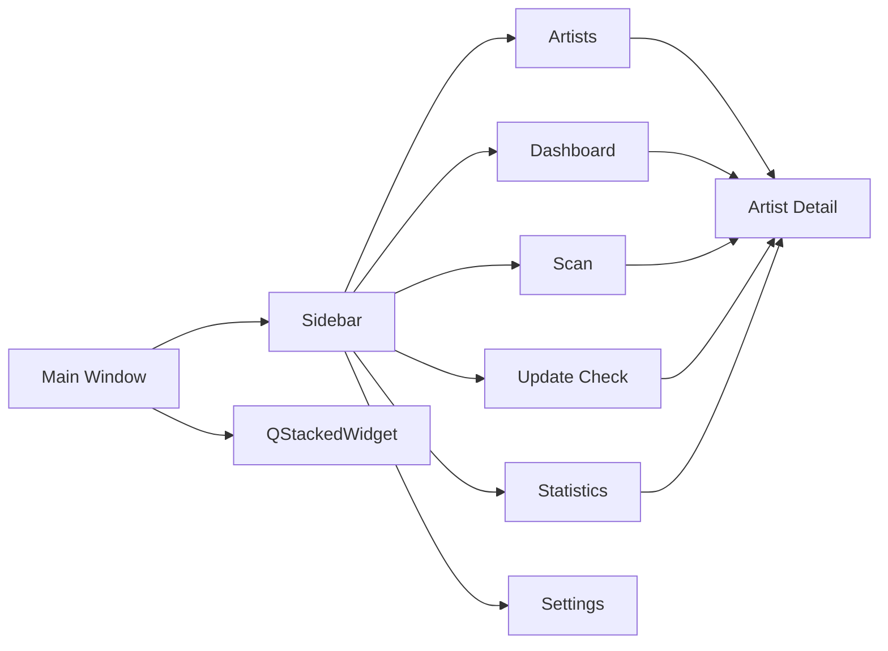

# UI 설계

## UI 기본 방향

<table>
<tr>
    <th>항목</th>
    <th>방향</th>
</tr>

<tr>
    <td>구조</td>
    <td>사이드바 + 페이지 전환 방식</td>
</tr>

<tr>
    <td>디자인</td>
    <td>관리 도구 중심의 단순하고 직관적인 UI</td>
</tr>

<tr>
    <td>조작 방식</td>
    <td>검색, 필터, 선택, 버튼 실행 중심</td>
</tr>

<tr>
    <td>화면 전환</td>
    <td>사이드바 메뉴 기반</td>
</tr>

<tr>
    <td>우선순위</td>
    <td>속도, 가독성, 유지보수성</td>
</tr>

</table>

---

# 전체 화면 구조



---

# 화면 구성

<table>
<tr>
    <th>화면</th>
    <th>설명</th>
</tr>

<tr>
    <td>Dashboard</td>
    <td>전체 통계, 최근 활동, 추천 정보 표시</td>
</tr>

<tr>
    <td>Scan</td>
    <td>Pixiv 폴더 스캔, 미리보기, 등록 및 결과 관리</td>
</tr>

<tr>
    <td>Artists</td>
    <td>작가 목록 조회, 필터, 정렬, 일괄 관리</td>
</tr>

<tr>
    <td>Artist Detail</td>
    <td>작가 상세 정보 조회 및 수정</td>
</tr>

<tr>
    <td>Update Check</td>
    <td>Pixiv 업데이트 확인 및 결과 관리</td>
</tr>

<tr>
    <td>Statistics</td>
    <td>통계 분석 및 데이터 품질 관리</td>
</tr>

<tr>
    <td>Settings</td>
    <td>프로그램 설정 및 데이터 관리</td>
</tr>

</table>

---

# Sidebar

<table>
<tr>
    <th>메뉴</th>
    <th>역할</th>
</tr>

<tr>
    <td>대시보드</td>
    <td>통계 및 추천 정보</td>
</tr>

<tr>
    <td>폴더 스캔</td>
    <td>폴더 등록, 갱신, 미리보기, 결과 관리</td>
</tr>

<tr>
    <td>작가 목록</td>
    <td>작가 관리</td>
</tr>

<tr>
    <td>업데이트 확인</td>
    <td>Pixiv 업데이트 확인</td>
</tr>

<tr>
    <td>통계 분석</td>
    <td>통계 및 데이터 품질 분석</td>
</tr>

<tr>
    <td>설정</td>
    <td>환경 설정 및 데이터 관리</td>
</tr>

</table>

---

# Dashboard 화면

## 구성 요소

<table>
<tr>
    <th>구성</th>
    <th>설명</th>
</tr>

<tr>
    <td>통계 카드</td>
    <td>전체 작가 수, 작품 수, 파일 수, 폴더 용량, 최근 스캔 일시 표시</td>
</tr>

<tr>
    <td>업데이트 현황</td>
    <td>상태 분포 및 누락 작품 통계 표시</td>
</tr>

<tr>
    <td>최근 활동</td>
    <td>최근 열람, 최근 등록, 최근 확인, 오류, 누락 증가 이력 표시</td>
</tr>

<tr>
    <td>TOP 랭킹</td>
    <td>작품 수, 파일 수, 폴더 용량 기준 랭킹 표시</td>
</tr>

<tr>
    <td>추천 작가</td>
    <td>고평점 작가 추천</td>
</tr>

<tr>
    <td>랜덤 작가</td>
    <td>무작위 작가 추천</td>
</tr>

</table>

---

## Dashboard 세부 구성

<table>
<tr>
    <th>영역</th>
    <th>설명</th>
</tr>

<tr>
    <td>통계 카드</td>
    <td>전체 작가 수, 전체 작품 수, 전체 파일 수, 전체 폴더 용량, 최근 스캔 일시 표시</td>
</tr>

<tr>
    <td>업데이트 현황</td>
    <td>최신, 업데이트 필요, 미확인, 오류 상태 분포 및 누락 작품 통계 표시</td>
</tr>

<tr>
    <td>최근 활동</td>
    <td>최근 열람, 최근 등록, 최근 확인, 오류, 누락 증가 탭 제공</td>
</tr>

<tr>
    <td>TOP 랭킹</td>
    <td>10 / 30 / 50 기준 랭킹 전환</td>
</tr>

<tr>
    <td>추천 작가</td>
    <td>평점, 작품 수, 파일 수 표시</td>
</tr>

<tr>
    <td>랜덤 작가</td>
    <td>Pixiv 바로가기, 폴더 바로가기 제공</td>
</tr>

<tr>
    <td>상세 페이지 연동</td>
    <td>최근 활동 및 랭킹 더블클릭 시 상세 페이지 이동</td>
</tr>

</table>

---

# Scan 화면

## 구성 요소

<table>
<tr>
    <th>구성</th>
    <th>설명</th>
</tr>

<tr>
    <td>폴더 선택</td>
    <td>루트 Pixiv 폴더 지정</td>
</tr>

<tr>
    <td>미리보기</td>
    <td>등록 전 결과 검토</td>
</tr>

<tr>
    <td>스캔 및 등록</td>
    <td>신규 등록 또는 기존 정보 갱신</td>
</tr>

<tr>
    <td>스캔 제어</td>
    <td>일시정지, 재개, 중지</td>
</tr>

<tr>
    <td>진행률 표시</td>
    <td>현재 진행 상태 표시</td>
</tr>

<tr>
    <td>진행 정보</td>
    <td>시작 시각, 실행 시간, 처리 속도 표시</td>
</tr>

<tr>
    <td>스캔 통계</td>
    <td>등록, 업데이트, 변경 없음, 실패 통계</td>
</tr>

<tr>
    <td>최근 스캔 정보</td>
    <td>직전 스캔 결과 표시</td>
</tr>

<tr>
    <td>미리보기 테이블</td>
    <td>예상 결과 목록 표시</td>
</tr>

<tr>
    <td>미리보기 필터</td>
    <td>결과 유형별 필터</td>
</tr>

<tr>
    <td>선택 항목 등록</td>
    <td>선택 항목만 등록</td>
</tr>

<tr>
    <td>결과 로그</td>
    <td>작업 로그 및 오류 표시</td>
</tr>

<tr>
    <td>결과 필터</td>
    <td>등록, 업데이트, 실패 등 필터링</td>
</tr>

<tr>
    <td>실패 항목 관리</td>
    <td>실패 항목 재시도</td>
</tr>

<tr>
    <td>CSV 저장</td>
    <td>결과 저장</td>
</tr>

</table>

---

## Scan 처리 흐름

```text
폴더 선택
→ 미리보기 생성
→ 선택 항목 검토
→ 스캔 실행
→ 결과 저장
→ 최근 스캔 이력 갱신
```

---

# Artists 화면

## 구성 요소

<table>
<tr>
    <th>구성</th>
    <th>설명</th>
</tr>

<tr>
    <td>검색창</td>
    <td>작가명 / Pixiv ID 검색</td>
</tr>

<tr>
    <td>평점 표시 전환</td>
    <td>별점 ↔ 숫자 전환</td>
</tr>

<tr>
    <td>새로고침</td>
    <td>작가 목록 갱신</td>
</tr>

<tr>
    <td>필터 영역</td>
    <td>평점, 즐겨찾기, 업데이트 필요, 미확인, 평점 미설정, 숨김 제외 필터</td>
</tr>

<tr>
    <td>일괄 작업 영역</td>
    <td>평점, 즐겨찾기, 숨김, 삭제, 복구 관리</td>
</tr>

<tr>
    <td>작가 테이블</td>
    <td>등록 작가 목록 표시</td>
</tr>

</table>

---

# Artist Table

## 컬럼 구조

<table>
<tr>
    <th>컬럼</th>
    <th>설명</th>
</tr>

<tr>
    <td>No</td>
    <td>순번</td>
</tr>

<tr>
    <td>즐겨찾기</td>
    <td>즐겨찾기 토글</td>
</tr>

<tr>
    <td>작가명</td>
    <td>작가 이름</td>
</tr>

<tr>
    <td>Pixiv ID</td>
    <td>Pixiv 사용자 ID</td>
</tr>

<tr>
    <td>작품 수</td>
    <td>로컬 작품 수</td>
</tr>

<tr>
    <td>파일 수</td>
    <td>실제 이미지 파일 수</td>
</tr>

<tr>
    <td>상태</td>
    <td>업데이트 상태 배지</td>
</tr>

<tr>
    <td>평점</td>
    <td>별 또는 숫자 표시</td>
</tr>

<tr>
    <td>태그</td>
    <td>상위 태그 표시</td>
</tr>

<tr>
    <td>최근 열람</td>
    <td>최근 상세 페이지 진입 시각</td>
</tr>

<tr>
    <td>메모</td>
    <td>작가 메모</td>
</tr>

<tr>
    <td>바로가기</td>
    <td>폴더 열기 / Pixiv 페이지 열기</td>
</tr>

</table>

---

# Artists 필터

<table>
<tr>
    <th>필터</th>
    <th>설명</th>
</tr>

<tr>
    <td>검색</td>
    <td>작가명 또는 Pixiv ID 기준 검색</td>
</tr>

<tr>
    <td>평점 필터</td>
    <td>평점 이상 또는 일치 조건 필터</td>
</tr>

<tr>
    <td>즐겨찾기</td>
    <td>즐겨찾기 작가만 표시</td>
</tr>

<tr>
    <td>업데이트 필요</td>
    <td>업데이트 필요 상태 작가만 표시</td>
</tr>

<tr>
    <td>미확인</td>
    <td>업데이트 미확인 작가만 표시</td>
</tr>

<tr>
    <td>평점 미설정</td>
    <td>평점이 없는 작가만 표시</td>
</tr>

<tr>
    <td>숨김 제외</td>
    <td>숨김 처리된 작가 제외</td>
</tr>

</table>

---

# Artists 일괄 작업

<table>
<tr>
    <th>작업</th>
    <th>설명</th>
</tr>

<tr>
    <td>선택 평점 변경</td>
    <td>선택 작가 평점 일괄 변경</td>
</tr>

<tr>
    <td>선택 즐겨찾기</td>
    <td>선택 작가 즐겨찾기 설정</td>
</tr>

<tr>
    <td>선택 즐겨찾기 해제</td>
    <td>선택 작가 즐겨찾기 해제</td>
</tr>

<tr>
    <td>선택 숨김</td>
    <td>선택 작가 숨김 설정</td>
</tr>

<tr>
    <td>선택 숨김 해제</td>
    <td>선택 작가 숨김 해제</td>
</tr>

<tr>
    <td>선택 삭제</td>
    <td>선택 작가 삭제</td>
</tr>

<tr>
    <td>삭제 작가 복구</td>
    <td>삭제 백업 기반 복구</td>
</tr>

</table>

---

# Artist Detail 화면

## 구성 요소

<table>
<tr>
    <th>구성</th>
    <th>설명</th>
</tr>

<tr>
    <td>기본 정보</td>
    <td>작가명, Pixiv ID, 상태, 최근 확인일, 최근 열람일 표시</td>
</tr>

<tr>
    <td>작품 정보</td>
    <td>작품 수, 파일 수, 폴더 상태 표시</td>
</tr>

<tr>
    <td>평점</td>
    <td>작가 평점 수정</td>
</tr>

<tr>
    <td>즐겨찾기</td>
    <td>즐겨찾기 설정 및 해제</td>
</tr>

<tr>
    <td>숨김</td>
    <td>숨김 설정 및 해제</td>
</tr>

<tr>
    <td>폴더 변경</td>
    <td>작가 저장 위치 변경 및 재스캔</td>
</tr>

<tr>
    <td>현재 작가 재스캔</td>
    <td>현재 작가 폴더 재분석</td>
</tr>

<tr>
    <td>현재 작가 업데이트 확인</td>
    <td>단일 작가 업데이트 확인</td>
</tr>

<tr>
    <td>Pixiv ID 복사</td>
    <td>Pixiv ID 복사</td>
</tr>

<tr>
    <td>폴더 경로 복사</td>
    <td>폴더 경로 복사</td>
</tr>

<tr>
    <td>최근 로컬 작품</td>
    <td>최근 저장 작품 표시</td>
</tr>

<tr>
    <td>누락 작품</td>
    <td>Pixiv 대비 누락 작품 표시</td>
</tr>

<tr>
    <td>업데이트 이력</td>
    <td>업데이트 결과 변화 추적</td>
</tr>

<tr>
    <td>태그 관리</td>
    <td>태그 조회 및 수정</td>
</tr>

<tr>
    <td>메모 관리</td>
    <td>장문 메모 저장</td>
</tr>

<tr>
    <td>바로가기</td>
    <td>Pixiv 및 폴더 이동</td>
</tr>

<tr>
    <td>뒤로가기</td>
    <td>진입 이전 페이지 복귀</td>
</tr>

</table>

---

## Artist Detail 레이아웃

```text id="o7q3q2"
QScrollArea
 └─ Artist Detail Container
     ├─ 기본 정보
     ├─ 작품 정보
     ├─ 최근 로컬 작품
     ├─ 누락 작품
     ├─ 태그 관리
     ├─ 업데이트 이력
     ├─ 메모
     └─ 바로가기
```

---

## 최근 로컬 작품 영역

<table>
<tr>
    <th>항목</th>
    <th>설명</th>
</tr>

<tr>
    <td>작품 ID</td>
    <td>작품 식별 번호 표시</td>
</tr>

<tr>
    <td>Pixiv 열기</td>
    <td>Pixiv 작품 페이지 이동</td>
</tr>

<tr>
    <td>복사</td>
    <td>작품 ID 복사</td>
</tr>

</table>

---

## 누락 작품 영역

<table>
<tr>
    <th>항목</th>
    <th>설명</th>
</tr>

<tr>
    <td>작품 ID</td>
    <td>누락 작품 표시</td>
</tr>

<tr>
    <td>Pixiv 열기</td>
    <td>Pixiv 작품 페이지 이동</td>
</tr>

<tr>
    <td>전체 복사</td>
    <td>누락 작품 ID 전체 복사</td>
</tr>

</table>

---

## 업데이트 이력 영역

<table>
<tr>
    <th>항목</th>
    <th>설명</th>
</tr>

<tr>
    <td>확인 시각</td>
    <td>업데이트 확인 시각</td>
</tr>

<tr>
    <td>결과</td>
    <td>최신, 업데이트 필요, 오류 등</td>
</tr>

<tr>
    <td>로컬 작품 수</td>
    <td>확인 시점 로컬 작품 수</td>
</tr>

<tr>
    <td>Pixiv 작품 수</td>
    <td>확인 시점 Pixiv 작품 수</td>
</tr>

<tr>
    <td>누락 작품 수</td>
    <td>누락 작품 수</td>
</tr>

<tr>
    <td>변화량</td>
    <td>직전 결과 대비 변화량</td>
</tr>

<tr>
    <td>신규 / 해결</td>
    <td>신규 누락 및 해결 작품 수</td>
</tr>

</table>

---

# Update Check 페이지

## 구성 요소

<table>
<tr>
    <th>구성</th>
    <th>설명</th>
</tr>

<tr>
    <td>작가 목록</td>
    <td>업데이트 확인 대상 표시</td>
</tr>

<tr>
    <td>선택 영역</td>
    <td>전체 선택 및 조건 선택</td>
</tr>

<tr>
    <td>실행 옵션</td>
    <td>최근 확인 제외 조건 설정</td>
</tr>

<tr>
    <td>진행률</td>
    <td>현재 진행 상태 표시</td>
</tr>

<tr>
    <td>결과 요약</td>
    <td>결과 집계 표시</td>
</tr>

<tr>
    <td>결과 로그</td>
    <td>업데이트 결과 출력</td>
</tr>

<tr>
    <td>시작</td>
    <td>업데이트 확인 시작</td>
</tr>

<tr>
    <td>일시정지</td>
    <td>현재 작업 완료 후 정지</td>
</tr>

<tr>
    <td>재개</td>
    <td>일시정지 위치부터 재개</td>
</tr>

<tr>
    <td>중단</td>
    <td>작업 취소</td>
</tr>

<tr>
    <td>CSV 저장</td>
    <td>결과 내보내기</td>
</tr>

</table>

---

## 처리 흐름

```text id="4gt5w5"
작가 선택
→ 업데이트 확인
→ 결과 저장
→ 결과 비교
→ 로그 출력
→ CSV 저장
→ 이력 조회
```

---

# Statistics 페이지

## 구성 요소

<table>
<tr>
    <th>구성</th>
    <th>설명</th>
</tr>

<tr>
    <td>기초 통계</td>
    <td>전체 작가 수, 작품 수, 파일 수, 저장 용량, 평균 정보 표시</td>
</tr>

<tr>
    <td>데이터 품질 분석</td>
    <td>태그, 메모, 평점, 폴더 상태 분석</td>
</tr>

<tr>
    <td>상태 분포</td>
    <td>업데이트 상태 분포 표시</td>
</tr>

<tr>
    <td>평점 분포</td>
    <td>평점 구간별 분포 표시</td>
</tr>

<tr>
    <td>작품 수 TOP</td>
    <td>작품 수 기준 상위 작가 표시</td>
</tr>

<tr>
    <td>파일 수 TOP</td>
    <td>파일 수 기준 상위 작가 표시</td>
</tr>

<tr>
    <td>저장 용량 TOP</td>
    <td>저장 용량 기준 상위 작가 표시</td>
</tr>

<tr>
    <td>태그 분석</td>
    <td>상위 태그 사용 통계 표시</td>
</tr>

</table>


---

## 기초 통계

<table>
<tr>
    <th>항목</th>
    <th>설명</th>
</tr>

<tr>
    <td>전체 작가 수</td>
    <td>등록된 전체 작가 수</td>
</tr>

<tr>
    <td>전체 작품 수</td>
    <td>등록된 전체 작품 수</td>
</tr>

<tr>
    <td>전체 파일 수</td>
    <td>등록된 전체 파일 수</td>
</tr>

<tr>
    <td>전체 저장 용량</td>
    <td>전체 폴더 용량 합계</td>
</tr>

<tr>
    <td>평균 평점</td>
    <td>등록 작가 평균 평점</td>
</tr>

<tr>
    <td>평균 작품 수</td>
    <td>작가당 평균 작품 수</td>
</tr>

<tr>
    <td>평균 파일 수</td>
    <td>작가당 평균 파일 수</td>
</tr>

<tr>
    <td>평균 저장 용량</td>
    <td>작가당 평균 저장 용량</td>
</tr>

<tr>
    <td>즐겨찾기 작가 수</td>
    <td>즐겨찾기 등록 작가 수</td>
</tr>

<tr>
    <td>즐겨찾기 평균 평점</td>
    <td>즐겨찾기 작가 평균 평점</td>
</tr>

</table>

---

## 데이터 품질 분석

<table>
<tr>
    <th>항목</th>
    <th>설명</th>
</tr>

<tr>
    <td>태그 보유 비율</td>
    <td>태그가 등록된 작가 비율</td>
</tr>

<tr>
    <td>메모 작성 비율</td>
    <td>메모가 작성된 작가 비율</td>
</tr>

<tr>
    <td>평점 설정 비율</td>
    <td>평점이 설정된 작가 비율</td>
</tr>

<tr>
    <td>폴더 오류 비율</td>
    <td>존재하지 않는 폴더 비율</td>
</tr>

</table>

---

## Artist Detail 레이아웃

```text id="o7q3q2"
QScrollArea
 └─ Artist Detail Container
     ├─ 기본 정보
     ├─ 작품 정보
     ├─ 최근 로컬 작품
     ├─ 누락 작품
     ├─ 태그 관리
     ├─ 업데이트 이력
     ├─ 메모
     └─ 바로가기
```

---

## 최근 로컬 작품 영역

<table>
<tr>
    <th>항목</th>
    <th>설명</th>
</tr>

<tr>
    <td>작품 ID</td>
    <td>작품 식별 번호 표시</td>
</tr>

<tr>
    <td>Pixiv 열기</td>
    <td>Pixiv 작품 페이지 이동</td>
</tr>

<tr>
    <td>복사</td>
    <td>작품 ID 복사</td>
</tr>

</table>

---

## 누락 작품 영역

<table>
<tr>
    <th>항목</th>
    <th>설명</th>
</tr>

<tr>
    <td>작품 ID</td>
    <td>누락 작품 표시</td>
</tr>

<tr>
    <td>Pixiv 열기</td>
    <td>Pixiv 작품 페이지 이동</td>
</tr>

<tr>
    <td>전체 복사</td>
    <td>누락 작품 ID 전체 복사</td>
</tr>

</table>

---

## 업데이트 이력 영역

<table>
<tr>
    <th>항목</th>
    <th>설명</th>
</tr>

<tr>
    <td>확인 시각</td>
    <td>업데이트 확인 시각</td>
</tr>

<tr>
    <td>결과</td>
    <td>최신, 업데이트 필요, 오류 등</td>
</tr>

<tr>
    <td>로컬 작품 수</td>
    <td>확인 시점 로컬 작품 수</td>
</tr>

<tr>
    <td>Pixiv 작품 수</td>
    <td>확인 시점 Pixiv 작품 수</td>
</tr>

<tr>
    <td>누락 작품 수</td>
    <td>누락 작품 수</td>
</tr>

<tr>
    <td>변화량</td>
    <td>직전 결과 대비 변화량</td>
</tr>

<tr>
    <td>신규 / 해결</td>
    <td>신규 누락 및 해결 작품 수</td>
</tr>

</table>

---

# Update Check 페이지

## 구성 요소

<table>
<tr>
    <th>구성</th>
    <th>설명</th>
</tr>

<tr>
    <td>작가 목록</td>
    <td>업데이트 확인 대상 표시</td>
</tr>

<tr>
    <td>선택 영역</td>
    <td>전체 선택 및 조건 선택</td>
</tr>

<tr>
    <td>실행 옵션</td>
    <td>최근 확인 제외 조건 설정</td>
</tr>

<tr>
    <td>진행률</td>
    <td>현재 진행 상태 표시</td>
</tr>

<tr>
    <td>결과 요약</td>
    <td>결과 집계 표시</td>
</tr>

<tr>
    <td>결과 로그</td>
    <td>업데이트 결과 출력</td>
</tr>

<tr>
    <td>시작</td>
    <td>업데이트 확인 시작</td>
</tr>

<tr>
    <td>일시정지</td>
    <td>현재 작업 완료 후 정지</td>
</tr>

<tr>
    <td>재개</td>
    <td>일시정지 위치부터 재개</td>
</tr>

<tr>
    <td>중단</td>
    <td>작업 취소</td>
</tr>

<tr>
    <td>CSV 저장</td>
    <td>결과 내보내기</td>
</tr>

</table>

---

## 처리 흐름

```text id="4gt5w5"
작가 선택
→ 업데이트 확인
→ 결과 저장
→ 결과 비교
→ 로그 출력
→ CSV 저장
→ 이력 조회
```

---

# Statistics 페이지

## 구성 요소

<table>
<tr>
    <th>구성</th>
    <th>설명</th>
</tr>

<tr>
    <td>기초 통계</td>
    <td>전체 작가 수, 작품 수, 파일 수, 저장 용량, 평균 정보 표시</td>
</tr>

<tr>
    <td>데이터 품질 분석</td>
    <td>태그, 메모, 평점, 폴더 상태 분석</td>
</tr>

<tr>
    <td>상태 분포</td>
    <td>업데이트 상태 분포 표시</td>
</tr>

<tr>
    <td>평점 분포</td>
    <td>평점 구간별 분포 표시</td>
</tr>

<tr>
    <td>작품 수 TOP</td>
    <td>작품 수 기준 상위 작가 표시</td>
</tr>

<tr>
    <td>파일 수 TOP</td>
    <td>파일 수 기준 상위 작가 표시</td>
</tr>

<tr>
    <td>저장 용량 TOP</td>
    <td>저장 용량 기준 상위 작가 표시</td>
</tr>

<tr>
    <td>태그 분석</td>
    <td>상위 태그 사용 통계 표시</td>
</tr>

</table>

---

## Statistics 레이아웃

```text id="nghlg4"
┌─────────────────────────────┬─────────────┐
│                             │ 데이터 품질 │
│     기초 통계 (5 × 2)        ├─────────────┤
│                             │ 상태 분포   │
├───────────────┬─────────────┼─────────────┤
│               │             │ 평점 분포   │
│ 작품/파일/용량 │ 태그 분석   │             │
│ TOP 랭킹      │             │             │
│               │             │             │
└───────────────┴─────────────┴─────────────┘
```

---

## 기초 통계

<table>
<tr>
    <th>항목</th>
    <th>설명</th>
</tr>

<tr>
    <td>전체 작가 수</td>
    <td>등록된 전체 작가 수</td>
</tr>

<tr>
    <td>전체 작품 수</td>
    <td>등록된 전체 작품 수</td>
</tr>

<tr>
    <td>전체 파일 수</td>
    <td>등록된 전체 파일 수</td>
</tr>

<tr>
    <td>전체 저장 용량</td>
    <td>전체 폴더 용량 합계</td>
</tr>

<tr>
    <td>평균 평점</td>
    <td>등록 작가 평균 평점</td>
</tr>

<tr>
    <td>평균 작품 수</td>
    <td>작가당 평균 작품 수</td>
</tr>

<tr>
    <td>평균 파일 수</td>
    <td>작가당 평균 파일 수</td>
</tr>

<tr>
    <td>평균 저장 용량</td>
    <td>작가당 평균 저장 용량</td>
</tr>

<tr>
    <td>즐겨찾기 작가 수</td>
    <td>즐겨찾기 등록 작가 수</td>
</tr>

<tr>
    <td>즐겨찾기 평균 평점</td>
    <td>즐겨찾기 작가 평균 평점</td>
</tr>

</table>

---

## 데이터 품질 분석

<table>
<tr>
    <th>항목</th>
    <th>설명</th>
</tr>

<tr>
    <td>태그 보유 비율</td>
    <td>태그가 등록된 작가 비율</td>
</tr>

<tr>
    <td>메모 작성 비율</td>
    <td>메모가 작성된 작가 비율</td>
</tr>

<tr>
    <td>평점 설정 비율</td>
    <td>평점이 설정된 작가 비율</td>
</tr>

<tr>
    <td>폴더 오류 비율</td>
    <td>존재하지 않는 폴더 비율</td>
</tr>

</table>
