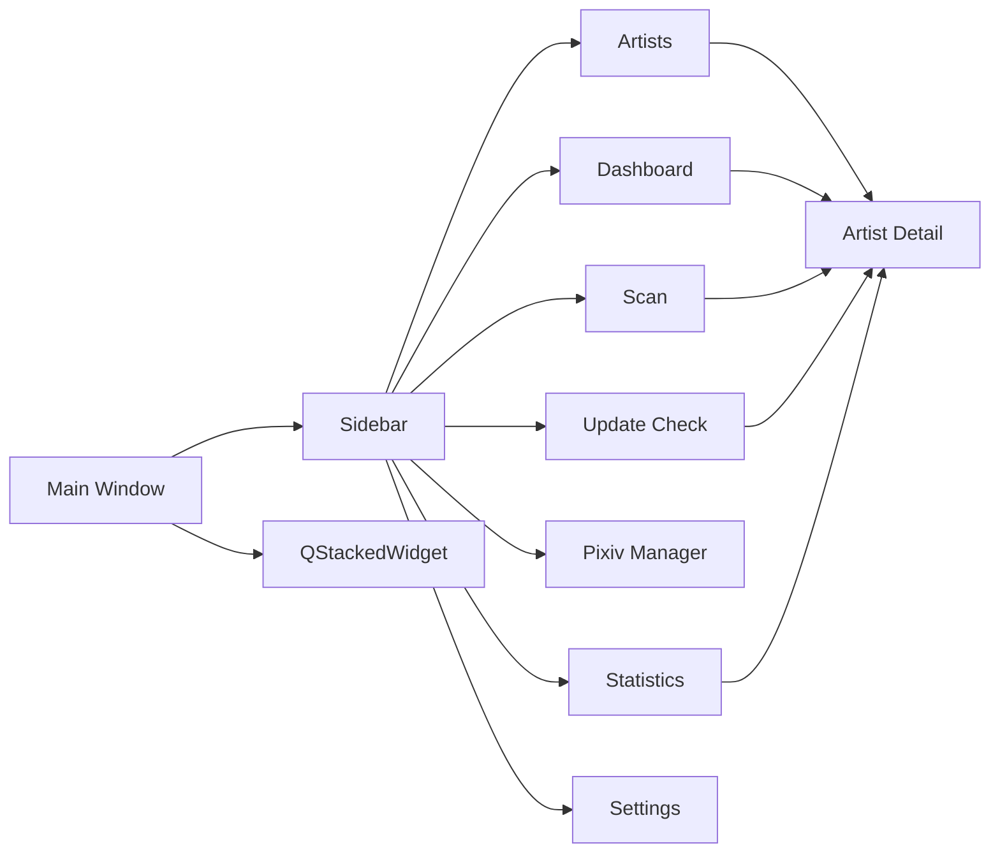
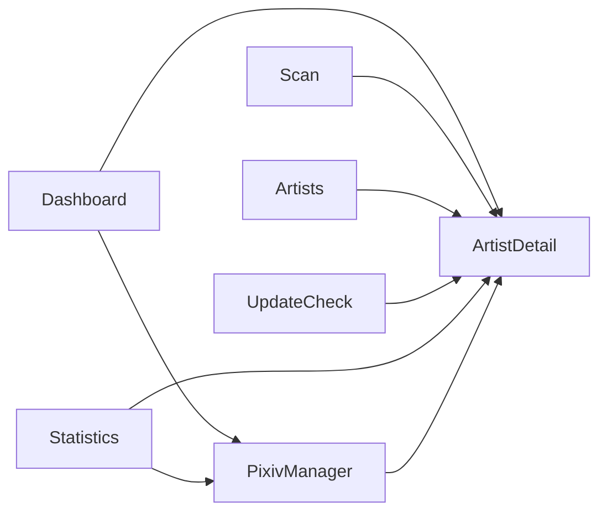

# UI 설계

## UI 기본 방향

<table>
<tr>
    <th>항목</th>
    <th>방향</th>
</tr>

<tr>
    <td>구조</td>
    <td>사이드바 + 페이지 전환 방식</td>
</tr>

<tr>
    <td>디자인</td>
    <td>관리 도구 중심의 단순하고 직관적인 UI</td>
</tr>

<tr>
    <td>조작 방식</td>
    <td>검색, 필터, 선택, 버튼 실행 중심</td>
</tr>

<tr>
    <td>화면 전환</td>
    <td>사이드바 메뉴 기반</td>
</tr>

<tr>
    <td>우선순위</td>
    <td>속도, 가독성, 유지보수성</td>
</tr>

</table>

---

# 전체 화면 구조



---

# 화면 구성

<table>
<tr>
    <th>화면</th>
    <th>설명</th>
</tr>

<tr>
    <td>Dashboard</td>
    <td>전체 통계, 최근 활동, 추천 정보 표시</td>
</tr>

<tr>
    <td>Scan</td>
    <td>Pixiv 폴더 스캔, 미리보기, 등록 및 결과 관리</td>
</tr>

<tr>
    <td>Update Check</td>
    <td>Pixiv 업데이트 확인 및 결과 관리</td>
</tr>

<tr>
    <td>Artists</td>
    <td>작가 목록 조회, 필터, 정렬, 일괄 관리</td>
</tr>

<tr>
    <td>Artist Detail</td>
    <td>작가 상세 정보 조회 및 수정</td>
</tr>

<tr>
    <td>Pixiv Manager</td>
    <td>Pixiv 팔로우 유저 및 북마크 작품 관리</td>
</tr>

<tr>
    <td>Statistics</td>
    <td>통계 분석 및 데이터 품질 관리</td>
</tr>

<tr>
    <td>Settings</td>
    <td>프로그램 설정 및 데이터 관리</td>
</tr>

</table>

---

# Sidebar

<table>
<tr>
    <th>메뉴</th>
    <th>역할</th>
</tr>

<tr>
    <td>대시보드</td>
    <td>통계 및 추천 정보</td>
</tr>

<tr>
    <td>폴더 스캔</td>
    <td>폴더 등록, 갱신, 미리보기, 결과 관리</td>
</tr>

<tr>
    <td>업데이트 확인</td>
    <td>Pixiv 업데이트 확인</td>
</tr>

<tr>
    <td>작가 목록</td>
    <td>로컬 작가 관리</td>
</tr>

<tr>
    <td>Pixiv 관리</td>
    <td>Pixiv 팔로우 유저 및 북마크 작품 관리</td>
</tr>

<tr>
    <td>통계 분석</td>
    <td>통계 및 데이터 품질 분석</td>
</tr>

<tr>
    <td>설정</td>
    <td>환경 설정 및 데이터 관리</td>
</tr>

</table>

---

# Dashboard 화면

<table>
<tr>
    <th>구성</th>
    <th>설명</th>
</tr>

<tr>
    <td>통계 카드</td>
    <td>전체 작가 수, 전체 작품 수, 전체 파일 수, 전체 저장 용량, 최근 스캔 일시 표시</td>
</tr>

<tr>
    <td>업데이트 현황</td>
    <td>최신, 업데이트 필요, 미확인, 오류 상태 분포 및 누락 작품 통계 표시</td>
</tr>

<tr>
    <td>최근 활동</td>
    <td>최근 열람, 최근 등록, 최근 확인, 오류, 누락 증가 탭 제공</td>
</tr>

<tr>
    <td>추천 작가</td>
    <td>평점 기반 추천 작가 표시</td>
</tr>

<tr>
    <td>랜덤 작가</td>
    <td>랜덤 작가 표시 및 Pixiv / 폴더 바로가기 제공</td>
</tr>

<tr>
    <td>상세 페이지 연동</td>
    <td>최근 활동, 추천 작가, 랜덤 작가 선택 시 상세 페이지 이동</td>
</tr>

</table>

---

# Scan 화면

<table>
<tr>
    <th>구성</th>
    <th>설명</th>
</tr>

<tr>
    <td>폴더 선택</td>
    <td>루트 Pixiv 폴더 지정</td>
</tr>

<tr>
    <td>미리보기</td>
    <td>등록 전 결과 검토</td>
</tr>

<tr>
    <td>미리보기 테이블</td>
    <td>예상 결과 목록 표시</td>
</tr>

<tr>
    <td>선택 항목 등록</td>
    <td>선택 항목만 등록</td>
</tr>

<tr>
    <td>스캔 실행</td>
    <td>신규 등록 또는 기존 정보 갱신</td>
</tr>

<tr>
    <td>일시정지</td>
    <td>현재 작업 완료 후 정지</td>
</tr>

<tr>
    <td>재개</td>
    <td>중단 위치부터 이어서 진행</td>
</tr>

<tr>
    <td>중지</td>
    <td>현재 스캔 작업 중지</td>
</tr>

<tr>
    <td>진행률 표시</td>
    <td>현재 진행 상태 표시</td>
</tr>

<tr>
    <td>스캔 통계</td>
    <td>등록, 업데이트, 변경 없음, 실패 통계 표시</td>
</tr>

<tr>
    <td>비작품 파일 통계</td>
    <td>작품으로 분류되지 않은 파일 통계 표시</td>
</tr>

<tr>
    <td>실패 항목 재시도</td>
    <td>실패 항목만 다시 스캔</td>
</tr>

<tr>
    <td>결과 로그</td>
    <td>작업 로그 및 오류 표시</td>
</tr>

<tr>
    <td>CSV 저장</td>
    <td>스캔 결과 저장</td>
</tr>

</table>

---

# Update Check 화면

<table>
<tr>
    <th>구성</th>
    <th>설명</th>
</tr>

<tr>
    <td>작가 선택</td>
    <td>전체 또는 선택 작가 대상 업데이트 확인</td>
</tr>

<tr>
    <td>자동 선택</td>
    <td>업데이트 필요, 미확인 작가 자동 선택</td>
</tr>

<tr>
    <td>업데이트 실행</td>
    <td>Pixiv 최신 작품 확인</td>
</tr>

<tr>
    <td>최근 확인 스킵</td>
    <td>최근 확인된 작가 제외</td>
</tr>

<tr>
    <td>PHPSESSID 테스트</td>
    <td>Pixiv 세션 유효성 검사</td>
</tr>

<tr>
    <td>일시정지 / 재개</td>
    <td>작업 제어</td>
</tr>

<tr>
    <td>결과 로그</td>
    <td>진행 과정 및 오류 표시</td>
</tr>

<tr>
    <td>결과 요약</td>
    <td>최신, 업데이트 필요, 오류 결과 집계</td>
</tr>

<tr>
    <td>누락 작품 계산</td>
    <td>로컬 누락 작품 수 계산</td>
</tr>

<tr>
    <td>결과 비교</td>
    <td>이전 결과와 현재 결과 비교</td>
</tr>

<tr>
    <td>업데이트 이력 저장</td>
    <td>업데이트 결과 저장</td>
</tr>

<tr>
    <td>CSV 저장</td>
    <td>결과 내보내기</td>
</tr>

</table>

---

# Artists 화면

<table>
<tr>
    <th>구성</th>
    <th>설명</th>
</tr>

<tr>
    <td>작가 목록</td>
    <td>등록된 작가 목록 표시</td>
</tr>

<tr>
    <td>검색</td>
    <td>전체, 작가명, Pixiv ID, 태그 검색</td>
</tr>

<tr>
    <td>필터</td>
    <td>평점, 즐겨찾기, 상태 기준 필터링</td>
</tr>

<tr>
    <td>정렬</td>
    <td>다중 정렬 지원</td>
</tr>

<tr>
    <td>우클릭 메뉴</td>
    <td>평점 변경, 즐겨찾기, 삭제 기능 제공</td>
</tr>

<tr>
    <td>삭제 및 복구</td>
    <td>자동 백업 및 복구 지원</td>
</tr>

<tr>
    <td>상세 페이지 이동</td>
    <td>더블클릭으로 이동</td>
</tr>

</table>

---

# Artist Detail 화면

<table>
<tr>
    <th>구성</th>
    <th>설명</th>
</tr>

<tr>
    <td>기본 정보</td>
    <td>작가명, Pixiv ID, 상태, 평점 표시</td>
</tr>

<tr>
    <td>폴더 정보</td>
    <td>경로, 작품 수, 파일 수, 저장 용량 표시</td>
</tr>

<tr>
    <td>메모 관리</td>
    <td>메모, 참고 링크, 다운로드 메모 관리</td>
</tr>

<tr>
    <td>태그 관리</td>
    <td>태그 추가, 삭제, 정리</td>
</tr>

<tr>
    <td>최근 로컬 작품</td>
    <td>최근 로컬 작품 표시</td>
</tr>

<tr>
    <td>누락 작품</td>
    <td>Pixiv에는 존재하지만 로컬에 없는 작품 표시</td>
</tr>

<tr>
    <td>업데이트 이력</td>
    <td>업데이트 결과 이력 표시</td>
</tr>

<tr>
    <td>Pixiv ID 복사</td>
    <td>클립보드 복사 기능 제공</td>
</tr>

<tr>
    <td>Pixiv 바로가기</td>
    <td>작가 Pixiv 페이지 이동</td>
</tr>

<tr>
    <td>폴더 바로가기</td>
    <td>작가 폴더 열기</td>
</tr>

<tr>
    <td>작업 기능</td>
    <td>재스캔, 업데이트 확인, 경로 변경 지원</td>
</tr>

<tr>
    <td>상태 메시지</td>
    <td>저장, 재스캔, 업데이트 완료 메시지 표시</td>
</tr>

</table>


---

# Pixiv Manager 화면

<table>
<tr>
    <th>구성</th>
    <th>설명</th>
</tr>

<tr>
    <td>팔로우 유저 관리</td>
    <td>팔로우 유저 목록 조회 및 관리</td>
</tr>

<tr>
    <td>북마크 작품 관리</td>
    <td>북마크 작품 목록 조회 및 관리</td>
</tr>

<tr>
    <td>파일 가져오기</td>
    <td>TXT, CSV 데이터 가져오기</td>
</tr>

<tr>
    <td>중복 제거</td>
    <td>이미 저장된 Pixiv ID 자동 제외</td>
</tr>

<tr>
    <td>로컬 작가 매칭</td>
    <td>등록된 작가와 자동 연결</td>
</tr>

<tr>
    <td>Pixiv 메타데이터 수집</td>
    <td>작가 및 작품 정보 수집</td>
</tr>

<tr>
    <td>태그 동기화</td>
    <td>Pixiv 태그 정보 수집 및 저장</td>
</tr>

<tr>
    <td>AI 작품 관리</td>
    <td>AI 생성 작품 여부 저장</td>
</tr>

<tr>
    <td>결과 로그</td>
    <td>동기화 로그 표시</td>
</tr>

<tr>
    <td>통계 카드</td>
    <td>팔로우 수, 북마크 수, 로컬 매칭 수 표시</td>
</tr>

</table>

---

# Statistics 화면

<table>
<tr>
    <th>구성</th>
    <th>설명</th>
</tr>

<tr>
    <td>요약 통계</td>
    <td>작가 수, 작품 수, 파일 수, 저장 용량 표시</td>
</tr>

<tr>
    <td>Pixiv 통계</td>
    <td>팔로우 수, 북마크 수 표시</td>
</tr>

<tr>
    <td>즐겨찾기 통계</td>
    <td>즐겨찾기 작가 수 및 평균 평점 표시</td>
</tr>

<tr>
    <td>상태 분포</td>
    <td>업데이트 상태 분포 분석</td>
</tr>

<tr>
    <td>평점 분포</td>
    <td>평점 통계 분석</td>
</tr>

<tr>
    <td>TOP 랭킹</td>
    <td>작품 수, 파일 수, 저장 용량 TOP 분석</td>
</tr>

<tr>
    <td>랭킹 이동</td>
    <td>더블클릭 시 Pixiv 작가 페이지 이동</td>
</tr>

<tr>
    <td>태그 분석</td>
    <td>태그 사용 현황 분석</td>
</tr>

<tr>
    <td>태그 검색</td>
    <td>더블클릭 시 원문 태그 기준 Pixiv 검색</td>
</tr>

<tr>
    <td>태그 보유 작가 이동</td>
    <td>더블클릭 시 Pixiv 작가 페이지 이동</td>
</tr>

<tr>
    <td>품질 분석</td>
    <td>태그, 메모, 평점 작성률 분석</td>
</tr>

<tr>
    <td>주간 변화</td>
    <td>주간별 누락 작품 증가량 분석</td>
</tr>

<tr>
    <td>해결 작품 변화</td>
    <td>주간별 해결 작품 증가량 분석</td>
</tr>

<tr>
    <td>저장 용량 변화</td>
    <td>주간별 저장 용량 증가량 분석</td>
</tr>

</table>

---

# Artist Table

## 컬럼 구성

```text
No
즐겨찾기
작가명
Pixiv ID
작품 수
파일 수
저장 용량
누락 작품 수
상태
평점
태그
수정일
최근 열람
메모
바로가기
```

---

## 특징

* 다중 정렬 지원
* 검색 조건 선택 지원
* 평점 필터 지원
* 즐겨찾기 표시
* 상태 배지 표시
* 평점 즉시 수정
* 상위 3개 태그 표시
* 저장 용량 표시
* 누락 작품 수 표시
* 수정일 표시
* 최근 열람 시각 표시
* Pixiv 및 폴더 바로가기 제공
* 우클릭 메뉴 제공
* 더블클릭 상세 이동 지원

---

# Settings 화면

<table>
<tr>
    <th>구성</th>
    <th>설명</th>
</tr>

<tr>
    <td>폴더 설정</td>
    <td>Pixiv 루트 폴더 설정</td>
</tr>

<tr>
    <td>Pixiv 세션 설정</td>
    <td>PHPSESSID 저장 및 테스트</td>
</tr>

<tr>
    <td>업데이트 요청 설정</td>
    <td>요청 간격, 배치 휴식 설정</td>
</tr>

<tr>
    <td>Pixiv 관리 요청 설정</td>
    <td>동기화 요청 간격 설정</td>
</tr>

<tr>
    <td>데이터베이스 관리</td>
    <td>백업, 복원, 무결성 검사, 최적화</td>
</tr>

<tr>
    <td>설정 관리</td>
    <td>설정 백업 및 복원</td>
</tr>

<tr>
    <td>로그 관리</td>
    <td>실행 로그 및 업데이트 로그 조회 / 삭제</td>
</tr>

<tr>
    <td>창 위치 관리</td>
    <td>창 위치 저장 및 화면 밖 자동 복구</td>
</tr>

<tr>
    <td>프로그램 정보</td>
    <td>버전 및 시스템 정보 표시</td>
</tr>

</table>

---
# 페이지 연동 흐름



---

# 데이터 관리

## 백업

```text
데이터베이스 백업
삭제 작가 백업
설정 백업
```

---

## 복원

```text
데이터베이스 복원
삭제 작가 복원
설정 복원
```

---

## 내보내기

```text
작가 목록 CSV
스캔 결과 CSV
스캔 미리보기 CSV
업데이트 결과 CSV
비작품 파일 목록
```

---

## 로그 관리

```text
실행 로그
업데이트 로그
동기화 로그
로그 조회
로그 삭제
로그 폴더 열기
```

---

# 프로그램 정보

설정 페이지에서 다음 정보를 확인할 수 있다.

```text
프로그램 버전
데이터베이스 경로
데이터베이스 크기
전체 작가 수
전체 작품 수
전체 파일 수
전체 저장 용량
최근 백업 정보
로그 정보
Pixiv 설정 상태
```

---

# UI 공통 규칙

## 1. 페이지 분리

각 기능은 독립 Page로 구성한다.

```text
Dashboard
Scan
Update Check
Artists
Artist Detail
Pixiv Manager
Statistics
Settings
```

---

## 2. 액션 분리

화면 이벤트 처리는 Actions 계층으로 분리한다.

```text
Page
→ Actions
→ Action Parts
```

---

## 3. UI 영역 분리

복잡한 화면은 Section 단위로 분리한다.

```text
Page
→ Sections
→ Section Parts
```

---

## 4. Worker 분리

장시간 작업은 Worker에서 처리한다.

```text
Page
→ Worker
→ Worker Parts
```

---

## 5. 서비스 계층 사용

UI는 직접 데이터베이스에 접근하지 않는다.

```text
UI
→ Service
→ Repository
→ Database
```

---

## 6. 공통 위젯 사용

재사용 가능한 UI 요소는 Widget으로 분리한다.

```text
Sidebar
StatusBadge
ArtistTable
```

---

## 7. 팝업 최소화

단순 완료 알림은 가능하면 화면 내부 상태 메시지로 표시한다.

```text
저장 완료
재스캔 완료
업데이트 확인 완료
복사 완료
```

오류, 경고, 삭제 확인처럼 사용자의 판단이 필요한 경우에만 팝업을 사용한다.

---

## 8. 테이블 상호작용

테이블은 화면 목적에 따라 더블클릭, 우클릭 메뉴, 바로가기 버튼을 제공한다.

```text
더블클릭
→ 상세 페이지 이동
→ Pixiv 페이지 이동
→ Pixiv 태그 검색

우클릭 메뉴
→ 평점 변경
→ 즐겨찾기 설정 / 해제
→ 삭제
```

---

## 9. 외부 링크 처리

Pixiv 작가, 작품, 태그 검색 페이지는 기본 브라우저에서 연다.

```text
작가
→ https://www.pixiv.net/users/{pixiv_id}

작품
→ https://www.pixiv.net/artworks/{artwork_id}

태그
→ https://www.pixiv.net/tags/{tag}/artworks
```

---

## 10. 상태 메시지

작업 완료 또는 복사 완료처럼 즉시 확인 가능한 결과는 화면 내부 메시지로 표시한다.

```text
상태: 저장 완료
상태: 재스캔 완료
상태: 업데이트 확인 완료
상태: Pixiv ID 복사 완료
상태: 폴더 경로 복사 완료
```

---

# 버전 기준

본 문서는 v0.17.0 (추가 기능 개발 완료) 기준으로 작성되었다.

Pixiv 관리 시스템, Pixiv 메타데이터 연동 기능, 통계 분석 기능, 업데이트 이력 기능, 로그 관리 기능, 주간 변화 분석 기능이 포함된 UI 구조를 설명한다.
