# 시스템 아키텍처 (Architecture)

## 아키텍처 개요

Pixiv Local Manager는 계층형 아키텍처(Layered Architecture)를 사용한다.

각 계층은 자신의 책임만 수행하며 상위 계층은 하위 계층을 통해 기능을 수행한다.

UI는 직접 데이터베이스에 접근하지 않으며 Service 계층을 통해 데이터를 처리한다.

```text
UI
→ Service
→ Repository
→ Database
```

---

# 전체 구조

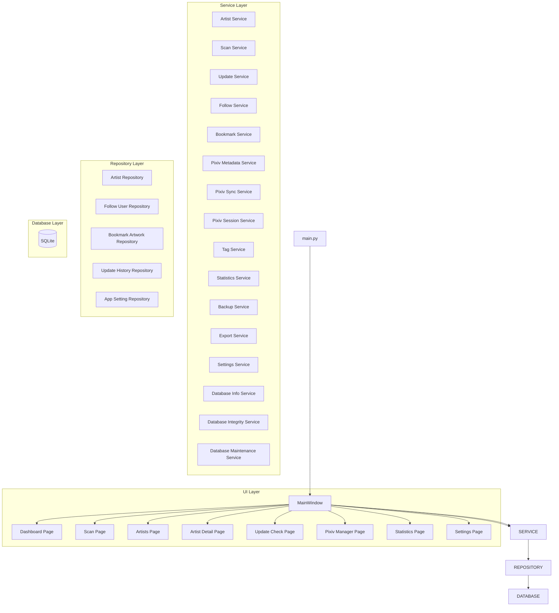

---

# 계층 구조

## Layer 1 - Presentation Layer

사용자 인터페이스를 담당한다.

### 구성

```text
ui/
│
├─ dialogs
├─ pages
├─ widgets
├─ main_window.py
└─ __init__.py
```

### 역할

* 사용자 입력 처리
* 화면 표시
* 페이지 이동
* 진행률 표시
* 결과 출력
* 스캔 제어
* 업데이트 확인
* Pixiv 관리
* 통계 분석
* 설정 및 데이터 관리

### 책임 범위

```text
가능

- 버튼 클릭 처리
- 입력값 수집
- 데이터 표시
- 사용자 이벤트 연결
- 진행률 출력
- 로그 출력

불가능

- SQL 실행
- 데이터 영속화
- Pixiv 통신
- 비즈니스 규칙 처리
```

---

## Layer 2 - Service Layer

프로그램의 핵심 비즈니스 로직을 담당한다.

### 구성

```text
app/services/

├─ artist/
├─ scan/
├─ update/

├─ follow/
├─ bookmark/

├─ pixiv/
├─ tag/

├─ statistics/
├─ backup/

├─ artwork_status_service.py
├─ export_service.py
├─ settings_service.py

├─ database_info_service.py
├─ database_integrity_service.py
├─ database_maintenance_service.py

├─ settings_backup_service.py
└─ pixiv_update_service.py
```

### 역할

* 작가 등록
* 작가 수정
* 작가 삭제
* 삭제 작가 복구
* 폴더 스캔
* 재스캔
* 업데이트 확인
* 작품 상태 계산
* 업데이트 이력 처리
* 팔로우 유저 관리
* 북마크 작품 관리
* Pixiv 메타데이터 수집
* Pixiv 데이터 동기화
* Pixiv 세션 검증
* 태그 병합 및 동기화
* 통계 분석
* 데이터 품질 분석
* CSV 내보내기
* 설정 관리
* 데이터베이스 관리
* 백업 관리

### 책임 범위

```text
가능

- 데이터 처리
- 비즈니스 규칙 적용
- Repository 호출
- 서비스 간 협력
- Pixiv API 통신
- 태그 병합 및 가공

불가능

- UI 직접 조작
- SQL 직접 실행
```

---

## Layer 3 - Repository Layer

SQLite 접근을 담당한다.

### 구성

```text
app/database/

├─ artist_repository.py

├─ follow_user_repository.py
├─ bookmark_artwork_repository.py

├─ update_history_repository.py
├─ app_setting_repository.py

├─ connection.py
├─ schema.py
└─ __init__.py
```

### 역할

* 작가 데이터 저장
* 팔로우 유저 저장
* 북마크 작품 저장
* 업데이트 이력 저장
* 설정 저장
* SQL 관리
* 데이터 변환
* 스키마 관리

### 책임 범위

```text
가능

- INSERT
- UPDATE
- DELETE
- SELECT
- 트랜잭션 처리

불가능

- UI 처리
- Pixiv 통신
- 비즈니스 규칙 처리
```

---

## Layer 4 - Database Layer

데이터 영구 저장을 담당한다.

### 구성

```text
SQLite
```

### 역할

* 작가 정보 저장
* 태그 정보 저장
* 상태 정보 저장
* 업데이트 정보 저장
* 최근 열람 기록 저장
* 업데이트 이력 저장
* 팔로우 유저 저장
* 북마크 작품 저장
* 프로그램 설정 저장

### 저장 대상

```text
artists

follow_users

bookmark_artworks

update_history

app_settings
```

---

# 의존성 방향

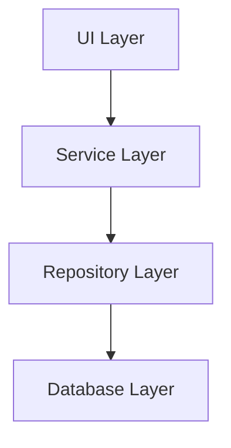

UI 계층은 Service 계층만 호출한다.

Service 계층은 Repository 계층을 통해 데이터에 접근한다.

Repository 계층은 SQLite에 직접 접근한다.

Database 계층은 데이터 저장만 담당한다.

---

# 주요 기능 흐름

## 폴더 스캔

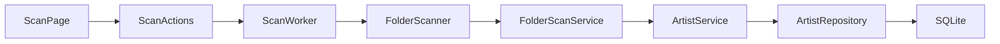

### 설명

* ScanPage는 사용자 입력과 화면 표시를 담당한다.
* ScanActions는 스캔 시작, 중지, 일시정지, 재개를 제어한다.
* ScanWorker는 백그라운드에서 스캔을 수행한다.
* FolderScanner는 스캔 대상 폴더를 탐색한다.
* FolderScanService는 폴더 내부 파일과 작품 정보를 분석한다.
* ArtistService는 분석 결과를 저장 가능한 데이터로 처리한다.
* ArtistRepository는 SQLite에 저장한다.

---

## 스캔 미리보기

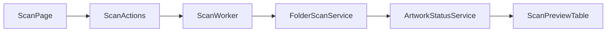

### 설명

* 스캔 미리보기는 DB 저장 전에 예상 결과를 보여준다.
* ScanActions는 미리보기 실행 요청을 처리한다.
* ScanWorker는 백그라운드에서 폴더 정보를 분석한다.
* FolderScanService는 작품 수, 파일 수, 폴더 상태를 계산한다.
* ArtworkStatusService는 신규 등록, 업데이트, 변경 없음, 오류 예상 상태를 계산한다.
* ScanPreviewTable은 미리보기 결과, 선택 상태, 제외 상태를 표시한다.

---

## 작가 수정

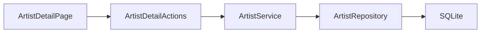

### 설명

* ArtistDetailPage는 수정할 작가 정보를 화면에 표시한다.
* ArtistDetailActions는 저장 버튼 클릭과 입력값 검증을 처리한다.
* ArtistService는 수정 가능한 데이터로 가공한다.
* ArtistRepository는 변경된 작가 정보를 SQLite에 저장한다.
* 저장 후 작가 목록과 상세 화면을 갱신한다.

---

## 작가 폴더 변경

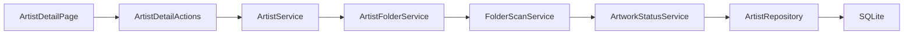

### 설명

* ArtistDetailPage에서 새 폴더 경로를 선택한다.
* ArtistDetailActions는 폴더 변경 요청을 ArtistService로 전달한다.
* ArtistService는 폴더 변경 처리를 ArtistFolderService에 위임한다.
* ArtistFolderService는 새 폴더 경로의 유효성을 확인한다.
* FolderScanService는 새 폴더의 작품 수, 파일 수, 최신 작품 ID를 다시 계산한다.
* ArtworkStatusService는 로컬 작품 정보와 기존 Pixiv 정보를 비교하여 상태를 갱신한다.
* ArtistRepository는 변경된 폴더 정보와 재스캔 결과를 저장한다.

---

## 작가 삭제

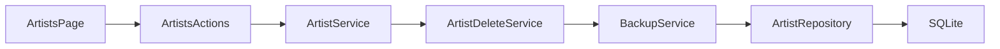

### 설명

* ArtistsPage에서 삭제할 작가를 선택한다.
* ArtistsActions는 삭제 확인 후 삭제 요청을 처리한다.
* ArtistService는 삭제 처리를 ArtistDeleteService에 위임한다.
* ArtistDeleteService는 삭제 전 백업을 생성한다.
* BackupService는 삭제 대상 작가 데이터를 JSON 백업으로 저장한다.
* ArtistRepository는 선택한 작가 데이터를 SQLite에서 삭제한다.

---

## 삭제 작가 복구


### 설명

* ArtistsPage에서 삭제 작가 복구 기능을 실행한다.
* ArtistsActions는 복구할 백업 파일을 선택한다.
* ArtistService는 복구 처리를 ArtistDeleteService에 위임한다.
* ArtistDeleteService는 백업 파일을 읽고 복구 가능한 작가 데이터를 검증한다.
* BackupService는 백업 데이터 로딩과 복구 결과 생성을 보조한다.
* ArtistRepository는 중복 Pixiv ID를 제외하고 복구 가능한 작가를 SQLite에 저장한다.
* 복구 완료 후 목록을 갱신한다.

---

## 업데이트 확인

```mermaid
flowchart LR

UpdateCheckPage
--> UpdateCheckActions
--> UpdateCheckWorker
--> ArtistService
--> ArtistUpdateService
--> PixivUpdateService
--> PixivMetadataService
--> TagService
--> ArtworkStatusService
--> ArtistUpdateHistoryRepository
--> ArtistRepository
--> SQLite
```

### 설명

* UpdateCheckPage는 업데이트 확인 대상 작가 목록과 실행 옵션을 표시한다.
* UpdateCheckActions는 시작, 일시정지, 재개, 중지를 제어한다.
* UpdateCheckWorker는 선택된 작가를 백그라운드에서 순차 처리한다.
* ArtistService는 단일 작가 업데이트 확인 요청을 ArtistUpdateService에 전달한다.
* ArtistUpdateService는 PixivUpdateService를 통해 최신 작품 ID를 조회한다.
* PixivMetadataService는 Pixiv 작가 태그 통계를 조회한다.
* TagService는 기존 태그와 Pixiv 태그를 병합한다.
* ArtworkStatusService는 로컬 작품 ID와 Pixiv 작품 ID를 비교하여 상태와 누락 작품을 계산한다.
* ArtistUpdateHistoryRepository는 확인 결과와 누락 변화 이력을 저장한다.
* ArtistRepository는 작가의 최신 Pixiv 작품 ID, 업데이트 상태, 태그 정보를 저장한다.
* 결과는 로그 테이블, 진행률, 요약 카드에 반영된다.

---

## Pixiv 팔로우 유저 가져오기

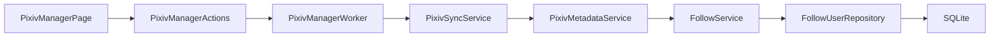

### 설명

* PixivManagerPage는 팔로우 유저 가져오기 UI를 제공한다.
* PixivManagerActions는 txt 또는 csv 파일에서 Pixiv 유저 ID 목록을 읽는다.
* PixivManagerWorker는 가져오기 작업을 백그라운드에서 수행한다.
* PixivSyncService는 Pixiv API 요청 흐름과 요청 안정성을 관리한다.
* PixivMetadataService는 Pixiv 유저명, 작품 수, 태그 통계 등 메타데이터를 수집한다.
* FollowService는 수집된 팔로우 유저 데이터를 저장 가능한 구조로 변환한다.
* FollowService는 로컬 작가 DB와 Pixiv ID를 기준으로 자동 매칭한다.
* FollowUserRepository는 중복 ID를 제외하고 팔로우 유저 정보를 SQLite에 저장한다.
* 처리 결과는 팔로우 유저 테이블과 로그에 반영된다.

---

## Pixiv 북마크 작품 가져오기

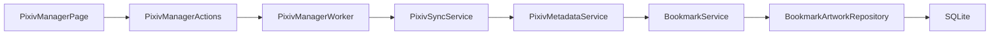

### 설명

* PixivManagerPage는 북마크 작품 가져오기 UI를 제공한다.
* PixivManagerActions는 txt 또는 csv 파일에서 Pixiv 작품 ID 목록을 읽는다.
* PixivManagerWorker는 북마크 작품 정보를 백그라운드에서 수집한다.
* PixivSyncService는 Pixiv 요청 간격, 배치 휴식, 재시도 정책을 관리한다.
* PixivMetadataService는 작품명, 작가명, 작가 ID, 북마크 수, 페이지 수, 태그, AI 여부를 수집한다.
* BookmarkService는 수집된 작품 데이터를 저장 가능한 구조로 변환한다.
* BookmarkService는 작품의 작가 ID를 기준으로 로컬 작가와 자동 매칭한다.
* BookmarkArtworkRepository는 중복 작품 ID를 제외하고 북마크 작품 정보를 SQLite에 저장한다.
* 처리 결과는 북마크 작품 테이블과 로그에 반영된다.

---

## 태그 동기화

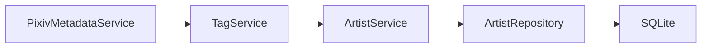

### 설명

* PixivMetadataService는 Pixiv 태그 통계 API를 통해 원문 태그, 번역 태그, 작품 수를 수집한다.
* TagService는 Pixiv 태그 데이터를 내부 태그 구조로 정규화한다.
* TagService는 기존 작가 태그와 새 Pixiv 태그를 원문 기준으로 병합한다.
* 사용자가 직접 수정한 번역 태그는 가능한 한 보존한다.
* ArtistService는 병합된 태그 데이터를 작가 정보 갱신에 포함한다.
* ArtistRepository는 직렬화된 태그 데이터를 artists 테이블에 저장한다.
* 갱신된 태그는 작가 목록, 작가 상세, Pixiv 관리 페이지에 표시된다.

---

## 통계 분석

```mermaid
flowchart LR

StatisticsPage
--> StatisticsActions
--> StatisticsService
--> StatisticsStatusService
--> StatisticsRatingService
--> StatisticsRankingService
--> StatisticsTagService
--> StatisticsQualityService
--> StatisticsFavoriteService
--> ArtistRepository
--> SQLite
```

### 설명

* StatisticsPage는 통계 분석 화면을 표시한다.
* StatisticsActions는 통계 새로고침 요청을 처리한다.
* StatisticsService는 하위 통계 서비스 결과를 통합한다.
* StatisticsStatusService는 업데이트 상태 분포를 계산한다.
* StatisticsRatingService는 평점 분포와 평균 평점을 계산한다.
* StatisticsRankingService는 작품 수, 파일 수, 저장 용량 기준 랭킹을 생성한다.
* StatisticsTagService는 태그 사용 통계를 분석한다.
* StatisticsQualityService는 태그, 메모, 평점, 폴더 상태 기반 데이터 품질을 계산한다.
* StatisticsFavoriteService는 즐겨찾기 작가 통계를 계산한다.
* ArtistRepository는 통계 계산에 필요한 작가 데이터를 제공한다.

---

## 설정 저장

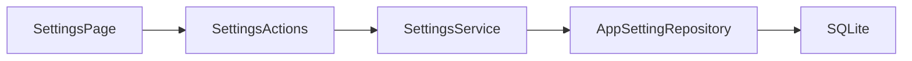

### 설명

* SettingsPage는 설정 입력 화면을 제공한다.
* SettingsActions는 저장 버튼 클릭과 입력값 검증을 처리한다.
* SettingsService는 설정값을 문자열 기반 저장 형식으로 변환한다.
* AppSettingRepository는 설정값을 app_settings 테이블에 저장한다.
* 저장된 설정은 Pixiv 요청, 업데이트 확인, 백업, 창 크기 복원 등에 사용된다.

---

## 백업 및 복구

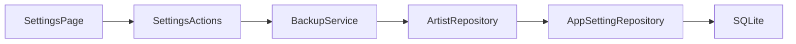

### 설명

* SettingsPage는 백업, 복원, 삭제, DB 최적화 기능을 제공한다.
* SettingsActions는 사용자가 선택한 백업 작업을 실행한다.
* BackupService는 데이터베이스 백업 파일을 생성하거나 복원한다.
* ArtistRepository는 작가 데이터를 백업 및 복원 대상으로 제공한다.
* AppSettingRepository는 설정 데이터를 백업 및 복원 대상으로 제공한다.
* SQLite 파일은 백업 생성, 복원, 최적화의 대상이 된다.

---

# UI 구조

```mermaid
flowchart TD

MainWindow

MainWindow --> Sidebar

MainWindow --> DashboardPage
MainWindow --> ScanPage
MainWindow --> UpdateCheckPage
MainWindow --> PixivManagerPage
MainWindow --> ArtistsPage
MainWindow --> ArtistDetailPage
MainWindow --> StatisticsPage
MainWindow --> SettingsPage

ArtistsPage --> ArtistTable

ArtistDetailPage --> ArtistInfoSection

ScanPage --> ScanFolderSection
ScanPage --> ScanProgressSection
ScanPage --> ScanPreviewTable
ScanPage --> ScanLogTable

UpdateCheckPage --> UpdateArtistTable
UpdateCheckPage --> UpdateLogTable

PixivManagerPage --> FollowUserTable
PixivManagerPage --> BookmarkArtworkTable
PixivManagerPage --> PixivLogTable
PixivManagerPage --> PixivSummarySection

StatisticsPage --> SummarySection
StatisticsPage --> QualitySection
StatisticsPage --> StatusSection
StatisticsPage --> RatingSection
StatisticsPage --> RankingSection
StatisticsPage --> TagSection

SettingsPage --> FolderSection
SettingsPage --> PixivSection
SettingsPage --> UpdateRequestSection
SettingsPage --> PixivRequestSection
SettingsPage --> DatabaseSection
SettingsPage --> SettingsManagementSection
SettingsPage --> AppInfoSection
```

## 설명

MainWindow는 전체 페이지를 관리한다.

Sidebar를 통해 페이지를 전환한다.

각 기능은 독립 Page 구조로 분리되어 있으며,
페이지 내부는 Section 단위로 구성된다.

ArtistTable, UpdateArtistTable,
FollowUserTable, BookmarkArtworkTable 등
대형 테이블은 Widget으로 분리되어 재사용된다.

---

# UI 내부 분리 구조

## Page 구조

```text
page.py
├─ actions.py
├─ styles.py
├─ section files
└─ utils.py
```

### 설명

* page.py는 화면 생성과 시그널 연결 담당
* actions.py는 UI 이벤트 처리 담당
* styles.py는 스타일 정의 담당
* section 파일은 UI 영역 분리 담당
* utils.py는 화면 전용 유틸 담당

---

## Action Parts 구조

```text
actions.py
│
└─ action_parts
   ├─ data_actions.py
   ├─ dialog_actions.py
   ├─ shortcut_actions.py
   └─ update_actions.py
```

### 설명

* Actions 파일 비대화를 방지하기 위한 구조
* 기능별 액션을 별도 파일로 분리
* Page에서는 단일 Actions 객체만 사용

---

## Worker Parts 구조

```text
worker.py
│
└─ worker_parts
   ├─ validation.py
   ├─ preview_builder.py
   ├─ result_builder.py
   ├─ statistics.py
   └─ runtime_utils.py
```

### 설명

* Worker는 실행 흐름만 담당
* 세부 기능은 worker_parts로 분리
* 테스트와 유지보수를 쉽게 하기 위한 구조

---

# Service 구조

```mermaid
flowchart TD

ArtistService

ArtistService --> ArtistMetadataService
ArtistService --> ArtistFolderService
ArtistService --> ArtistDeleteService
ArtistService --> ArtistValidationService

ArtistService --> ArtistRepository
ArtistService --> FolderScanService
ArtistService --> ArtworkStatusService
ArtistService --> BackupService

ArtistScanService --> ArtistService
ArtistScanService --> FolderScanService

RescanService --> ArtistService
RescanService --> FolderScanService

ArtistUpdateService --> PixivUpdateService
ArtistUpdateService --> PixivMetadataService
ArtistUpdateService --> ArtworkStatusService
ArtistUpdateService --> TagService
ArtistUpdateService --> ArtistRepository
ArtistUpdateService --> ArtistUpdateHistoryRepository

ArtistBulkUpdateService --> ArtistUpdateService

FollowService --> FollowImporter
FollowService --> FollowMatcher
FollowService --> FollowUserRepository

BookmarkService --> BookmarkImporter
BookmarkService --> BookmarkMatcher
BookmarkService --> BookmarkArtworkRepository

PixivSyncService --> FollowService
PixivSyncService --> BookmarkService
PixivSyncService --> PixivMetadataService

TagService --> TagParser

BackupService --> DeletedArtistBackupService
BackupService --> DatabaseBackupService

ExportService --> ArtistRepository

SettingsService --> AppSettingRepository

DatabaseInfoService --> ArtistRepository

DatabaseIntegrityService --> ArtistRepository

DatabaseMaintenanceService --> SQLite
```

## 설명

Service Layer는 실제 비즈니스 로직을 담당한다.

UI는 직접 Repository를 호출하지 않는다.

모든 데이터 처리는 Service를 통해 수행된다.

기능 규모가 커진 서비스는
Service Group 형태로 분리한다.

Pixiv 관리 기능 추가 이후

* Follow Service Group
* Bookmark Service Group
* Pixiv Service Group
* Tag Service Group

이 추가되었다.

---

# Statistics Service 구조

```text
StatisticsService
│
├─ StatisticsStatusService
├─ StatisticsRatingService
├─ StatisticsRankingService
├─ StatisticsTagService
├─ StatisticsQualityService
└─ StatisticsFavoriteService
```

## 설명

StatisticsService는 통계 계산 진입점이다.

각 하위 서비스는 개별 통계를 담당한다.

### StatisticsStatusService

* 상태 분포 계산

### StatisticsRatingService

* 평점 분포 계산

### StatisticsRankingService

* 작품 수 TOP
* 파일 수 TOP
* 저장 용량 TOP

### StatisticsTagService

* 태그 분석
* 인기 태그 계산

### StatisticsQualityService

* 데이터 품질 분석

### StatisticsFavoriteService

* 즐겨찾기 통계 분석

---

# Repository 구조

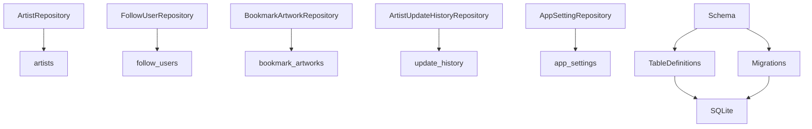

---

# 주요 모듈 분리

## Artists Page

```text
ui/pages/artists/
│
├─ action_parts
│  ├─ bulk_actions.py
│  ├─ data_actions.py
│  ├─ dialog_actions.py
│  └─ __init__.py
│
├─ page.py
├─ actions.py
├─ filters.py
├─ toolbar.py
└─ __init__.py
```

### 역할

* 작가 목록 조회
* 검색 / 필터 / 정렬
* 다중 선택 작업
* 삭제 / 복구
* 업데이트 확인 페이지 이동

---

## Artist Detail Page

```text
ui/pages/artist_detail/
│
├─ action_parts
│  ├─ artwork_actions.py
│  ├─ data_actions.py
│  ├─ dialog_actions.py
│  ├─ tag_actions.py
│  └─ __init__.py
│
├─ page.py
├─ actions.py
├─ styles.py
├─ info_section.py
├─ utils.py
└─ __init__.py
```

### 역할

* 작가 상세 정보 표시
* 평점 관리
* 즐겨찾기 / 숨김 설정
* 태그 관리
* 장문 메모 관리
* 참고 링크 관리
* 다운로드 메모 관리
* 최근 로컬 작품 표시
* 누락 작품 표시
* 업데이트 이력 표시
* Pixiv 바로가기
* 폴더 바로가기
* 폴더 변경 및 재스캔

---

## Scan Page

```text
ui/pages/scan/
│
├─ action_parts
│  ├─ filter_actions.py
│  ├─ folder_actions.py
│  ├─ result_actions.py
│  ├─ worker_actions.py
│  └─ __init__.py
│
├─ preview_table_parts
│  ├─ filter_logic.py
│  ├─ row_renderer.py
│  ├─ summary.py
│  └─ __init__.py
│
├─ progress_parts
│  ├─ history_formatter.py
│  ├─ statistics_formatter.py
│  └─ __init__.py
│
├─ worker_parts
│  ├─ preview_builder.py
│  ├─ result_builder.py
│  ├─ runtime_utils.py
│  ├─ statistics.py
│  ├─ validation.py
│  └─ __init__.py
│
├─ actions.py
├─ folder_scanner.py
├─ folder_section.py
├─ log_table.py
├─ log_utils.py
├─ page.py
├─ preview_table.py
├─ progress_section.py
├─ scan_styles.py
├─ worker.py
└─ __init__.py
```

### 역할

* 폴더 스캔
* 미리보기 생성
* 선택 등록
* 결과 필터링
* 로그 출력
* 진행률 표시
* 최근 스캔 통계 표시
* 일시정지 / 재개 / 중단

---

## Dashboard Page

```text
ui/pages/dashboard/
│
├─ page.py
├─ actions.py
├─ dashboard_metrics.py
├─ dashboard_styles.py
│
├─ summary_section.py
├─ summary_card.py
│
├─ update_status_section.py
├─ scan_statistics_section.py
├─ recent_activity_section.py
├─ recent_artists_section.py
│
├─ top_ranking_section.py
│
├─ recommendation_section.py
├─ recommendation_card.py
│
├─ random_artist_section.py
│
├─ utils.py
└─ __init__.py
```

### 역할

* 전체 통계 카드
* 업데이트 상태 표시
* 최근 스캔 결과
* 최근 활동 표시
* TOP 랭킹 표시
* 추천 작가 표시
* 랜덤 작가 표시

---

## Statistics Page

```text
ui/pages/statistics/
│
├─ page.py
├─ actions.py
├─ styles.py
│
├─ summary_card.py
├─ summary_section.py
│
├─ quality_section.py
├─ status_section.py
├─ rating_section.py
├─ ranking_section.py
├─ tag_section.py
│
└─ __init__.py
```

### 역할

* 기초 통계
* 데이터 품질 분석
* 상태 분포 분석
* 평점 분포 분석
* 작품 수 TOP
* 파일 수 TOP
* 저장 용량 TOP
* 태그 분석

---

## Update Check Page

```text
ui/pages/update_check/
│
├─ page.py
├─ actions.py
├─ selection_actions.py
├─ worker.py
├─ worker_config.py
├─ artist_table.py
├─ log_table.py
├─ styles.py
├─ utils.py
└─ __init__.py
```

### 역할

* 업데이트 확인 실행
* 다중 작가 선택
* 선택 작가 일괄 확인
* 결과 로그 출력
* 누락 작품 계산
* 최근 확인 스킵
* 일시정지 / 재개 / 중단
* CSV 저장

---

## Pixiv Manager Page

```text
ui/pages/pixiv_manager/
│
├─ page.py
├─ actions.py
├─ worker.py
├─ styles.py
│
├─ follow_table.py
├─ bookmark_table.py
├─ log_table.py
├─ summary_section.py
│
└─ __init__.py
```

### 역할

* 팔로우 유저 관리
* 북마크 작품 관리
* txt / csv 가져오기
* Pixiv 메타데이터 동기화
* 태그 수집
* 로컬 작가 자동 매칭
* 즐겨찾기 작가 매칭
* 동기화 로그 출력
* 통계 요약 표시

---

## Settings 구조

```text 
Settings Page
│
├─ Folder Section
├─ Pixiv Section
├─ Update Request Section
├─ Pixiv Request Section
├─ Database Section
├─ Settings Management Section
└─ App Info Section
```

### 역할

* 기본 Pixiv 폴더 설정
* Pixiv PHPSESSID 저장 및 테스트
* 업데이트 확인 요청 간격 설정
* 업데이트 확인 배치 처리 설정
* Pixiv 관리 요청 간격 설정
* Pixiv 관리 배치 처리 설정
* 데이터베이스 백업 / 복원
* CSV 내보내기
* DB 무결성 검사
* DB 최적화
* 설정 백업 / 복원
* 프로그램 정보 표시

---

# Dashboard 아키텍처

## 데이터 생성 구조

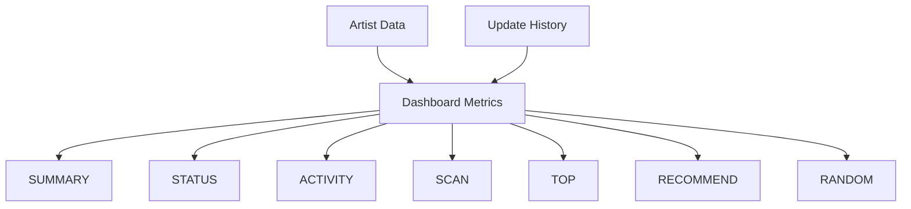

---

## 추천 작가 생성

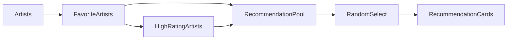

---

## TOP 랭킹 생성

```mermaid
flowchart LR

Artists

--> ArtworkCount
--> FileCount
--> FolderSize

ArtworkCount --> TopRanking
FileCount --> TopRanking
FolderSize --> TopRanking
```

---

# Statistics 아키텍처

## 데이터 생성 구조

```mermaid
flowchart TD

ARTISTS[Artist Data]

ARTISTS --> STATUS
ARTISTS --> RATING
ARTISTS --> RANKING
ARTISTS --> TAG
ARTISTS --> QUALITY
ARTISTS --> FAVORITE

STATUS[Status Statistics]
RATING[Rating Statistics]
RANKING[Ranking Statistics]
TAG[Tag Statistics]
QUALITY[Quality Statistics]
FAVORITE[Favorite Statistics]

STATUS --> STATISTICS
RATING --> STATISTICS
RANKING --> STATISTICS
TAG --> STATISTICS
QUALITY --> STATISTICS
FAVORITE --> STATISTICS

STATISTICS[StatisticsService]

STATISTICS --> PAGE[Statistics Page]
```

---

## Statistics Service 구조

```text
StatisticsService
│
├─ StatusService
├─ RatingService
├─ RankingService
├─ TagService
├─ QualityService
└─ FavoriteService
```

---

# Repository 구조

## Artist Repository

```text
Artist Repository
│
├─ 조회
├─ 등록
├─ 수정
├─ 삭제
├─ 복구
├─ 평점 수정
├─ 즐겨찾기 수정
├─ 숨김 상태 수정
└─ 태그 저장
```

---

## Follow User Repository

```text
FollowUserRepository
│
├─ 팔로우 유저 저장
├─ 팔로우 유저 조회
├─ 팔로우 유저 수정
├─ 중복 Pixiv ID 검사
├─ 로컬 작가 매칭 정보 저장
└─ 통계 조회
```

---

## Bookmark Artwork Repository

```text
BookmarkArtworkRepository
│
├─ 북마크 작품 저장
├─ 북마크 작품 조회
├─ 북마크 작품 수정
├─ 중복 작품 ID 검사
├─ 로컬 작가 매칭 정보 저장
└─ 통계 조회
```

---

## Update History Repository

```text
ArtistUpdateHistoryRepository
│
├─ 이력 저장
├─ 최근 결과 조회
├─ 최근 오류 조회
├─ 최신 결과 조회
├─ 누락 증가 조회
├─ 결과 비교
├─ 신규 누락 계산
└─ 해결 작품 계산
```

---

## App Setting Repository

```text
AppSettingRepository
│
├─ 설정 조회
├─ 설정 저장
├─ 설정 삭제
└─ 설정 초기화
```

---

# 데이터 저장 구조

```mermaid
flowchart LR

UI
--> Services

Services
--> Repositories

Repositories
--> SQLite

SQLite
--> Artists
SQLite
--> FollowUsers
SQLite
--> BookmarkArtworks
SQLite
--> UpdateHistory
SQLite
--> AppSettings
```

---

# 확장성 설계

## V2

현재 구조는 다음 기능을 기준으로 설계되었다.

```text
작가 관리 고도화
작가 상세 페이지
스캔 시스템
업데이트 확인
대시보드
설정 관리
통계 분석
Pixiv 팔로우 관리
Pixiv 북마크 관리
Pixiv 태그 연동
```

---

## V3

향후 작품 단위 관리 시스템을 추가할 수 있도록 설계되어 있다.

```text
Artwork Manager
Artwork Detail
Thumbnail View
Card View
Built-in Viewer
Download Queue
Artwork Tag Manager
Artwork Collection
```

---

# 설계 원칙

## 1. 단일 책임 원칙

각 모듈은 하나의 책임만 가진다.

```text
Artist Service
→ 작가 관리

Folder Scan Service
→ 폴더 분석

Artist Update Service
→ 업데이트 확인

Pixiv Sync Service
→ Pixiv 데이터 동기화

Statistics Service
→ 통계 생성
```

---

## 2. UI와 비즈니스 로직 분리

```text
UI
→ 입력 / 출력

Service
→ 처리

Repository
→ 저장
```

UI는 Service를 통해서만 데이터에 접근한다.

Repository는 데이터 저장만 담당한다.

---

## 3. 기능 단위 모듈화

```text
artist/
scan/
update/
statistics/
backup/
follow/
bookmark/
pixiv/
tag/
```

기능별로 독립적인 구조를 유지한다.

---

## 4. 확장 우선 설계

향후 기능 추가 시 기존 구조 변경을 최소화한다.

```text
V2
→ 기능 확장

V3
→ 작품 단위 관리
→ 뷰어 시스템
→ 다운로드 큐
→ 썸네일 시스템
```

---

## 5. 유지보수성 우선

파일 크기가 과도하게 커질 경우 분리한다.

```text
page.py
↓
actions.py
↓
action_parts/
```

복잡한 Worker 역시 별도 모듈로 분리한다.

```text
worker.py
↓
worker_parts/
```

---

# 리팩토링 원칙

## 1. 페이지 분리

```text
Page
 ↓

Actions
Sections
Styles
Utils
```

---

## 2. 액션 분리

```text
actions.py
 ↓

action_parts/
```

---

## 3. 워커 분리

```text
worker.py
 ↓

worker_parts/
```

---

## 4. UI / Service 분리

```text
UI
 ↓
Service
 ↓
Repository
 ↓
Database
```

---

## 5. Import 단순화

```python
from ui.pages.scan import ScanPage
from ui.pages.dashboard import DashboardPage
from ui.pages.statistics import StatisticsPage
from ui.pages.pixiv_manager import PixivManagerPage

from app.services import (
    ArtistService,
    BackupService,
    StatisticsService,
)
```

---

# 버전 기준

본 문서는 v0.16.0 (Pixiv 관리 시스템 및 Pixiv 메타데이터 연동 완료) 기준으로 작성되었다.

