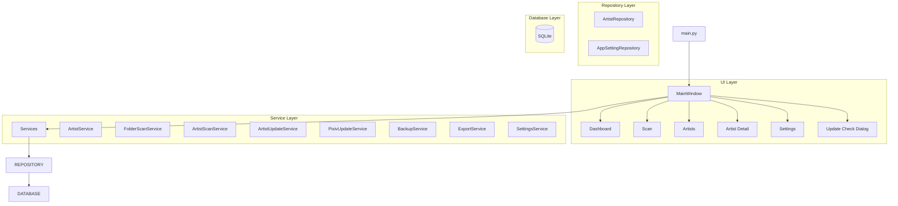
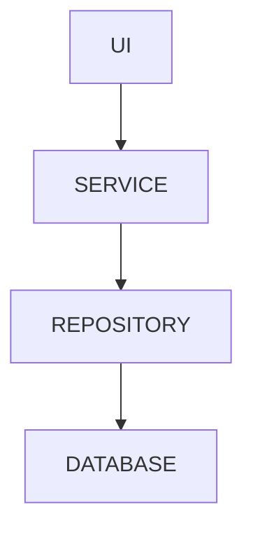
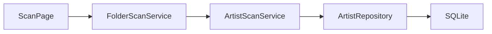
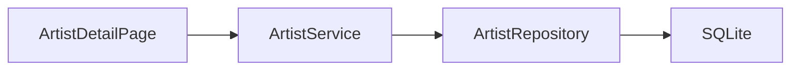
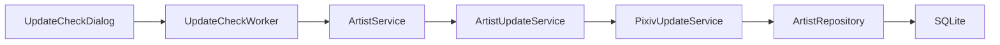
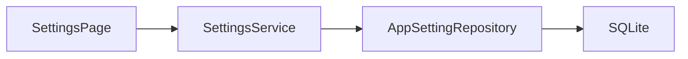
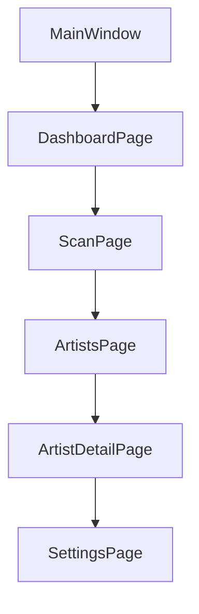
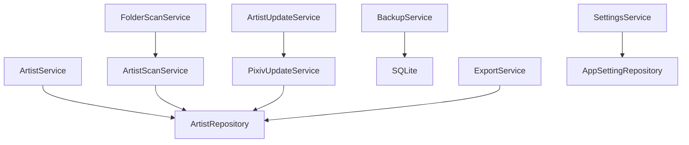
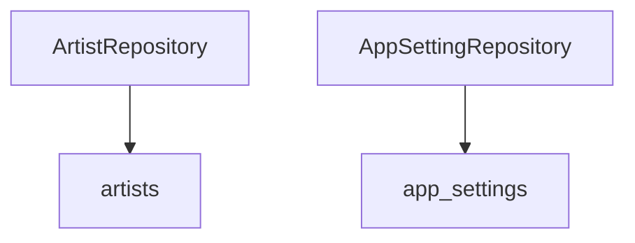

# 시스템 아키텍처 (Architecture)

## 아키텍처 개요

Pixiv Local Manager는 계층형 아키텍처(Layered Architecture)를 사용한다.

각 계층은 자신의 책임만 수행하며 상위 계층은 하위 계층을 통해 기능을 수행한다.

---

# 전체 구조



---

# 계층 구조

## Layer 1 - Presentation Layer

사용자 인터페이스를 담당한다.

### 구성

```text
ui/
├─ main_window.py
├─ pages/
├─ dialogs/
└─ widgets/
```

### 역할

- 사용자 입력 처리
- 화면 표시
- 페이지 이동
- 진행률 표시
- 결과 출력

### 책임 범위

```text
가능
- 버튼 클릭
- 입력값 수집
- 데이터 표시

불가능
- SQL 실행
- Pixiv 요청
- 데이터 가공
```

---

## Layer 2 - Service Layer

프로그램의 핵심 비즈니스 로직을 담당한다.

### 구성

```text
app/services/
```

### 역할

- 폴더 스캔
- 작가 등록
- 작가 수정
- Pixiv 조회
- 백업
- CSV 생성

### 책임 범위

```text
가능
- 데이터 처리
- 비즈니스 규칙 적용
- Repository 호출

불가능
- UI 출력
- SQL 직접 작성
```

---

## Layer 3 - Repository Layer

SQLite 접근을 담당한다.

### 구성

```text
app/database/
├─ artist_repository.py
└─ app_setting_repository.py
```

### 역할

- CRUD 처리
- SQL 관리
- 데이터 변환

### 책임 범위

```text
가능
- INSERT
- UPDATE
- DELETE
- SELECT

불가능
- 화면 처리
- Pixiv 요청
```

---

## Layer 4 - Database Layer

데이터 영구 저장을 담당한다.

### 구성

```text
SQLite
```

### 역할

- 작가 정보 저장
- 설정 저장
- 업데이트 상태 저장

---

# 의존성 방향



---

# 주요 기능 흐름

## 폴더 스캔



---

## 작가 수정



---

## 업데이트 확인



---

## 설정 저장



---

# UI 구조



---

# Service 구조



---

# Repository 구조



---

# 설계 원칙

<table>
<tr>
    <th>원칙</th>
    <th>설명</th>
</tr>

<tr>
    <td>단일 책임 원칙</td>
    <td>하나의 클래스는 하나의 책임만 가진다.</td>
</tr>

<tr>
    <td>계층 분리</td>
    <td>UI, Service, Repository 역할을 분리한다.</td>
</tr>

<tr>
    <td>낮은 결합도</td>
    <td>계층 간 의존성을 최소화한다.</td>
</tr>

<tr>
    <td>높은 응집도</td>
    <td>관련 기능은 같은 모듈에 배치한다.</td>
</tr>

<tr>
    <td>확장성</td>
    <td>기능 추가 시 기존 코드 수정 최소화</td>
</tr>

<tr>
    <td>유지보수성</td>
    <td>대형 파일을 기능별로 분리한다.</td>
</tr>

</table>

---

# 리팩토링 결과

## 리팩토링 전

```text
ui/
├─ artist_detail_page.py
├─ update_check_dialog.py
└─ artist_table.py
```

대형 파일 중심 구조

---

## 리팩토링 후

```text
artist_detail/
update_check/
artist_table/
```

기능 단위 모듈 구조

---

# 향후 확장 방향

```text
V2
├─ Artwork Layer
├─ Tag System
├─ Thumbnail Cache
├─ Recommendation System
└─ Plugin Support
```