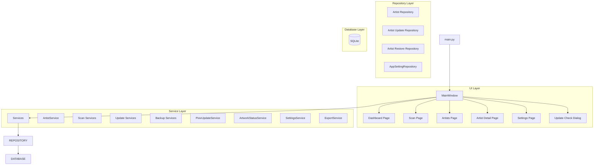

# 시스템 아키텍처 (Architecture)

## 아키텍처 개요

Pixiv Local Manager는 계층형 아키텍처(Layered Architecture)를 사용한다.

각 계층은 자신의 책임만 수행하며, 상위 계층은 하위 계층을 통해 기능을 수행한다.

v0.10.0 2차 리팩토링 이후 기능 단위 모듈 분리 구조를 적용하여 유지보수성과 확장성을 향상시켰다.

---

# 전체 구조



---

# 계층 구조

## Layer 1 - Presentation Layer

사용자 인터페이스를 담당한다.

### 구성

```text
ui/
├─ main_window.py
├─ pages/
├─ dialogs/
└─ widgets/
```

### 역할

* 사용자 입력 처리
* 화면 표시
* 페이지 이동
* 진행률 표시
* 결과 출력
* 스캔 제어
* 업데이트 확인

### 책임 범위

```text
가능

- 버튼 클릭 처리
- 입력값 수집
- 데이터 표시
- 사용자 이벤트 연결
- 진행률 출력
- 로그 출력

불가능

- SQL 실행
- 데이터 영속화
- Pixiv 통신
- 비즈니스 규칙 처리
```

---

## Layer 2 - Service Layer

프로그램의 핵심 비즈니스 로직을 담당한다.

### 구성

```text
app/services/

├─ artist/
├─ scan/
├─ update/
├─ backup/

├─ artwork_status_service.py
├─ export_service.py
├─ pixiv_update_service.py
├─ settings_service.py
└─ __init__.py
```

### 역할

* 작가 등록
* 작가 수정
* 작가 삭제
* 삭제 작가 복구
* 폴더 스캔
* 재스캔
* 업데이트 확인
* 작품 상태 계산
* CSV 내보내기
* 설정 관리

### 책임 범위

```text
가능

- 데이터 처리
- 비즈니스 규칙 적용
- Repository 호출
- 서비스 간 협력

불가능

- UI 직접 조작
- SQL 직접 실행
```

---

## Layer 3 - Repository Layer

SQLite 접근을 담당한다.

### 구성

```text
app/database/

├─ artist/
│  ├─ repository.py
│  ├─ update_repository.py
│  ├─ restore_repository.py
│  └─ columns.py
│
├─ connection.py
├─ schema.py
├─ migrations.py
├─ table_definitions.py
├─ app_setting_repository.py
└─ __init__.py
```

### 역할

* CRUD 처리
* 업데이트 처리
* 복구 처리
* SQL 관리
* 데이터 변환
* 마이그레이션

### 책임 범위

```text
가능

- INSERT
- UPDATE
- DELETE
- SELECT
- 트랜잭션 처리

불가능

- UI 처리
- Pixiv 통신
- 비즈니스 규칙 처리
```

---

## Layer 4 - Database Layer

데이터 영구 저장을 담당한다.

### 구성

```text
SQLite
```

### 역할

* 작가 정보 저장
* 설정 저장
* 상태 저장
* 태그 저장
* 메모 저장
* 최근 열람 기록 저장
* 업데이트 정보 저장
* 백업 및 복구 대상 데이터 저장

```
```
