# 시스템 아키텍처 (Architecture)

## 아키텍처 개요

Pixiv Local Manager는 계층형 아키텍처(Layered Architecture)를 사용한다.

각 계층은 자신의 책임만 수행하며 상위 계층은 하위 계층을 통해 기능을 수행한다.

v0.10.0 2차 리팩토링 이후 기능 단위 모듈 분리 구조를 적용하였으며,

v0.12.0 대시보드 고도화 완료 기준으로 Dashboard, Update History, Recommendation 구조가 추가되었다.

---

# 전체 구조

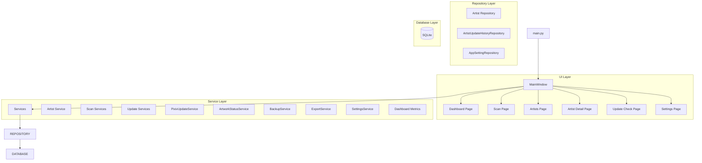

---

# 계층 구조

## Layer 1 - Presentation Layer

사용자 인터페이스 담당.

### 구성

```text
ui/
├─ main_window.py
├─ pages/
└─ widgets/
```

### 역할

* 사용자 입력 처리
* 페이지 이동
* 데이터 표시
* 진행률 표시
* 결과 출력
* 스캔 제어
* 업데이트 확인

### 책임 범위

```text
가능

- 버튼 이벤트 처리
- 입력값 수집
- 데이터 표시
- 시그널 연결
- 진행률 출력
- 로그 출력

불가능

- SQL 실행
- 데이터 저장
- Pixiv 통신
- 비즈니스 규칙 처리
```

---

## Layer 2 - Service Layer

비즈니스 로직 담당.

### 구성

```text
app/services/

├─ artist
├─ scan
├─ update
├─ backup

├─ artwork_status_service.py
├─ export_service.py
├─ pixiv_update_service.py
├─ settings_service.py
└─ __init__.py
```

### 역할

* 작가 등록
* 작가 수정
* 작가 삭제
* 삭제 작가 복구
* 폴더 스캔
* 재스캔
* 업데이트 확인
* 상태 계산
* CSV 저장
* 설정 관리

### 책임 범위

```text
가능

- 데이터 처리
- 비즈니스 규칙 적용
- Repository 호출
- 서비스 간 협력

불가능

- UI 직접 조작
- SQL 직접 실행
```

---

## Layer 3 - Repository Layer

SQLite 접근 담당.

### 구성

```text
app/database/

├─ artist/
│  ├─ repository.py
│  ├─ update_repository.py
│  ├─ restore_repository.py
│  └─ columns.py
│
├─ app_setting_repository.py
├─ update_history_repository.py
├─ connection.py
├─ schema.py
├─ migrations.py
├─ table_definitions.py
└─ __init__.py
```

### 역할

* CRUD 처리
* 업데이트 이력 저장
* 설정 저장
* SQL 관리
* 데이터 변환
* 마이그레이션

### 책임 범위

```text
가능

- INSERT
- UPDATE
- DELETE
- SELECT
- 트랜잭션 처리

불가능

- UI 처리
- Pixiv 통신
- 비즈니스 규칙 처리
```

---

## Layer 4 - Database Layer

데이터 영구 저장 담당.

### 구성

```text
SQLite
```

### 저장 대상

* 작가 정보
* 설정 정보
* 태그 정보
* 메모 정보
* 최근 열람 기록
* 업데이트 상태
* 업데이트 이력
* 누락 작품 정보

---

# 의존성 방향

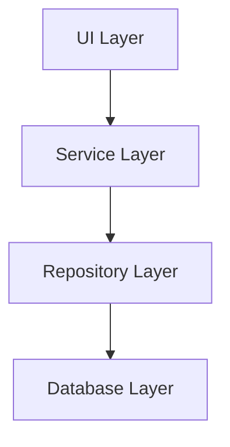

---

# 주요 기능 흐름

## 폴더 스캔

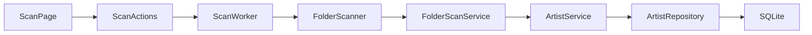

---

## 스캔 미리보기

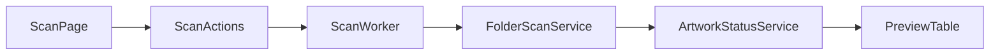

---

## 작가 수정

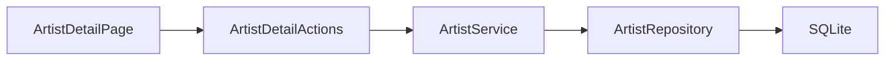

---

## 작가 폴더 변경

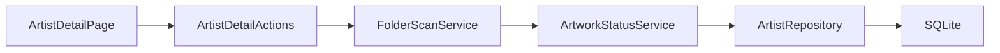

---

## 작가 삭제

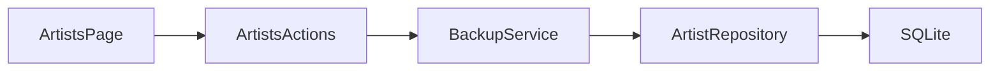

---

## 삭제 작가 복구

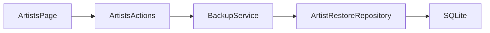

---

## 업데이트 확인

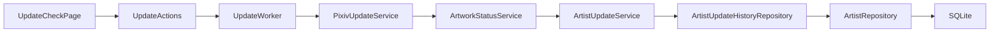

---

## 대시보드 데이터 생성

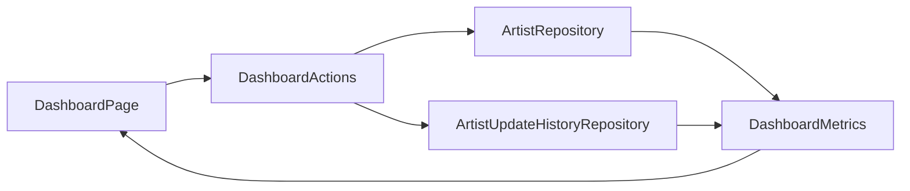

---

# UI 구조

## Main Window

프로그램의 최상위 UI.

```text
MainWindow
│
├─ Sidebar
│
└─ QStackedWidget
    │
    ├─ Dashboard Page
    ├─ Scan Page
    ├─ Artists Page
    ├─ Artist Detail Page
    ├─ Update Check Page
    └─ Settings Page
```

---

## Dashboard 구조

대시보드는 프로그램 진입 시 가장 먼저 표시되는 화면이다.

```text
Dashboard
│
├─ Summary Section
│
├─ Update Status Section
│
├─ Scan Statistics Section
│
├─ Recent Activity Section
│
├─ Top Ranking Section
│
├─ Recommendation Section
│
└─ Random Artist Section
```

### 역할

<table>
<tr>
    <th>영역</th>
    <th>설명</th>
</tr>

<tr>
    <td>Summary</td>
    <td>전체 통계 카드</td>
</tr>

<tr>
    <td>Update Status</td>
    <td>업데이트 상태 분포</td>
</tr>

<tr>
    <td>Scan Statistics</td>
    <td>최근 스캔 결과</td>
</tr>

<tr>
    <td>Recent Activity</td>
    <td>최근 열람, 등록, 확인, 오류, 누락 증가</td>
</tr>

<tr>
    <td>Top Ranking</td>
    <td>작품 수, 파일 수, 용량 TOP 랭킹</td>
</tr>

<tr>
    <td>Recommendation</td>
    <td>추천 작가</td>
</tr>

<tr>
    <td>Random Artist</td>
    <td>랜덤 작가</td>
</tr>

</table>

---

## Scan 구조

```text
Scan Page
│
├─ Folder Section
├─ Preview Table
├─ Progress Section
└─ Log Table
```

---

## Artists 구조

```text
Artists Page
│
├─ Toolbar
├─ Filters
└─ Artist Table
```

---

## Artist Detail 구조

```text
Artist Detail Page
│
├─ Basic Information
├─ Rating
├─ Tags
├─ Memo
├─ Reference Links
├─ Download Note
├─ Local Artworks
├─ Missing Artworks
└─ Update History
```

---

## Update Check 구조

```text
Update Check Page
│
├─ Artist Table
├─ Selection Actions
├─ Progress Area
├─ Log Table
└─ Result Summary
```

---

## Settings 구조

```text
Settings Page
│
├─ Folder Section
├─ Database Section
├─ Pixiv Section
└─ App Info Section
```

---

# Dashboard 아키텍처

## 데이터 생성 구조

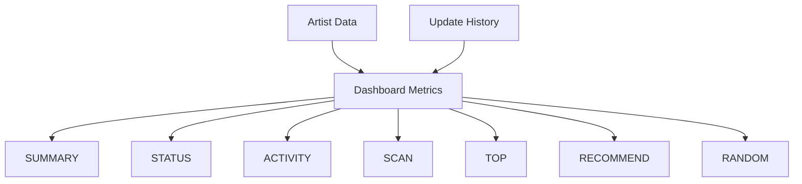

---

## 추천 작가 생성

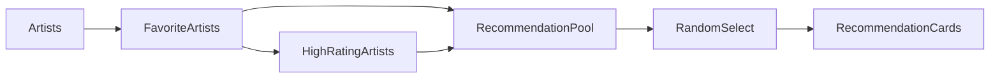

---

## TOP 랭킹 생성

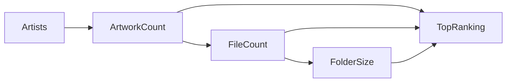

---

# Service 구조

## Artist 계열

```text
Artist Service
│
├─ Metadata Service
├─ Folder Service
├─ Delete Service
└─ Validation
```

---

## Scan 계열

```text
Scan Services
│
├─ FolderScanService
├─ ArtistScanService
├─ RescanService
├─ ScanBuilder
└─ ScanCompare
```

---

## Update 계열

```text
Update Services
│
├─ ArtistUpdateService
├─ BulkUpdateService
└─ UpdateUtils
```

---

# Repository 구조

## Artist Repository

```text
Artist Repository
│
├─ 조회
├─ 등록
├─ 수정
├─ 삭제
└─ 복구
```

---

## Update History Repository

```text
ArtistUpdateHistoryRepository
│
├─ 이력 저장
├─ 최근 결과 조회
├─ 최근 오류 조회
├─ 최신 결과 조회
├─ 누락 증가 조회
├─ 결과 비교
├─ 신규 누락 계산
└─ 해결 작품 계산
```

---

## App Setting Repository

```text
AppSettingRepository
│
├─ 설정 조회
├─ 설정 저장
└─ 설정 초기화
```

---

# 데이터 저장 구조

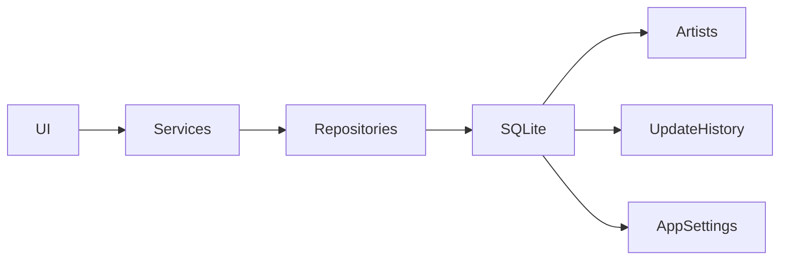

---

# 확장성 설계

## V2

현재 구조는 다음 기능 추가를 고려하여 설계되었다.

```text
통계 분석
설정 관리 고도화
추가 업데이트 기능
성능 최적화
```

---

## V3

향후 작품 단위 관리 시스템을 추가할 수 있도록 설계되어 있다.

```text
Artwork Manager
Artwork Detail
Thumbnail View
Card View
Built-in Viewer
Download Queue
```

---

# 리팩토링 원칙

## 1. 페이지 분리

```text
Page
 ↓

Actions
Sections
Styles
Utils
```

---

## 2. 액션 분리

```text
actions.py
 ↓

action_parts/
```

---

## 3. 워커 분리

```text
worker.py
 ↓

worker_parts/
```

---

## 4. UI / Service 분리

```text
UI
 ↓
Service
 ↓
Repository
 ↓
Database
```

---

## 5. Import 단순화

```python
from ui.pages.scan import ScanPage
from ui.pages.dashboard import DashboardPage

from app.services import (
    ArtistService,
    BackupService,
)
```

---

# 버전 기준

본 문서는 v0.12.0 (대시보드 고도화 완료) 기준으로 작성되었다.
