# 시스템 아키텍처 (Architecture)

## 아키텍처 개요

Pixiv Local Manager는 계층형 아키텍처(Layered Architecture)를 사용한다.

각 계층은 자신의 책임만 수행하며, 상위 계층은 하위 계층을 통해 기능을 수행한다.

v0.10.0 2차 리팩토링 이후 기능 단위 모듈 분리 구조를 적용하여 유지보수성과 확장성을 향상시켰다.

v0.14.0 통계 분석 시스템 완료 이후 Statistics Page와 Statistics Service 계열 구조가 추가되었다.

---

# 전체 구조

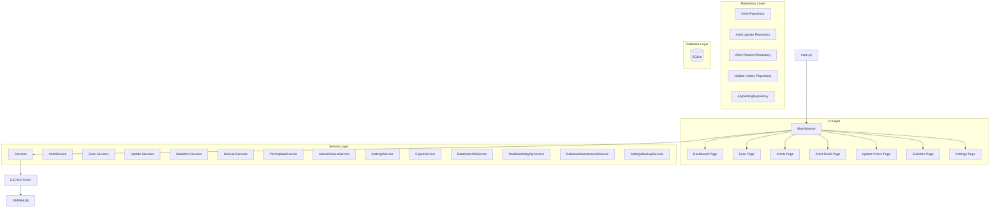

---

# 계층 구조

## Layer 1 - Presentation Layer

사용자 인터페이스를 담당한다.

### 구성

```text
ui/
├─ main_window.py
├─ pages/
└─ widgets/
```

### 역할

* 사용자 입력 처리
* 화면 표시
* 페이지 이동
* 진행률 표시
* 결과 출력
* 스캔 제어
* 업데이트 확인
* 통계 분석
* 설정 및 데이터 관리

### 책임 범위

```text
가능

- 버튼 클릭 처리
- 입력값 수집
- 데이터 표시
- 사용자 이벤트 연결
- 진행률 출력
- 로그 출력

불가능

- SQL 실행
- 데이터 영속화
- Pixiv 통신
- 비즈니스 규칙 처리
```

---

## Layer 2 - Service Layer

프로그램의 핵심 비즈니스 로직을 담당한다.

### 구성

```text
app/services/

├─ artist/
├─ scan/
├─ update/
├─ statistics/
├─ backup/

├─ artwork_status_service.py
├─ database_info_service.py
├─ database_integrity_service.py
├─ database_maintenance_service.py
├─ export_service.py
├─ pixiv_update_service.py
├─ settings_backup_service.py
├─ settings_service.py
└─ __init__.py
```

### 역할

* 작가 등록
* 작가 수정
* 작가 삭제
* 삭제 작가 복구
* 폴더 스캔
* 재스캔
* 업데이트 확인
* 작품 상태 계산
* 업데이트 이력 처리
* 통계 분석
* 데이터 품질 분석
* CSV 내보내기
* 설정 관리
* 데이터베이스 관리
* 백업 관리

### 책임 범위

```text
가능

- 데이터 처리
- 비즈니스 규칙 적용
- Repository 호출
- 서비스 간 협력

불가능

- UI 직접 조작
- SQL 직접 실행
```

---

## Layer 3 - Repository Layer

SQLite 접근을 담당한다.

### 구성

```text
app/database/

├─ artist/
│  ├─ repository.py
│  ├─ update_repository.py
│  ├─ restore_repository.py
│  └─ columns.py
│
├─ connection.py
├─ schema.py
├─ migrations.py
├─ table_definitions.py
├─ update_history_repository.py
├─ app_setting_repository.py
└─ __init__.py
```

### 역할

* CRUD 처리
* 업데이트 처리
* 복구 처리
* 업데이트 이력 저장
* 설정 저장
* SQL 관리
* 데이터 변환
* 마이그레이션

### 책임 범위

```text
가능

- INSERT
- UPDATE
- DELETE
- SELECT
- 트랜잭션 처리

불가능

- UI 처리
- Pixiv 통신
- 비즈니스 규칙 처리
```

---

## Layer 4 - Database Layer

데이터 영구 저장을 담당한다.

### 구성

```text
SQLite
```

### 역할

* 작가 정보 저장
* 설정 저장
* 상태 저장
* 태그 저장
* 메모 저장
* 최근 열람 기록 저장
* 업데이트 정보 저장
* 업데이트 이력 저장
* 누락 작품 정보 저장
* 백업 및 복구 대상 데이터 저장

---

# 의존성 방향

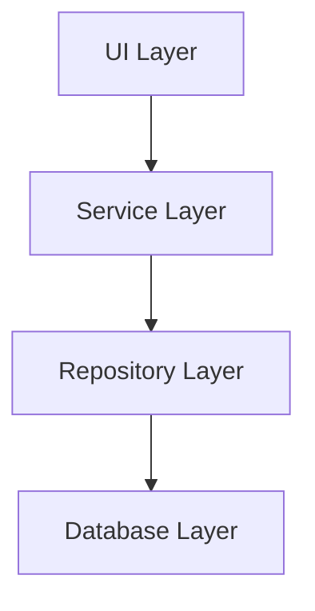

UI 계층은 Service 계층만 호출한다.

Service 계층은 Repository 계층을 통해 데이터에 접근한다.

Repository 계층은 SQLite에 직접 접근한다.

Database 계층은 데이터 저장만 담당한다.

---

# 주요 기능 흐름

## 폴더 스캔

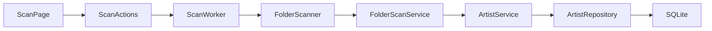

### 설명

* ScanPage는 사용자 입력과 화면 표시를 담당한다.
* ScanActions는 스캔 시작, 중지, 일시정지, 재개를 제어한다.
* ScanWorker는 백그라운드에서 스캔을 수행한다.
* FolderScanner는 스캔 대상 폴더를 탐색한다.
* FolderScanService는 폴더 내부 파일과 작품 정보를 분석한다.
* ArtistService는 분석 결과를 저장 가능한 데이터로 처리한다.
* ArtistRepository는 SQLite에 저장한다.

---

## 스캔 미리보기

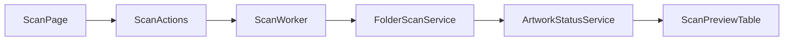

### 설명

* 스캔 미리보기는 DB 저장 전에 예상 결과를 보여준다.
* ScanWorker는 신규 등록, 업데이트, 변경 없음, 오류 예상 항목을 생성한다.
* ScanPreviewTable은 미리보기 결과, 선택 상태, 제외 상태를 표시한다.

---

## 작가 수정

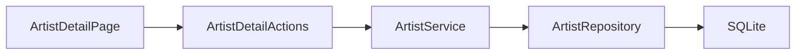

---

## 작가 폴더 변경

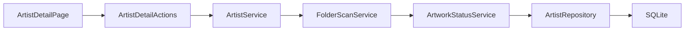

---

## 작가 삭제

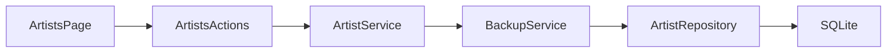

---

## 삭제 작가 복구

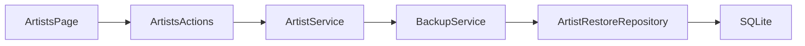

---

## 업데이트 확인

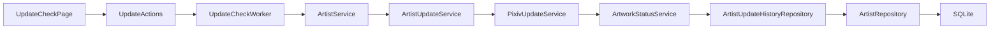

---

## 통계 분석

```mermaid
flowchart LR

StatisticsPage
--> StatisticsActions
--> StatisticsService
--> StatisticsStatusService
--> StatisticsRatingService
--> StatisticsRankingService
--> StatisticsTagService
--> StatisticsQualityService
--> StatisticsFavoriteService
--> ArtistRepository
--> SQLite
```

---

## 설정 저장

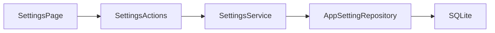

---

## 백업 및 복구

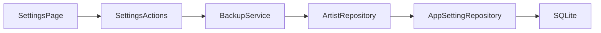

---

# UI 구조

```mermaid id="2n0pbx"
flowchart TD

MainWindow

MainWindow --> Sidebar

MainWindow --> DashboardPage
MainWindow --> ScanPage
MainWindow --> ArtistsPage
MainWindow --> ArtistDetailPage
MainWindow --> UpdateCheckPage
MainWindow --> StatisticsPage
MainWindow --> SettingsPage

ArtistsPage --> ArtistTable

ArtistDetailPage --> ArtistInfoSection

ScanPage --> ScanFolderSection
ScanPage --> ScanProgressSection
ScanPage --> ScanPreviewTable
ScanPage --> ScanLogTable

UpdateCheckPage --> UpdateArtistTable
UpdateCheckPage --> UpdateLogTable

StatisticsPage --> SummarySection
StatisticsPage --> QualitySection
StatisticsPage --> StatusSection
StatisticsPage --> RatingSection
StatisticsPage --> RankingSection
StatisticsPage --> TagSection

SettingsPage --> FolderSection
SettingsPage --> DatabaseSection
SettingsPage --> PixivSection
SettingsPage --> SettingsManagementSection
SettingsPage --> AppInfoSection
```

---

# UI 내부 분리 구조

## Page 구조

```text id="7nl58u"
page.py
├─ actions.py
├─ styles.py
├─ section files
└─ utils.py
```

### 설명

* page.py는 화면 조립과 시그널 연결을 담당한다.
* actions.py는 외부에서 호출하는 액션 진입점 역할을 한다.
* section 파일은 UI 영역을 분리한다.
* styles 파일은 페이지 스타일을 분리한다.
* utils 파일은 UI 전용 보조 함수를 담당한다.

---

## Action Parts 구조

```text id="rh426a"
actions.py
↓
action_parts/
├─ data_actions.py
├─ dialog_actions.py
└─ feature_actions.py
```

### 설명

* actions.py는 Facade 역할을 유지한다.
* 실제 기능은 action_parts 내부 파일로 분리한다.
* 기존 page.py의 import 경로를 크게 바꾸지 않기 위해 진입점 파일을 유지한다.

---

## Worker Parts 구조

```text id="r9z8jj"
worker.py
↓
worker_parts/
├─ validation.py
├─ preview_builder.py
├─ result_builder.py
├─ statistics.py
└─ runtime_utils.py
```

### 설명

* worker.py는 실행 흐름, 상태, signal을 유지한다.
* worker_parts는 검증, 결과 생성, 통계, 시간 계산 등 보조 로직을 분리한다.
* 스캔 상태가 여러 객체로 분산되지 않도록 Worker 본체는 유지한다.

---

# Service 구조

```mermaid id="fhjxbo"
flowchart TD

ArtistService

ArtistService --> ArtistMetadataService
ArtistService --> ArtistFolderService
ArtistService --> ArtistDeleteService
ArtistService --> ArtistValidation

ArtistService --> ArtistRepository
ArtistService --> FolderScanService
ArtistService --> ArtworkStatusService
ArtistService --> BackupService

FolderScanService --> ScanBuilder
FolderScanService --> ScanCompare

ArtistScanService --> ArtistService
ArtistScanService --> FolderScanService

RescanService --> ArtistService
RescanService --> FolderScanService

ArtistUpdateService --> PixivUpdateService
ArtistUpdateService --> ArtworkStatusService
ArtistUpdateService --> ArtistRepository
ArtistUpdateService --> UpdateHistoryRepository

BulkUpdateService --> ArtistUpdateService

BackupService --> DeletedArtistBackupService
BackupService --> DatabaseBackupService
BackupService --> ArtistRepository
BackupService --> AppSettingRepository

ExportService --> ArtistRepository

SettingsService --> AppSettingRepository

DatabaseInfoService --> ArtistRepository

DatabaseIntegrityService --> ArtistRepository

DatabaseMaintenanceService --> SQLite
```

---

## Statistics Service 구조

```text id="wy1ls5"
StatisticsService
│
├─ StatisticsStatusService
├─ StatisticsRatingService
├─ StatisticsRankingService
├─ StatisticsTagService
├─ StatisticsQualityService
└─ StatisticsFavoriteService
```

### 역할

* 통계 데이터 통합
* 상태 분포 생성
* 평점 분포 생성
* 랭킹 생성
* 태그 분석
* 데이터 품질 분석
* 즐겨찾기 통계 생성

---

# Repository 구조

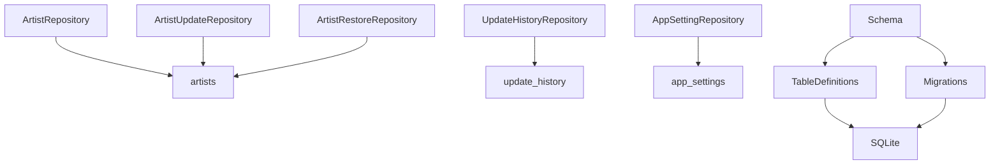

---

# 주요 모듈 분리

## Artists Page

```text id="3hy1fj"
ui/pages/artists/
│
├─ action_parts
│  ├─ bulk_actions.py
│  ├─ data_actions.py
│  ├─ dialog_actions.py
│  └─ __init__.py
│
├─ page.py
├─ actions.py
├─ filters.py
├─ toolbar.py
└─ __init__.py
```

### 역할

* 작가 목록 조회
* 검색 / 필터 / 정렬
* 다중 선택 작업
* 삭제 / 복구
* 업데이트 확인 페이지 이동

---

## Artist Detail Page

```text id="ijjlwm"
ui/pages/artist_detail/
│
├─ action_parts
│  ├─ artwork_actions.py
│  ├─ data_actions.py
│  ├─ dialog_actions.py
│  ├─ tag_actions.py
│  └─ __init__.py
│
├─ page.py
├─ actions.py
├─ styles.py
├─ info_section.py
├─ utils.py
└─ __init__.py
```

### 역할

* 작가 상세 정보 표시
* 평점 관리
* 즐겨찾기 / 숨김 설정
* 태그 관리
* 장문 메모 관리
* 참고 링크 관리
* 다운로드 메모 관리
* 최근 로컬 작품 표시
* 누락 작품 표시
* 업데이트 이력 표시
* Pixiv 바로가기
* 폴더 바로가기
* 폴더 변경 및 재스캔

---

## Scan Page

```text
ui/pages/scan/
│
├─ action_parts
│  ├─ filter_actions.py
│  ├─ folder_actions.py
│  ├─ result_actions.py
│  ├─ worker_actions.py
│  └─ __init__.py
│
├─ preview_table_parts
│  ├─ filter_logic.py
│  ├─ row_renderer.py
│  ├─ summary.py
│  └─ __init__.py
│
├─ progress_parts
│  ├─ history_formatter.py
│  ├─ statistics_formatter.py
│  └─ __init__.py
│
├─ worker_parts
│  ├─ preview_builder.py
│  ├─ result_builder.py
│  ├─ runtime_utils.py
│  ├─ statistics.py
│  ├─ validation.py
│  └─ __init__.py
│
├─ actions.py
├─ folder_scanner.py
├─ folder_section.py
├─ log_table.py
├─ log_utils.py
├─ page.py
├─ preview_table.py
├─ progress_section.py
├─ scan_styles.py
├─ worker.py
└─ __init__.py
```

### 역할

* 폴더 스캔
* 미리보기 생성
* 선택 등록
* 결과 필터링
* 로그 출력
* 진행률 표시
* 최근 스캔 통계 표시
* 일시정지 / 재개 / 중단

---

## Dashboard Page

```text
ui/pages/dashboard/
│
├─ page.py
├─ actions.py
├─ dashboard_metrics.py
├─ dashboard_styles.py
│
├─ summary_section.py
├─ summary_card.py
│
├─ update_status_section.py
├─ scan_statistics_section.py
├─ recent_activity_section.py
├─ recent_artists_section.py
│
├─ top_ranking_section.py
│
├─ recommendation_section.py
├─ recommendation_card.py
│
├─ random_artist_section.py
│
├─ utils.py
└─ __init__.py
```

### 역할

* 전체 통계 카드
* 업데이트 상태 표시
* 최근 스캔 결과
* 최근 활동 표시
* TOP 랭킹 표시
* 추천 작가 표시
* 랜덤 작가 표시

---

## Statistics Page

```text
ui/pages/statistics/
│
├─ page.py
├─ actions.py
├─ styles.py
│
├─ summary_card.py
├─ summary_section.py
│
├─ quality_section.py
├─ status_section.py
├─ rating_section.py
├─ ranking_section.py
├─ tag_section.py
│
└─ __init__.py
```

### 역할

* 기초 통계
* 데이터 품질 분석
* 상태 분포 분석
* 평점 분포 분석
* 작품 수 TOP
* 파일 수 TOP
* 저장 용량 TOP
* 태그 분석

---

## Update Check Page

```text
Update Check Page
│
├─ Artist Table
├─ Selection Actions
├─ Progress Area
├─ Log Table
└─ Result Summary
```

---

## Settings 구조

```text
Settings Page
│
├─ Folder Section
├─ Database Section
├─ Pixiv Section
├─ Settings Management Section
└─ App Info Section
```

---

# Dashboard 아키텍처

## 데이터 생성 구조

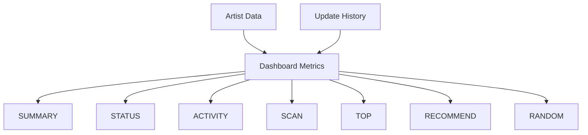

---

## 추천 작가 생성

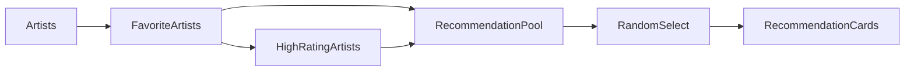

---

## TOP 랭킹 생성

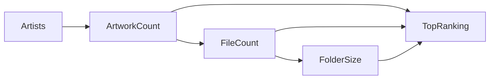

---

# Statistics 아키텍처

## 데이터 생성 구조

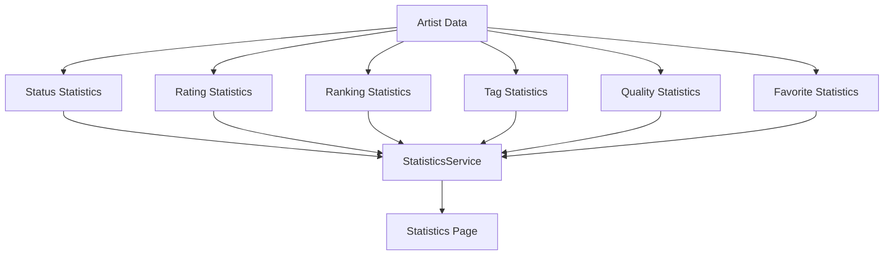

---

## Statistics Service 구조

```text
StatisticsService
│
├─ StatusService
├─ RatingService
├─ RankingService
├─ TagService
├─ QualityService
└─ FavoriteService
```

---

# Repository 구조

## Artist Repository

```text
Artist Repository
│
├─ 조회
├─ 등록
├─ 수정
├─ 삭제
└─ 복구
```

---

## Update History Repository

```text
ArtistUpdateHistoryRepository
│
├─ 이력 저장
├─ 최근 결과 조회
├─ 최근 오류 조회
├─ 최신 결과 조회
├─ 누락 증가 조회
├─ 결과 비교
├─ 신규 누락 계산
└─ 해결 작품 계산
```

---

## App Setting Repository

```text
AppSettingRepository
│
├─ 설정 조회
├─ 설정 저장
└─ 설정 초기화
```

---

# 데이터 저장 구조

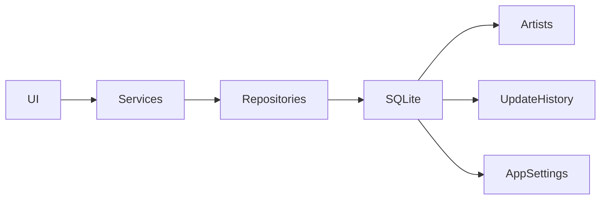

---

# 확장성 설계

## V2

현재 구조는 다음 기능 추가를 고려하여 설계되었다.

```text
통계 분석 고도화
설정 관리 고도화
Pixiv 팔로우 / 북마크 관리
추가 업데이트 기능
성능 최적화
```

---

## V3

향후 작품 단위 관리 시스템을 추가할 수 있도록 설계되어 있다.

```text
Artwork Manager
Artwork Detail
Thumbnail View
Card View
Built-in Viewer
Download Queue
```

---

# 설계 원칙

## 1. 단일 책임 원칙

각 모듈은 하나의 책임만 가진다.

```text
Artist Service
→ 작가 관리

Folder Scan Service
→ 폴더 분석

Statistics Service
→ 통계 생성
```

---

## 2. UI와 비즈니스 로직 분리

```text
UI
→ 입력 / 출력

Service
→ 처리

Repository
→ 저장
```

UI는 Service를 통해서만 데이터에 접근한다.

---

## 3. 기능 단위 모듈화

```text
artist/
scan/
update/
statistics/
backup/
```

기능별로 독립적인 구조를 유지한다.

---

## 4. 확장 우선 설계

향후 기능 추가 시 기존 구조 변경을 최소화한다.

```text
V2
→ 기능 확장

V3
→ 작품 단위 관리
→ 뷰어 시스템
```

---

## 5. 유지보수성 우선

파일 크기가 과도하게 커질 경우 분리한다.

```text
page.py
↓
actions.py
↓
action_parts/
```

---

# 리팩토링 원칙

## 1. 페이지 분리

```text
Page
 ↓

Actions
Sections
Styles
Utils
```

---

## 2. 액션 분리

```text
actions.py
 ↓

action_parts/
```

---

## 3. 워커 분리

```text
worker.py
 ↓

worker_parts/
```

---

## 4. UI / Service 분리

```text
UI
 ↓
Service
 ↓
Repository
 ↓
Database
```

---

## 5. Import 단순화

```python
from ui.pages.scan import ScanPage
from ui.pages.dashboard import DashboardPage
from ui.pages.statistics import StatisticsPage

from app.services import (
    ArtistService,
    BackupService,
    StatisticsService,
)
```

---

# 버전 기준

본 문서는 v0.14.0 (통계 분석 시스템 완료) 기준으로 작성되었다.
