# 시스템 아키텍처 (Architecture)

## 아키텍처 개요

Pixiv Local Manager는 계층형 아키텍처(Layered Architecture)를 사용한다.

각 계층은 자신의 책임만 수행하며, 상위 계층은 하위 계층을 통해 기능을 수행한다.

---

# 전체 구조

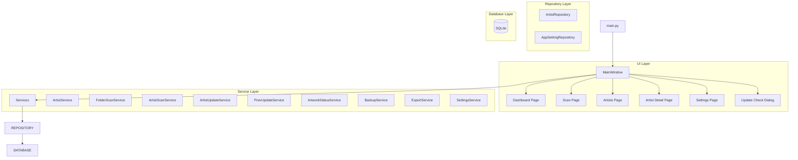

---

# 계층 구조

## Layer 1 - Presentation Layer

사용자 인터페이스를 담당한다.

### 구성

```text
ui/
├─ main_window.py
├─ pages/
├─ dialogs/
└─ widgets/
```

### 역할

* 사용자 입력 처리
* 화면 표시
* 페이지 이동
* 진행률 표시
* 결과 출력

### 책임 범위

```text
가능
- 버튼 클릭
- 입력값 수집
- 데이터 표시
- 사용자 이벤트 연결

불가능
- SQL 실행
- Pixiv 요청
- 데이터 영속화
- 핵심 비즈니스 로직 처리
```

---

## Layer 2 - Service Layer

프로그램의 핵심 비즈니스 로직을 담당한다.

### 구성

```text
app/services/
├─ artist_service.py
├─ folder_scan_service.py
├─ artist_scan_service.py
├─ artist_update_service.py
├─ pixiv_update_service.py
├─ artwork_status_service.py
├─ backup_service.py
├─ export_service.py
└─ settings_service.py
```

### 역할

* 폴더 스캔
* 작가 등록
* 작가 수정
* 작가 폴더 변경
* Pixiv 업데이트 확인
* 작품 ID 비교
* 삭제 전 백업
* 삭제 작가 복구
* CSV 생성
* 설정 관리

### 책임 범위

```text
가능
- 데이터 처리
- 비즈니스 규칙 적용
- Repository 호출
- 서비스 간 협력

불가능
- UI 직접 조작
- SQL 직접 작성
```

---

## Layer 3 - Repository Layer

SQLite 접근을 담당한다.

### 구성

```text
app/database/
├─ connection.py
├─ schema.py
├─ artist_repository.py
└─ app_setting_repository.py
```

### 역할

* CRUD 처리
* 일괄 수정
* 삭제
* 복구용 삽입
* SQL 관리
* 데이터 변환

### 책임 범위

```text
가능
- INSERT
- UPDATE
- DELETE
- SELECT
- 트랜잭션 처리

불가능
- 화면 처리
- Pixiv 요청
- UI 이벤트 처리
```

---

## Layer 4 - Database Layer

데이터 영구 저장을 담당한다.

### 구성

```text
SQLite
```

### 역할

* 작가 정보 저장
* 설정 저장
* 업데이트 상태 저장
* 즐겨찾기 저장
* 숨김 상태 저장
* 태그 저장
* 메모 저장
* 참고 링크 저장
* 다운로드 메모 저장
* 최근 열람 기록 저장
* 백업 및 복구 대상 데이터 보관

---

# 의존성 방향

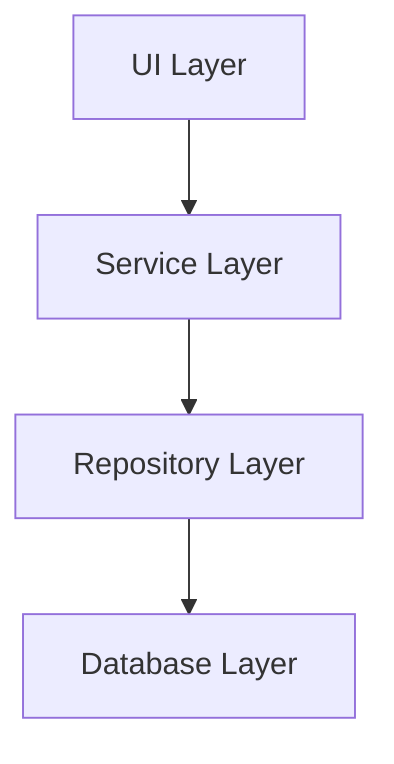

---

# 주요 기능 흐름

## 폴더 스캔

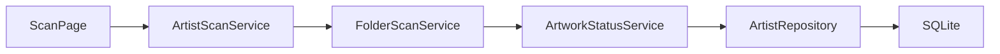

---

## 작가 수정

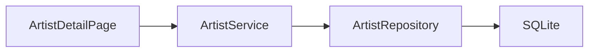

---

## 작가 폴더 변경

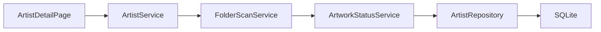

---

## 작가 삭제

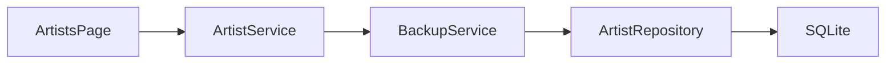

---

## 삭제 작가 복구


---

# 주요 기능 흐름 (계속)

## 업데이트 확인

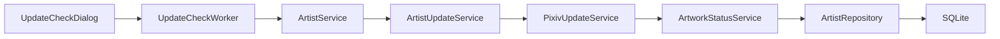

---

## 설정 저장

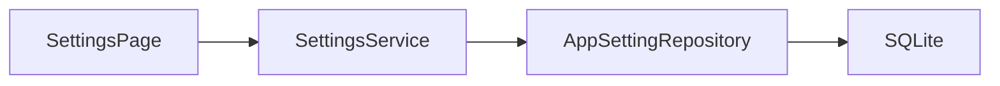

---

# UI 구조

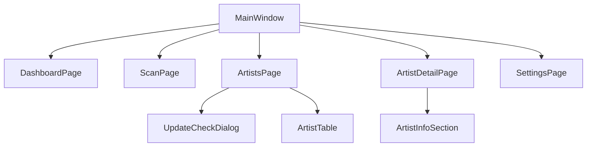

---

# Service 구조

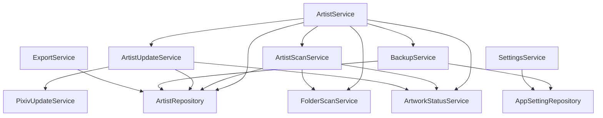

---

# Repository 구조

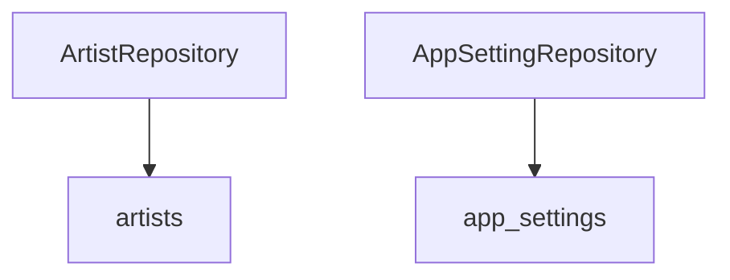

---

# 주요 모듈 분리

## Artists Page

```text id="4hgw0w"
ui/pages/artists/
├─ page.py
├─ actions.py
├─ filters.py
├─ toolbar.py
└─ __init__.py
```

### 역할

* 작가 목록 조회
* 검색 / 필터 / 정렬
* 다중 선택 작업
* 삭제 / 복구
* 업데이트 확인 다이얼로그 실행

---

## Artist Detail Page

```text id="7d6a8l"
ui/pages/artist_detail/
├─ page.py
├─ actions.py
├─ info_section.py
├─ utils.py
└─ __init__.py
```

### 역할

* 작가 상세 정보 표시
* 평점 관리
* 즐겨찾기 / 숨김 설정
* 태그 관리
* 장문 메모 관리
* 참고 링크 관리
* 다운로드 메모 관리
* 최근 로컬 작품 표시
* 누락 작품 표시
* Pixiv 바로가기
* 폴더 바로가기
* 폴더 변경 및 재스캔

---

## Artist Table

```text id="k07yha"
ui/widgets/artist_table/
├─ table.py
├─ actions.py
├─ row_renderer.py
├─ formatters.py
├─ columns.py
├─ cell_widgets.py
└─ __init__.py
```

### 역할

* 작가 목록 테이블 표시
* 행 렌더링
* 컬럼 정의
* 셀 위젯 생성
* 정렬 이벤트 처리
* 바로가기 버튼 처리

---

## Update Check Dialog

```text id="i5xpd5"
ui/dialogs/update_check/
├─ dialog.py
├─ actions.py
├─ worker.py
├─ artist_table.py
├─ log_table.py
├─ selection_actions.py
├─ utils.py
└─ __init__.py
```

### 역할

* 업데이트 대상 선택
* 업데이트 확인 실행
* 백그라운드 작업 처리
* 진행률 표시
* 결과 로그 출력
* 취소 처리

---

# 설계 원칙

<table>
<tr>
    <th>원칙</th>
    <th>설명</th>
</tr>

<tr>
    <td>단일 책임 원칙</td>
    <td>하나의 클래스와 파일은 하나의 주요 책임만 가진다.</td>
</tr>

<tr>
    <td>계층 분리</td>
    <td>UI, Service, Repository, Database 역할을 분리한다.</td>
</tr>

<tr>
    <td>낮은 결합도</td>
    <td>계층 간 의존성을 최소화한다.</td>
</tr>

<tr>
    <td>높은 응집도</td>
    <td>관련 기능은 같은 모듈에 배치한다.</td>
</tr>

<tr>
    <td>확장성</td>
    <td>기능 추가 시 기존 코드 수정 범위를 최소화한다.</td>
</tr>

<tr>
    <td>유지보수성</td>
    <td>대형 파일을 기능별 파일로 분리한다.</td>
</tr>

<tr>
    <td>UI 독립성</td>
    <td>비즈니스 로직은 UI 코드에 의존하지 않는다.</td>
</tr>

<tr>
    <td>데이터 접근 제한</td>
    <td>SQL 실행은 Repository 계층에서만 수행한다.</td>
</tr>

</table>

---

# 향후 확장 방향

## V2

```text id="m1bgjy"
Update Check Enhancement
Dashboard Enhancement
Settings / Management Enhancement
Statistics / Analysis
```

### 예정 서비스

```text id="8ahp9l"
UpdateHistoryService
StatisticsService
LogService
```

---

## V3

```text id="g1mlhu"
View Mode Extension
Artwork Management
Internal Viewer
Long-term Features
```

### 예정 Repository

```text id="lzv6q2"
artwork_repository.py
update_history_repository.py
statistics_repository.py
viewer_repository.py
```

### 예정 Service

```text id="9ckgk4"
ArtworkService
StatisticsService
ViewerService
DownloadService
```

### 예정 UI

```text id="d4ph8s"
ui/pages/artworks
ui/pages/statistics

ui/widgets/artwork_table
ui/widgets/thumbnail_grid
```

---

# 최종 구조 목표

```text id="rvokkh"
UI Layer
→ Service Layer
→ Repository Layer
→ Database Layer
```

각 계층은 자신의 책임만 수행하며,

UI는 데이터 저장 방식을 알 필요가 없고,

Service는 화면 구조를 알 필요가 없으며,

Repository는 비즈니스 로직을 알 필요가 없는 구조를 유지한다.

이를 통해 기능 추가 시 수정 범위를 최소화하고 유지보수성을 확보하는 것을 목표로 한다.

---
