# 시스템 아키텍처 (Architecture)

## 아키텍처 개요

Pixiv Local Manager는 계층형 아키텍처(Layered Architecture)를 사용한다.

각 계층은 자신의 책임만 수행하며, 상위 계층은 하위 계층을 통해 기능을 수행한다.

v0.10.0 2차 리팩토링 이후 기능 단위 모듈 분리 구조를 적용하여 유지보수성과 확장성을 향상시켰다.

---

# 전체 구조

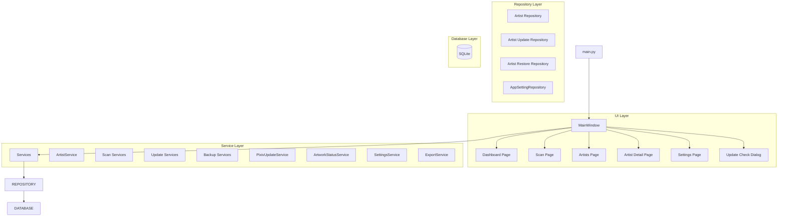

---

# 계층 구조

## Layer 1 - Presentation Layer

사용자 인터페이스를 담당한다.

### 구성

```text
ui/
├─ main_window.py
├─ pages/
├─ dialogs/
└─ widgets/
```

### 역할

* 사용자 입력 처리
* 화면 표시
* 페이지 이동
* 진행률 표시
* 결과 출력
* 스캔 제어
* 업데이트 확인

### 책임 범위

```text
가능

- 버튼 클릭 처리
- 입력값 수집
- 데이터 표시
- 사용자 이벤트 연결
- 진행률 출력
- 로그 출력

불가능

- SQL 실행
- 데이터 영속화
- Pixiv 통신
- 비즈니스 규칙 처리
```

---

## Layer 2 - Service Layer

프로그램의 핵심 비즈니스 로직을 담당한다.

### 구성

```text
app/services/

├─ artist/
├─ scan/
├─ update/
├─ backup/

├─ artwork_status_service.py
├─ export_service.py
├─ pixiv_update_service.py
├─ settings_service.py
└─ __init__.py
```

### 역할

* 작가 등록
* 작가 수정
* 작가 삭제
* 삭제 작가 복구
* 폴더 스캔
* 재스캔
* 업데이트 확인
* 작품 상태 계산
* CSV 내보내기
* 설정 관리

### 책임 범위

```text
가능

- 데이터 처리
- 비즈니스 규칙 적용
- Repository 호출
- 서비스 간 협력

불가능

- UI 직접 조작
- SQL 직접 실행
```

---

## Layer 3 - Repository Layer

SQLite 접근을 담당한다.

### 구성

```text
app/database/

├─ artist/
│  ├─ repository.py
│  ├─ update_repository.py
│  ├─ restore_repository.py
│  └─ columns.py
│
├─ connection.py
├─ schema.py
├─ migrations.py
├─ table_definitions.py
├─ app_setting_repository.py
└─ __init__.py
```

### 역할

* CRUD 처리
* 업데이트 처리
* 복구 처리
* SQL 관리
* 데이터 변환
* 마이그레이션

### 책임 범위

```text
가능

- INSERT
- UPDATE
- DELETE
- SELECT
- 트랜잭션 처리

불가능

- UI 처리
- Pixiv 통신
- 비즈니스 규칙 처리
```

---

## Layer 4 - Database Layer

데이터 영구 저장을 담당한다.

### 구성

```text
SQLite
```

### 역할

* 작가 정보 저장
* 설정 저장
* 상태 저장
* 태그 저장
* 메모 저장
* 최근 열람 기록 저장
* 업데이트 정보 저장
* 백업 및 복구 대상 데이터 저장

---

# 의존성 방향

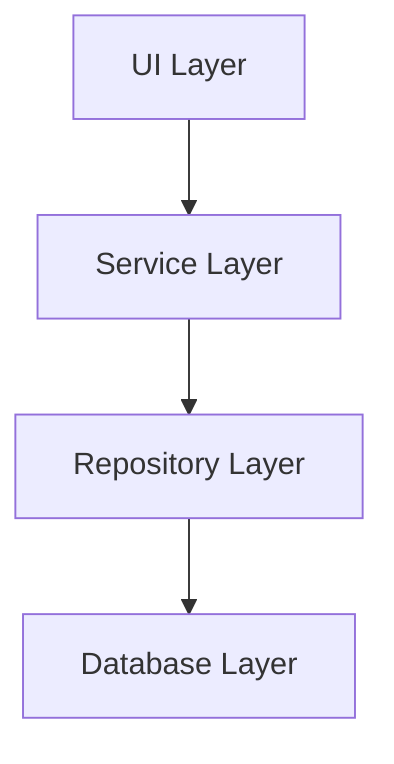

UI 계층은 Service 계층만 호출한다.

Service 계층은 Repository 계층을 통해 데이터에 접근한다.

Repository 계층은 SQLite에 직접 접근한다.

Database 계층은 데이터 저장만 담당한다.

---

# 주요 기능 흐름

## 폴더 스캔

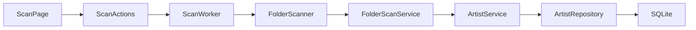

### 설명

* ScanPage는 사용자 입력과 화면 표시를 담당한다.
* ScanActions는 스캔 시작, 중지, 일시정지, 재개를 제어한다.
* ScanWorker는 백그라운드에서 스캔을 수행한다.
* FolderScanner는 스캔 대상 폴더를 탐색한다.
* FolderScanService는 폴더 내부 파일과 작품 정보를 분석한다.
* ArtistService는 분석 결과를 저장 가능한 데이터로 처리한다.
* ArtistRepository는 SQLite에 저장한다.

---

## 스캔 미리보기

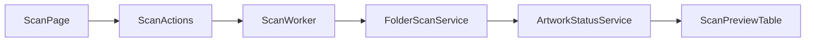

### 설명

* 스캔 미리보기는 DB 저장 전에 예상 결과를 보여준다.
* ScanWorker는 신규 등록, 업데이트, 변경 없음, 오류 예상 항목을 생성한다.
* ScanPreviewTable은 미리보기 결과, 선택 상태, 제외 상태를 표시한다.

---

## 작가 수정

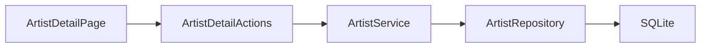

---

## 작가 폴더 변경

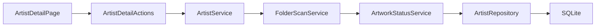

---

## 작가 삭제

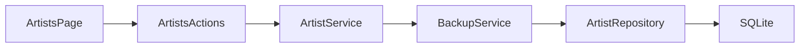

---

## 삭제 작가 복구

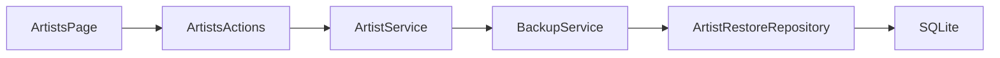

---

## 업데이트 확인

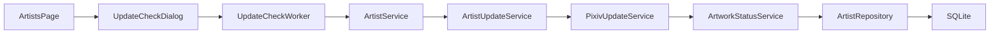

---

## 설정 저장

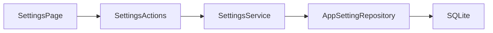

---

## 백업 및 복구

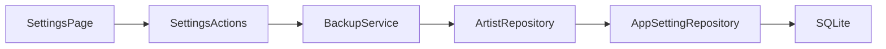

---

# UI 구조

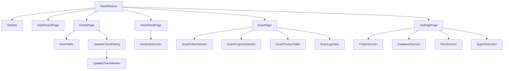

---

# UI 내부 분리 구조

## Page 구조

```text id="7nl58u"
page.py
├─ actions.py
├─ styles.py
├─ section files
└─ utils.py
```

### 설명

* page.py는 화면 조립과 시그널 연결을 담당한다.
* actions.py는 외부에서 호출하는 액션 진입점 역할을 한다.
* section 파일은 UI 영역을 분리한다.
* styles 파일은 페이지 스타일을 분리한다.
* utils 파일은 UI 전용 보조 함수를 담당한다.

---

## Action Parts 구조

```text id="rh426a"
actions.py
↓
action_parts/
├─ data_actions.py
├─ dialog_actions.py
└─ feature_actions.py
```

### 설명

* actions.py는 Facade 역할을 유지한다.
* 실제 기능은 action_parts 내부 파일로 분리한다.
* 기존 page.py의 import 경로를 크게 바꾸지 않기 위해 진입점 파일을 유지한다.

---

## Worker Parts 구조

```text id="r9z8jj"
worker.py
↓
worker_parts/
├─ validation.py
├─ preview_builder.py
├─ result_builder.py
├─ statistics.py
└─ runtime_utils.py
```

### 설명

* worker.py는 실행 흐름, 상태, signal을 유지한다.
* worker_parts는 검증, 결과 생성, 통계, 시간 계산 등 보조 로직을 분리한다.
* 스캔 상태가 여러 객체로 분산되지 않도록 Worker 본체는 유지한다.

---

# Service 구조

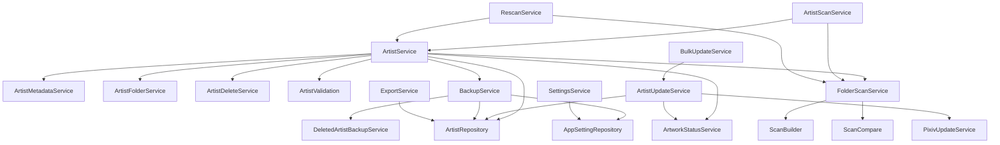

---

# Repository 구조

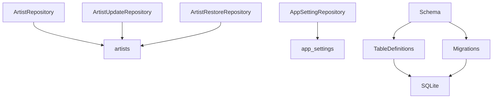

---

# 주요 모듈 분리

## Artists Page

```text
ui/pages/artists/
│
├─ action_parts
│  ├─ bulk_actions.py
│  ├─ data_actions.py
│  ├─ dialog_actions.py
│  └─ __init__.py
│
├─ page.py
├─ actions.py
├─ filters.py
├─ toolbar.py
└─ __init__.py
```

### 역할

* 작가 목록 조회
* 검색 / 필터 / 정렬
* 다중 선택 작업
* 삭제 / 복구
* 업데이트 확인 다이얼로그 실행

---

## Artist Detail Page

```text
ui/pages/artist_detail/
│
├─ action_parts
│  ├─ artwork_actions.py
│  ├─ data_actions.py
│  ├─ dialog_actions.py
│  ├─ tag_actions.py
│  └─ __init__.py
│
├─ page.py
├─ actions.py
├─ styles.py
├─ info_section.py
├─ utils.py
└─ __init__.py
```

### 역할

* 작가 상세 정보 표시
* 평점 관리
* 즐겨찾기 / 숨김 설정
* 태그 관리
* 장문 메모 관리
* 참고 링크 관리
* 다운로드 메모 관리
* 최근 로컬 작품 표시
* 누락 작품 표시
* Pixiv 바로가기
* 폴더 바로가기
* 폴더 변경 및 재스캔

---

## Scan Page

```text
ui/pages/scan/
│
├─ action_parts
│  ├─ folder_actions.py
│  ├─ worker_actions.py
│  ├─ filter_actions.py
│  ├─ result_actions.py
│  └─ __init__.py
│
├─ preview_table_parts
│  ├─ filter_logic.py
│  ├─ row_renderer.py
│  ├─ summary.py
│  └─ __init__.py
│
├─ progress_parts
│  ├─ history_formatter.py
│  ├─ statistics_formatter.py
│  └─ __init__.py
│
├─ worker_parts
│  ├─ validation.py
│  ├─ preview_builder.py
│  ├─ result_builder.py
│  ├─ statistics.py
│  ├─ runtime_utils.py
│  └─ __init__.py
│
├─ page.py
├─ actions.py
├─ worker.py
├─ scan_styles.py
├─ folder_scanner.py
├─ folder_section.py
├─ preview_table.py
├─ progress_section.py
├─ log_table.py
├─ log_utils.py
└─ __init__.py
```

### 역할

* 스캔 대상 폴더 선택
* 스캔 미리보기
* 선택 항목 등록
* 스캔 실행
* 일시정지 / 재개 / 중지
* 실패 항목 재시도
* 스캔 결과 CSV 저장
* 최근 스캔 이력 표시
* 직전 스캔 대비 표시

---

## Dashboard Page

```text
ui/pages/dashboard/
│
├─ page.py
├─ actions.py
├─ dashboard_metrics.py
├─ dashboard_styles.py
├─ summary_section.py
├─ recent_artists_section.py
├─ recent_scan_section.py
├─ random_artist_section.py
├─ recommendation_section.py
├─ recommendation_card.py
├─ utils.py
└─ __init__.py
```

### 역할

* 전체 통계 표시
* 최근 등록 작가 표시
* 최근 스캔 정보 표시
* 추천 작가 표시
* 랜덤 작가 표시

---

## Settings Page

```text
ui/pages/settings/
│
├─ page.py
├─ actions.py
├─ settings_styles.py
├─ folder_section.py
├─ database_section.py
├─ pixiv_section.py
├─ app_info_section.py
├─ database_utils.py
└─ __init__.py
```

### 역할

* 기본 Pixiv 폴더 관리
* PHPSESSID 관리
* DB 백업
* DB 복원
* CSV 내보내기
* DB 폴더 열기
* 프로그램 정보 표시

---

## Artist Table

```text
ui/widgets/artist_table/
│
├─ table.py
├─ actions.py
├─ row_renderer.py
├─ formatters.py
├─ columns.py
├─ cell_widgets.py
└─ __init__.py
```

### 역할

* 작가 목록 테이블 표시
* 행 렌더링
* 컬럼 정의
* 셀 위젯 생성
* 정렬 이벤트 처리
* 바로가기 버튼 처리

---

## Update Check Dialog

```text
ui/dialogs/update_check/
│
├─ dialog.py
├─ dialog_styles.py
├─ worker.py
├─ worker_config.py
└─ __init__.py
```

### 역할

* 업데이트 대상 선택
* 업데이트 확인 실행
* 백그라운드 작업 처리
* 진행률 표시
* 결과 로그 출력
* 취소 처리

---

# 설계 원칙

<table>
<tr>
    <th>원칙</th>
    <th>설명</th>
</tr>

<tr>
    <td>단일 책임 원칙</td>
    <td>하나의 클래스와 파일은 하나의 주요 책임을 가진다.</td>
</tr>

<tr>
    <td>계층 분리</td>
    <td>UI, Service, Repository, Database 역할을 분리한다.</td>
</tr>

<tr>
    <td>낮은 결합도</td>
    <td>계층 간 의존성을 최소화한다.</td>
</tr>

<tr>
    <td>높은 응집도</td>
    <td>관련 기능은 같은 모듈에 배치한다.</td>
</tr>

<tr>
    <td>Facade 유지</td>
    <td>actions.py, worker.py 등 주요 진입점 파일은 유지하고 내부 구현을 기능별로 분리한다.</td>
</tr>

<tr>
    <td>점진적 리팩토링</td>
    <td>기능 개발 과정에서 비대해진 파일을 선택적으로 분리한다.</td>
</tr>

<tr>
    <td>UI 독립성</td>
    <td>비즈니스 로직은 UI 코드에 의존하지 않는다.</td>
</tr>

<tr>
    <td>데이터 접근 제한</td>
    <td>SQL 실행은 Repository 계층에서만 수행한다.</td>
</tr>

<tr>
    <td>확장성</td>
    <td>V2, V3 기능 확장을 고려하여 구조를 유지한다.</td>
</tr>

<tr>
    <td>유지보수성</td>
    <td>대형 파일은 기능별 파일로 분리한다.</td>
</tr>

</table>

---

# 향후 확장 방향

## V2 남은 개발

```text
v0.11.0 - 업데이트 확인 고도화
v0.12.0 - 대시보드 고도화
v0.13.0 - 설정 / 관리 고도화
v0.14.0 - 통계 / 분석 기능
v0.15.0 - 3차 리팩토링
v0.16.0 - 누락 기능 개발 및 버그 수정
v1.0.0 - V2 완료 및 배포 준비
```

### 예정 서비스

```text
UpdateHistoryService
StatisticsService
LogService
```

---

## V3

```text
View Mode Extension
Artwork Management
Internal Viewer
Long-term Features
```

### 예정 Repository

```text
artwork_repository.py
update_history_repository.py
statistics_repository.py
viewer_repository.py
```

### 예정 Service

```text
ArtworkService
StatisticsService
ViewerService
DownloadService
```

### 예정 UI

```text
ui/pages/artworks
ui/pages/statistics
ui/pages/viewer

ui/widgets/artwork_table
ui/widgets/thumbnail_grid
ui/widgets/artwork_card
```

---

# 최종 구조 목표

```text
UI Layer
→ Service Layer
→ Repository Layer
→ Database Layer
```

각 계층은 자신의 책임만 수행한다.

UI는 데이터 저장 방식을 알 필요가 없고, Service는 화면 구조를 알 필요가 없으며, Repository는 비즈니스 로직을 알 필요가 없는 구조를 유지한다.

이를 통해 기능 추가 시 수정 범위를 최소화하고 유지보수성을 확보하는 것을 목표로 한다.

---

# 버전 기준

본 문서는 v0.10.0 (2차 리팩토링 완료) 기준으로 작성되었다.

