# 시스템 아키텍처 (Architecture)

## 아키텍처 개요

Pixiv Local Manager는 계층형 아키텍처(Layered Architecture)를 사용한다.

각 계층은 자신의 책임만 수행하며 상위 계층은 하위 계층을 통해 기능을 수행한다.

UI는 직접 데이터베이스에 접근하지 않으며 Service 계층을 통해 데이터를 처리한다.

```text
UI
→ Service
→ Repository
→ Database
```

---

# 전체 구조

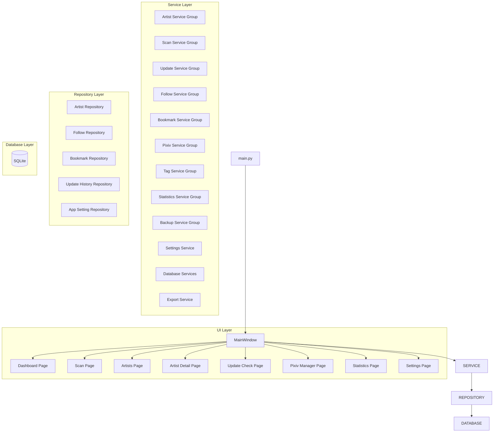

---

# 계층 구조

## Layer 1 - Presentation Layer

사용자 인터페이스를 담당한다.

### 역할

* 사용자 입력 처리
* 화면 표시
* 페이지 이동
* 진행률 표시
* 로그 출력
* 스캔 제어
* 업데이트 확인
* Pixiv 관리
* 통계 분석
* 설정 관리

### 책임 범위

```text
가능

- 버튼 클릭 처리
- 입력값 수집
- 데이터 표시
- 사용자 이벤트 연결
- 진행률 출력
- 로그 출력

불가능

- SQL 실행
- 데이터 영속화
- Pixiv API 통신
- 비즈니스 규칙 처리
```

---

## Layer 2 - Service Layer

프로그램의 핵심 비즈니스 로직을 담당한다.

### 구성

```text
artist/
backup/
bookmark/
follow/
pixiv/
scan/
statistics/
tag/
update/

artwork_status_service.py
database_info_service.py
database_integrity_service.py
database_maintenance_service.py
export_service.py
pixiv_update_service.py
settings_backup_service.py
settings_service.py
```

### 역할

* 작가 관리
* 폴더 스캔
* 업데이트 확인
* Pixiv 데이터 수집
* Pixiv 데이터 동기화
* 태그 처리
* 통계 분석
* 백업 및 복구
* 설정 관리
* 데이터베이스 유지보수

### 책임 범위

```text
가능

- 데이터 처리
- 비즈니스 규칙 적용
- Repository 호출
- 서비스 간 협력
- Pixiv API 통신
- 통계 계산
- 태그 가공

불가능

- UI 직접 조작
- SQL 직접 실행
```

---

## Layer 3 - Repository Layer

데이터 저장 및 조회를 담당한다.

### 구성

```text
artist/
bookmark/
follow/

app_setting_repository.py
update_history_repository.py

connection.py
migrations.py
schema.py
table_definitions.py
```

### 역할

* 작가 데이터 저장
* 팔로우 유저 저장
* 북마크 작품 저장
* 업데이트 이력 저장
* 설정 저장
* SQL 관리
* 데이터 변환
* 스키마 관리

### 책임 범위

```text
가능

- INSERT
- UPDATE
- DELETE
- SELECT
- 트랜잭션 처리

불가능

- UI 처리
- Pixiv API 통신
- 비즈니스 규칙 처리
```

---

## Layer 4 - Database Layer

데이터 영구 저장을 담당한다.

### 구성

```text
SQLite
```

### 역할

* 작가 정보 저장
* 태그 정보 저장
* 상태 정보 저장
* 업데이트 정보 저장
* 최근 열람 기록 저장
* 업데이트 이력 저장
* 팔로우 유저 저장
* 북마크 작품 저장
* 프로그램 설정 저장

### 저장 대상

```text
artists

follow_users

bookmark_artworks

update_history

app_settings
```

---

# 의존성 방향

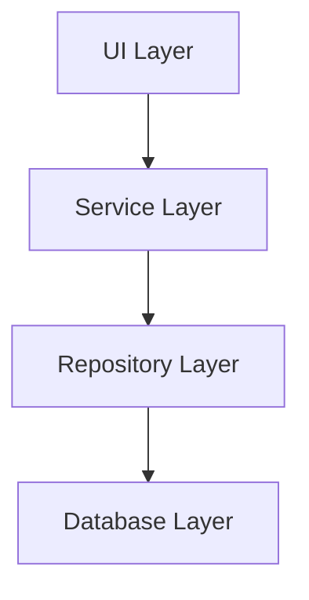

UI 계층은 Service 계층만 호출한다.

Service 계층은 Repository 계층을 통해 데이터에 접근한다.

Repository 계층은 SQLite에 직접 접근한다.

Database 계층은 데이터 저장만 담당한다.

---

# 주요 기능 흐름

## 폴더 스캔

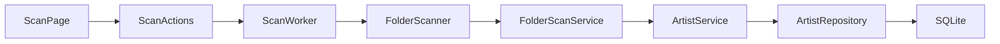

### 설명

* ScanPage는 스캔 화면과 사용자 입력을 담당한다.
* ScanActions는 스캔 시작, 중지, 일시정지, 재개 요청을 처리한다.
* ScanWorker는 백그라운드에서 스캔 작업을 실행한다.
* FolderScanner는 스캔 대상 폴더를 탐색한다.
* FolderScanService는 폴더 내부 파일, 작품 수, 파일 수, 저장 용량을 분석한다.
* ArtistService는 분석 결과를 작가 데이터로 가공한다.
* ArtistRepository는 작가 정보를 SQLite에 저장한다.

---

## 스캔 미리보기

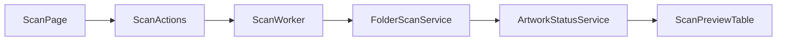

### 설명

* 스캔 미리보기는 DB 저장 전에 예상 결과를 표시한다.
* ScanActions는 미리보기 실행 요청을 처리한다.
* ScanWorker는 백그라운드에서 폴더 정보를 분석한다.
* FolderScanService는 작품 수, 파일 수, 저장 용량을 계산한다.
* ArtworkStatusService는 신규 등록, 업데이트, 변경 없음, 오류 예상 상태를 계산한다.
* ScanPreviewTable은 미리보기 결과와 선택 상태를 표시한다.

---

## 작가 수정

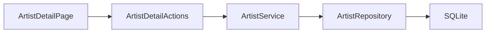

### 설명

* ArtistDetailPage는 작가 정보를 화면에 표시한다.
* ArtistDetailActions는 저장 버튼 클릭과 입력값 검증을 처리한다.
* ArtistService는 입력 데이터를 저장 가능한 형태로 가공한다.
* ArtistRepository는 변경된 작가 정보를 SQLite에 저장한다.
* 저장 후 목록과 상세 화면을 갱신한다.

---

## 작가 폴더 변경

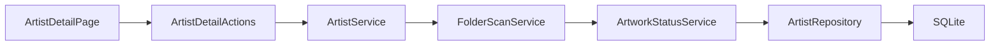

### 설명

* ArtistDetailPage에서 새 폴더 경로를 선택한다.
* ArtistDetailActions는 폴더 변경 요청을 처리한다.
* FolderScanService는 새 폴더의 작품 수, 파일 수, 저장 용량을 다시 계산한다.
* ArtworkStatusService는 로컬 작품 정보와 Pixiv 작품 정보를 비교하여 상태를 갱신한다.
* ArtistRepository는 변경된 폴더 정보와 재스캔 결과를 저장한다.

---

## 작가 삭제

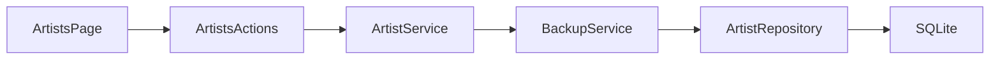

### 설명

* ArtistsPage에서 삭제할 작가를 선택한다.
* ArtistsActions는 삭제 요청을 처리한다.
* BackupService는 삭제 전 작가 정보를 JSON 백업으로 저장한다.
* ArtistRepository는 선택한 작가를 SQLite에서 삭제한다.

---

## 삭제 작가 복구


### 설명

* ArtistsPage에서 삭제 작가 복구 기능을 실행한다.
* BackupService는 백업 파일을 읽는다.
* ArtistRepository는 복구 가능한 작가를 다시 저장한다.
* 복구 완료 후 목록을 갱신한다.

---

## 업데이트 확인

```mermaid
flowchart LR

UpdateCheckPage
--> UpdateCheckActions
--> UpdateCheckWorker
--> ArtistService
--> ArtistUpdateService
--> PixivUpdateService
--> PixivMetadataService
--> TagService
--> ArtworkStatusService
--> UpdateHistoryRepository
--> ArtistRepository
--> SQLite
```

### 설명

* UpdateCheckPage는 업데이트 확인 대상 작가 목록과 실행 옵션을 표시한다.
* UpdateCheckActions는 시작, 일시정지, 재개, 중지를 제어한다.
* UpdateCheckWorker는 선택된 작가를 백그라운드에서 순차 처리한다.
* ArtistService는 업데이트 확인 요청을 처리한다.
* ArtistUpdateService는 Pixiv 최신 작품 정보를 계산한다.
* PixivUpdateService는 Pixiv 최신 작품 ID를 조회한다.
* PixivMetadataService는 태그 통계를 조회한다.
* TagService는 기존 태그와 Pixiv 태그를 병합한다.
* ArtworkStatusService는 누락 작품 수와 상태를 계산한다.
* UpdateHistoryRepository는 업데이트 결과와 변화 이력을 저장한다.
* ArtistRepository는 최신 Pixiv 정보와 상태를 저장한다.
* 결과는 로그, 통계, 작가 상세 페이지에 반영된다.

---

## Pixiv 팔로우 유저 가져오기

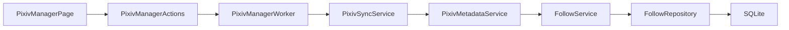

### 설명

* PixivManagerPage는 팔로우 유저 관리 UI를 제공한다.
* PixivManagerActions는 가져오기 및 동기화 요청을 처리한다.
* PixivManagerWorker는 백그라운드에서 작업을 수행한다.
* PixivSyncService는 Pixiv 요청 흐름을 관리한다.
* PixivMetadataService는 유저 정보를 수집한다.
* FollowService는 데이터를 저장 가능한 형태로 가공한다.
* FollowRepository는 팔로우 유저 정보를 저장한다.
* 결과는 목록, 통계, 로그에 반영된다.

---

## Pixiv 북마크 작품 가져오기

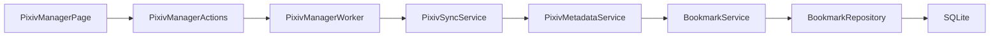

### 설명

* PixivManagerPage는 북마크 작품 관리 UI를 제공한다.
* PixivManagerActions는 작품 가져오기 및 동기화 요청을 처리한다.
* PixivManagerWorker는 백그라운드에서 정보를 수집한다.
* PixivMetadataService는 작품 정보, 태그, AI 여부를 수집한다.
* BookmarkService는 수집 데이터를 정규화한다.
* BookmarkRepository는 북마크 작품 정보를 저장한다.
* 결과는 북마크 목록과 통계에 반영된다.

---

## 태그 동기화

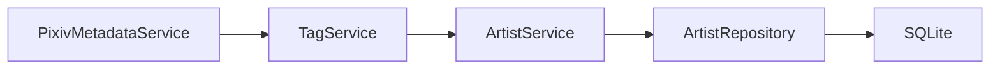

### 설명

* PixivMetadataService는 Pixiv 태그 통계 API를 통해 원문 태그, 번역 태그, 작품 수를 수집한다.
* TagService는 Pixiv 태그 데이터를 내부 태그 구조로 정규화한다.
* TagService는 기존 태그와 Pixiv 태그를 원문 기준으로 병합한다.
* ArtistService는 병합된 태그 데이터를 작가 정보 갱신에 포함한다.
* ArtistRepository는 직렬화된 태그 데이터를 저장한다.

---

## 통계 분석

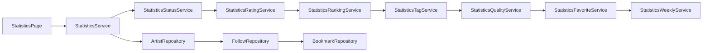

### 설명

* StatisticsPage는 통계 분석 화면을 표시한다.
* StatisticsService는 하위 통계 서비스 결과를 통합한다.
* StatisticsStatusService는 상태 분포를 계산한다.
* StatisticsRatingService는 평점 분포를 계산한다.
* StatisticsRankingService는 작품 수, 파일 수, 저장 용량 랭킹을 생성한다.
* StatisticsTagService는 태그 사용 통계를 분석한다.
* StatisticsQualityService는 데이터 품질을 계산한다.
* StatisticsFavoriteService는 즐겨찾기 통계를 계산한다.
* StatisticsWeeklyService는 주간 변화 데이터를 계산한다.
* FollowRepository와 BookmarkRepository를 통해 Pixiv 통계를 생성한다.

---

## 설정 저장

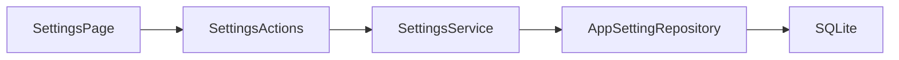

### 설명

* SettingsPage는 설정 입력 화면을 제공한다.
* SettingsActions는 저장 버튼 클릭과 입력값 검증을 처리한다.
* SettingsService는 설정값을 저장 형식으로 변환한다.
* AppSettingRepository는 설정값을 app_settings 테이블에 저장한다.

---

## 백업 및 복구

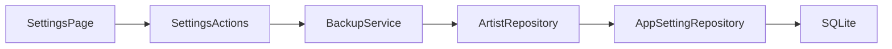

### 설명

* SettingsPage는 백업, 복원, 데이터베이스 관리 기능을 제공한다.
* BackupService는 데이터베이스 백업 파일을 생성하거나 복원한다.
* ArtistRepository는 작가 데이터를 제공한다.
* AppSettingRepository는 설정 데이터를 제공한다.
* SQLite 파일은 백업, 복원, 최적화 대상이 된다.

---

# UI 구조

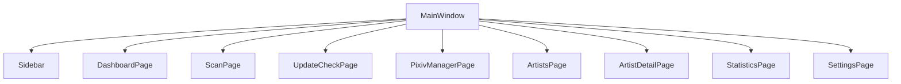

## 설명

MainWindow는 전체 페이지를 관리한다.

Sidebar를 통해 페이지를 전환한다.

각 기능은 독립 Page 구조로 분리되어 있으며,
페이지별 기능은 Service 계층과 연동하여 동작한다.

공통 기능은 Widget으로 분리하여 재사용한다.

---

# Service 구조

```mermaid
flowchart TD

ArtistServiceGroup
ScanServiceGroup
UpdateServiceGroup

FollowServiceGroup
BookmarkServiceGroup

PixivServiceGroup
TagServiceGroup

StatisticsServiceGroup

BackupServiceGroup
SettingsService

DatabaseServices
ExportService

ArtistServiceGroup --> RepositoryLayer
ScanServiceGroup --> RepositoryLayer
UpdateServiceGroup --> RepositoryLayer

FollowServiceGroup --> RepositoryLayer
BookmarkServiceGroup --> RepositoryLayer

PixivServiceGroup --> RepositoryLayer
TagServiceGroup --> RepositoryLayer

StatisticsServiceGroup --> RepositoryLayer

BackupServiceGroup --> RepositoryLayer
SettingsService --> RepositoryLayer

DatabaseServices --> RepositoryLayer
ExportService --> RepositoryLayer
```

## 설명

Service Layer는 프로그램의 핵심 비즈니스 로직을 담당한다.

UI는 직접 Repository를 호출하지 않는다.

모든 데이터 처리는 Service를 통해 수행된다.

기능 규모가 커진 영역은 Service Group 구조로 분리하여 관리한다.

현재 구조는 다음 그룹으로 구성된다.

* Artist Service Group
* Scan Service Group
* Update Service Group
* Follow Service Group
* Bookmark Service Group
* Pixiv Service Group
* Tag Service Group
* Statistics Service Group
* Backup Service Group
* Settings Service

---

# Repository 구조

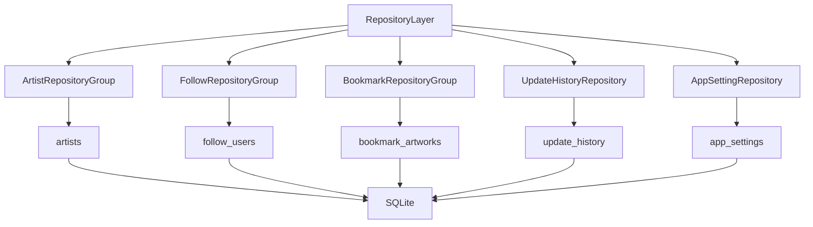

## 설명

Repository Layer는 데이터 저장 및 조회를 담당한다.

Service는 Repository를 통해 데이터에 접근한다.

Repository는 비즈니스 로직을 처리하지 않으며 데이터 저장 기능만 담당한다.

현재 저장 구조는 다음과 같다.

* artists
* follow_users
* bookmark_artworks
* update_history
* app_settings

모든 데이터는 SQLite 데이터베이스에 저장된다.

---

# Dashboard 아키텍처

## 데이터 생성 구조

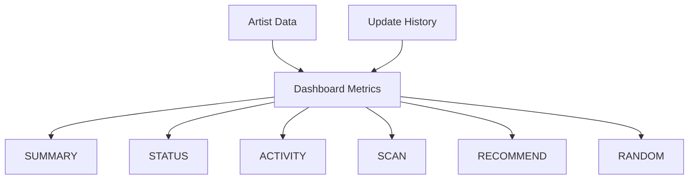

---

## 추천 작가 생성

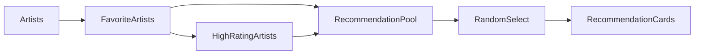

---

## TOP 랭킹 생성

```mermaid
flowchart LR

Artists

--> ArtworkCount
--> FileCount
--> FolderSize

ArtworkCount --> TopRanking
FileCount --> TopRanking
FolderSize --> TopRanking
```

---


## 랜덤 작가 생성

```mermaid
flowchart LR

Artists
--> RandomPool
--> RandomSelect
--> RandomArtistCard
```

---

# Statistics 아키텍처

## 데이터 생성 구조

```mermaid
flowchart TD

ARTISTS[Artist Data]
FOLLOWS[Follow Users]
BOOKMARKS[Bookmark Artworks]
HISTORY[Update History]

ARTISTS --> STATUS
ARTISTS --> RATING
ARTISTS --> RANKING
ARTISTS --> TAG
ARTISTS --> QUALITY
ARTISTS --> FAVORITE

FOLLOWS --> PIXIV
BOOKMARKS --> PIXIV

HISTORY --> WEEKLY

STATUS[Status Statistics]
RATING[Rating Statistics]
RANKING[Ranking Statistics]
TAG[Tag Statistics]
QUALITY[Quality Statistics]
FAVORITE[Favorite Statistics]
PIXIV[Pixiv Statistics]
WEEKLY[Weekly Statistics]

STATUS --> STATISTICS
RATING --> STATISTICS
RANKING --> STATISTICS
TAG --> STATISTICS
QUALITY --> STATISTICS
FAVORITE --> STATISTICS
PIXIV --> STATISTICS
WEEKLY --> STATISTICS

STATISTICS[Statistics Service Group]

STATISTICS --> PAGE[Statistics Page]
```

---

# 데이터 저장 구조

```mermaid
flowchart LR

UI
--> Services

Services
--> Repositories

Repositories
--> SQLite

SQLite
--> Artists

SQLite
--> FollowUsers

SQLite
--> BookmarkArtworks

SQLite
--> UpdateHistory

SQLite
--> AppSettings
```

---

# 확장성 설계

## V2

현재 구조는 다음 기능을 기준으로 설계되었다.

```text
작가 관리
작가 상세 관리
스캔 시스템
업데이트 확인
대시보드
통계 분석
설정 관리
Pixiv 팔로우 관리
Pixiv 북마크 관리
Pixiv 태그 연동
```

---

## V3

향후 작품 단위 관리 시스템을 추가할 수 있도록 설계되어 있다.

```text
작품 관리
작품 상세 관리
썸네일 뷰
카드 뷰
내장 뷰어
다운로드 큐
작품 태그 관리
작품 컬렉션 관리

팔로우 / 북마크 상세
Pixiv 자동 동기화
Pixiv 검색 기능
동기화 이력 분석
예약 업데이트 확인
```

---

# 설계 원칙

## 1. 단일 책임 원칙

각 모듈은 하나의 책임만 가진다.

```text
Artist Service
→ 작가 관리

Folder Scan Service
→ 폴더 분석

Artist Update Service
→ 업데이트 확인

Pixiv Service Group
→ Pixiv 데이터 처리

Statistics Service Group
→ 통계 분석
```

---

## 2. UI와 비즈니스 로직 분리

```text
UI
→ 입력 / 출력

Service
→ 처리

Repository
→ 저장
```

UI는 Service를 통해서만 데이터에 접근한다.

Repository는 데이터 저장만 담당한다.

---

## 3. 기능 단위 모듈화

```text
artist/
scan/
update/
statistics/
backup/
follow/
bookmark/
pixiv/
tag/
```

기능별로 독립적인 구조를 유지한다.

---

## 4. 확장 우선 설계

향후 기능 추가 시 기존 구조 변경을 최소화한다.

```text
V2
→ Pixiv 관리 기능 확장

V3
→ 작품 단위 관리
→ 뷰어 시스템
→ 다운로드 큐
→ 썸네일 시스템
→ Pixiv 자동 동기화
→ 팔로우 / 북마크 상세
```

---

## 5. 유지보수성 우선

파일 크기가 과도하게 커질 경우 기능 단위로 분리한다.

복잡한 UI와 Worker 역시 하위 모듈로 분리하여 관리한다.

---

# 리팩토링 원칙

## 1. 계층 분리

```text
UI
↓
Service
↓
Repository
↓
Database
```

---

## 2. 기능 단위 분리

```text
artist/
scan/
update/
statistics/
backup/
follow/
bookmark/
pixiv/
tag/
```

---

## 3. Import 단순화

```python
from ui.pages.scan import ScanPage
from ui.pages.dashboard import DashboardPage
from ui.pages.statistics import StatisticsPage
from ui.pages.pixiv_manager import PixivManagerPage

from app.services import (
    ArtistService,
    BackupService,
    StatisticsService,
)
```

---

# 버전 기준

본 문서는 v0.17.0 (추가 기능 개발 완료) 기준으로 작성되었다.

Pixiv 관리 시스템, Pixiv 메타데이터 연동 기능, 통계 분석 기능, 업데이트 이력 기능, 로그 관리 기능, 주간 변화 분석 기능이 포함된 구조를 설명한다.
