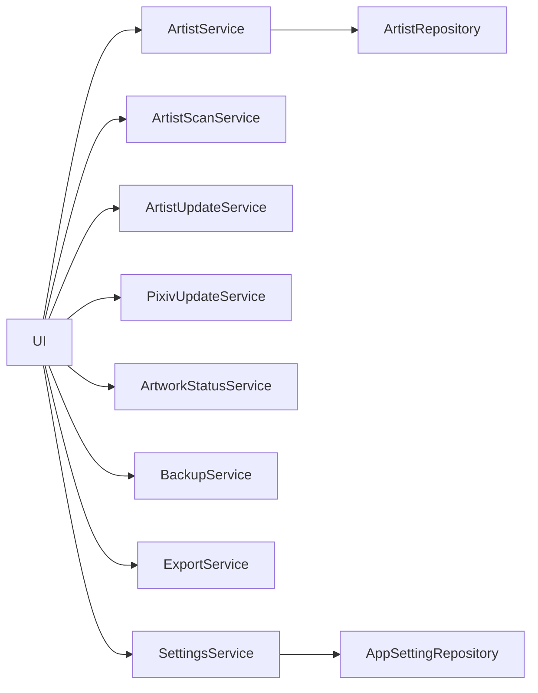

# 서비스 구조

## 개요

Pixiv Local Manager는 Service Layer 구조를 사용한다.

UI는 직접 데이터베이스에 접근하지 않고 Service를 통해 데이터를 처리한다.

```text
UI
 ↓
Service
 ↓
Repository
 ↓
Database
```

---

# 서비스 구성



---

# ArtistService

작가 데이터 관리 담당.

## 주요 역할

<table>
<tr>
    <th>기능</th>
    <th>설명</th>
</tr>

<tr>
    <td>작가 조회</td>
    <td>목록 조회 및 상세 조회</td>
</tr>

<tr>
    <td>작가 등록</td>
    <td>신규 작가 저장</td>
</tr>

<tr>
    <td>작가 수정</td>
    <td>정보 수정</td>
</tr>

<tr>
    <td>평점 관리</td>
    <td>평점 저장</td>
</tr>

<tr>
    <td>즐겨찾기 관리</td>
    <td>즐겨찾기 설정 및 해제</td>
</tr>

<tr>
    <td>숨김 관리</td>
    <td>숨김 설정 및 해제</td>
</tr>

<tr>
    <td>태그 관리</td>
    <td>태그 추가 및 삭제</td>
</tr>

<tr>
    <td>최근 열람 기록</td>
    <td>상세 페이지 진입 시각 저장</td>
</tr>

<tr>
    <td>다중 선택 작업</td>
    <td>평점, 즐겨찾기, 숨김 일괄 변경</td>
</tr>

<tr>
    <td>작가 삭제</td>
    <td>삭제 전 백업 후 삭제</td>
</tr>

<tr>
    <td>삭제 작가 복구</td>
    <td>삭제 백업 JSON 기반 복구</td>
</tr>

<tr>
    <td>작가 폴더 변경</td>
    <td>폴더 경로 변경 및 재스캔</td>
</tr>

</table>

---

## 주요 연동 서비스

```text
ArtistService
 ├─ ArtistRepository
 ├─ BackupService
 ├─ FolderScanService
 └─ ArtworkStatusService
```

---

# FolderScanService

폴더 분석 담당.

## 주요 역할

<table>
<tr>
    <th>기능</th>
    <th>설명</th>
</tr>

<tr>
    <td>폴더 탐색</td>
    <td>작가 폴더 검색</td>
</tr>

<tr>
    <td>작가명 추출</td>
    <td>폴더명 분석</td>
</tr>

<tr>
    <td>Pixiv ID 추출</td>
    <td>폴더명 분석</td>
</tr>

<tr>
    <td>작품 수 계산</td>
    <td>작품 ID 수 계산</td>
</tr>

<tr>
    <td>파일 수 계산</td>
    <td>실제 이미지 파일 수 계산</td>
</tr>

<tr>
    <td>작품 ID 수집</td>
    <td>로컬 작품 ID 목록 생성</td>
</tr>

</table>

---

# ArtistScanService

스캔 결과를 DB에 반영하는 담당 서비스.

## 주요 역할

<table>
<tr>
    <th>기능</th>
    <th>설명</th>
</tr>

<tr>
    <td>신규 등록</td>
    <td>새 작가 생성</td>
</tr>

<tr>
    <td>기존 작가 갱신</td>
    <td>정보 업데이트</td>
</tr>

<tr>
    <td>스캔 로그 생성</td>
    <td>결과 로그 생성</td>
</tr>

</table>

---

# PixivUpdateService

Pixiv 최신 정보 수집 담당.

## 주요 역할

<table>
<tr>
    <th>기능</th>
    <th>설명</th>
</tr>

<tr>
    <td>작가 페이지 조회</td>
    <td>Pixiv 작가 페이지 요청</td>
</tr>

<tr>
    <td>최신 작품 조회</td>
    <td>최신 작품 목록 수집</td>
</tr>

<tr>
    <td>작품 ID 수집</td>
    <td>최신 작품 ID 목록 생성</td>
</tr>

<tr>
    <td>작품 수 조회</td>
    <td>현재 작품 수 계산</td>
</tr>

</table>

---

# ArtworkStatusService

업데이트 상태 계산 담당.

## 주요 역할

<table>
<tr>
    <th>기능</th>
    <th>설명</th>
</tr>

<tr>
    <td>작품 ID 비교</td>
    <td>Pixiv 작품과 로컬 작품 비교</td>
</tr>

<tr>
    <td>누락 작품 계산</td>
    <td>누락 작품 수 계산</td>
</tr>

<tr>
    <td>업데이트 상태 계산</td>
    <td>최신 상태 여부 판정</td>
</tr>

<tr>
    <td>업데이트 상태 생성</td>
    <td>need_update, up_to_date 등 반환</td>
</tr>

</table>

---

# BackupService

백업 및 복원 담당.

## 주요 역할

<table>
<tr>
    <th>기능</th>
    <th>설명</th>
</tr>

<tr>
    <td>DB 백업</td>
    <td>전체 데이터 백업</td>
</tr>

<tr>
    <td>DB 복원</td>
    <td>전체 데이터 복원</td>
</tr>

<tr>
    <td>삭제 작가 백업</td>
    <td>삭제 전 JSON 저장</td>
</tr>

<tr>
    <td>삭제 작가 복구</td>
    <td>JSON 기반 작가 복원</td>
</tr>

<tr>
    <td>중복 작가 스킵</td>
    <td>동일 Pixiv ID 존재 시 복구 제외</td>
</tr>

<tr>
    <td>백업 파일 삭제</td>
    <td>복구 완료 후 JSON 자동 삭제</td>
</tr>

</table>

---

# ExportService

데이터 내보내기 담당.

## 주요 역할

<table>
<tr>
    <th>기능</th>
    <th>설명</th>
</tr>

<tr>
    <td>CSV 생성</td>
    <td>작가 목록 CSV 생성</td>
</tr>

<tr>
    <td>CSV 저장</td>
    <td>파일 저장</td>
</tr>

</table>

---

# SettingsService

프로그램 설정 관리 담당.

## 주요 역할

<table>
<tr>
    <th>기능</th>
    <th>설명</th>
</tr>

<tr>
    <td>설정 조회</td>
    <td>설정 로드</td>
</tr>

<tr>
    <td>설정 저장</td>
    <td>설정 저장</td>
</tr>

<tr>
    <td>PHPSESSID 관리</td>
    <td>Pixiv 로그인 쿠키 저장</td>
</tr>

<tr>
    <td>기본 폴더 관리</td>
    <td>Pixiv 루트 폴더 저장</td>
</tr>

</table>

---

# 서비스 계층 원칙

<table>
<tr>
    <th>원칙</th>
    <th>설명</th>
</tr>

<tr>
    <td>UI와 DB 분리</td>
    <td>UI는 Service만 호출</td>
</tr>

<tr>
    <td>비즈니스 로직 집중</td>
    <td>모든 처리 로직은 Service 담당</td>
</tr>

<tr>
    <td>Repository 분리</td>
    <td>DB 접근은 Repository 담당</td>
</tr>

<tr>
    <td>확장성</td>
    <td>서비스 단위 기능 추가 가능</td>
</tr>

</table>

---
