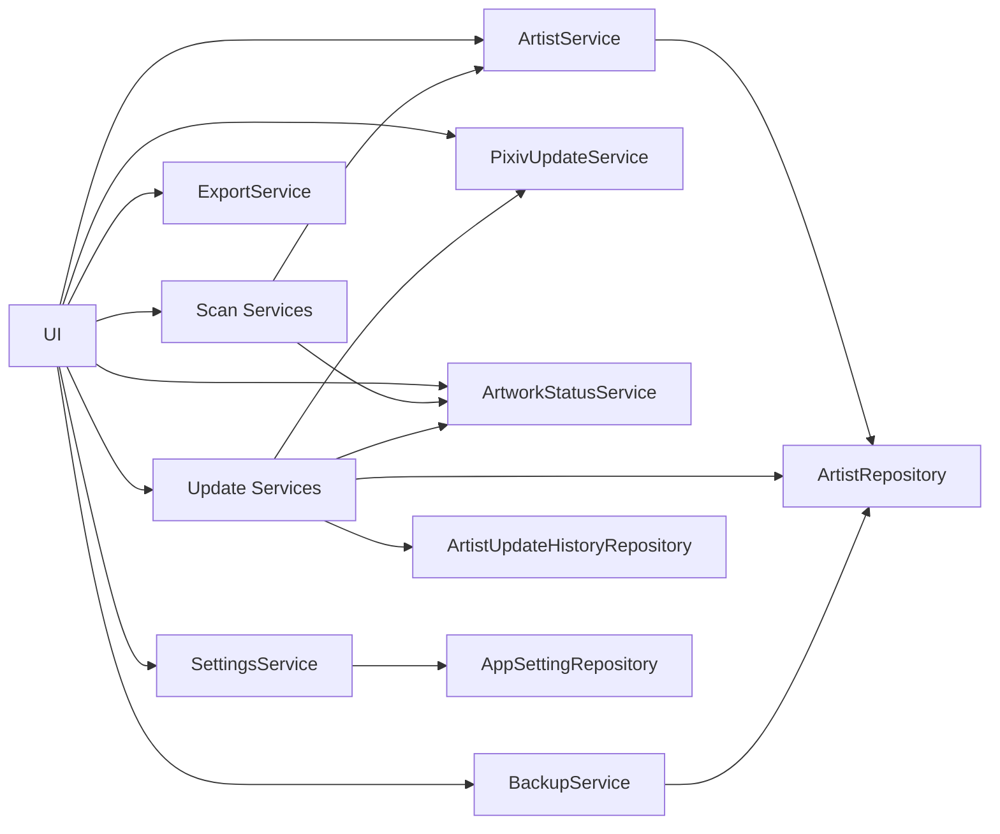

# 서비스 구조

## 개요

Pixiv Local Manager는 Service Layer 구조를 사용한다.

UI는 직접 데이터베이스에 접근하지 않고 Service를 통해 데이터를 처리한다.

```text
UI
→ Service
→ Repository
→ Database
```

v0.11.0 업데이트 확인 고도화 이후 업데이트 이력 저장 및 결과 비교 구조가 추가되었다.

---

# 서비스 구성

```text
app/services
│
├─ artist
│  ├─ service.py
│  ├─ metadata_service.py
│  ├─ folder_service.py
│  ├─ delete_service.py
│  ├─ validation.py
│  └─ __init__.py
│
├─ backup
│  ├─ service.py
│  ├─ deleted_artist_backup_service.py
│  ├─ json_utils.py
│  └─ __init__.py
│
├─ scan
│  ├─ folder_scan_service.py
│  ├─ artist_scan_service.py
│  ├─ rescan_service.py
│  ├─ scan_builder.py
│  ├─ scan_compare.py
│  └─ __init__.py
│
├─ update
│  ├─ artist_update_service.py
│  ├─ bulk_update_service.py
│  ├─ update_utils.py
│  └─ __init__.py
│
├─ artwork_status_service.py
├─ export_service.py
├─ pixiv_update_service.py
├─ settings_service.py
└─ __init__.py
```

```text
app/database
│
├─ artist
│  ├─ repository.py
│  ├─ update_repository.py
│  ├─ restore_repository.py
│  ├─ columns.py
│  └─ __init__.py
│
├─ app_setting_repository.py
├─ update_history_repository.py
├─ connection.py
├─ migrations.py
├─ schema.py
├─ table_definitions.py
└─ __init__.py
```

---

# 서비스 흐름



---

# artist 서비스 그룹

작가 데이터 관리 담당.

```text
app/services/artist
│
├─ service.py
├─ metadata_service.py
├─ folder_service.py
├─ delete_service.py
├─ validation.py
└─ __init__.py
```

## ArtistService

작가 관리 진입점.

### 주요 역할

<table>
<tr>
    <th>기능</th>
    <th>설명</th>
</tr>

<tr>
    <td>작가 조회</td>
    <td>목록 조회 및 상세 조회</td>
</tr>

<tr>
    <td>작가 등록</td>
    <td>신규 작가 저장</td>
</tr>

<tr>
    <td>작가 수정</td>
    <td>작가 기본 정보 수정</td>
</tr>

<tr>
    <td>평점 관리</td>
    <td>평점 저장 및 일괄 변경</td>
</tr>

<tr>
    <td>즐겨찾기 관리</td>
    <td>즐겨찾기 설정, 해제, 일괄 변경</td>
</tr>

<tr>
    <td>숨김 관리</td>
    <td>숨김 설정, 해제, 일괄 변경</td>
</tr>

<tr>
    <td>최근 열람 기록</td>
    <td>상세 페이지 진입 시각 저장</td>
</tr>

<tr>
    <td>작가 폴더 변경</td>
    <td>폴더 경로 변경 및 재스캔</td>
</tr>

<tr>
    <td>현재 작가 업데이트 확인</td>
    <td>작가 상세 페이지에서 단일 작가 업데이트 확인 실행</td>
</tr>

<tr>
    <td>작가 삭제</td>
    <td>삭제 전 백업 후 삭제</td>
</tr>

<tr>
    <td>삭제 작가 복구</td>
    <td>삭제 백업 JSON 기반 복구</td>
</tr>

</table>

## 세부 서비스

<table>
<tr>
    <th>파일</th>
    <th>역할</th>
</tr>

<tr>
    <td>metadata_service.py</td>
    <td>태그, 메모, 참고 링크, 다운로드 메모 등 메타데이터 처리</td>
</tr>

<tr>
    <td>folder_service.py</td>
    <td>작가 폴더 변경, 재스캔, 폴더 기반 데이터 갱신</td>
</tr>

<tr>
    <td>delete_service.py</td>
    <td>작가 삭제 및 삭제 전 백업 처리</td>
</tr>

<tr>
    <td>validation.py</td>
    <td>Pixiv ID 중복 검증 및 입력값 검증</td>
</tr>

</table>

---

# scan 서비스 그룹

폴더 분석 및 스캔 결과 처리 담당.

```text
app/services/scan
│
├─ folder_scan_service.py
├─ artist_scan_service.py
├─ rescan_service.py
├─ scan_builder.py
├─ scan_compare.py
└─ __init__.py
```

## FolderScanService

폴더 분석 담당.

### 주요 역할

<table>
<tr>
    <th>기능</th>
    <th>설명</th>
</tr>

<tr>
    <td>작가명 추출</td>
    <td>폴더명에서 작가명 추출</td>
</tr>

<tr>
    <td>Pixiv ID 추출</td>
    <td>폴더명에서 Pixiv ID 추출</td>
</tr>

<tr>
    <td>폴더 용량 계산</td>
    <td>폴더 전체 용량 계산</td>
</tr>

<tr>
    <td>작품 수 계산</td>
    <td>작품 ID 기준 작품 수 계산</td>
</tr>

<tr>
    <td>파일 수 계산</td>
    <td>실제 이미지 파일 수 계산</td>
</tr>

<tr>
    <td>작품 ID 수집</td>
    <td>로컬 작품 ID 목록 생성</td>
</tr>

<tr>
    <td>확장자 통계</td>
    <td>확장자별 파일 수 계산</td>
</tr>

</table>

## ArtistScanService

스캔 결과를 DB에 반영하는 서비스.

### 주요 역할

<table>
<tr>
    <th>기능</th>
    <th>설명</th>
</tr>

<tr>
    <td>신규 등록</td>
    <td>새 작가 생성</td>
</tr>

<tr>
    <td>기존 작가 갱신</td>
    <td>기존 작가의 스캔 정보 업데이트</td>
</tr>

<tr>
    <td>스캔 결과 생성</td>
    <td>등록, 업데이트, 변경 없음 결과 생성</td>
</tr>

</table>

## RescanService

기존 작가 재스캔 담당.

### 주요 역할

* 현재 작가 폴더 재스캔
* 폴더 변경 후 재스캔
* 작품 수 / 파일 수 / 로컬 작품 ID 갱신
* 업데이트 상태 재계산

## scan_builder.py

스캔 결과 객체 생성 담당.

## scan_compare.py

기존 데이터와 신규 스캔 데이터 비교 담당.

---

# update 서비스 그룹

업데이트 확인 결과 저장 및 일괄 처리 담당.

```text
app/services/update
│
├─ artist_update_service.py
├─ bulk_update_service.py
├─ update_utils.py
└─ __init__.py
```

## ArtistUpdateService

업데이트 확인 결과 저장 담당.

### 주요 역할

<table>
<tr>
    <th>기능</th>
    <th>설명</th>
</tr>

<tr>
    <td>업데이트 결과 저장</td>
    <td>Pixiv 확인 결과 DB 반영</td>
</tr>

<tr>
    <td>최신 작품 정보 저장</td>
    <td>Pixiv 최신 작품 ID 목록 저장</td>
</tr>

<tr>
    <td>최근 확인 시각 저장</td>
    <td>last_checked_at 갱신</td>
</tr>

<tr>
    <td>업데이트 상태 저장</td>
    <td>need_update, up_to_date 등 저장</td>
</tr>

<tr>
    <td>업데이트 이력 저장</td>
    <td>업데이트 확인 결과를 이력 테이블에 저장</td>
</tr>

<tr>
    <td>누락 작품 수 저장</td>
    <td>확인 시점의 로컬 수, Pixiv 수, 누락 작품 수 저장</td>
</tr>

<tr>
    <td>누락 작품 ID 저장</td>
    <td>확인 시점의 누락 작품 ID 목록 저장</td>
</tr>

<tr>
    <td>오류 정보 저장</td>
    <td>오류 메시지 및 오류 원인 저장</td>
</tr>

</table>

## BulkUpdateService

여러 작가의 업데이트 확인 결과를 일괄 처리한다.

### 주요 역할

<table>
<tr>
    <th>기능</th>
    <th>설명</th>
</tr>

<tr>
    <td>다중 작가 업데이트 확인</td>
    <td>선택한 여러 작가의 업데이트 확인 수행</td>
</tr>

<tr>
    <td>최근 확인 작가 제외</td>
    <td>최근 1일 이내 확인한 작가를 제외</td>
</tr>

<tr>
    <td>결과 로그 생성</td>
    <td>업데이트 확인 결과 로그 생성</td>
</tr>

<tr>
    <td>결과 요약 생성</td>
    <td>최신, 업데이트 필요, 오류, 스킵, 누락 수 집계</td>
</tr>

<tr>
    <td>업데이트 이력 저장</td>
    <td>업데이트 결과를 이력 DB에 저장</td>
</tr>

<tr>
    <td>오류 처리</td>
    <td>Pixiv 요청 오류 발생 시 작가 상태 및 오류 이력 저장</td>
</tr>

<tr>
    <td>중단 조건 처리</td>
    <td>쿠키 만료, 요청 제한 등 중단 필요 오류 처리</td>
</tr>

</table>

## update_utils.py

업데이트 결과 처리에 필요한 보조 함수를 제공한다.

### 주요 기능

* 최근 확인 여부 판정
* 업데이트 오류 상태 저장
* 스킵 이력 저장
* 업데이트 이력 저장
* 업데이트 상태 라벨 변환
* 작품 ID 목록 문자열 변환

---

# ArtistUpdateHistoryRepository

업데이트 확인 이력 저장 및 비교 담당.

```text
app/database/update_history_repository.py
```

## 주요 역할

<table>
<tr>
    <th>기능</th>
    <th>설명</th>
</tr>

<tr>
    <td>업데이트 이력 저장</td>
    <td>확인 시점별 업데이트 결과 저장</td>
</tr>

<tr>
    <td>작가별 이력 조회</td>
    <td>특정 작가의 과거 업데이트 확인 결과 조회</td>
</tr>

<tr>
    <td>최근 이력 조회</td>
    <td>전체 업데이트 확인 이력을 최근순으로 조회</td>
</tr>

<tr>
    <td>직전 결과 조회</td>
    <td>현재 결과와 비교할 직전 이력 조회</td>
</tr>

<tr>
    <td>결과 비교</td>
    <td>현재 결과와 직전 결과 비교</td>
</tr>

<tr>
    <td>누락 변화량 계산</td>
    <td>이전 누락 수와 현재 누락 수의 차이 계산</td>
</tr>

<tr>
    <td>신규 누락 계산</td>
    <td>현재 누락에는 있고 이전 누락에는 없던 작품 ID 계산</td>
</tr>

<tr>
    <td>해결 작품 계산</td>
    <td>이전 누락에는 있었으나 현재 누락에서 사라진 작품 ID 계산</td>
</tr>

<tr>
    <td>최근 누락 증가 작가 조회</td>
    <td>직전 확인 대비 누락 작품 수가 증가한 작가 조회</td>
</tr>

<tr>
    <td>이력 삭제</td>
    <td>작가 삭제 시 해당 작가의 업데이트 이력 삭제</td>
</tr>

</table>

## 저장 항목

<table>
<tr>
    <th>항목</th>
    <th>설명</th>
</tr>

<tr>
    <td>artist_id</td>
    <td>작가 ID</td>
</tr>

<tr>
    <td>artist_name</td>
    <td>확인 시점의 작가명</td>
</tr>

<tr>
    <td>pixiv_id</td>
    <td>확인 시점의 Pixiv ID</td>
</tr>

<tr>
    <td>checked_at</td>
    <td>확인 시각</td>
</tr>

<tr>
    <td>action</td>
    <td>checked, skipped_recent, error 등 작업 유형</td>
</tr>

<tr>
    <td>result_status</td>
    <td>need_update, up_to_date, error 등 내부 상태</td>
</tr>

<tr>
    <td>result_label</td>
    <td>화면 표시용 결과 라벨</td>
</tr>

<tr>
    <td>local_count</td>
    <td>로컬 작품 수</td>
</tr>

<tr>
    <td>pixiv_count</td>
    <td>Pixiv 작품 수</td>
</tr>

<tr>
    <td>missing_count</td>
    <td>누락 작품 수</td>
</tr>

<tr>
    <td>missing_ids</td>
    <td>누락 작품 ID 목록</td>
</tr>

<tr>
    <td>download_candidate_ids</td>
    <td>다운로드 후보 작품 ID 목록</td>
</tr>

<tr>
    <td>error_message</td>
    <td>오류 메시지</td>
</tr>

<tr>
    <td>error_reason</td>
    <td>오류 원인 코드</td>
</tr>

</table>

---

# PixivUpdateService

Pixiv 최신 정보 수집 담당.

## 주요 역할

<table>
<tr>
    <th>기능</th>
    <th>설명</th>
</tr>

<tr>
    <td>작가 페이지 조회</td>
    <td>Pixiv 작가 페이지 요청</td>
</tr>

<tr>
    <td>최신 작품 조회</td>
    <td>최신 작품 목록 수집</td>
</tr>

<tr>
    <td>작품 ID 수집</td>
    <td>최신 작품 ID 목록 생성</td>
</tr>

<tr>
    <td>작품 수 조회</td>
    <td>현재 작품 수 계산</td>
</tr>

<tr>
    <td>PHPSESSID 테스트</td>
    <td>Pixiv 로그인 쿠키 유효성 확인</td>
</tr>

<tr>
    <td>요청 간격 제어</td>
    <td>설정값 기준으로 Pixiv 요청 간격 조절</td>
</tr>

<tr>
    <td>자동 재시도</td>
    <td>일시적인 네트워크 오류 발생 시 재시도</td>
</tr>

<tr>
    <td>오류 분류</td>
    <td>쿠키 누락, 쿠키 만료, 요청 제한, 네트워크 오류 등 분류</td>
</tr>

</table>

---

# ArtworkStatusService

작품 상태 계산 담당.

## 주요 역할

<table>
<tr>
    <th>기능</th>
    <th>설명</th>
</tr>

<tr>
    <td>작품 ID 비교</td>
    <td>Pixiv 작품과 로컬 작품 비교</td>
</tr>

<tr>
    <td>누락 작품 계산</td>
    <td>누락 작품 수 계산</td>
</tr>

<tr>
    <td>누락 작품 목록 생성</td>
    <td>누락 작품 ID 목록 생성</td>
</tr>

<tr>
    <td>업데이트 상태 계산</td>
    <td>최신 상태 여부 판정</td>
</tr>

<tr>
    <td>업데이트 상태 생성</td>
    <td>need_update, up_to_date 등 반환</td>
</tr>

</table>

---

# backup 서비스 그룹

백업 및 복구 담당.

```text
app/services/backup
│
├─ service.py
├─ deleted_artist_backup_service.py
├─ json_utils.py
└─ __init__.py
```

## BackupService

전체 백업 및 복구 진입점.

### 주요 역할

<table>
<tr>
    <th>기능</th>
    <th>설명</th>
</tr>

<tr>
    <td>DB 백업</td>
    <td>전체 데이터 백업</td>
</tr>

<tr>
    <td>DB 복원</td>
    <td>전체 데이터 복원</td>
</tr>

<tr>
    <td>삭제 작가 백업</td>
    <td>삭제 전 JSON 저장</td>
</tr>

<tr>
    <td>삭제 작가 복구</td>
    <td>JSON 기반 작가 복원</td>
</tr>

<tr>
    <td>중복 작가 스킵</td>
    <td>동일 Pixiv ID 존재 시 복구 제외</td>
</tr>

<tr>
    <td>백업 파일 삭제</td>
    <td>복구 완료 후 JSON 자동 삭제</td>
</tr>

</table>

## DeletedArtistBackupService

삭제 작가 백업 생성 및 복구 처리를 담당한다.

## json_utils.py

백업 JSON 읽기 / 쓰기 보조 기능을 제공한다.

---

# ExportService

데이터 내보내기 담당.

## 주요 역할

<table>
<tr>
    <th>기능</th>
    <th>설명</th>
</tr>

<tr>
    <td>CSV 생성</td>
    <td>작가 목록 CSV 생성</td>
</tr>

<tr>
    <td>CSV 저장</td>
    <td>파일 저장</td>
</tr>

</table>

---

# SettingsService

프로그램 설정 관리 담당.

## 주요 역할

<table>
<tr>
    <th>기능</th>
    <th>설명</th>
</tr>

<tr>
    <td>설정 조회</td>
    <td>설정 로드</td>
</tr>

<tr>
    <td>설정 저장</td>
    <td>설정 저장</td>
</tr>

<tr>
    <td>PHPSESSID 관리</td>
    <td>Pixiv 로그인 쿠키 저장</td>
</tr>

<tr>
    <td>기본 폴더 관리</td>
    <td>Pixiv 루트 폴더 저장</td>
</tr>

<tr>
    <td>최근 스캔 폴더 관리</td>
    <td>마지막 스캔 폴더 저장</td>
</tr>

<tr>
    <td>스캔 이력 관리</td>
    <td>최근 스캔 결과 및 비교 정보 저장</td>
</tr>

<tr>
    <td>업데이트 요청 간격 관리</td>
    <td>Pixiv 최소 / 최대 요청 간격 저장</td>
</tr>

<tr>
    <td>업데이트 재시도 설정 관리</td>
    <td>Pixiv 요청 재시도 횟수 및 간격 저장</td>
</tr>

</table>

---

# 서비스 계층 원칙

<table>
<tr>
    <th>원칙</th>
    <th>설명</th>
</tr>

<tr>
    <td>UI와 DB 분리</td>
    <td>UI는 Service만 호출한다.</td>
</tr>

<tr>
    <td>비즈니스 로직 집중</td>
    <td>핵심 처리 로직은 Service 계층에서 담당한다.</td>
</tr>

<tr>
    <td>Repository 분리</td>
    <td>DB 접근은 Repository 계층에서 담당한다.</td>
</tr>

<tr>
    <td>서비스 그룹화</td>
    <td>관련 서비스는 artist, scan, update, backup 등 기능 그룹으로 분리한다.</td>
</tr>

<tr>
    <td>확장성</td>
    <td>서비스 단위로 기능을 추가할 수 있도록 구성한다.</td>
</tr>

<tr>
    <td>UI 비의존성</td>
    <td>Service는 UI 위젯이나 화면 구조에 의존하지 않는다.</td>
</tr>

</table>

---

# 버전 기준

본 문서는 v0.11.0 (업데이트 확인 고도화 완료) 기준으로 작성되었다.
