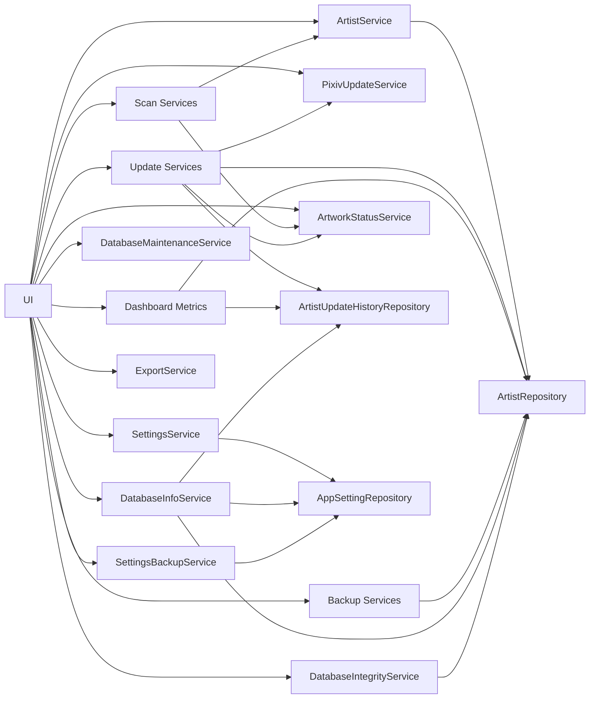

# 서비스 구조

## 개요

Pixiv Local Manager는 Service Layer 구조를 사용한다.

UI는 직접 데이터베이스에 접근하지 않고 Service를 통해 데이터를 처리한다.

```text
UI
→ Service
→ Repository
→ Database
```

v0.11.0 업데이트 확인 고도화 이후 업데이트 이력 저장 및 결과 비교 구조가 추가되었으며,

v0.12.0 대시보드 고도화 이후 업데이트 이력 데이터를 활용한 최근 활동, 스캔 통계, TOP 랭킹 기능이 추가되었다.

v0.13.0 설정 / 관리 고도화 이후 자동 백업, 데이터 무결성 검사, DB 최적화, 설정 백업/복원 기능이 추가되었다.

---

# 서비스 구성

```text
app/services
│
├─ artist
│  ├─ service.py
│  ├─ metadata_service.py
│  ├─ folder_service.py
│  ├─ delete_service.py
│  ├─ validation.py
│  └─ __init__.py
│
├─ backup
│  ├─ service.py
│  ├─ database_backup_service.py
│  ├─ deleted_artist_backup_service.py
│  ├─ json_utils.py
│  └─ __init__.py
│
├─ scan
│  ├─ folder_scan_service.py
│  ├─ artist_scan_service.py
│  ├─ rescan_service.py
│  ├─ scan_builder.py
│  ├─ scan_compare.py
│  └─ __init__.py
│
├─ update
│  ├─ artist_update_service.py
│  ├─ bulk_update_service.py
│  ├─ update_utils.py
│  └─ __init__.py
│
├─ artwork_status_service.py
├─ database_info_service.py
├─ database_integrity_service.py
├─ database_maintenance_service.py
├─ export_service.py
├─ pixiv_update_service.py
├─ settings_backup_service.py
├─ settings_service.py
└─ __init__.py
```

---

# 서비스 흐름



---

# artist 서비스 그룹

작가 데이터 관리 담당.

## ArtistService

작가 관리 진입점.

### 주요 역할

<table>
<tr>
    <th>기능</th>
    <th>설명</th>
</tr>

<tr>
    <td>작가 조회</td>
    <td>목록 조회 및 상세 조회</td>
</tr>

<tr>
    <td>작가 등록</td>
    <td>신규 작가 저장</td>
</tr>

<tr>
    <td>작가 수정</td>
    <td>작가 기본 정보 수정</td>
</tr>

<tr>
    <td>평점 관리</td>
    <td>평점 저장 및 일괄 변경</td>
</tr>

<tr>
    <td>즐겨찾기 관리</td>
    <td>즐겨찾기 설정, 해제, 일괄 변경</td>
</tr>

<tr>
    <td>숨김 관리</td>
    <td>숨김 설정, 해제, 일괄 변경</td>
</tr>

<tr>
    <td>최근 열람 기록</td>
    <td>상세 페이지 진입 시각 저장</td>
</tr>

<tr>
    <td>작가 폴더 변경</td>
    <td>폴더 경로 변경 및 재스캔</td>
</tr>

<tr>
    <td>현재 작가 재스캔</td>
    <td>현재 작가 폴더 재분석</td>
</tr>

<tr>
    <td>현재 작가 업데이트 확인</td>
    <td>단일 작가 업데이트 확인</td>
</tr>

<tr>
    <td>작가 삭제</td>
    <td>삭제 전 백업 후 삭제</td>
</tr>

<tr>
    <td>삭제 작가 복구</td>
    <td>삭제 백업 JSON 기반 복구</td>
</tr>

</table>

---

# scan 서비스 그룹

폴더 분석 및 스캔 결과 처리 담당.

## FolderScanService

폴더 분석 담당.

### 주요 역할

* 작가명 추출
* Pixiv ID 추출
* 폴더 용량 계산
* 작품 수 계산
* 파일 수 계산
* 작품 ID 수집
* 확장자 통계 생성

---

## ArtistScanService

스캔 결과를 DB에 반영한다.

### 주요 역할

* 신규 작가 등록
* 기존 작가 정보 갱신
* 작품 수 저장
* 파일 수 저장
* 폴더 용량 저장
* 최신 작품 ID 저장
* 스캔 결과 생성

---

## RescanService

기존 작가 재스캔 담당.

### 주요 역할

* 현재 작가 재스캔
* 폴더 변경 후 재스캔
* 작품 수 갱신
* 파일 수 갱신
* 로컬 작품 ID 갱신
* 상태 재계산

---

# update 서비스 그룹

업데이트 확인 결과 저장 및 일괄 처리 담당.

## ArtistUpdateService

업데이트 확인 결과 저장 담당.

### 주요 역할

* Pixiv 최신 작품 조회 결과 저장
* Pixiv 최신 작품 ID 저장
* 최근 확인 시각 저장
* 업데이트 상태 저장
* 누락 작품 수 저장
* 누락 작품 ID 저장
* 오류 정보 저장
* 업데이트 이력 저장

---

## BulkUpdateService

여러 작가의 업데이트 확인 결과를 일괄 처리한다.

### 주요 역할

* 다중 작가 업데이트 확인
* 최근 확인 작가 제외
* 결과 로그 생성
* 결과 요약 생성
* 업데이트 이력 저장
* 오류 처리
* 중단 조건 처리
* 일시정지 및 재개 지원

---

# ArtistUpdateHistoryRepository

업데이트 확인 결과 이력 관리 담당.

## 주요 역할

<table>
<tr>
    <th>기능</th>
    <th>설명</th>
</tr>

<tr>
    <td>이력 저장</td>
    <td>업데이트 확인 결과 저장</td>
</tr>

<tr>
    <td>이력 조회</td>
    <td>작가별 업데이트 이력 조회</td>
</tr>

<tr>
    <td>최근 결과 조회</td>
    <td>최근 업데이트 결과 조회</td>
</tr>

<tr>
    <td>오늘 결과 조회</td>
    <td>오늘 수행된 업데이트 결과 조회</td>
</tr>

<tr>
    <td>최신 결과 조회</td>
    <td>작가별 최신 결과 조회</td>
</tr>

<tr>
    <td>최근 오류 조회</td>
    <td>최근 오류 발생 작가 조회</td>
</tr>

<tr>
    <td>누락 증가 조회</td>
    <td>최근 누락 증가 작가 조회</td>
</tr>

<tr>
    <td>결과 비교</td>
    <td>현재 결과와 직전 결과 비교</td>
</tr>

<tr>
    <td>신규 누락 계산</td>
    <td>새롭게 누락된 작품 계산</td>
</tr>

<tr>
    <td>해결 작품 계산</td>
    <td>누락이 해결된 작품 계산</td>
</tr>

<tr>
    <td>최근 활동 제공</td>
    <td>대시보드 최근 활동 데이터 제공</td>
</tr>

<tr>
    <td>업데이트 현황 제공</td>
    <td>대시보드 상태 통계 제공</td>
</tr>

<tr>
    <td>누락 통계 제공</td>
    <td>대시보드 누락 통계 제공</td>
</tr>

<tr>
    <td>스캔 결과 제공</td>
    <td>최근 스캔 결과 데이터 제공</td>
</tr>

</table>

---

# PixivUpdateService

Pixiv 통신 담당.

## 주요 역할

<table>
<tr>
    <th>기능</th>
    <th>설명</th>
</tr>

<tr>
    <td>작가 조회</td>
    <td>Pixiv 작가 정보 조회</td>
</tr>

<tr>
    <td>최신 작품 조회</td>
    <td>최신 작품 목록 조회</td>
</tr>

<tr>
    <td>작품 ID 수집</td>
    <td>작품 ID 목록 생성</td>
</tr>

<tr>
    <td>누락 작품 계산</td>
    <td>로컬 작품과 비교</td>
</tr>

<tr>
    <td>오류 처리</td>
    <td>403, 404, 429 처리</td>
</tr>

<tr>
    <td>요청 간격 제어</td>
    <td>과도한 요청 방지</td>
</tr>

<tr>
    <td>PHPSESSID 사용</td>
    <td>로그인 세션 활용</td>
</tr>

<tr>
    <td>PHPSESSID 테스트</td>
    <td>세션 유효성 확인</td>
</tr>

<tr>
    <td>요청 설정 사용</td>
    <td>최소/최대 대기시간 적용</td>
</tr>

<tr>
    <td>재시도 처리</td>
    <td>실패 요청 재시도</td>
</tr>

</table>

---

# ArtworkStatusService

작가 상태 계산 담당.

## 주요 역할

<table>
<tr>
    <th>기능</th>
    <th>설명</th>
</tr>

<tr>
    <td>상태 계산</td>
    <td>작가 상태 결정</td>
</tr>

<tr>
    <td>최신 상태</td>
    <td>최신 여부 판단</td>
</tr>

<tr>
    <td>업데이트 필요</td>
    <td>누락 작품 존재 여부 판단</td>
</tr>

<tr>
    <td>미확인 상태</td>
    <td>확인 이력 부재 여부 판단</td>
</tr>

<tr>
    <td>오류 상태</td>
    <td>최근 확인 오류 여부 판단</td>
</tr>

</table>

---

# Backup Services

백업 담당.

## DatabaseBackupService

데이터베이스 백업 관리 담당.

### 주요 역할

<table>
<tr>
    <th>기능</th>
    <th>설명</th>
</tr>

<tr>
    <td>DB 백업</td>
    <td>SQLite 데이터베이스 백업</td>
</tr>

<tr>
    <td>DB 복원</td>
    <td>백업 파일 복원</td>
</tr>

<tr>
    <td>자동 백업</td>
    <td>주기 기반 자동 백업</td>
</tr>

<tr>
    <td>시작 시 자동 백업 검사</td>
    <td>프로그램 실행 시 백업 여부 확인</td>
</tr>

<tr>
    <td>백업 목록 조회</td>
    <td>백업 파일 목록 생성</td>
</tr>

<tr>
    <td>백업 삭제</td>
    <td>선택 백업 삭제</td>
</tr>

<tr>
    <td>보관 정책</td>
    <td>최대 보관 개수 유지</td>
</tr>

<tr>
    <td>자동 정리</td>
    <td>초과 백업 자동 삭제</td>
</tr>

<tr>
    <td>백업 통계</td>
    <td>전체 백업 용량 계산</td>
</tr>

<tr>
    <td>최근 백업 조회</td>
    <td>최근 백업 일시 조회</td>
</tr>

</table>

---

## DeletedArtistBackupService

삭제 작가 백업 담당.

### 주요 역할

<table>
<tr>
    <th>기능</th>
    <th>설명</th>
</tr>

<tr>
    <td>삭제 작가 백업</td>
    <td>삭제 전 JSON 생성</td>
</tr>

<tr>
    <td>삭제 작가 복구</td>
    <td>JSON 기반 복구</td>
</tr>

<tr>
    <td>중복 Pixiv ID 검사</td>
    <td>복구 시 중복 등록 방지</td>
</tr>

<tr>
    <td>복구 후 정리</td>
    <td>복구 완료 JSON 자동 삭제</td>
</tr>

</table>

---

# DatabaseInfoService

DB 정보 및 프로그램 정보 조회 담당.

## 주요 역할

<table>
<tr>
    <th>기능</th>
    <th>설명</th>
</tr>

<tr>
    <td>DB 경로 조회</td>
    <td>현재 SQLite DB 파일 경로 조회</td>
</tr>

<tr>
    <td>DB 크기 계산</td>
    <td>DB 파일 크기 계산</td>
</tr>

<tr>
    <td>작가 수 계산</td>
    <td>등록된 전체 작가 수 계산</td>
</tr>

<tr>
    <td>설정 수 계산</td>
    <td>저장된 설정 수 계산</td>
</tr>

<tr>
    <td>업데이트 이력 수 계산</td>
    <td>업데이트 확인 이력 수 계산</td>
</tr>

<tr>
    <td>전체 작품 수 계산</td>
    <td>등록 작가의 전체 작품 수 합산</td>
</tr>

<tr>
    <td>전체 파일 수 계산</td>
    <td>등록 작가의 전체 파일 수 합산</td>
</tr>

<tr>
    <td>전체 폴더 용량 계산</td>
    <td>등록 작가 폴더 용량 합산</td>
</tr>

<tr>
    <td>프로그램 정보 생성</td>
    <td>버전, 기술 스택 등 프로그램 정보 생성</td>
</tr>

<tr>
    <td>백업 정보 생성</td>
    <td>최근 백업, 백업 개수, 전체 백업 용량 조회</td>
</tr>

</table>

---

# DatabaseIntegrityService

데이터 무결성 검사 담당.

## 주요 역할

<table>
<tr>
    <th>기능</th>
    <th>설명</th>
</tr>

<tr>
    <td>중복 Pixiv ID 검사</td>
    <td>동일 Pixiv ID를 가진 작가 데이터 검사</td>
</tr>

<tr>
    <td>존재하지 않는 폴더 검사</td>
    <td>DB에 저장된 폴더 경로가 실제로 존재하는지 검사</td>
</tr>

<tr>
    <td>빈 작가명 검사</td>
    <td>작가명이 비어 있는 데이터 검사</td>
</tr>

<tr>
    <td>잘못된 평점 검사</td>
    <td>0~10 범위를 벗어난 평점 검사</td>
</tr>

<tr>
    <td>잘못된 status 검사</td>
    <td>허용되지 않은 작가 상태값 검사</td>
</tr>

<tr>
    <td>잘못된 update_status 검사</td>
    <td>허용되지 않은 업데이트 상태값 검사</td>
</tr>

<tr>
    <td>검사 결과 생성</td>
    <td>문제 유형, 작가명, Pixiv ID, 상세 내용을 포함한 결과 생성</td>
</tr>

</table>

---

# DatabaseMaintenanceService

SQLite DB 최적화 담당.

## 주요 역할

<table>
<tr>
    <th>기능</th>
    <th>설명</th>
</tr>

<tr>
    <td>VACUUM 실행</td>
    <td>SQLite DB 공간 정리 및 최적화</td>
</tr>

<tr>
    <td>ANALYZE 실행</td>
    <td>SQLite 쿼리 최적화를 위한 통계 정보 갱신</td>
</tr>

<tr>
    <td>최적화 전 크기 계산</td>
    <td>작업 전 DB 파일 크기 계산</td>
</tr>

<tr>
    <td>최적화 후 크기 계산</td>
    <td>작업 후 DB 파일 크기 계산</td>
</tr>

<tr>
    <td>절감 용량 계산</td>
    <td>최적화 전후 크기 차이 계산</td>
</tr>

<tr>
    <td>소요 시간 계산</td>
    <td>최적화 작업 실행 시간 계산</td>
</tr>

</table>

---

# SettingsBackupService

설정 백업 및 복원 담당.

## 주요 역할

<table>
<tr>
    <th>기능</th>
    <th>설명</th>
</tr>

<tr>
    <td>설정 백업</td>
    <td>app_settings 데이터를 JSON 파일로 저장</td>
</tr>

<tr>
    <td>설정 복원</td>
    <td>JSON 파일 기반 설정 복원</td>
</tr>

<tr>
    <td>백업 파일 검증</td>
    <td>설정 백업 파일 형식 검사</td>
</tr>

<tr>
    <td>설정 개수 기록</td>
    <td>백업 파일에 설정 개수 저장</td>
</tr>

<tr>
    <td>백업 생성 시각 기록</td>
    <td>설정 백업 생성 시각 저장</td>
</tr>

<tr>
    <td>기본 백업 경로 제공</td>
    <td>설정 백업 기본 저장 폴더 제공</td>
</tr>

</table>

---

# ExportService

데이터 내보내기 담당.

## 주요 역할

<table>
<tr>
    <th>기능</th>
    <th>설명</th>
</tr>

<tr>
    <td>CSV 저장</td>
    <td>작가 목록 저장</td>
</tr>

<tr>
    <td>스캔 결과 저장</td>
    <td>스캔 결과 CSV 저장</td>
</tr>

<tr>
    <td>업데이트 결과 저장</td>
    <td>업데이트 결과 CSV 저장</td>
</tr>

<tr>
    <td>마지막 내보내기 경로 연동</td>
    <td>CSV 내보내기 후 마지막 경로 저장</td>
</tr>

</table>

---

# SettingsService

프로그램 설정 관리 담당.

## 주요 역할

<table>
<tr>
    <th>기능</th>
    <th>설명</th>
</tr>

<tr>
    <td>설정 조회</td>
    <td>설정값 조회</td>
</tr>

<tr>
    <td>설정 저장</td>
    <td>설정값 저장</td>
</tr>

<tr>
    <td>설정 삭제</td>
    <td>특정 설정값 삭제</td>
</tr>

<tr>
    <td>설정 초기화</td>
    <td>모든 설정을 기본값으로 복원</td>
</tr>

<tr>
    <td>정수 설정 조회</td>
    <td>정수형 설정값 변환 조회</td>
</tr>

<tr>
    <td>불리언 설정 조회</td>
    <td>불리언 설정값 변환 조회</td>
</tr>

<tr>
    <td>Pixiv 루트 폴더</td>
    <td>기본 폴더 관리</td>
</tr>

<tr>
    <td>PHPSESSID</td>
    <td>Pixiv 로그인 세션 관리</td>
</tr>

<tr>
    <td>Pixiv 요청 설정</td>
    <td>요청 간격 및 재시도 설정 관리</td>
</tr>

<tr>
    <td>자동 백업 설정</td>
    <td>자동 백업 여부, 주기, 보관 개수 관리</td>
</tr>

<tr>
    <td>창 크기 저장</td>
    <td>마지막 창 크기 저장</td>
</tr>

<tr>
    <td>창 위치 저장</td>
    <td>마지막 창 위치 저장</td>
</tr>

<tr>
    <td>최대화 상태 저장</td>
    <td>창 최대화 여부 저장</td>
</tr>

<tr>
    <td>최근 경로 저장</td>
    <td>백업, 복원, 내보내기 경로 저장</td>
</tr>

</table>

---

# Dashboard 데이터 흐름

v0.12.0 대시보드 고도화 이후 추가.

```text
Dashboard
│
├─ ArtistService
│
├─ ArtistUpdateHistoryRepository
│
├─ Dashboard Metrics
│
├─ Recommendation Engine
│
└─ Random Artist Generator
```

## 데이터 생성 흐름

```text
ArtistService
      │
      ├─ 전체 통계
      ├─ TOP 랭킹
      ├─ 추천 작가
      └─ 랜덤 작가
                │
                ▼
Dashboard Metrics
                │
                ▼
Dashboard UI
```

```text
ArtistUpdateHistoryRepository
                │
                ├─ 최근 활동
                ├─ 최근 오류
                ├─ 누락 증가
                ├─ 최근 스캔 결과
                └─ 업데이트 현황
                          │
                          ▼
Dashboard UI
```

---

# 설정 / 관리 데이터 흐름

v0.13.0 설정 / 관리 고도화 이후 추가.

```text
Settings Page
│
├─ 기본 설정
│  ├─ SettingsService
│  └─ PixivUpdateService
│
├─ 데이터 관리
│  ├─ DatabaseInfoService
│  ├─ DatabaseIntegrityService
│  ├─ DatabaseMaintenanceService
│  └─ DatabaseBackupService
│
├─ 환경 설정
│  ├─ SettingsService
│  └─ SettingsBackupService
│
└─ 프로그램 정보
   ├─ DatabaseInfoService
   └─ DatabaseBackupService
```

## 데이터 관리 흐름

```text
DatabaseInfoService
      │
      ├─ ArtistRepository
      ├─ ArtistUpdateHistoryRepository
      ├─ AppSettingRepository
      └─ DatabaseBackupService
                │
                ▼
Settings Page
```

```text
DatabaseIntegrityService
      │
      ├─ ArtistRepository
      └─ Local Folder Check
                │
                ▼
Settings Page
```

```text
DatabaseMaintenanceService
      │
      ├─ VACUUM
      ├─ ANALYZE
      └─ Size Compare
                │
                ▼
Settings Page
```

```text
SettingsBackupService
      │
      ├─ AppSettingRepository
      ├─ JSON Export
      └─ JSON Import
                │
                ▼
Settings Page
```

---

# 설계 원칙

## 1. UI 직접 DB 접근 금지

```text
UI
→ Service
→ Repository
→ Database
```

---

## 2. 기능 단위 분리

```text
Artist
Scan
Update
Backup
Database Management
Export
Settings
```

---

## 3. 서비스 재사용

하나의 Service는 여러 페이지에서 재사용 가능해야 한다.

예시:

```text
ArtistService

├─ Dashboard
├─ Artists
├─ Artist Detail
└─ Update Check
```

---

## 4. Repository 단순화

Repository는 데이터 저장과 조회만 담당한다.

비즈니스 로직은 Service 계층에서 처리한다.

---

## 5. Dashboard 계산 분리

Dashboard 전용 계산은 UI가 아닌 Metrics 계층에서 수행한다.

```text
Dashboard UI
      ↓
Dashboard Metrics
      ↓
Service / Repository
```

---

## 6. 설정 / 관리 기능 분리

DB 정보 조회, 무결성 검사, DB 최적화, 설정 백업은 각각 독립 Service로 분리한다.

```text
Settings UI
      ↓
DatabaseInfoService
DatabaseIntegrityService
DatabaseMaintenanceService
SettingsBackupService
DatabaseBackupService
```

---

# 버전 기준

본 문서는 v0.13.0 (설정 / 관리 고도화 완료) 기준으로 작성되었다.
