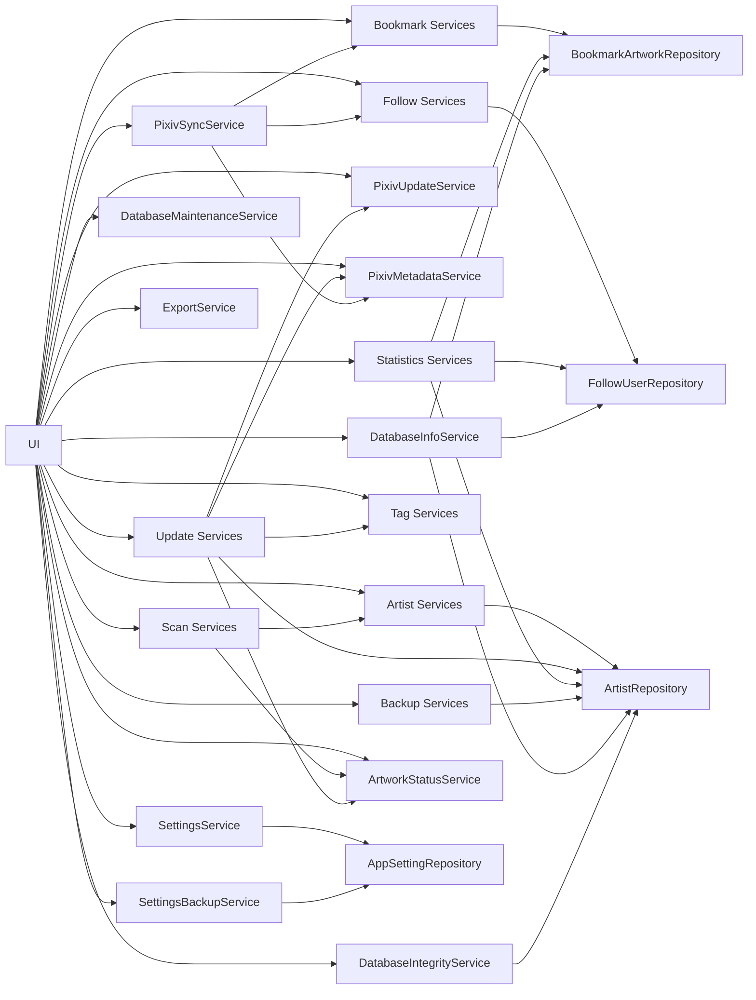

# 서비스 구조

## 개요

Pixiv Local Manager는 Service Layer 구조를 사용한다.

UI는 직접 데이터베이스에 접근하지 않고 Service를 통해 데이터를 처리한다.

```text
UI
→ Service
→ Repository
→ Database
```

---

# 서비스 구성

```text
app/services
│
├─ artist
├─ backup
├─ bookmark
├─ follow
├─ pixiv
├─ scan
├─ statistics
├─ tag
├─ update
│
├─ artwork_status_service.py
├─ database_info_service.py
├─ database_integrity_service.py
├─ database_maintenance_service.py
├─ export_service.py
├─ pixiv_update_service.py
├─ settings_backup_service.py
├─ settings_service.py
└─ __init__.py
```

---

# 서비스 흐름



---

# artist 서비스 그룹

작가 데이터 관리 담당.

## ArtistService

작가 관리 진입점.

### 주요 역할

* 작가 조회
* 작가 등록
* 작가 수정
* 평점 관리
* 즐겨찾기 관리
* 최근 열람 기록 저장
* 작가 폴더 변경
* 현재 작가 재스캔
* 현재 작가 업데이트 확인
* 삭제 전 백업 후 삭제
* 삭제 작가 복구
* 태그 저장
* 태그 수정
* 누락 작품 정보 저장
* 저장 용량 갱신
* 업데이트 이력 연동

---

# scan 서비스 그룹

폴더 분석 및 스캔 결과 처리 담당.

## FolderScanService

### 주요 역할

* 작가명 추출
* Pixiv ID 추출
* 폴더 용량 계산
* 작품 수 계산
* 파일 수 계산
* 작품 ID 수집
* 확장자 통계 생성
* 비작품 파일 통계 생성

---

## ArtistScanService

### 주요 역할

* 신규 작가 등록
* 기존 작가 정보 갱신
* 작품 수 저장
* 파일 수 저장
* 폴더 용량 저장
* 최신 작품 ID 저장
* 스캔 결과 생성
* 미리보기 결과 생성

---

## RescanService

### 주요 역할

* 현재 작가 재스캔
* 폴더 변경 후 재스캔
* 작품 수 갱신
* 파일 수 갱신
* 저장 용량 갱신
* 로컬 작품 ID 갱신
* 상태 재계산

---

# update 서비스 그룹

업데이트 확인 결과 저장 및 일괄 처리 담당.

## ArtistUpdateService

### 주요 역할

* Pixiv 최신 작품 조회 결과 저장
* Pixiv 최신 작품 ID 저장
* 최근 확인 시각 저장
* 업데이트 상태 저장
* 누락 작품 수 저장
* 누락 작품 ID 저장
* Pixiv 태그 통계 수집
* 작가 태그 자동 동기화
* 오류 정보 저장
* 업데이트 이력 저장
* 태그 데이터 갱신
* 태그 통계 갱신

---

## BulkUpdateService

### 주요 역할

* 다중 작가 업데이트 확인
* 최근 확인 작가 제외
* 결과 로그 생성
* 결과 요약 생성
* 업데이트 이력 저장
* 오류 처리
* 중단 조건 처리
* 일시정지 및 재개 지원
* 요청 간격 및 배치 휴식 적용
* 진행률 계산
* 상태 메시지 생성

---

# pixiv 서비스 그룹

Pixiv 요청, 메타데이터 수집, 동기화 처리를 담당한다.

## PixivClient

Pixiv 요청 클라이언트 담당.

### 주요 역할

* Pixiv 요청 생성
* PHPSESSID 쿠키 적용
* Referer 적용
* User-Agent 적용
* urlopen 실행
* 요청 예외 전달

---

## PixivMetadataService

Pixiv 메타데이터 수집 담당.

### 주요 역할

* 유저 메타데이터 조회
* 작품 메타데이터 조회
* 일러스트 태그 통계 조회
* 태그 번역 정보 수집
* AI 여부 수집
* 북마크 정보 수집
* 팔로우 유저 정보 수집

---

## PixivSessionService

Pixiv 세션 검증 담당.

### 주요 역할

* PHPSESSID 유효성 확인
* 테스트 결과 상태 변환
* 정상 / 만료 / 오류 상태 구분
* 설정 페이지 세션 상태 표시 지원

---

## PixivSyncService

Pixiv 관리 페이지 동기화 담당.

### 주요 역할

* 팔로우 유저 메타데이터 동기화
* 북마크 작품 메타데이터 동기화
* 요청 간격 적용
* 배치 휴식 적용
* 재시도 설정 적용
* 동기화 결과 생성
* 로그 출력용 결과 생성
* 태그 정보 동기화
* AI 여부 동기화
* 로컬 작가 매칭 연동

---

## PixivRateLimit

Pixiv 요청 안정성 담당.

### 주요 역할

* 요청 간격 관리
* 배치 처리 수 관리
* 배치 휴식 관리
* 재시도 횟수 관리
* 과도한 요청 방지

---

# follow 서비스 그룹

Pixiv 팔로우 유저 관리 담당.

## FollowService

### 주요 역할

* 팔로우 유저 조회
* 팔로우 유저 저장
* 중복 제거
* 로컬 작가 매칭
* 요약 통계 생성
* Pixiv 통계 생성

---

## FollowImporter

팔로우 유저 ID 가져오기 담당.

### 주요 역할

* TXT 파일 파싱
* CSV 파일 파싱
* Pixiv ID 추출
* 중복 ID 정리
* 가져오기 미리보기 결과 생성

---

## FollowMatcher

로컬 작가 매칭 담당.

### 주요 역할

* Pixiv ID 기준 작가 검색
* 로컬 등록 여부 판단
* 즐겨찾기 상태 확인
* 로컬 작가 ID 연결

---

# bookmark 서비스 그룹

Pixiv 북마크 작품 관리 담당.

## BookmarkService

### 주요 역할

* 북마크 작품 조회
* 북마크 작품 저장
* 중복 제거
* 로컬 작가 매칭
* 요약 통계 생성
* Pixiv 통계 생성

---

## BookmarkImporter

북마크 작품 ID 가져오기 담당.

### 주요 역할

* TXT 파일 파싱
* CSV 파일 파싱
* 작품 ID 추출
* 중복 ID 정리
* 가져오기 미리보기 결과 생성

---

## BookmarkMatcher

로컬 작가 매칭 담당.

### 주요 역할

* 작가 Pixiv ID 기준 작가 검색
* 로컬 등록 여부 판단
* 즐겨찾기 상태 확인
* 로컬 작가 ID 연결

---

# tag 서비스 그룹

태그 파싱, 병합, 직렬화를 담당한다.

## TagService

### 주요 역할

* 태그 파싱
* 기존 태그와 Pixiv 태그 병합
* 사용자 번역 보존
* 태그 직렬화
* 태그 표시명 생성
* 원문 태그 유지
* 번역 태그 관리
* 태그 검색 데이터 생성

---

## TagParser

태그 데이터 파싱 담당.

### 주요 역할

* JSON 태그 파싱
* 문자열 태그 파싱
* 빈 태그 제거
* 잘못된 태그 데이터 방어 처리

---

## TagData

태그 데이터 모델.

### 주요 필드

| 필드                 | 설명                  |
| ------------------ | ------------------- |
| original           | 원문 태그               |
| translated         | 번역 태그               |
| artwork_count      | Pixiv 태그 통계 기준 작품 수 |
| file_count         | 로컬 파일 기준 수          |
| custom_translation | 사용자 번역 여부           |

---

# statistics 서비스 그룹

통계 분석 시스템 담당.

## StatisticsService

통계 데이터 통합 담당.

### 주요 역할

* 기초 통계 생성
* 하위 서비스 결과 통합
* Statistics Page 표시용 데이터 제공
* Pixiv 통계 생성
* 주간 변화 통계 생성

---

## StatisticsStatusService

상태 분포 분석 담당.

### 주요 역할

* 업데이트 미확인 집계
* 최신 상태 집계
* 업데이트 필요 집계
* 확인 실패 집계
* 업데이트 완료 집계
* 상태 분포 생성

---

## StatisticsRatingService

평점 분포 분석 담당.

### 주요 역할

* 평점 수집
* 구간별 분포 계산
* 평점 통계 생성
* 평균 평점 계산

---

## StatisticsRankingService

랭킹 분석 담당.

### 주요 역할

* 작품 수 TOP 생성
* 파일 수 TOP 생성
* 저장 용량 TOP 생성
* 정렬 및 순위 계산

---

## StatisticsTagService

태그 분석 담당.

### 주요 역할

* 태그 수집
* 태그 사용 횟수 계산
* 태그별 작가 수 계산
* 상위 태그 생성
* 태그 보유 작가 TOP 생성

---

## StatisticsQualityService

데이터 품질 분석 담당.

### 주요 역할

* 태그 보유 비율 계산
* 메모 작성 비율 계산
* 평점 설정 비율 계산
* 폴더 오류 비율 계산

---

## StatisticsFavoriteService

즐겨찾기 통계 담당.

### 주요 역할

* 즐겨찾기 작가 수 계산
* 즐겨찾기 평균 평점 계산
* 즐겨찾기 통계 생성

---

## StatisticsWeeklyService

주간 변화 분석 담당.

### 주요 역할

* 주간 누락 작품 증가량 계산
* 주간 해결 작품 증가량 계산
* 주간 저장 용량 증가량 계산
* 주차별 변화 데이터 생성

---

# 공통 서비스

여러 기능에서 공통으로 사용하는 단일 서비스 모듈.

---

## ArtworkStatusService

작가 상태 계산 담당.

### 주요 역할

* 로컬 작품 ID와 Pixiv 작품 ID 비교
* 최신 상태 판단
* 업데이트 필요 여부 판단
* 미확인 상태 판단
* 오류 상태 판단
* 누락 작품 수 계산
* 누락 작품 ID 계산

---

## PixivUpdateService

Pixiv 최신 작품 조회 및 업데이트 확인 공통 요청 담당.

### 주요 역할

* Pixiv 작가 정보 조회
* 최신 작품 목록 조회
* 작품 ID 목록 생성
* 로컬 작품과 Pixiv 작품 비교
* 누락 작품 계산
* 요청 간격 제어
* PHPSESSID 사용
* 요청 실패 재시도
* 403, 404, 429 오류 처리

---

## DatabaseInfoService

DB 정보 및 프로그램 정보 조회 담당.

### 주요 역할

* DB 경로 조회
* DB 크기 계산
* 전체 작가 수 계산
* 전체 작품 수 계산
* 전체 파일 수 계산
* 전체 폴더 용량 계산
* 팔로우 유저 수 계산
* 북마크 작품 수 계산
* 업데이트 이력 수 계산
* 프로그램 정보 생성
* 백업 정보 생성

---

## DatabaseIntegrityService

데이터 무결성 검사 담당.

### 주요 역할

* 중복 Pixiv ID 검사
* 존재하지 않는 폴더 검사
* 빈 작가명 검사
* 잘못된 평점 검사
* 잘못된 작가 상태값 검사
* 잘못된 업데이트 상태값 검사
* 검사 결과 생성

---

## DatabaseMaintenanceService

SQLite DB 최적화 담당.

### 주요 역할

* VACUUM 실행
* ANALYZE 실행
* 최적화 전 DB 크기 계산
* 최적화 후 DB 크기 계산
* 절감 용량 계산
* 소요 시간 계산

---

## SettingsService

프로그램 설정 관리 담당.

### 주요 역할

* 설정 조회
* 설정 저장
* 설정 삭제
* 설정 초기화
* 정수 설정 조회
* 불리언 설정 조회
* Pixiv 루트 폴더 설정 관리
* PHPSESSID 관리
* Pixiv 관리 요청 설정 관리
* 업데이트 확인 요청 설정 관리
* 자동 백업 설정 관리
* 창 크기 저장
* 창 위치 저장
* 최대화 상태 저장
* 화면 밖 창 복구 지원
* 최근 경로 저장

---

## SettingsBackupService

설정 백업 및 복원 담당.

### 주요 역할

* 설정 백업
* 설정 복원
* 백업 파일 검증
* 설정 개수 기록
* 백업 생성 시각 기록
* 기본 백업 경로 제공

---

## ExportService

데이터 내보내기 담당.

### 주요 역할

* 작가 목록 CSV 저장
* 스캔 결과 CSV 저장
* 업데이트 결과 CSV 저장
* 마지막 내보내기 경로 연동

---

# backup 서비스 그룹

백업 및 복구 담당.

## BackupService

백업 기능 진입점.

### 주요 역할

* 데이터베이스 백업 실행
* 데이터베이스 복원 실행
* 삭제 작가 백업 실행
* 삭제 작가 복구 실행
* 백업 결과 통합

---

## DatabaseBackupService

데이터베이스 백업 관리 담당.

### 주요 역할

* SQLite 데이터베이스 백업
* 백업 파일 복원
* 자동 백업 실행
* 시작 시 자동 백업 검사
* 백업 목록 조회
* 백업 삭제
* 보관 정책 적용
* 초과 백업 자동 정리
* 백업 통계 생성
* 최근 백업 조회

---

## DeletedArtistBackupService

삭제 작가 백업 담당.

### 주요 역할

* 삭제 전 JSON 백업 생성
* JSON 기반 삭제 작가 복구
* 복구 시 중복 Pixiv ID 검사
* 복구 완료 후 JSON 자동 삭제

---

# 설계 원칙

## 1. UI 직접 DB 접근 금지

```text
UI
→ Service
→ Repository
→ Database
```

UI는 Service를 통해서만 데이터에 접근한다.

---

## 2. 기능 단위 분리

```text
artist
scan
update
statistics
backup
follow
bookmark
pixiv
tag
```

기능별로 독립적인 구조를 유지한다.

---

## 3. Service와 Repository 분리

Service는 비즈니스 로직을 담당한다.

Repository는 데이터 저장 및 조회만 담당한다.

---

## 4. 서비스 그룹 사용

기능 규모가 커질 경우 Service Group 형태로 분리한다.

```text
artist/
follow/
bookmark/
pixiv/
statistics/
```

서비스 그룹은 관련 기능을 하나의 도메인 단위로 관리한다.

---

# 버전 기준

본 문서는 v0.17.0 (추가 기능 개발 완료) 기준으로 작성되었다.

Pixiv 관리 시스템, Pixiv 메타데이터 연동 기능, 태그 동기화 기능, 통계 분석 기능, 주간 변화 분석 기능이 포함된 서비스 구조를 설명한다.
