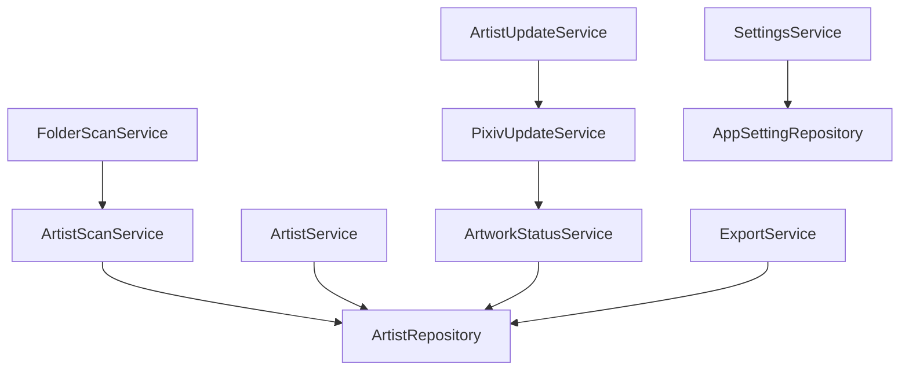

# 서비스 레이어 설계 (Services)

## 개요

Service Layer는 프로그램의 핵심 비즈니스 로직을 담당한다.

UI는 Service를 호출하여 기능을 수행하며,
Service는 Repository를 이용하여 데이터베이스를 처리한다.

---

# Service 구조


---

# 서비스 의존성



---

# ArtistService

## 역할

작가 관련 기능을 제공하는 메인 서비스.

---

## 주요 기능

<table>
<tr>
    <th>기능</th>
    <th>설명</th>
</tr>

<tr>
    <td>작가 조회</td>
    <td>전체 작가 목록 반환</td>
</tr>

<tr>
    <td>작가 검색</td>
    <td>검색 결과 반환</td>
</tr>

<tr>
    <td>작가 수정</td>
    <td>작가 정보 저장</td>
</tr>

<tr>
    <td>통계 계산</td>
    <td>대시보드 정보 제공</td>
</tr>

<tr>
    <td>추천 작가</td>
    <td>추천 작가 반환</td>
</tr>

<tr>
    <td>랜덤 작가</td>
    <td>랜덤 작가 반환</td>
</tr>

<tr>
    <td>업데이트 확인</td>
    <td>개별 작가 업데이트 검사</td>
</tr>

</table>

---

## 사용 화면

```text
Dashboard
Artists
Artist Detail
Update Check
```

---

# FolderScanService

## 역할

폴더 탐색 및 스캔 작업 관리.

---

## 주요 기능

<table>
<tr>
    <th>기능</th>
    <th>설명</th>
</tr>

<tr>
    <td>폴더 탐색</td>
    <td>하위 폴더 검색</td>
</tr>

<tr>
    <td>작가 등록</td>
    <td>신규 작가 저장</td>
</tr>

<tr>
    <td>작가 갱신</td>
    <td>기존 정보 수정</td>
</tr>

<tr>
    <td>진행률 보고</td>
    <td>UI 진행률 갱신</td>
</tr>

</table>

---

## 사용 화면

```text
Scan
```

---

# ArtistScanService

## 역할

폴더 정보 분석 전용 서비스.

---

## 주요 기능

<table>
<tr>
    <th>기능</th>
    <th>설명</th>
</tr>

<tr>
    <td>작가명 추출</td>
    <td>폴더명 분석</td>
</tr>

<tr>
    <td>Pixiv ID 추출</td>
    <td>폴더명 분석</td>
</tr>

<tr>
    <td>작품 수 계산</td>
    <td>이미지 파일 개수 계산</td>
</tr>

<tr>
    <td>작가 정보 생성</td>
    <td>등록용 데이터 생성</td>
</tr>

</table>

---

## 사용 서비스

```text
FolderScanService
```

---

# ArtistUpdateService

## 역할

업데이트 상태 계산 담당.

---

## 주요 기능

<table>
<tr>
    <th>기능</th>
    <th>설명</th>
</tr>

<tr>
    <td>Pixiv 조회</td>
    <td>Pixiv 데이터 요청</td>
</tr>

<tr>
    <td>작품 수 비교</td>
    <td>로컬 / Pixiv 비교</td>
</tr>

<tr>
    <td>누락 작품 계산</td>
    <td>차이 계산</td>
</tr>

<tr>
    <td>상태 결정</td>
    <td>최신 여부 판단</td>
</tr>

<tr>
    <td>DB 갱신</td>
    <td>결과 저장</td>
</tr>

</table>

---

## 사용 화면

```text
Update Check Dialog
```

---

# PixivUpdateService

## 역할

Pixiv 통신 담당.

---

## 주요 기능

<table>
<tr>
    <th>기능</th>
    <th>설명</th>
</tr>

<tr>
    <td>PHPSESSID 사용</td>
    <td>로그인 상태 유지</td>
</tr>

<tr>
    <td>작가 정보 요청</td>
    <td>Pixiv AJAX API 호출</td>
</tr>

<tr>
    <td>작품 수 조회</td>
    <td>최신 작품 수 반환</td>
</tr>

<tr>
    <td>예외 처리</td>
    <td>403 / 429 처리</td>
</tr>

</table>

---

## 사용 서비스

```text
ArtistUpdateService
```

---

# ArtworkStatusService

## 역할

업데이트 상태 계산 전용 서비스.

---

## 주요 기능

<table>
<tr>
    <th>기능</th>
    <th>설명</th>
</tr>

<tr>
    <td>상태 판정</td>
    <td>업데이트 상태 계산</td>
</tr>

<tr>
    <td>누락 계산</td>
    <td>작품 수 차이 계산</td>
</tr>

<tr>
    <td>상태 문자열 생성</td>
    <td>DB 저장용 상태값 반환</td>
</tr>

</table>

---

## 사용 서비스

```text
ArtistUpdateService
```

---

# BackupService

## 역할

SQLite 백업 및 복원 담당.

---

## 주요 기능

<table>
<tr>
    <th>기능</th>
    <th>설명</th>
</tr>

<tr>
    <td>DB 백업</td>
    <td>SQLite 파일 복사</td>
</tr>

<tr>
    <td>DB 복원</td>
    <td>백업 파일 복원</td>
</tr>

<tr>
    <td>무결성 검사</td>
    <td>SQLite 파일 검증</td>
</tr>

</table>

---

## 사용 화면

```text
Settings
```

---

# ExportService

## 역할

CSV 내보내기 담당.

---

## 주요 기능

<table>
<tr>
    <th>기능</th>
    <th>설명</th>
</tr>

<tr>
    <td>데이터 조회</td>
    <td>작가 목록 수집</td>
</tr>

<tr>
    <td>CSV 생성</td>
    <td>CSV 파일 생성</td>
</tr>

<tr>
    <td>파일 저장</td>
    <td>사용자 위치 저장</td>
</tr>

</table>

---

## 사용 화면

```text
Settings
```

---

# SettingsService

## 역할

프로그램 설정 관리.

---

## 주요 기능

<table>
<tr>
    <th>기능</th>
    <th>설명</th>
</tr>

<tr>
    <td>설정 저장</td>
    <td>설정값 저장</td>
</tr>

<tr>
    <td>설정 조회</td>
    <td>설정값 반환</td>
</tr>

<tr>
    <td>PHPSESSID 관리</td>
    <td>Pixiv 로그인 정보 저장</td>
</tr>

<tr>
    <td>기본 폴더 관리</td>
    <td>스캔 경로 저장</td>
</tr>

</table>

---

## 사용 화면

```text
Settings
Scan
```

---

# 서비스 호출 흐름

## 폴더 스캔


---

## 작가 저장


---

## 업데이트 확인


---

## 설정 저장


---

# 설계 원칙

<table>
<tr>
    <th>원칙</th>
    <th>설명</th>
</tr>

<tr>
    <td>서비스 단일 책임</td>
    <td>각 서비스는 하나의 역할만 담당</td>
</tr>

<tr>
    <td>UI 독립성</td>
    <td>서비스는 UI에 의존하지 않음</td>
</tr>

<tr>
    <td>Repository 사용</td>
    <td>DB 접근은 Repository만 수행</td>
</tr>

<tr>
    <td>재사용성</td>
    <td>여러 화면에서 공통 사용 가능</td>
</tr>

<tr>
    <td>확장성</td>
    <td>신규 기능 추가 시 영향 최소화</td>
</tr>

</table>